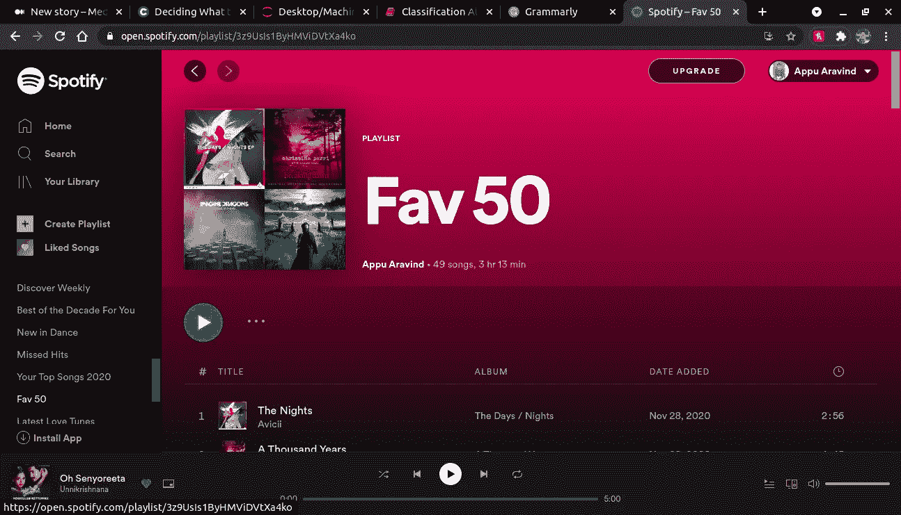

# 使用分类算法创建播放列表

> 原文：<https://medium.com/codex/creating-a-playlist-using-classification-algorithm-300a4fb0bcaf?source=collection_archive---------3----------------------->

## [法典](http://medium.com/codex)


我是 Spotify 的《发现周刊》的忠实粉丝。也许让我在周一早上醒来的唯一原因。如果你正在使用 Spotify，你可能也会对 Discover Weekly 这个功能印象深刻。Spotify 如何非常理解你的音乐品味。《发现周刊》是激励我做这个项目的主要原因。在这个项目中，我将向您展示如何制作适合您音乐品味的播放列表。为此，你需要一个现有的 30 首歌曲的播放列表，其中前 15 首是你最喜欢的歌曲，后 15 首是你最不喜欢的歌曲(我知道很难找到你不喜欢的歌曲，但你不得不这样做)。一旦你拿到这个，我们就可以开始了。

我将在 Jupyter 笔记本上做这个项目。首先，你必须安装这个程序中需要用到的所有软件包。我将使用 spotipy、pandas、matplotlib、scikit-learn 和 pydotplus。要安装这些软件包，你只需输入以下命令。一旦安装了这些包，我们就可以开始编码了。

```
pip install spotipy
pip install matplotlib
pi install pandas
pip install scikit-learn
pip install pydotplus
```

我们要做的第一件事是获得一个访问令牌。它可以用来读取播放列表，并修改它们等。

```
import spotipy
from spotipy.oauth2 import SpotifyClientCredentials
import spotipy.util as utilcid =’4a8f691d58c34c059a235249fa877f6e’ # Client ID; copy this from your app created on beta.developer.spotify.com
secret = ‘9b9a8e97d24c4688abb5f188a2d80de3’ # Client Secret; copy this from your app
username = ‘31obxjrwpdtksnjtof7oopbelnwq' # #for avaliable scopes see [https://developer.spotify.com/web-api/using-scopes/](https://developer.spotify.com/web-api/using-scopes/)
scope = ‘user-library-read playlist-modify-public playlist-read-private’redirect_uri=’[http://localhost:3000/callback'](http://localhost:3000/callback')client_credentials_manager = SpotifyClientCredentials(client_id=cid, client_secret=secret)sp = spotipy.Spotify(client_credentials_manager=client_credentials_manager)token = util.prompt_for_user_token(username, scope, cid, secret, redirect_uri)if token:
 sp = spotipy.Spotify(auth=token)
else:
 print(“Can’t get token for”, username)
```

接下来我们要做的是获得你的播放列表 Id，从播放列表页面的 URL 中复制并粘贴到 SourcePLaylist Id 中。首先，它提取曲目名称和 Id，然后提取播放列表中这些歌曲的音频特征。如果你想知道更多关于音频功能的信息，请查看上一篇文章。我们创建一个具有列名 Id、轨道名和几个音频特征的数据帧。每行代表一首歌曲及其功能。


创建播放列表的用户的用户名



URL 显示播放列表 Id

```
import pandas as pdplaylistCreatorUserName='UserName of user who created the playlist'
sourcePlaylistID = ‘PlaylistId’
sourcePlaylist = sp.user_playlist(playlistCreatorUserName, sourcePlaylistID);
tracks = sourcePlaylist[“tracks”];
songs = tracks[“items”];track_ids = []
track_names = []for i in range(0, len(songs)):
 if songs[i][‘track’][‘id’] != None: 
 track_ids.append(songs[i][‘track’][‘id’])
 track_names.append(songs[i][‘track’][‘name’])features = []
for i in range(0,len(track_ids)):
 audio_features = sp.audio_features(track_ids[i])
 for track in audio_features:
 features.append(track)

playlist_df = pd.DataFrame(features, index = track_names)
```

我将使用分类来区分我喜欢和不喜欢的歌曲。首先，我创建了一个包含 30 个元素的数组，其中前 15 个是 1，表示我喜欢的歌曲，接下来的 15 个是 0。如果您的播放列表包含超过 30 首歌曲，您可以创建一个播放列表中歌曲数量的数组。我将这个数组作为最后一列添加到数据框“isLike”中。因此，当您查看数据框时，可以看到最后一列只包含 1 和 0。我将根据“Id”对该数据框进行排序，从而对其进行洗牌。

```
playlist_df=playlist_df[[“id”, “acousticness”, “danceability”, “duration_ms”, 
 “energy”, “instrumentalness”, “key”, “liveness”,
 “loudness”, “mode”, “speechiness”, “tempo”, “valence”]]import numpy as np
N = 30
K = 15 # K zeros, N-K ones
arr = np.array([1] * K + [0] * (N-K))playlist_df[‘isLike’]=arrplaylist_df=playlist_df.sort_values(by='id', ascending=False)
```

现在我们有了数据，你要做的就是找到与数据非常吻合的算法。我这里用的是 KNN，邻居 n= 4，你也可以用 n=5。首先，你必须从 skleran.model 导入 train _ test _ split】我的 X 将只包含音频功能，所以我会删除它的其余列。Y 是目标变量，所以它只包含列“isLike”。

```
X= playlist_df.drop([‘id’, ‘isLike’], axis=1) 
Y=playlist_df[‘isLike’]
```

我将用 75%的数据来训练我的模型，剩下的 25%来测试它。我们必须导入一个标准的缩放器来缩放输入变量 x_test 和 x_train。然后我们从 sklearn 导入 KNeighborsClassifier，用 x_train 和 y_train 拟合模型。然后，我们用 x_test 测试模型。我们将借助混淆矩阵将分类器给出的输出与原始 x_test 进行比较，并确定其准确性。您的模型现在已经准备好了。

```
from sklearn.model_selection import train_test_split
x_train, x_test, y_train, y_test= train_test_split(X, Y, test_size= 0.25, random_state=0)from sklearn.preprocessing import StandardScaler 
st_x= StandardScaler() 
x_train= st_x.fit_transform(x_train) 
x_test= st_x.transform(x_test)from sklearn.neighbors import KNeighborsClassifier 
classifier= KNeighborsClassifier(n_neighbors=4, metric=’minkowski’, p=2 ) 
classifier.fit(x_train, y_train)y_pred= classifier.predict(x_test)from sklearn.metrics import confusion_matrix 
cm= confusion_matrix(y_test, y_pred)from sklearn import metricsprint(metrics.accuracy_score(y_test, y_pred))
```

现在，为了获得推荐，我们创建了一个数组来存储 sp.recomendations 的输出，包括歌曲 id 和曲目名称。我们设置了 5 首歌曲的限制，并将我已经喜欢的歌曲的 id 传递给推荐方法。正如我们之前所做的，我们获取了推荐歌曲的音频特征，并创建了一个数据帧。因此，我们将有新的歌曲和它们的音频特征，我们应用我们的分类器来预测我们是否会喜欢特定歌曲和它的音频特征，就像我们测试模型一样。现在我们将得到一个数组 y_pred。将该数组作为最后一列添加到新数据框中，并对“isLike”等于 1 的歌曲的 id 进行排序。我们创建一个新的播放列表。我把它命名为“KNN 播放列表”。
然后我把这些歌添加到新的播放列表中。

```
rec_tracks = []
for i in playlist_df[playlist_df[‘isLike’]==1][‘id’].values.tolist():
 rec_tracks += sp.recommendations(seed_tracks=[i], limit=5, max_instrumentalness=max(playlist_df[‘instrumentalness’]), min_instrumentalness=min(playlist_df[‘instrumentalness’]),max_tempo=max(playlist_df[‘tempo’]),min_tempo=min(playlist_df[‘tempo’]))[‘tracks’];rec_track_ids = []
rec_track_names = []
for i in rec_tracks:
 rec_track_ids.append(i[‘id’])
 rec_track_names.append(i[‘name’])rec_features = []
for i in range(0,len(rec_track_ids)):
 rec_audio_features = sp.audio_features(rec_track_ids[i])
 for track in rec_audio_features:
 rec_features.append(track)

rec_playlist_df = pd.DataFrame(rec_features, index = rec_track_ids)
rec_playlist_df.head()rec_playlist_df=rec_playlist_df[[“id”,”acousticness”, “danceability”, “duration_ms”, 
 “energy”, “instrumentalness”, “key”, “liveness”,
 “loudness”, “mode”, “speechiness”, “tempo”, “valence”]]x_final= rec_playlist_df[[“acousticness”, “danceability”, “duration_ms”, 
 “energy”, “instrumentalness”, “key”, “liveness”,
 “loudness”, “mode”, “speechiness”, “tempo”, “valence”]]rec_playlist_df_scaled = StandardScaler().fit_transform(x_final)y_pred=classifier.predict(rec_playlist_df_scaled)rec_playlist_df[‘isLike’]=np.array(y_pred)recs_to_add =rec_playlist_df[rec_playlist_df[‘isLike’]==1][‘id’].values.tolist()playlist_recs = sp.user_playlist_create('your username', 
 name=’KNN Playlist 1')sp.user_playlist_add_tracks('your username', playlist_recs[‘id’], recs_to_add);
```

所以现在就这样了。请查看该项目的 [GitHub 回购](https://github.com/Appuaravind98/RecommendationPlaylist)。分享你的想法。谢谢你。