# 在屏幕上创建一个复古游戏

> 原文：<https://medium.com/codex/creating-a-retro-game-over-behavior-f520e519b21e?source=collection_archive---------5----------------------->

这个标志性的，虽然令人沮丧的短语，来自 20 世纪 50 年代！像机电弹球机这样的互动游戏设备会用这句话点亮一盏灯或灯泡——有些甚至会闪烁。这个概念被街机游戏机所采用，并且一直到 21 世纪都是视频游戏的一部分。

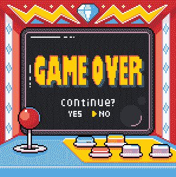

在这篇文章中，你将学习如何创建一个文本显示的复古风格的游戏！

# 在文本上添加游戏

在这个例子中，我使用的 UIManager 脚本是在 [**分数** **系统文章**](https://levelup.gitconnected.com/ease-of-building-ui-elements-in-unity-4f501c7e7c5e) 中创建的，在这里我将更深入地介绍添加 UI 文本元素。但是，您可以在代码中任何适用的地方使用相同的逻辑。在我的例子中，我已经有办法知道这个脚本中还有多少条生命，因此它在这里是适用的。你可以在这里看到[**的生命计数器流程**](/codex/creating-a-lives-counter-ui-element-in-unity-9d48b485555e) 。

1.  添加 UI 文本元素。

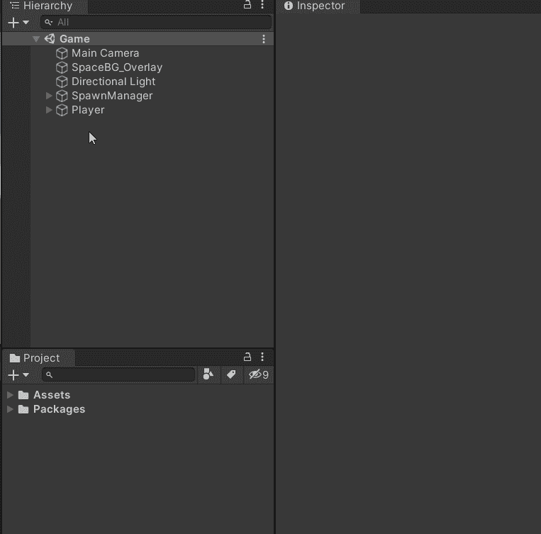

2.如有必要，更改文本的颜色，使其更加清晰可见。确保将水平和垂直溢出设置为*溢出*，否则，随着字体变大，文本也会变小。

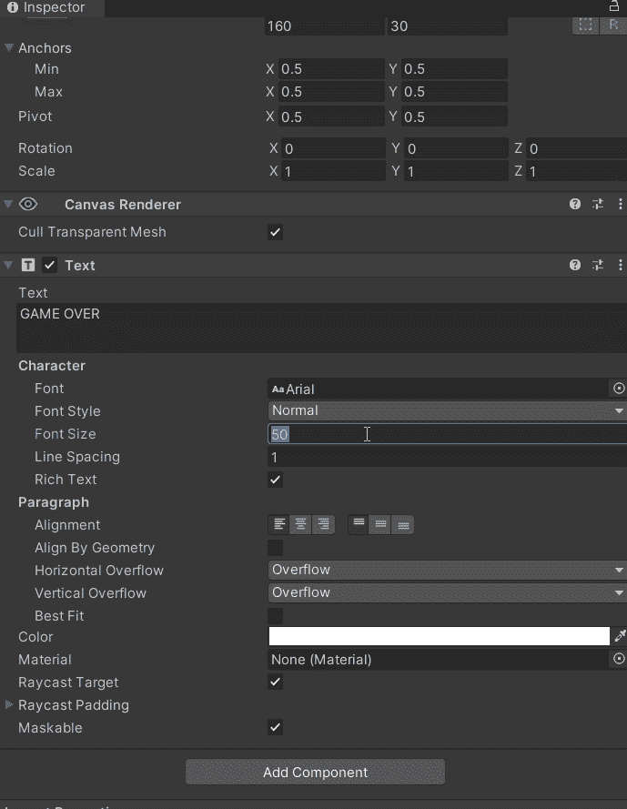

3.将文本放置在屏幕中央，并将其锚定在该位置。

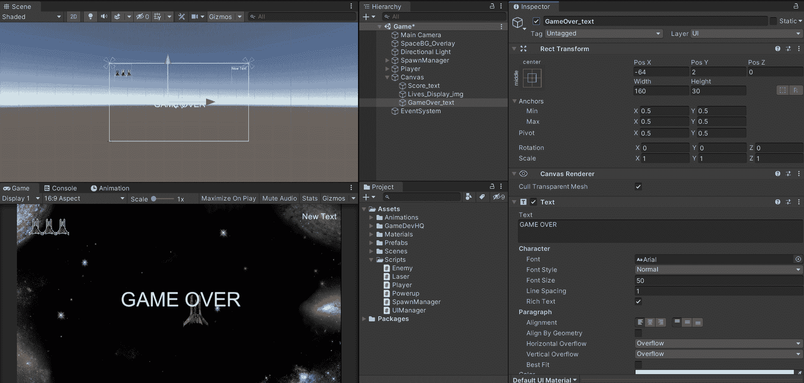

4.根据屏幕大小缩放文本，这样，无论您是将应用程序部署到电视还是手机，大小都会相应地缩放。要确保文本在透视中缩放到屏幕大小，您可以在检查器中设定 UI 缩放模式。

> **注意**:这一步是在评分系统文章中完成的，但是，如果您将此作为一个单独的指南，那么您这样做是非常重要的。

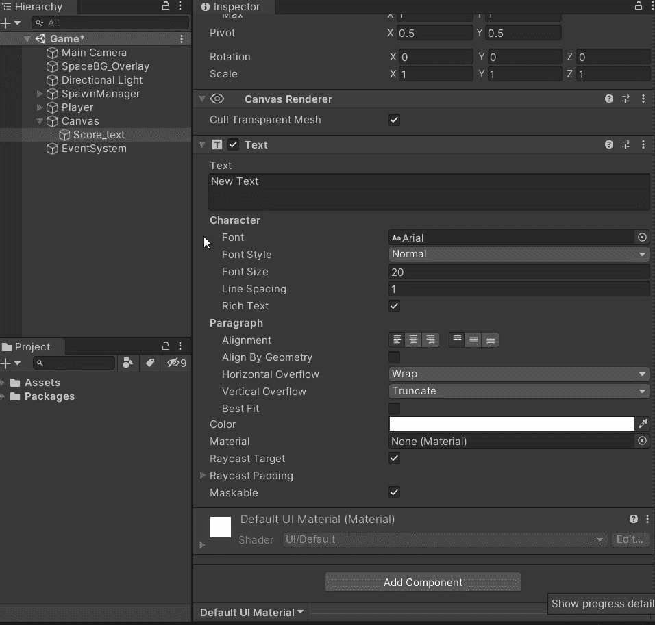

# 编写玩家死亡时出现的文本脚本

有了你的文本，是时候对它进行编程了，这样它就会特别地出现

1.  使用 SerializeField 创建一个句柄来引用文本对象，以便从检查器中访问它。将文本对象从层次拖动到新创建的引用。

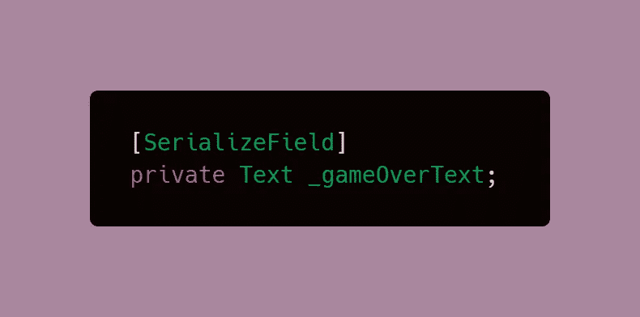

> ***注意*** *:我之前已经做了* ***Unity UI 库*** *可访问，这就是允许你创建数据类型创建文本数据类型的地方。如果你没有权限，就简单的*

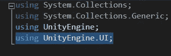

2.。将文本对象从层次拖动到新创建的引用。

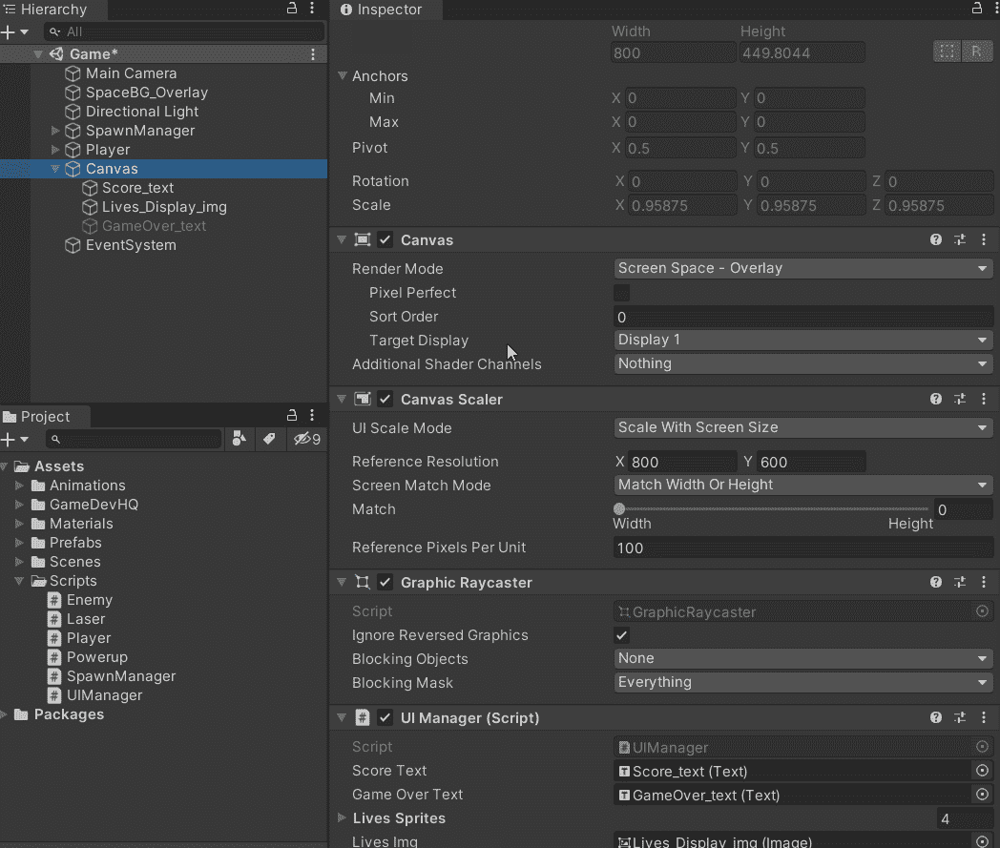

3.有了引用集，我们现在可以通过代码访问它。该对象将在开始时被停用，以便文本仅在我们也需要它时才显示，而不是经常显示。您可以通过代码或通过检查器来实现这一点。

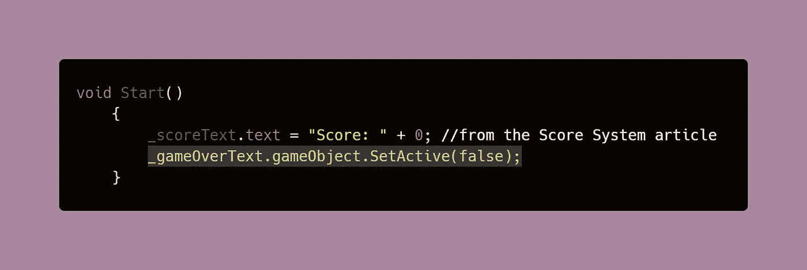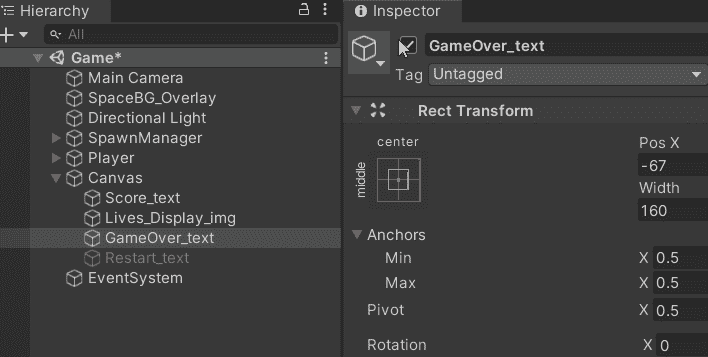

4.当玩家死亡/玩家生命等于零时激活文本。

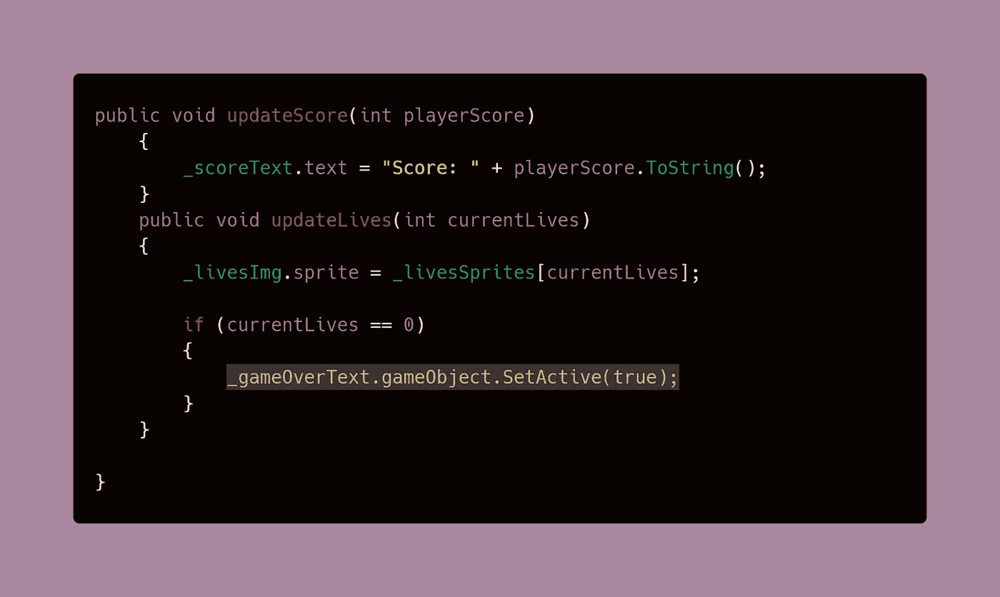

# 让文本像复古游戏一样在屏幕上闪烁

可以使用在玩家死亡时运行的[**协程**](/codex/coroutines-with-unity-b5a2b3fc3426) 对闪烁行为进行编程。文本将每隔 0.5 秒被禁用和启用。当当前的生命数量保持在 0 时，这个序列将不断重复。

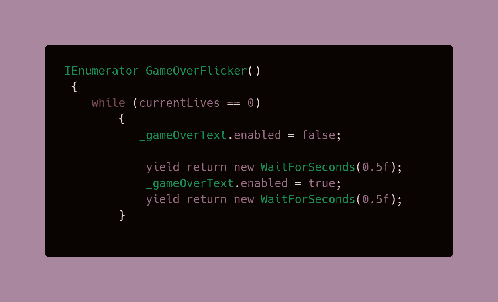

协程需要在处理文本激活游戏的相同代码中启动。

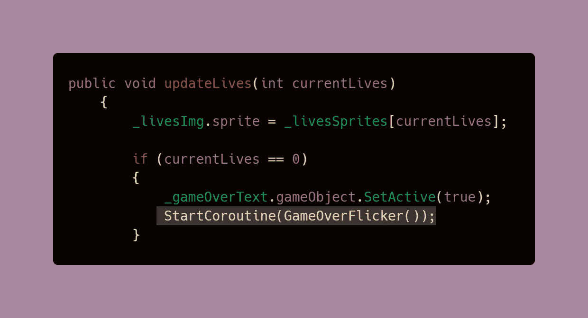

有了这个，你应该有一个全功能的文本行为的复古游戏！

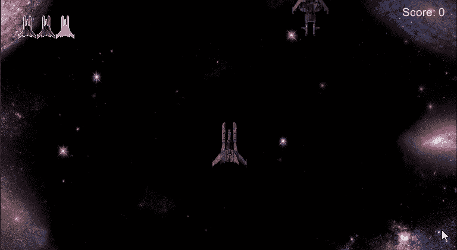

在我的下一篇文章中，我们将看看如何从游戏画面 中 [**重启游戏！**](https://dennisse-pd.medium.com/loading-scenes-in-unity-60efef317413)