# 创造一个带有冷却系统的自我再生耐力棒

> 原文：<https://medium.com/codex/creating-a-self-regenerating-stamina-bar-with-a-cooldown-system-5ef67f4262a9?source=collection_archive---------11----------------------->

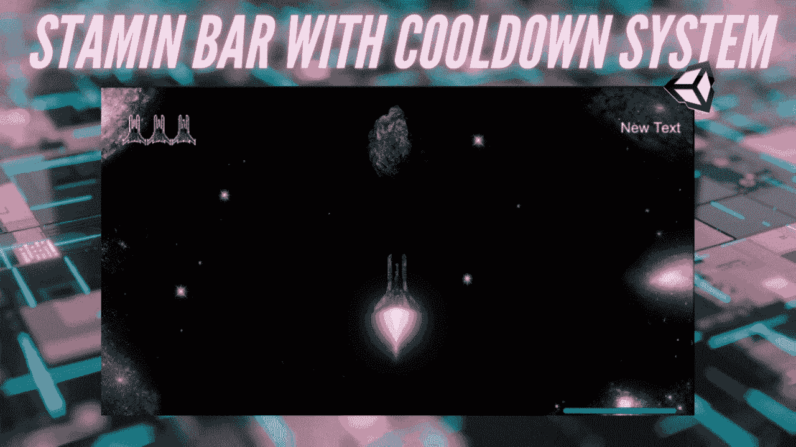

我之前写过一篇关于如何使用协程实现这一点的[文章](https://levelup.gitconnected.com/how-to-create-a-self-regenerating-stamina-bar-in-unity-44ab156dbad9)，这是另一种使用冷却系统的方法，这样玩家就不能滥用冲刺或推进功能。过程是类似的，滑块设置保持不变，如果你想知道我是如何得到这篇文章中的滑块的，请检查前一个。

## 目录:

[制作方法更新耐力条](#58f0)
[使用按键调用方法](#1e21)
[再生耐力条](#ec7f)
[添加冷却系统](#7bcb)
∘ [结果:](#4f8e)

# 制作一个更新耐力条的方法

在这一节中，我们将创建一个方法来计算和更新滑块的变化。下面的例子展示了我为 2D 太空射手推力机构编写的代码，然而，同样的逻辑也适用于耐力棒。

1.  首先，我们的代码中需要 Unity UI 库。

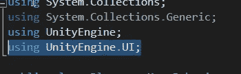

2.现在我们可以访问 UI 了，我们可以为滑块创建一个引用。这将是一个 SerializeField，以便我们可以在检查器中设置它。

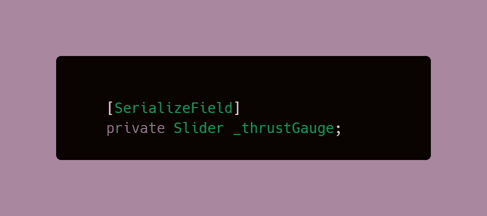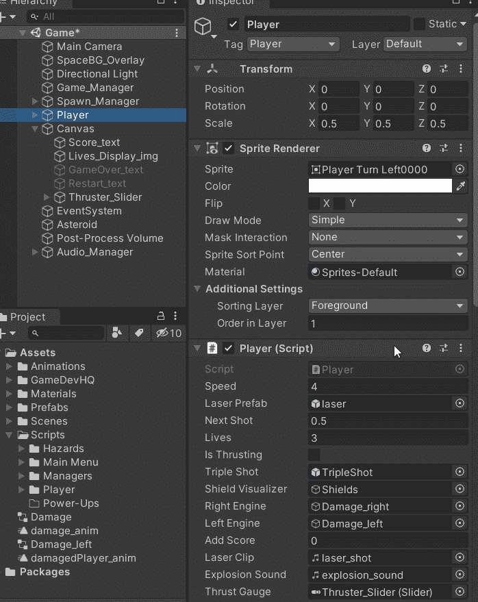

3.在 Start 方法中获取 Slider 组件。

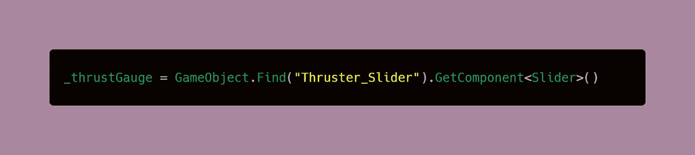

4.在试图在代码中使用组件之前，最好先检查它是否为空。

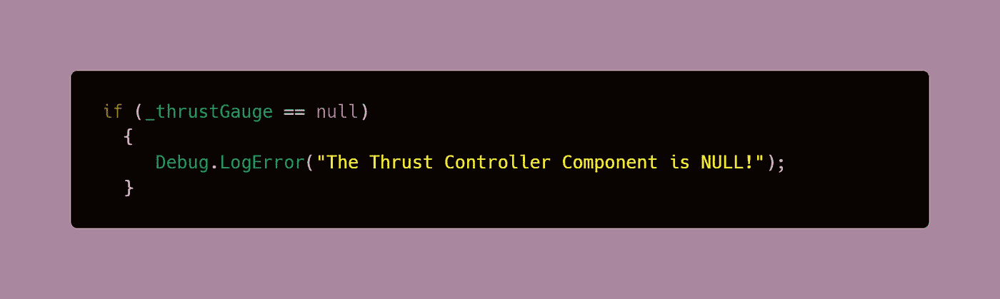

5.为最大值创建一个全局**变量。该值应该与您在检查器中为滑块分配的最大值相匹配。它可以是 int 或 float。**

> **注意**:如果您打算使用整数，请确保您在检查器中选择了“使用整数”。

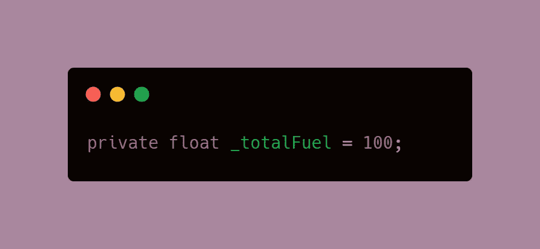

6.创建一个计算和更新滑块/耐力条的方法。该方法将有一个数字参数来跟踪当前减少或增加的燃油。

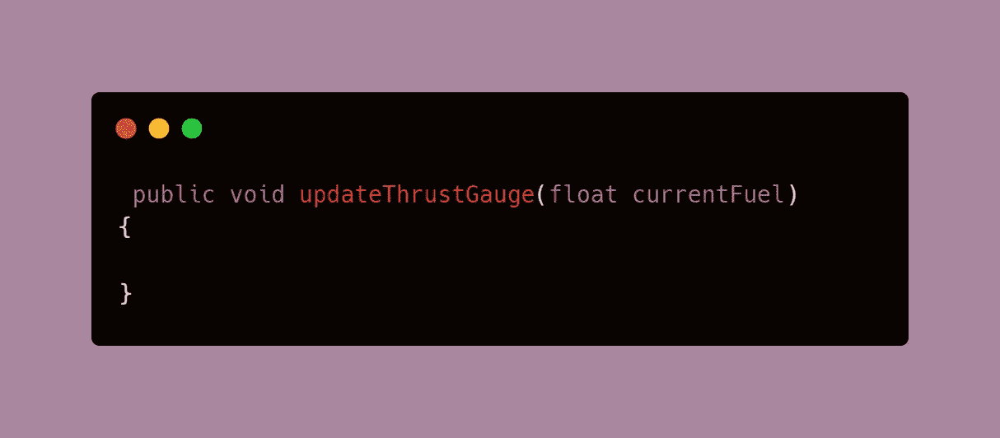

7.在这种方法中，我们需要确保总燃油量根据当前燃油变量增加或减少。这是通过使用[速记符号+=](https://docs.microsoft.com/en-us/dotnet/csharp/language-reference/operators/addition-operator) 将当前燃料数加到总燃料数上来完成的

> **注意**:程序知道数值是减少还是增加的方式是通过使用负数或正数。随着代码的深入，您将会看到这一点。

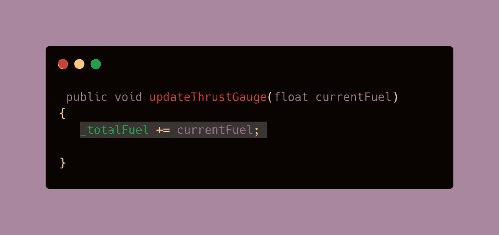

8.由于我们可以访问一个变量，该变量通过添加当前燃料来跟踪总燃料的更新，因此我们可以使用这个变量来检查是否有足够的燃料来继续写入或运行。如果没有，您可以将播放器的速度设置为默认值，在我的例子中是 4。

> **注意**:这里的调试信息并不是必须的，但它有助于确保当滑块处于 0 时，if 被注册。

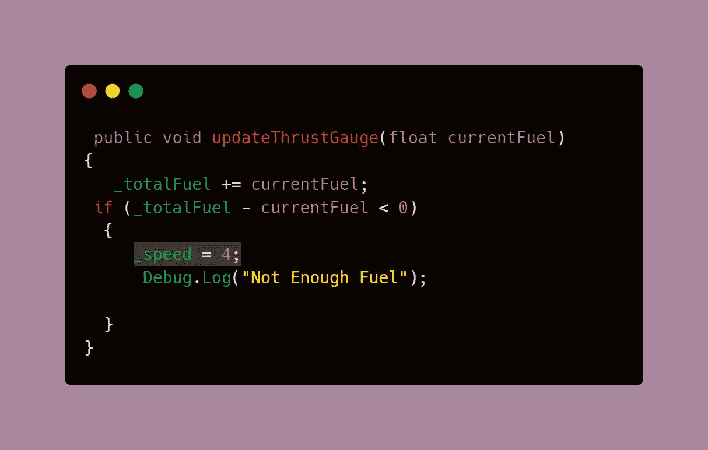

# 使用按键来调用方法

1.  通过这种设置，只要在 Update 方法中按下一个键，就可以调用 updateThrustGauge 方法，并在参数中设置一个数字来确定滑块的增减量。

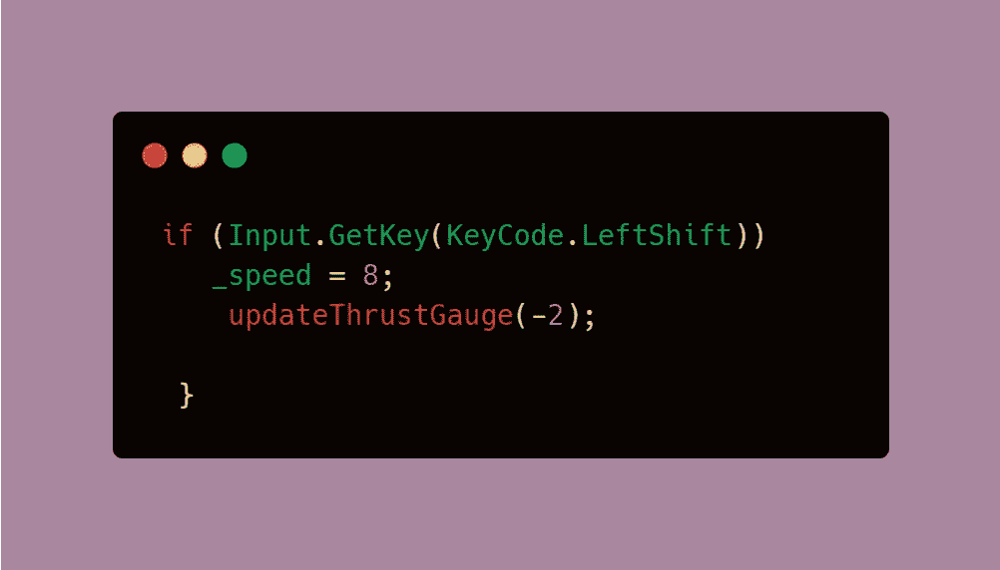

在这个例子中，我们使用 [**GetKey**](https://docs.unity3d.com/ScriptReference/Input.GetKeyDown.html) **而不是** [**GetKeyDown**](https://docs.unity3d.com/ScriptReference/Input.GetKeyDown.html) 因为按键将逐帧为真，而 GetKeyDown 对于您按下它的那一帧为真。这意味着只要你按下那个键，在 GetKey 中运行的计算就会连续发生。我们需要这样做，以便滑块不断更新，而不是必须重复按键才能移动。

我还将播放器速度设置为两倍(从 4 默认速度到 8)。这是直接分配的，而不是通过算术来分配，因为我们不希望玩家变得越来越快，正如前面提到的，这就是响应 GetKey 的计算会发生的情况。

2.现在，我们需要将每次释放按键时播放器的速度标准化。为此，我们使用 GetKeyUp，它以与 GetKeyDown 相同的方式注册该帧。

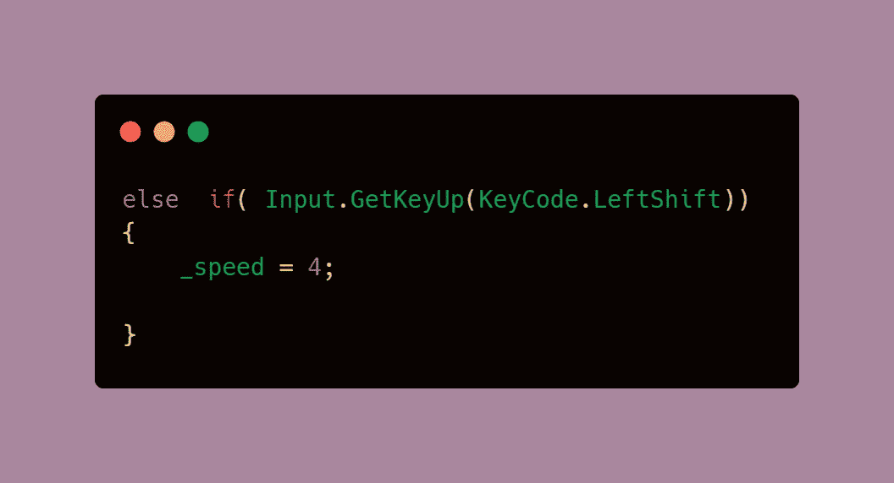

# 再生耐力条

现在，我们需要在不使用的时候重新生成耐力条/滑块。我们不能使用 GetKeyUp 来这样做，因为它每次按键只会注册一次。相反，我们将把它放在更新中，并在玩家不冲刺的时候激活它。首先，我们需要多一点来做到这一点。

1.  创建一个全局的 bool 变量来跟踪玩家什么时候推或者不推。这在默认情况下是错误的，因为我们的玩家不仅仅是在游戏开始时喷射或推进。

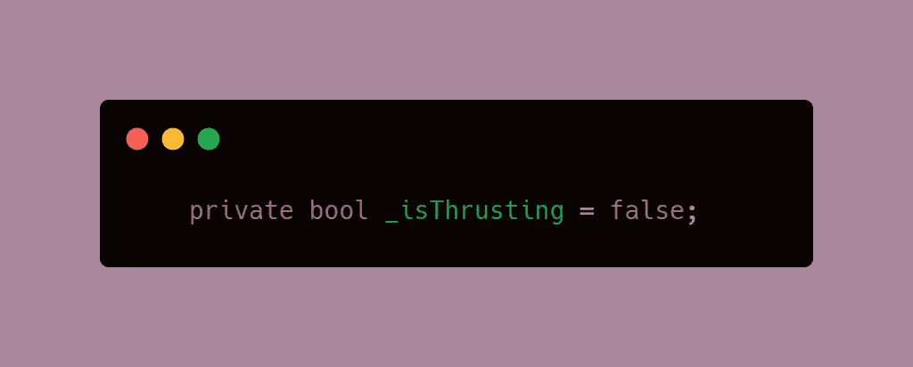

2.创建两个方法将值设置为 true 和 false。最好的做法是让方法来处理这个问题，而不是动态地改变变量的值。

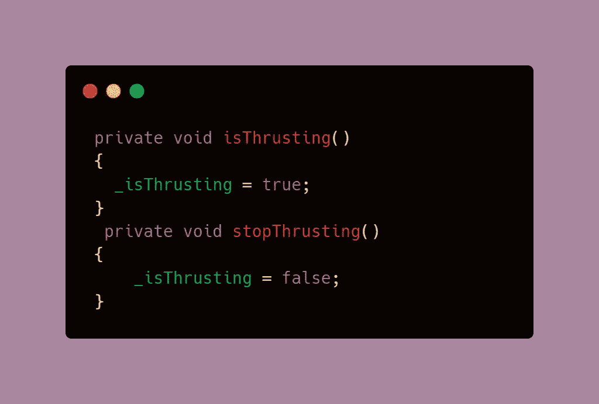

3.现在我们需要一种再生的方法。或者，这可以松散地放在更新中，但我觉得放在方法中更有条理。每当停止推进被调用时，该方法将被激活。

注意 updateThrustGauge 方法这次是如何递增的。

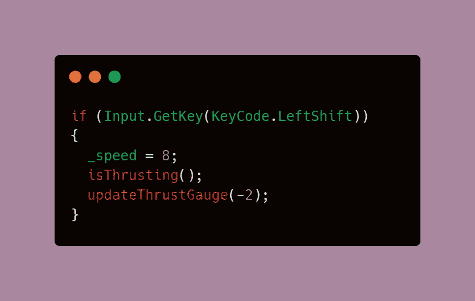

4.每当按键时调用 isThrusting 方法。

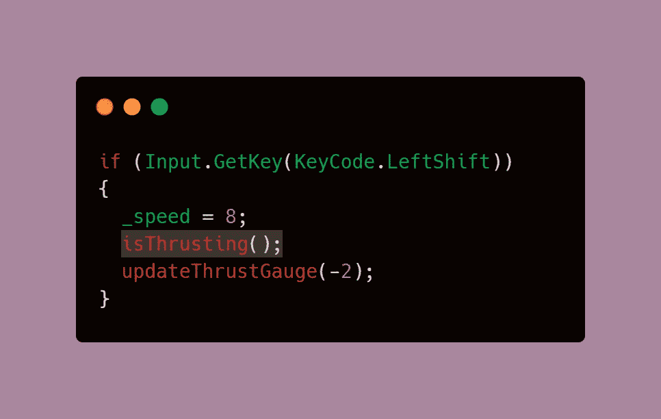

5.每当释放键时调用 StopThrusting 方法。由于您正在跟踪每个，再生方法将相应地变为活动和非活动。将 regenFule 方法添加到 GetKeyUp 之外，这样无论何时 thrusting 为假，它都会不断地重新生成工具条。

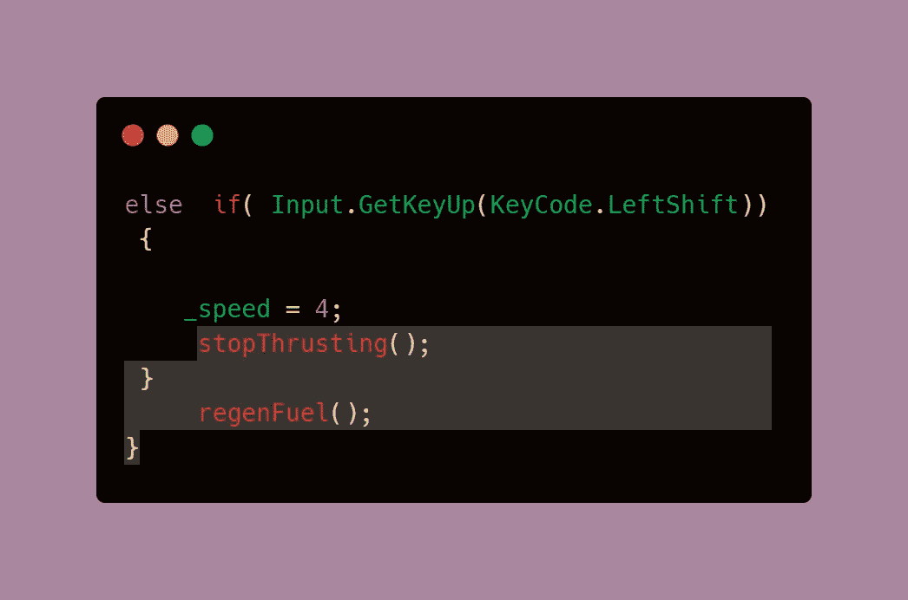

# 添加冷却系统

冷却系统实现起来既快又简单，你可以在这篇文章中了解更多。让我们来看看如何将它实现到这段代码中。

1.  创建两个全局变量，一个是延迟，一个是你再次冲刺的时候。我使用 SerializeField，这样我就可以在检查器中看到值是如何变化的，或者出于调试目的自己调整它。你可以调整这些数字，这取决于你希望球员被限制弹跳或冲刺多长时间。

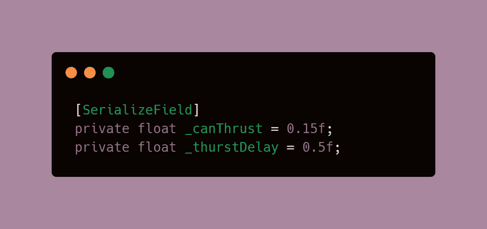

2.添加一个条件，通过比较当前运行时和 our _canThrust 变量来开始推进。

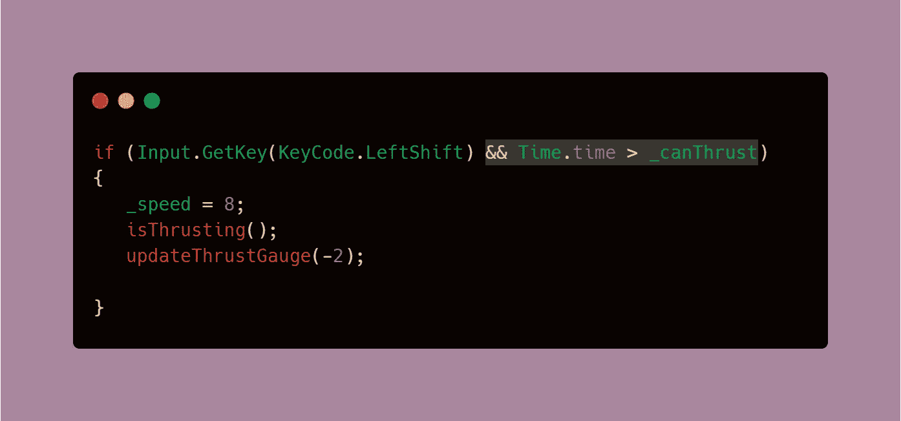

3.接下来，我们添加每当释放键时的延迟。我们不希望这个值无限增加，所以每当释放该键时，延迟就会增加。

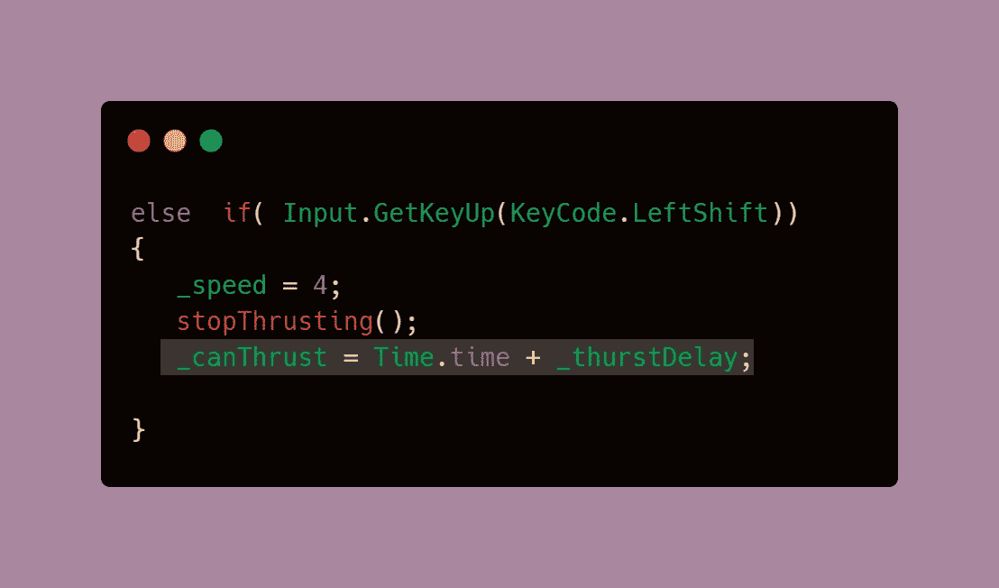

## 结果是:

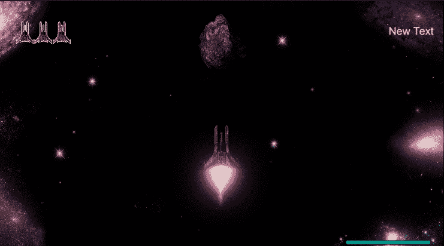