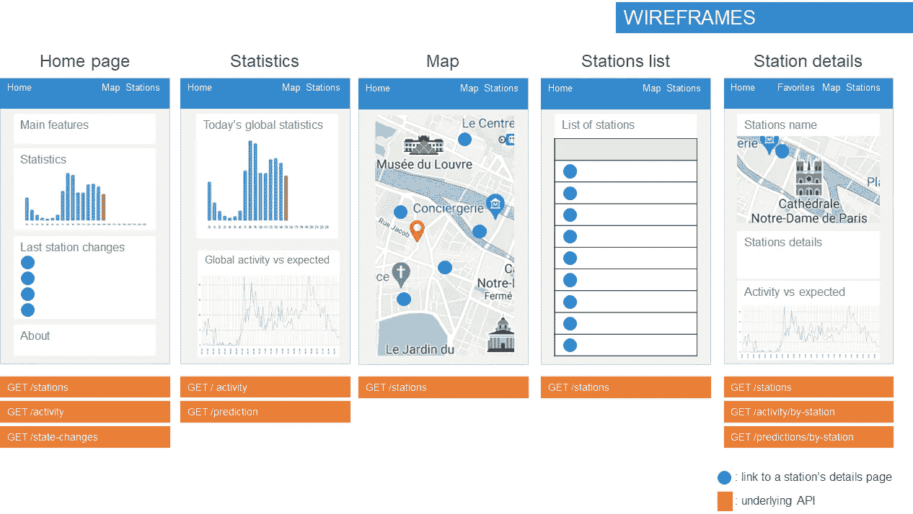
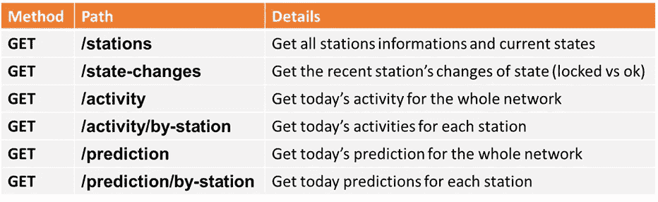
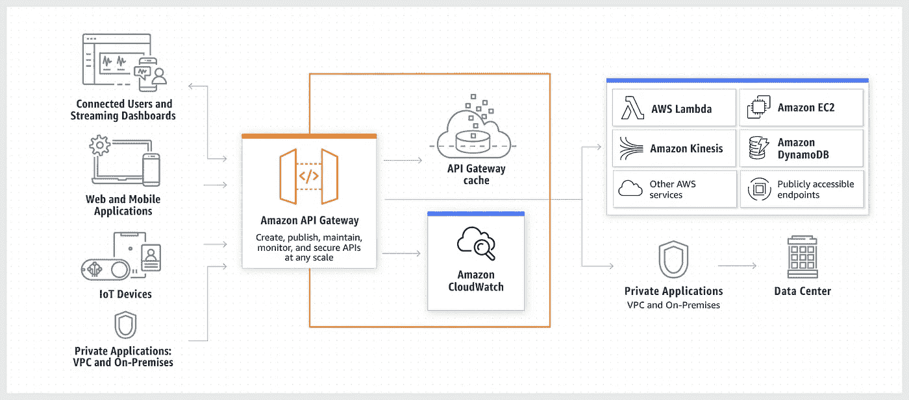
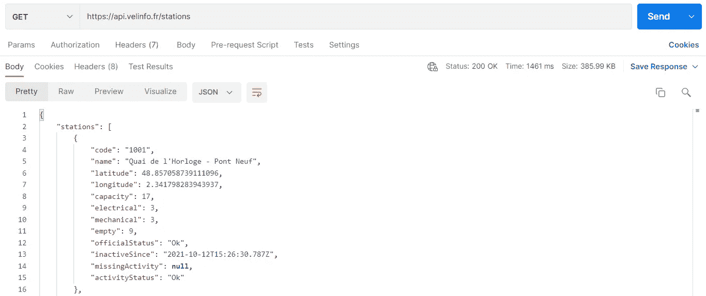
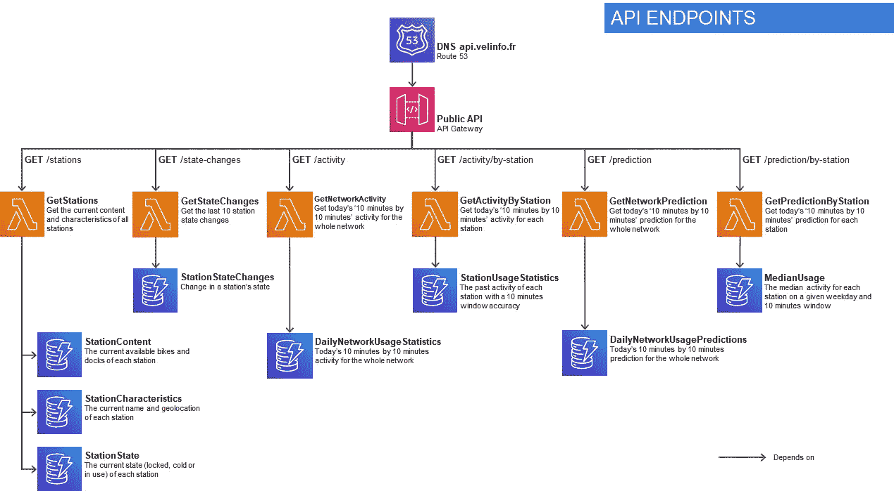
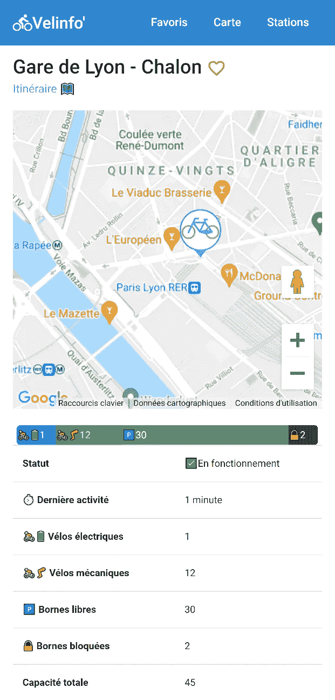
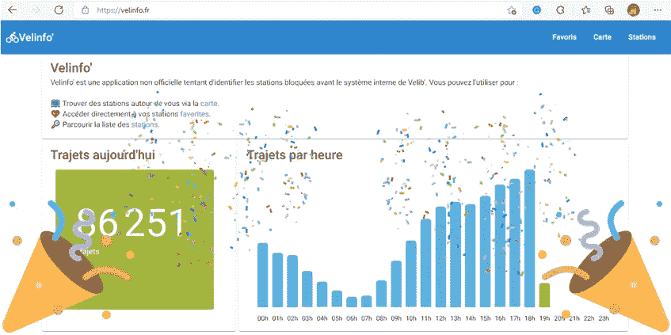
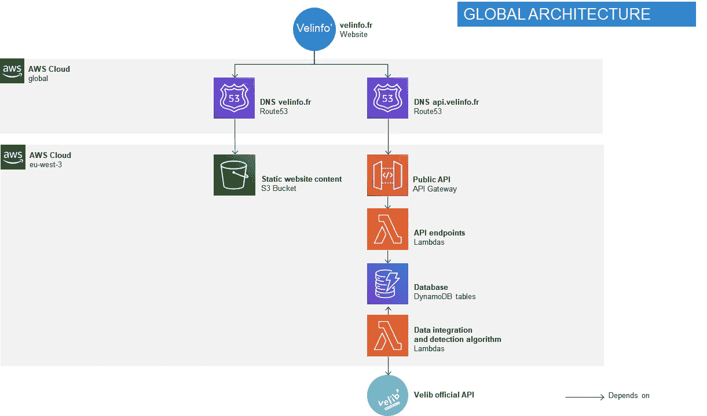

# 创建一个无服务器的 API 和托管一个与 S3 的前端(检测巴黎的锁自行车站 4/5)

> 原文：<https://medium.com/codex/creating-a-serverless-api-and-hosting-a-frontend-with-s3-b50e61a8f707?source=collection_archive---------2----------------------->


亚历山德拉·卡雷托在 [Unsplash](https://unsplash.com?utm_source=medium&utm_medium=referral) 上拍摄的照片

> 这一系列文章是关于我在学习如何使用 AWS 无服务器堆栈的同时，花了太多时间试图解决一个小问题(检测巴黎上锁的自行车站，见[第一部分](/codex/detecting-locked-bicycle-stations-an-aws-serverless-story-part-1-95dcdb477649))。要查找其他文章，请跳到页面底部。

# UX 和 API 设计

在使用 DynamoDb 流和 Lambda 函数实现了检测算法之后(参见[第 3 部分](/codex/detecting-locked-bicycle-stations-an-aws-serverless-story-part-3-d532318dfca7)，我需要一个前端来显示结果。一个简单的 HTML 表列出每个站点的状态就足够了，但是这有什么意思呢？因此，我将创建一个基本但功能强大的应用程序，让任何人都能够找到最近的电台，并查看其当前内容和状态。我还将使用这个应用程序来显示我的管道正在计算的一些统计数据。

但是在花时间开发之前，我将先做一个简单的模型。对于每个页面，我将尝试定义需要哪个 API。



web 应用程序的简单模型，调用相应的 API 端点。

最后，我选定了五个主要页面:

*   **主页**包含一些关于今天网络使用情况的指标(带有一个更详细的统计页面的链接)和一个最近站点状态变化的列表(从‘OK’变为‘Locked’的站点，反之亦然)。
*   **统计页面**显示今天的指标和一个比较预测活动和实际活动的图表。我自己会用它来快速监测我的预测有多准。
*   **地图页面**定位用户和附近的电台，并将其显示在地图上，使用自定义大头针快速查看锁定或不可用的电台。点击一个大头针将重定向到该站的详细信息页面。
*   **电台列表页面**允许用户通过搜索框按名称查找特定电台。
*   **电台详情页面**显示了特定电台的所有信息，包括一个小地图、电台内容详情和一个显示电台当天活动的图表。

填充这些页面所需的所有数据可以通过以下端点进行总结。



web 应用程序所需的 API 端点列表。

> **注**:理想情况下，我会依靠 path 参数更容易地获得单个站点的活动或预测(例如:GET /activity/{station-code})。但是，关于缓存的成本和技术限制阻止了我这样做。在第 5 部分中会有更多的介绍。

# 带 API 网关的无服务器 API

让我们从实现 API 开始。当然，要在 web 上公开 API，您需要某种始终可用的服务器，对吗？

不，或者更确切地说，AWS 提供了一个解决方案来管理这个问题，您只需要关注当端点被实际调用时会发生什么。这是 [API 网关](https://aws.amazon.com/api-gateway/?nc1=h_ls)。



无耻地从 AWS 文档中窃取

简而言之，API Gateway 充当 web 和您的代码之间的代理。它公开端点，当一个端点被调用时，它触发您选择的服务，转发调用的参数并返回服务决定的任何内容。在我们的例子中，我们只需要触发一个 Lambda 函数。从 Lambda 函数的角度来看，它只是另一个事件，有一个特定的[事件负载](https://docs.aws.amazon.com/lambda/latest/dg/services-apigateway.html)。

因此，让我们创建第一个" *GET /stations* "端点:

在 SAM/CloudFormation 模板中，我们需要创建一个新函数，并声明一个“HttpAPI”事件，使用所需的路径和方法，以及对 API 网关的引用。然后我们必须创建 API 网关。SAM 用 **AWS::Serverless::HttpApi** 类型提供了一个更简单的声明，如果需要的话，它主要需要 [CORS](https://developer.mozilla.org/en-US/docs/Web/HTTP/CORS) 配置以及对域名和相关参数的引用。这里我用的是自己的 [velinfo.fr](http://www.velinfo.fr) (Velinfo，Velib'+info，懂了吗？)域名。更确切地说，我专门为 api 创建了一个特定的 api.velinfo.fr 子域。

这需要通过 AWS [Route 53](https://aws.amazon.com/route53/) 设置一个域名，并创建相应的托管区域和证书，但我不会深入探讨这个话题。

> **注意**:实际上 API 网关有两种 SAM 类型: **AWS::Serverless::Api** 和 **AWS::Serverless::HttpApi。**它们分别代表 [RestApi](https://docs.aws.amazon.com/apigateway/latest/developerguide/apigateway-rest-api.html) 和 [HttpApi](https://docs.aws.amazon.com/apigateway/latest/developerguide/http-api.html) 网关。第一个是特性最丰富的，例如有自己的缓存，而第二个是最基本的，但也是性能最好和最便宜的(大约 x3)。我在用最后一个。

Lambda 函数与我们已经看到的函数非常相似。主要区别在于，它将一个特定的事件类型作为参数，并且它将返回一个结构化的对象，该对象将包含表示 REST 响应所需的状态代码、主体和潜在的头。

这里，我没有使用 event 参数，但是我可以使用它来查找关于这个特定 API 调用的上下文信息、使用的路径和查询参数等等。

下面是[事件](https://github.com/DefinitelyTyped/DefinitelyTyped/blob/master/types/aws-lambda/trigger/api-gateway-proxy.d.ts)的样子:

让我们部署新的端点(照常使用`sam deploy`)并测试它。



使用邮递员的端点调用。

效果很好！

我的大多数端点只是暴露了特定 DynamoDb 表中的内容，所以我将跳过它们的实现。



API 网关端点以及相关的 Lambda 函数和 DynamoDb 表。

# 与 S3 的前端托管

随着 API 的创建，我可以开始实现前端。由于角度开发不是本文的主题，我将快进一点。



电台的详细信息页面。目前只有法文版。

对于那些感兴趣的人，我主要依靠 [Angular Material](https://material.angular.io/) 组件库进行基本的造型和结构。我对地图使用了 [agm](https://www.npmjs.com/package/@agm/core) (从长远来看，这可能不是最合理的选择，因为谷歌地图的免费计划非常严格),对自定义图表使用了 [ngx-charts](http://twitter.com/swimlane/ngx-charts) 。

我可以构建我的前端应用程序，并使用 Angular CLI 生成相应的静态文件:`ng build --prod`

但是，我该怎么主持呢？显然，我可以在任何一家虚拟主机公司租一台服务器，在那里托管我的应用程序，但这并不是“无服务器”的😉

在第 1 部分，我很快谈到了 AWS 的“简单存储服务” [S3](https://aws.amazon.com/s3) 。

S3 是一个非常有弹性的对象存储服务。对象可以是任何东西，例如. html 或. css 文件。如果不是一堆静态文件提供给网络浏览器，那么什么是前端应用程序呢？

即使虚拟主机最初不是 S3 的核心功能(它实际上是作为一种存储服务，通过 SDK 或 API 来操作对象/文件)，托管静态网站很快成为 S3 的一个明显的用例，并且推出了[虚拟主机功能](https://docs.aws.amazon.com/AmazonS3/latest/userguide/HostingWebsiteOnS3Setup.html)。

要使用它，我们首先需要定义一个新的 S3“bucket”(bucket 是 S3 的一个存储单位，将其视为一个共享文件夹)，并定义一个 WebSiteConfiguration 来指定索引文档在哪里(在我的例子中，index.html 文件位于 bucket 的根)。我们还需要定义一个访问策略，允许每个人都可以读取 bucket 的内容。最后，我们需要知道为这个 bucket 生成的公共 URL 是什么，所以我将为此添加一个输出。

为了创建这个 bucket，我只需要用 SAM: `sam deploy`部署配置。在操作的最后，我将获得生成的 bucket 的 URL。

但是如果我现在调用它，它什么也不返回。这很正常，因为我创建了这个桶，但是我没有在里面放任何东西。我需要使用 AWS CLI 将我的静态站点内容推到桶中。为此，我将使用 AWS CLI。

```
#build using angular CLI
ng build --prod#clear the bucket content
aws s3 rm s3://velinfo-frontend --recursive#push the new content
aws s3 cp dist/velinfo s3://velinfo-frontend --recursive --cache-control max-age=31536000
```

在浏览器中调用 bucket 的 URL 将显示网站，但是 API 调用失败。这是因为我们的好朋友 [CORS](https://developer.mozilla.org/en-US/docs/Web/HTTP/CORS) 阻止了我的 API 调用，因为我的站点(或桶)的域不是 [https://www.velinfo.fr](https://www.velinfo.fr) 所以它不在接受的域列表中。

为了在 [www.velinfo.fr，](http://www.velinfo.fr,)上正确托管站点，我需要创建一个 DNS 记录来指向 bucket 的 URL。为此，我可以简单地使用 AWS 自己的 DNS 服务( [Route53](https://aws.amazon.com/route53/) )并添加一个 CNAME 记录。

现在，成功了！



网站托管在 [https://www.velinfo.fr](https://velinfo.fr)

# 架构摘要

所以，让我们回顾一下当我访问我的网站时会发生什么:

*   [**www.velinfo.fr**](http://www.velinfo.fr) 域名指向 **velinfo-frontend** S3 桶，使用由 Route53 管理的 DNS 记录
*   **velinfo-frontend** bucket 被配置为作为网站提供其内容
*   前端应用程序使用 Angular CLI 构建，并使用 AWS CLI 推送到 bucket
*   前端应用程序从 **api.velinfo.fr** REST API 获取数据
*   **api.velinfo.fr** 使用路由 53 中管理的 DNS 记录指向 api 网关
*   API 网关触发对应于被调用端点的 Lambda 函数，并向它提供关于调用的所有信息
*   Lambda 函数调用相应的 DynamoDb 表
*   Lambda 函数返回表示状态代码、标题和主体的特定输出。所有这些都由 API 网关转发回调用者。
*   整个基础设施在 SAM/CloudFormation 模板中定义



API 和 web 应用程序现在已经完成。但是在结束这个系列之前，我想解决最后一件事:性能。

第 5 部分再见！

*   [第 1 部分](/codex/detecting-locked-bicycle-stations-an-aws-serverless-story-part-1-95dcdb477649):为原型选择 AWS 无服务器堆栈
*   [第 2 部分](https://ouvreboite.medium.com/detecting-locked-bicycle-stations-an-aws-serverless-story-part-2-b1967d639699):无服务器应用的主干:Lambda 函数和 DynamoDb 表
*   [第 3 部分](/codex/detecting-locked-bicycle-stations-an-aws-serverless-story-part-3-d532318dfca7):用 Lambda 函数和 DynamoDb 流实现实时检测算法
*   [第 4 部分](https://ouvreboite.medium.com/creating-a-serverless-api-and-hosting-a-frontend-with-s3-b50e61a8f707):创建一个无服务器的 API，用 S3 托管一个前端
*   第 5 部分:基于 Lambda 的 API 的性能调优