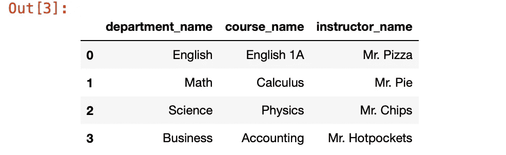

# 使用 SQLite 创建一个简单的大学数据库

> 原文：<https://medium.com/codex/creating-a-simple-college-database-using-sqlite-a29a0bcfcf37?source=collection_archive---------2----------------------->

## 练习 SQL 和基本数据库设计— #1

我正在寻找一些项目的想法，在这些项目中，我可以练习我的 SQL 并应用我迄今为止在基本数据库设计方面所学的知识，在快速的谷歌搜索后，我登陆了这个页面:

[](https://www.upgrad.com/blog/sql-project-ideas-topics-for-beginners/#2_Centralized_College_Database) [## 15 个令人兴奋的 SQL 项目创意&初学者主题[2022] | upGrad 博客

### 在过去几年中，现代商业世界经历了数据驱动决策的热潮。还有…

www.upgrad.com](https://www.upgrad.com/blog/sql-project-ideas-topics-for-beginners/#2_Centralized_College_Database) 

在这篇文章中，我想尝试解决第二个问题:

> 学院有学术部门，如英语系、数学系、历史系等等。每个系都提供各种各样的课程。现在，一名教师可以教授多门课程。比如说，一位教授上了一堂统计学和微积分的课。作为数学系的学生，你可以选修这两门课程。因此，每门大学课程都可以有任意数量的学生。这里需要注意的重要一点是，一门特定的课程只能有一名讲师，以避免重叠。”

我不想先在网上检查解决方案，然后再亲自尝试，只是基于我所知道的，我将在这里分享。像往常一样，任何建设性的反馈和批评都是受欢迎的，没有更多的麻烦，让我们直接开始吧！

**想象并创建数据库模式**

总结上面的问题，我们有以下几点需要考虑(加上我自己的一些补充):

1.  一个系可以有很多课程
2.  一名教师可以教授多门课程(在自己的部门内)
3.  一个学生可以(从任何系)选修许多课程
4.  一门课程只能由一名讲师授课

所以我想象了一个如下的场景:


*总的来说，4 个学生，4 个系，6 个老师教的 8 门课*

当然，我们不会创建这样的数据库，我们需要考虑我上面总结的几点，我认为数据库看起来更像这样:


除了我可怕的糟糕的书写，我将使用我自己的话和我如何理解我到目前为止所学到的来解释我上面所做的:

*   每个表的每一行都有自己唯一的 ID(主键)
*   每个表通过它们的 id 相互链接，这取决于哪种关系最有意义(例如，每个教师通过 department_id 连接到部门，department _ id 用作教师表中引用部门表的外键)
*   在学生、教师和课程的情况下——每一行只能指向一个部门，不管它是什么，因此它们可以通过引用 department_id 来建立“直接关系”
*   然而，一个教师可以教许多课程，一个学生可以选修许多课程。此外，一门课程可以有很多学生。为了管理彼此之间的这种多对多关系，我们将在学生和课程以及教师和课程之间添加一个“第三”表，即“学生 _ 课程”和“教师 _ 课程”，该表将只包含指向其 id 的外键来描述它们的关系(哪个教师教哪个班，哪个学生上哪个班)。

既然我已经基本上提出了这个概念，让我们开始实际制作吧。对于这一个，我将只使用 SQLite 来做所有的事情(方式更繁琐，但对我来说更快，而且我可以练习我的 SQL，这是我第一次使用外键)。

创建表格:

```
CREATE TABLE department (
 department_id INTEGER PRIMARY KEY AUTOINCREMENT,
 department_name varchar(255)
 );CREATE TABLE instructor (
 instructor_id INTEGER PRIMARY KEY AUTOINCREMENT,
 instructor_name varchar(255),
 department_id INTEGER,
 FOREIGN KEY (department_id) REFERENCES department (department_id)
 );CREATE TABLE course (
 course_id INTEGER PRIMARY KEY AUTOINCREMENT,
 course_name varchar(255),
 department_id INTEGER,
 FOREIGN KEY (department_id) REFERENCES department (department_id)
 );CREATE TABLE student (
 student_id INTEGER PRIMARY KEY AUTOINCREMENT,
 student_name varchar(255),
 department_id INTEGER,
 FOREIGN KEY (department_id) REFERENCES department (department_id)
 );CREATE TABLE instructor_course (
 instructor_course_id INTEGER PRIMARY KEY AUTOINCREMENT,
 instructor_id INTEGER,
 course_id INTEGER,
 FOREIGN KEY (instructor_id) REFERENCES instructor (instructor_id),
 FOREIGN KEY (course_id) REFERENCES course (course_id)
 );CREATE TABLE student_course (
 student_course_id INTEGER PRIMARY KEY AUTOINCREMENT,
 student_id INTEGER,
 course_id INTEGER,
 FOREIGN KEY (student_id) REFERENCES student (student_id),
 FOREIGN KEY (course_id) REFERENCES course (course_id)
 );
```

现在让我们填满所有的表格:

```
-- Insert department dataINSERT INTO department (department_name) VALUES ('English');
INSERT INTO department (department_name) VALUES ('Math');
INSERT INTO department (department_name) VALUES ('Science');
INSERT INTO department (department_name) VALUES ('Business');-- Insert instructor dataINSERT INTO instructor (instructor_name, department_id) VALUES ('Mr. Pizza', 1);
INSERT INTO instructor (instructor_name, department_id) VALUES ('Mr. Pie', 2);
INSERT INTO instructor (instructor_name, department_id) VALUES ('Mr. Donut', 3);
INSERT INTO instructor (instructor_name, department_id) VALUES ('Mr. Chips', 3);
INSERT INTO instructor (instructor_name, department_id) VALUES ('Mr. Pepsi', 4);
INSERT INTO instructor (instructor_name, department_id) VALUES ('Mr. Hotpockets', 4);-- Insert student dataINSERT INTO student (student_name, department_id) VALUES ('Alice', 1);
INSERT INTO student (student_name, department_id) VALUES ('Bob', 2);
INSERT INTO student (student_name, department_id) VALUES ('Charlie', 3);
INSERT INTO student (student_name, department_id) VALUES ('Dave', 4);-- Insert course dataINSERT INTO course (course_name, department_id) VALUES ('English 1A', 1);
INSERT INTO course (course_name, department_id) VALUES ('Calculus', 2);
INSERT INTO course (course_name, department_id) VALUES ('Chemistry', 3);
INSERT INTO course (course_name, department_id) VALUES ('Physics', 3);
INSERT INTO course (course_name, department_id) VALUES ('Biology', 3);
INSERT INTO course (course_name, department_id) VALUES ('Finance', 4);
INSERT INTO course (course_name, department_id) VALUES ('Accounting', 4);
INSERT INTO course (course_name, department_id) VALUES ('Marketing', 4);-- Insert instructor_course dataINSERT INTO instructor_course (instructor_id, course_id) VALUES (1,1);
INSERT INTO instructor_course (instructor_id, course_id) VALUES (2,2);
INSERT INTO instructor_course (instructor_id, course_id) VALUES (3,3);
INSERT INTO instructor_course (instructor_id, course_id) VALUES (4,4);
INSERT INTO instructor_course (instructor_id, course_id) VALUES (4,5);
INSERT INTO instructor_course (instructor_id, course_id) VALUES (5,6);
INSERT INTO instructor_course (instructor_id, course_id) VALUES (6,7);
INSERT INTO instructor_course (instructor_id, course_id) VALUES (6,8);-- Insert student_course data--Alice
INSERT INTO student_course (student_id, course_id) VALUES (1,1);
INSERT INTO student_course (student_id, course_id) VALUES (1,2);
INSERT INTO student_course (student_id, course_id) VALUES (1,3);
INSERT INTO student_course (student_id, course_id) VALUES (1,6);--Bob
INSERT INTO student_course (student_id, course_id) VALUES (2,1);
INSERT INTO student_course (student_id, course_id) VALUES (2,2);
INSERT INTO student_course (student_id, course_id) VALUES (2,4);
INSERT INTO student_course (student_id, course_id) VALUES (2,7);--Charlie
INSERT INTO student_course (student_id, course_id) VALUES (3,1);
INSERT INTO student_course (student_id, course_id) VALUES (3,2);
INSERT INTO student_course (student_id, course_id) VALUES (3,5);
INSERT INTO student_course (student_id, course_id) VALUES (3,8);--Dave
INSERT INTO student_course (student_id, course_id) VALUES (4,1);
INSERT INTO student_course (student_id, course_id) VALUES (4,2);
INSERT INTO student_course (student_id, course_id) VALUES (4,3);
INSERT INTO student_course (student_id, course_id) VALUES (4,8);
```

现在我们准备好测试它了。我将使用 Pandas 和 Jupyter notebook 在这里发布结果，因为 DataFrame 输出看起来比终端输出更好(如果你想知道如何做到这一点，请在这里阅读[我的帖子](https://lifang-lee.medium.com/creating-a-simple-database-using-python-and-sqlite-349d126253da))。

**场景#1:找到鲍勃参加的所有课程，包括课程的部门和教师**

正如我在上面的场景表中看到的，答案应该是:


讲师(从左到右):披萨先生，派先生，薯条先生，热口袋先生

SQL 查询:

```
SELECT department.department_name, course.course_name, instructor.instructor_name FROM department 
INNER JOIN instructor ON department.department_id = instructor.department_id 
INNER JOIN instructor_course ON instructor.instructor_id = instructor_course.instructor_id 
INNER JOIN course ON instructor_course.course_id = course.course_id 
INNER JOIN student_course ON course.course_id = student_course.course_id 
INNER JOIN student ON student_course.student_id = student.student_id 
WHERE student.student_name = "Bob";
```

结果:



我发现在考虑内部连接时，参考上面的模式对我有帮助，对于我画的每个红色箭头，它通过引用一个表的主键和另一个表的外键来引用两个表之间的内部连接。

**场景#2:找到所有上化学课的学生**

答案应该是:爱丽丝和戴夫。

SQL 查询:

```
SELECT student.student_name, department.department_name FROM department 
INNER JOIN instructor ON department.department_id = instructor.department_id 
INNER JOIN instructor_course ON instructor.instructor_id = instructor_course.instructor_id 
INNER JOIN course ON instructor_course.course_id = course.course_id 
INNER JOIN student_course ON course.course_id = student_course.course_id 
INNER JOIN student ON student_course.student_id = student.student_id 
WHERE course.course_name = "Chemistry";
```

结果:


**场景#3:显示课程及其教师的列表**

这里没有什么特别有趣的，但我只是想指出，因为如果我们只搜索教员 _ 课程表，我们会得到:


因为它们都只是一个带有相互引用的 id 的表，但是如果我们以一种更人性化的方式来看待这个问题，用教员姓名替换教员 id，用课程名称替换课程 id，结果将如下所示:

SQL 查询:

```
SELECT instructor.instructor_name, course.course_name FROM instructor 
INNER JOIN instructor_course ON instructor.instructor_id = instructor_course.instructor_id
INNER JOIN course ON instructor_course.course_id = course.course_id;
```

结果:


现在我终于可以在网上看看我是否做错了什么和/或是否有更好的解决方案。但是我认为这是开始我的数据库设计学习之旅的一个很好的练习，如果你设法读完了，希望它对你也有帮助！