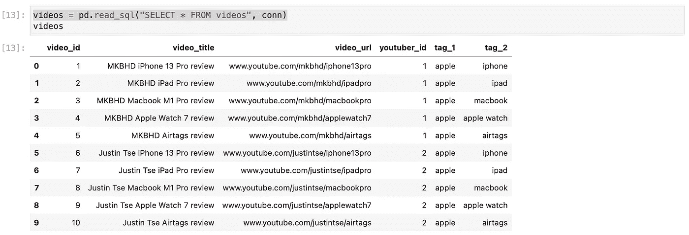
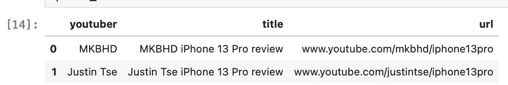
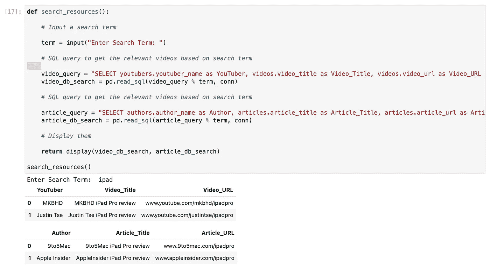

# 使用 Python 和 SQLite 创建简单的数据库

> 原文：<https://medium.com/codex/creating-a-simple-database-using-python-and-sqlite-349d126253da?source=collection_archive---------3----------------------->

## 还有如何用熊猫来看它们，它更漂亮

最近，我看了卡勒·哈尔登的视频，受到启发，开始做一些事情:

虽然我最终没有做出一个令人难以置信的、健壮的和可伸缩的数据库，但我真的想分享一些我在这个短暂的旅程中学到的(随机的)东西。如果你对我的代码有什么要指出的，或者对下一步有什么建议，请给所有的专业程序员积极的、建设性的反馈。

**我的简单数据库模式**

对于这个小任务，我想创建一个数据库来存储我最喜欢的文章以及 YouTube 视频的链接，我还想给它们标签，这样我就可以根据我想知道的主题搜索它们。我的想法是，不要每次都拿出整个表格自己查找我想要的内容(表格在某些时候可能会变得很大)，而是基于主题缩小搜索范围。

我还想把表格分成 YouTube 视频和文章，而不是把它们放在同一个桌子上。这样，我可以进一步将一行分类为视频或文章。当你在做一个真正的数据库设计时，这可能不是完全必要的，但是这不是重点。我只是在记录我学到的我们能做的。

*顺便提一下，我还想说这里使用的链接完全是虚构的。这个想法并不是要创建一个真实链接的数据库，只是为了展示数据库最终是如何工作的。*

**创建数据库，手动将表格和行插入每个表格**

这一次我们将使用 SQLite 3。我们需要做的就是在文本编辑器中打开一个新文件，并将其保存为一个. sql 文件。我把这个叫做“myDB.sql”。然后，我们将用我想要的表填充它。为此，我可以使用 SQL 命令:

```
CREATE TABLE youtubers (youtuber_id int, youtuber_name varchar(255));CREATE TABLE authors (author_id int, author_name varchar(255));CREATE TABLE videos (video_id int, video_title varchar(255), video_url varchar(255), youtuber_id int, tag_1 varchar(255), tag_2 varchar(255));CREATE TABLE articles (article_id int, article_title varchar(255), article_url varchar(255), author_id int, tag_1 varchar(255), tag_2 varchar(255));
```

这里我们有 4 个表，因为我想将作者(或 YouTuber)信息与文章和视频分开存储。由于每个表中每一行的 id 都是自己生成的(并不指向现实生活中的任何东西)，我们还可以将它设置为主键并自动递增它，但是由于我们并不打算在这个项目中学习如何输入数据(只是如何用已经建立的内容创建一个数据库)，所以让我们把它留到下一篇文章中。

此外，对于每个视频或文章，我们不会一遍又一遍地重写作者或 YouTuber 的名称，而是用 youtuber_id 或 author_id 来表示它们。通过这种方式，将来您还可以通过添加新列，在各自的表格中添加更多关于您最喜爱的 YouTuber 或作者的信息，而不会因为更多的冗余数据而使视频和/或文章表格越来越大。

同样为了简单起见，标题、URL 和标签将被设置为 *varchar(255)* ，因为此时无论。

让我们开始用信息填充表格。作为一名苹果粉丝，我将把以下内容插入我的数据库:

*   科技 YouTube**MKBHD**和**谢霆锋**
*   由 **9to5Mac** 和**苹果内幕**撰写的文章
*   对于每一个 YouTuber(或作者)，2 篇关于以下产品的文章(或视频):iPhone，iPad，MacBook，Apple Watch 和 AirTags

我们可以将它添加到刚刚创建的 myDB.sql 文件中:

```
INSERT INTO youtubers VALUES (1, "MKBHD");
INSERT INTO youtubers VALUES (2, "Justin Tse");INSERT INTO authors VALUES (1, "9to5Mac");
INSERT INTO authors VALUES (2, "Apple Insider");INSERT INTO videos VALUES (1, "MKBHD iPhone 13 Pro review", "[www.youtube.com/mkbhd/iphone13pro](http://www.youtube.com/mkbhd/iphone13pro)", 1, "apple", "iphone");
INSERT INTO videos VALUES (2, "MKBHD iPad Pro review", "[www.youtube.com/mkbhd/ipadpro](http://www.youtube.com/mkbhd/ipadpro)", 1, "apple", "ipad");
INSERT INTO videos VALUES (3, "MKBHD Macbook M1 Pro review", "[www.youtube.com/mkbhd/macbookpro](http://www.youtube.com/mkbhd/macbookpro)", 1, "apple", "macbook");
INSERT INTO videos VALUES (4, "MKBHD Apple Watch 7 review", "[www.youtube.com/mkbhd/applewatch7](http://www.youtube.com/mkbhd/applewatch7)", 1, "apple", "apple watch");
INSERT INTO videos VALUES (5, "MKBHD Airtags review", "[www.youtube.com/mkbhd/airtags](http://www.youtube.com/mkbhd/airtags)", 1, "apple", "airtags");
INSERT INTO videos VALUES (6, "Justin Tse iPhone 13 Pro review", "[www.youtube.com/justintse/iphone13pro](http://www.youtube.com/justintse/iphone13pro)", 2, "apple", "iphone");
INSERT INTO videos VALUES (7, "Justin Tse iPad Pro review", "[www.youtube.com/justintse/ipadpro](http://www.youtube.com/justintse/ipadpro)", 2, "apple", "ipad");
INSERT INTO videos VALUES (8, "Justin Tse Macbook M1 Pro review", "[www.youtube.com/justintse/macbookpro](http://www.youtube.com/justintse/macbookpro)", 2, "apple", "macbook");
INSERT INTO videos VALUES (9, "Justin Tse Apple Watch 7 review", "[www.youtube.com/justintse/applewatch7](http://www.youtube.com/justintse/applewatch7)", 2, "apple", "apple watch");
INSERT INTO videos VALUES (10, "Justin Tse Airtags review", "[www.youtube.com/justintse/airtags](http://www.youtube.com/justintse/airtags)", 2, "apple", "airtags");INSERT INTO articles VALUES (1, "9to5Mac iPhone 13 Pro review", "[www.9to5mac.com/iphone13pro](http://www.9to5mac.com/iphone13pro)", 1, "apple", "iphone");
INSERT INTO articles VALUES (1, "9to5Mac iPad Pro review", "[www.9to5mac.com/ipadpro](http://www.9to5mac.com/ipadpro)", 1, "apple", "ipad");
INSERT INTO articles VALUES (1, "9to5Mac Macbook M1 Pro review", "[www.9to5mac.com/macbookpro](http://www.9to5mac.com/macbookpro)", 1, "apple", "macbook");
INSERT INTO articles VALUES (1, "9to5Mac Apple Watch 7 review", "[www.9to5mac.com/applewatch7](http://www.9to5mac.com/applewatch7)", 1, "apple", "apple watch");
INSERT INTO articles VALUES (1, "9to5Mac Airtags review", "[www.9to5mac.com/airtags](http://www.9to5mac.com/airtags)", 1, "apple", "airtags");
INSERT INTO articles VALUES (1, "AppleInsider iPhone 13 Pro review", "[www.appleinsider.com/iphone13pro](http://www.appleinsider.com/iphone13pro)", 2, "apple", "iphone");
INSERT INTO articles VALUES (1, "AppleInsider iPad Pro review", "[www.appleinsider.com/ipadpro](http://www.appleinsider.com/ipadpro)", 2, "apple", "ipad");
INSERT INTO articles VALUES (1, "AppleInsider Macbook M1 Pro review", "[www.appleinsider.com/macbookpro](http://www.appleinsider.com/macbookpro)", 2, "apple", "macbook");
INSERT INTO articles VALUES (1, "AppleInsider Apple Watch 7 review", "[www.appleinsider.com/applewatch7](http://www.appleinsider.com/applewatch7)", 2, "apple", "apple watch");
INSERT INTO articles VALUES (1, "AppleInsider Airtags review", "[www.appleinsider.com/airtags](http://www.appleinsider.com/airtags)", 2, "apple", "airtag");
```

相当单调乏味的工作，但它会让我们得到一个简单的数据库，我们可以随时使用它。最后一步是运行这个 SQL 脚本并立即创建数据库。转到您的终端和 *cd* 到您的脚本的位置，并运行以下命令:

```
sqlite3 myDB.db < myDB.sql
```

假设一切运行完美，那”。db”文件基本上就是您的数据库。

您可以立即执行 SELECT 命令从该数据库中提取数据，有两种方法可以做到这一点。首先，您可以直接在终端上完成，如下所示:

```
sqlite3 myDB.db 'SELECT * FROM videos;'
```

或者你可以创造另一个。sql 文件，并像创建数据库时一样运行它，类似于:

```
sqlite3 myDB.db < mySearchQueries.sql
```

但是我将直接使用 Pandas 和 Jupyter Lab，因为这比在终端上查看输出结果更漂亮。

**第一步:导入库，连接到数据库**

这次我们真的只需要熊猫和 sqlite3。还有，让我们马上连接到数据库

```
import pandas as pd
import sqlite3 as sql# Connect to the database file 
conn = sql.connect("myDB.db")
```

**第二步:让我们执行所有不同种类的选择命令**

使用我们刚刚建立的连接，我们可以让 pandas 读取一个 SQL 命令并在数据库上执行它，然后输出我们想要的结果。例如，查看我的视频列表会是这样的:

```
videos = pd.read_sql("SELECT * FROM videos", conn)
```

输出如下:



此时，它基本上只是使用 SQL 命令，并将它们放在 pandas.read_sql()命令下。我将列出我在这篇文章中举的例子。

使用标签上的特定关键词搜索视频(比如 iPhone):

```
keyword = "iphone"iphone_videos = pd.read_sql("SELECT youtubers.youtuber_name as YouTuber, videos.video_title as Video_Title, videos.video_url as Video_URL FROM youtubers INNER JOIN videos ON youtubers.youtuber_id = videos.youtuber_id WHERE videos.tag_2 = '%s'" % keyword, conn)
```

正如在数据库模式中提到的，实际的 video 表没有 YouTuber 信息(只有它们的关联 id 可以与 YouTuber 表进行比较)。因此，我需要在 videos 和 YouTubers 表之间执行一个简单的连接，引用 youtuberid。

结果:


通过在标题中搜索特定的关键字，我也可以从上面得到相同的精确结果。同样，在这个阶段，它与 SQL 命令有更多的关系

```
title_search_query = "SELECT youtubers.youtuber_name as youtuber, videos.video_title as title, videos.video_url as url FROM youtubers INNER JOIN videos ON youtubers.youtuber_id = videos.youtuber_id WHERE videos.video_title LIKE '%iPhone%'"iphone_videos = pd.read_sql(title_search_query, conn)
```

结果:



如果我既想要标题上的特定关键字，又想要特定的 YouTuber，该怎么办？我可以在我的 SQL 命令中使用和

```
title_search_query = "SELECT youtubers.youtuber_name as youtuber, videos.video_title as title, videos.video_url as url FROM youtubers INNER JOIN videos ON youtubers.youtuber_id = videos.youtuber_id WHERE videos.video_title LIKE '%iPhone%' AND videos.youtuber_id = 1"iphone_videos = pd.DataFrame(pd.read_sql(title_search_query, conn))
```

结果:


最后，如果您注意到我们只是在玩视频表，而完全忽略了文章表。比方说，今天我想查阅我的数据库中关于某个特定标签的所有文章和视频。我想创建一个函数，它会提示我在数据库中搜索什么，并输出所有相关的结果。按照上面我们在不同的 SELECT 命令上所做的尝试，我们可以使用它来创建一个函数来完成这个任务。

首先，这个函数接收一个搜索词，并返回我数据库中的文章和视频。视频行将包含 YouTuber 名称、视频标题和视频 URL，文章行将包含作者名称、文章标题及其 URL(我们可以使用之前使用的 SQL JOIN 命令)。

最后，他们会将它输出为单独的表格(一个用于视频，一个用于列)，这对我来说很容易看到。带注释的完整代码如下:

```
def search_resources():

    # Input a search term

    term = input("Enter Search Term: ")

    # SQL query to get the relevant videos based on search term 

    video_query = "SELECT youtubers.youtuber_name as YouTuber, videos.video_title as Video_Title, videos.video_url as Video_URL FROM youtubers INNER JOIN videos ON youtubers.youtuber_id = videos.youtuber_id WHERE videos.tag_2 = '%s'"
    video_db_search = pd.read_sql(video_query % term, conn)

    # SQL query to get the relevant videos based on search term 

    article_query = "SELECT authors.author_name as Author, articles.article_title as Article_Title, articles.article_url as Article_URL FROM authors INNER JOIN articles ON authors.author_id = articles.author_id WHERE articles.tag_2 = '%s'"
    article_db_search = pd.read_sql(article_query % term, conn)

    # Display them

    return display(video_db_search, article_db_search)
```

让我们看看当我们尝试它的时候会发生什么。假设今天我想为 iPad 查看我保存在数据库中的所有资源。输出如下所示:



这是一个愚蠢的数据库，但我确实很享受制作它的过程，以及我在这个过程中学到的一些随机的东西。顺便说一下，下面是一个很好的资源来学习如何使用熊猫来连接表格:

[](https://brettromero.com/pandas-joining-tables/) [## 熊猫:连接表格

### 本文是使用 Python 数据处理库 pandas 的一系列实用指南的一部分。要查看视图…

brettromero.com](https://brettromero.com/pandas-joining-tables/)