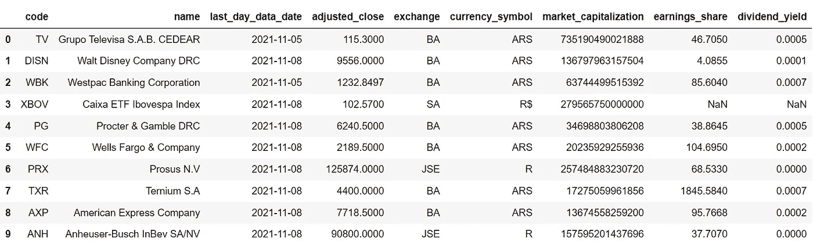
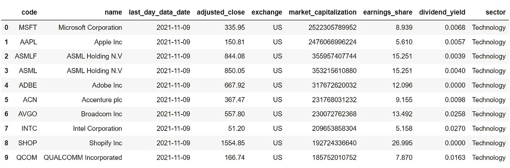

# 用 Python 在几分钟内创建一个简单的股票筛选程序

> 原文：<https://medium.com/codex/creating-a-simple-stock-screener-in-minutes-with-python-68c888d2fbf0?source=collection_archive---------0----------------------->

## 学习用不到 10 行代码构建您的自定义股票筛选程序


约书亚·阿拉贡在 [Unsplash](https://unsplash.com?utm_source=medium&utm_medium=referral) 上拍摄的照片

股票筛选是一个伟大的方式来排序和过滤数以千计的股票一次根据你的需要，但有些人可能会觉得很难从头编码。这时候 [**EOD 史料**](https://eodhistoricaldata.com/?utm_source=medium&utm_medium=post&utm_campaign=extracting_financial_news_seamlessly_using_python) 来救场了。我们大多数人都熟悉用于历史数据、实时数据和日内数据的股票 API，但 EOD 历史数据公司通过提供股票筛选 API 改变了游戏规则，使初学者易于入门并使用 Python 创建基本的股票筛选程序。

在本文中，我将带您浏览由 EOD 历史提供的股票筛选 API，并帮助您利用这些 API 来创建您想要的自定义股票筛选。不浪费更多的时间，让我们做一些编码！

> **注**:本文强烈基于 [EOD 史料](https://eodhistoricaldata.com/?utm_source=medium&utm_medium=post&utm_campaign=extracting_financial_news_seamlessly_using_python)提供的 API。因此，为了顺利地跟进即将到来的内容，请确保您拥有自己的帐户，因为它使您能够访问您的私有 API 密钥。您可以使用此处 的 [**链接创建账户。此外，并非本文中提到的所有 API 都是免费提供的，但需要订阅。点击**](https://eodhistoricaldata.com/register?utm_source=medium&utm_medium=post&utm_campaign=extracting_financial_news_seamlessly_using_python) 查看所有套餐的价格，并选择最适合您的套餐。

# 一个简单的 Python 股票筛选程序

## 1.导入包

让我们首先将所需的包导入到我们的 python 环境中，因为这是任何编程项目中最重要的过程。本文中我们需要的唯一包是进行 API 调用的请求和用于数据处理和操作的 Pandas。如果您尚未安装这两个软件包，请在命令行中输入以下代码行:

```
pip install pandas
pip install requests
```

安装完包后，我们现在可以使用下面的代码将它们导入到我们的 python 环境中:

```
import pandas as pd
import requests

api_key = 'YOUR API KEY'
```

现在，我们已经成功地将基本包导入到我们的环境中，并将 API 键存储到`api_key`变量中。

## 2.带单个过滤器的基本筛分机

我们现在将创建一个只有一个条件或过滤器的股票筛选程序。根据我们的条件，筛选者代表市值超过 1000 亿美元的股票。使用下面的代码，我们可以很容易地根据上述条件创建一个筛选程序:

```
# SINGLE FILTER

mktcap_url = f'https://eodhistoricaldata.com/api/screener?api_token={api_key}&sort=market_capitalization.desc&filters=[["market_capitalization",">",100000000000]]&limit=10'
mktcap = requests.get(mktcap_url).json()

mktcap_df = pd.DataFrame(mktcap['data']).drop(
    [
        'sector', 'industry','refund_1d', 
        'refund_1d_p','refund_5d', 'refund_5d_p'
    ], axis = 1)

mktcap_df
```

在上面的代码中，我们首先将 API URL 存储到`mktcap_url`变量中。在继续之前，我们需要理解 API URL 的结构和它所包含的参数。以下是网址:

```
https://eodhistoricaldata.com/api/screener?api_token={api_key}&filters=[["market_capitalization",">",100000000000]]&limit=10
```

所以第一个参数是`api_token`,我们必须在这里输入我们的 API 密钥。下一个参数是`sort`，我们可以对选择字段的数量进行升序或降序排序。接下来，我们有一个`filters`参数，用于输入筛选条件。最后，还有`limit`参数，在这个参数中我们必须指定我们想要输出的股票数量(在我们的例子中是 10)。尽管这些参数是主要参数，但仍有许多附加参数可用于更具体的筛分机。

回到我们的代码，在保存 API URL 之后，我们使用 Requests 包提供的`get`函数进行 API 调用，并将 JSON 格式的 API 响应存储到`mktcap`变量中。为了让数据更有意义，我们将 API 响应转换成 Pandas 数据帧，然后删除一些不需要的列。最终结果是一个股票筛选程序，其中包含市值超过 1000 亿美元的前 10 只股票，如下所示:



作者图片

## 3.具有多个过滤器的股票筛分机

现在，为了让我们的项目更上一层楼，我们将在筛选程序中再添加三个条件。这些条件是:

```
**MARKET CAPITALIZATION > 100 BILLION USD
EXCHANGE = UNITED STATES
SECTOR = TECHNOLOGY
EARNINGS PER SHARE > 5**
```

我们在这一部分的目标是构建一个股票筛选工具，根据上述条件过滤股票。这个筛选程序的代码或多或少与前一个筛选程序相同，尽管它有几个其他条件，如下所示:

```
# MULTIPLE FILTERS

mf_url = f'https://eodhistoricaldata.com/api/screener?api_token={api_key}&sort=market_capitalization.desc&filters=[["market_capitalization",">",100000000000],["exchange","=","us"],["sector","=","Technology"],["earnings_share",">",5]]&limit=10'
mf = requests.get(mf_url).json()

mf_df = pd.DataFrame(mf['data']).drop(
    [
        'currency_symbol', 'refund_1d', 
        'refund_1d_p','refund_5d', 'refund_5d_p', 'industry'
    ], axis = 1)

mf_df
```

正如我之前说过的，代码中发生的一切都与之前的‘screener’代码非常相似，但唯一略有变化的地方是 API URL 中的`filters`参数。我们已经在那个参数中指定了我们所有的四个条件，而在前一节的代码中只提到了一个。否则，一切都是一样的。上述代码的输出是一个股票筛选程序，它根据四个指定的过滤器表示前 10 只股票，如下所示:



作者图片

# 最后的想法！

在本文中，我们学习了使用 EOD 历史数据的 API 创建两种基本的股票筛选程序，您会注意到它甚至没有超过 15 行代码。

他们的 screener APIs 还有很多需要实验的地方，例如，我们在这篇文章中粗略地提到了四个过滤器，但是总共有将近十个过滤器可以用来创建完美的 screener。

除了过滤器之外，还有另一个有趣的参数，即信号参数，它可用于查看达到新的 50 天高点、200 天高点、负账面价值和许多更有趣的值的股票。在本文中，我们没有实际查阅这个概念，但是值得花些时间。

虽然这些 API 可能不太适合高级用户或专业人员，因为他们更喜欢自定义过滤器，但它非常适合初学者，并获得一些基本的概念。希望你能从这篇文章中学到一些新的有用的东西。