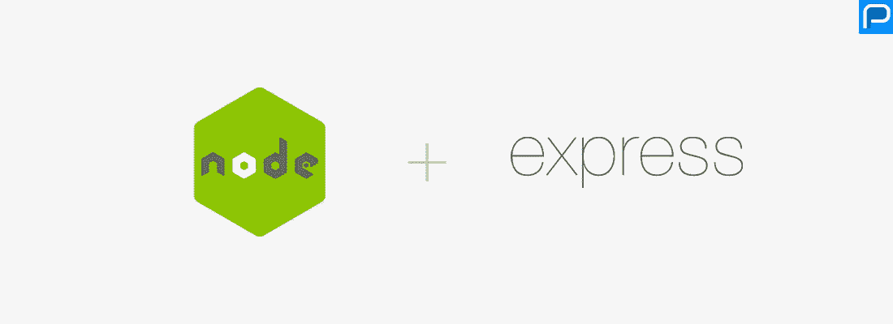
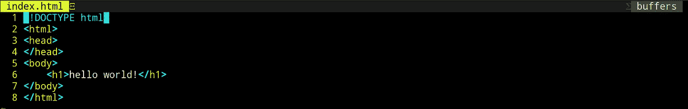
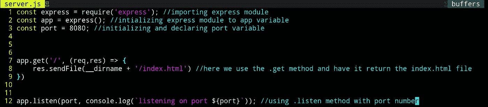

# 使用 NodeJS 创建一个简单的 web 服务器

> 原文：<https://medium.com/codex/creating-a-simple-web-server-using-nodejs-99c54be77303?source=collection_archive---------16----------------------->

# 前言。

在本文中，我将讨论如何设置 NodeJS Express 服务器应用程序。最后，它应该解释什么是 NodeJS，如何设置 Express，以及如何使用 NodeJS 来使用 get 请求。

此外，本文是我描述如何使用 GET 请求、POST 请求和服务静态文件的系列文章的一部分。

# 什么是 NodeJS？

JavaScript 是一种流行的编程语言，主要在浏览器中使用，但是随着 NodeJS 的发明，我们可以在 web 浏览器之外运行 JavaScript；我们现在可以在命令行中运行 JavaScript 了！NodeJS 由 Googles 的 V8 引擎支持，每天都有数百万开发者使用，这意味着 NodeJS 将会继续存在。NodeJS 也有自己的名为 NPM 的包库，用于导入和发布可重用的 JavaScript 模块。总之，NodeJS 不会消失，它非常强大，并且可以以多种不同的方式使用。

# 为什么要用 NodeJS？

许多软件 web 开发人员使用 NodeJS 的原因是因为大多数 web 开发人员已经通过使用 React、Svelte、Vue 和许多其他流行的 JavaScript 框架等技术在前端工作而了解了 JavaScript。许多开发人员决定使用 NodeJS 也是因为 JavaScript 是异步的，这意味着在运行时，如果另一段代码运行时间过长，代码也可以执行。这意味着构建和运行软件的速度更快、效率更高。

# NodeJS Express 模块是什么？

正如我前面解释的，NodeJS 有一个围绕它构建的包管理器，叫做 NPM。NPM 可用于下载数百万个模块，您可以将这些模块导入到您的项目中。其中一个模块叫做 Express。Express 主要用于在收到 HTTP 请求时处理文件。Express 还可以做许多其他事情，但是我们现在将坚持一个简单的 GET 请求。

# 首先让我们创建超级简单的 index.html 文件。

你会问 html 文件是什么？一个 html 文件是所有网站的构建模块(有人称之为网络的骨架),浏览器知道如何解释一个 HTML 文件，使其与其他文件一起工作。在过去的几年中，html 变得非常强大，从简单的文本到现在能够下载文件、延迟加载资源、对其他文件发出 get 请求等等(我可能很快也会写一篇 HTML 文章)。

但无论如何，让我们现在创建我们的真棒 HTML 文件。在这里。请随意将此复制到您的 index.html 文件并保存在那里。

# 让我们安装 Express。

在确认 NPM 已经成功安装后打开你的命令行(NPM 是 NodeJS 的包管理器，我们需要它来下载 express)。要确保您的计算机上安装了 express，请使用

`npm -v`

您的终端输出应该如下所示。

您应该会收到安装在您机器上的 NPM 版本。确认 express 在您的机器上之后，在您的 index.html 文件所在的目录(也称为文件夹)中使用这个终端命令。

`npm install express`

您应该会收到以下输出。

就这样，您已经安装了开始使用 express 所需的所有模块！

# 对简单的 GET 请求使用 Express。

比方说，我们有一个 html 文件，它位于我们当前的目录中，就像这样。

我们希望 Express 处理对 URL 中某个路由的 GET 请求，并将我们的 index.html 文件返回给发出请求的客户端。有了 Express，这变得非常简单。您所要做的就是创建一个 server.js(通常称为 app.js)文件，导入 Express 模块，然后将该类初始化为一个对象变量。然后使用。listen(端口、回调)方法。总而言之，代码应该是这样的。

# 现在运行脚本！

现在将数据保存到 server.js 文件，并运行 node，后跟 server.js 文件名。应该是这样的。

您将从文件中收到我们的控制台输出。然后，我们将导航到我们的网络浏览器。并键入 localhost:8080。应该是这样的。

# 你做到了！您已经用您的应用程序响应了客户端(浏览器)!

干得好！达到这一点的工程数量令人难以置信，它花了几十年才达到这一点！您现在可以创建其他 html 文件，并使用 GET 请求来服务这些文件！现在来看看使用 GET 服务单个文件的问题。使用一个 GET 请求的问题是，只有指定的文件会被发送回客户机(这称为响应)。如果 index.html 链接到一个 JavaScript 文件或 CSS 文件会怎样呢(您将需要更多链接到这些文件的 get 请求！)?一个简单的解决方案是主机服务一个静态文件夹，其中包含您的应用程序所需的所有文件。我将在另一篇文章中讨论静态文件夹服务(即将推出！).

# 感谢您的阅读！

感谢阅读。我希望你觉得这篇文章很有趣，并在这个过程中学到了一些东西。如果你觉得我遗漏了什么，请在下面评论，或者直接给我发消息。如果你觉得这篇文章内容丰富，也留下你的关注吧！:)

# 我最近在忙什么。

我的名字大卫和我已经从事软件 web 开发大约两年了。大多是自由职业者的工作。我知道 Python，JavaScript，Bash，CSS，HTML，PostgreSQL，MongoDB，还有很多其他的技术。如果你想联系我，请到 davidesquerra.com 来找我。在这里你可以直接给我发短信或者发邮件。就像我上面说的感谢阅读:)。