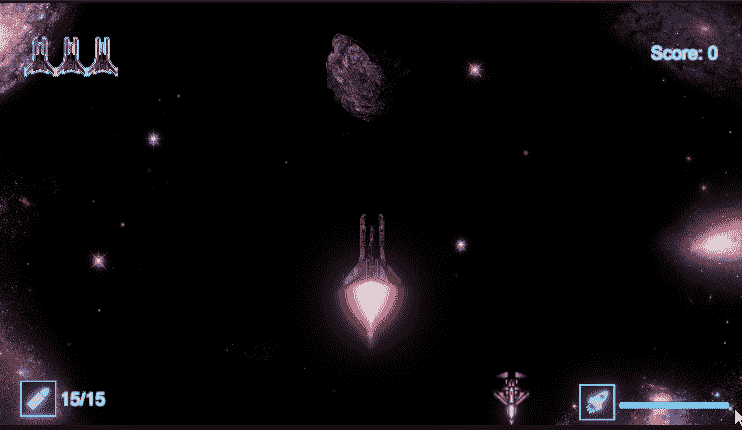

# 创造一个聪明的敌人

> 原文：<https://medium.com/codex/creating-a-smart-enemy-8c9477031f7d?source=collection_archive---------12----------------------->

随着游戏变得越来越复杂，增加更全面的敌人类型来挑战玩家是很重要的。开始增加深度的一个简单方法是让敌人“意识到”它的周围环境。虽然这篇文章将集中在 2D 游戏的简单世界，这可以被认为是更复杂的人工智能功能的前身。

**目标**:创造一个敌人，当玩家在他们身后时，它可以察觉并相应地开火。

# **探测玩家**

为了检测玩家，我们将使用 [**CircleCast**](https://docs.unity3d.com/ScriptReference/Physics2D.CircleCast.html) **。圆形投掷类似于从特定点向给定方向发射声纳。如果任何物体拦截声纳状结构，它们将被*检测到*并报告。**

[图像来源](https://www.researchgate.net/figure/Passive-and-active-SONAR-for-submarine-detection-Passive-the-submarine-on-the-right_fig12_302546326)

为了实现 CircleCast，我们需要指定圆被投射的**原点**，它将行进的**方向**和**距离**。最后，我们还可以通过 [**图层蒙版**](https://docs.unity3d.com/ScriptReference/LayerMask.html) 添加一个规范，这样我们就可以准确地告诉声纳我们正在寻找什么，而**忽略它接触到的任何其他物体**。

**让我们一步步来看这个:**

1.  声明我们的全局变量

**_rayDistance:** 顾名思义，这就是光线要行进的距离。您可以调整该值以更好地满足您的需求。

**_rayCastRad:** 我们圆的半径。确定我们将覆盖多宽的区域作为*检测区域。*该变量是一个 SeirlizeField，因此可以根据需要在检查器中显示和操作。

> **注**:如果您不确定应该使用的具体数字，您可以随时进行快速 [**调试。DrawRay**](https://docs.unity3d.com/ScriptReference/Debug.DrawRay.html)**这是在[这篇文章](https://levelup.gitconnected.com/how-to-detect-object-positions-using-raycast-in-unity-77d6cbd50006?source=user_profile---------1-------------------------------&gi=19f899645f7b)中解释的。**

**2.**将我们的循环广播编码成现实****

**创造一个新的虚空法来处理敌人的攻击行为。你可以给它起任何你喜欢的名字，在我的例子中，这是一种反击方法。CircleCast 将放在这里。语法如下:**

****

****原点:**我们正在使用脚本所附着的物体的位置，在这个例子中，是一个敌人的物体。**

****方向**变量使用库内[vector 2 . up](https://docs.unity3d.com/ScriptReference/Vector2.html)，因为它已经带有我们在所述方向需要的预设矢量数据。**

> ****注意**:你可以为你的游戏使用任何你需要的矢量方向，在本文中，我使用 Vector2.up 是因为我的 2D 游戏是面向方向的。**

****图层蒙版。GetMask("Player"):** 返回指定层。这将使它，所以所有其他对象以外的这个指定层将被忽略。您可以从检查器中分配层，如下所示:**

****

# **从背后攻击玩家**

**既然我们有了检测玩家的方法，我们可以创建一个当玩家从后面被检测到时执行的触发方法。**

1.  **要创建一个射击方法，你可以简单地用 [**实例化**](https://docs.unity3d.com/ScriptReference/Object.Instantiate.html) 你的射弹。我们将会在稍后检测到玩家时执行这个代码。**

****

> ****注:**四元数。Euler 可以保留为 Quternion.rotation，这将使实例化的对象保持默认旋转。在我的代码中，我使用欧拉来操纵我的对象的旋转，以匹配我希望它去的方向，因为它的默认旋转是相反的。**

**就我个人而言，我的代码(下图)可能看起来更复杂，但那是因为我的抛射体有子对象附加在它上面，这需要更多的思考。**

****

**此外，前两个黄色的变量是冷却系统的一部分，它使射击更受控制，而不是一个连续的和看起来无休止的射弹流。你可以在这里 **了解更多关于这个冷却系统 [**。**](https://dennisse-pd.medium.com/how-to-create-a-cooldown-system-in-unity-4156f3a842ae)****

**现在我们有了一个触发方法，我们可以让它在检测到玩家时执行。让我们回到之前为攻击行为创建的方法。**

**2.首先，我们检查是否有现存的碰撞器。**

****

**3.将 **hit** 变量与所需标签进行比较。请记住，这个 hit 变量是 CircleCast 的返回值，它被设置为忽略所有不在指定的“Player”层遮罩内的对象。**

> ****注**:同样，这里的黄色变量是前面提到的 [**冷却系统**](https://dennisse-pd.medium.com/how-to-create-a-cooldown-system-in-unity-4156f3a842ae) 的一部分。**

****

> ****注意**:记住标签和层是不同的。标签也需要在检查器中分配。**

****

**4.最后，如果返回值 ***hit*** 与期望的标签相同，则调用该方法一次。**

****

> ****注意**:这里我添加了一行调试代码，以确保播放器被检测到。这完全是可选的，但是很有用。**

# **结果呢**

**现在你应该有一个敌人，当他们被发现在敌人后面时，可以向玩家开火。**

****

**不幸的是，我已经有一段时间不能发表文章了，但是我很兴奋能够回来！许多有趣的很酷的东西即将推出！**