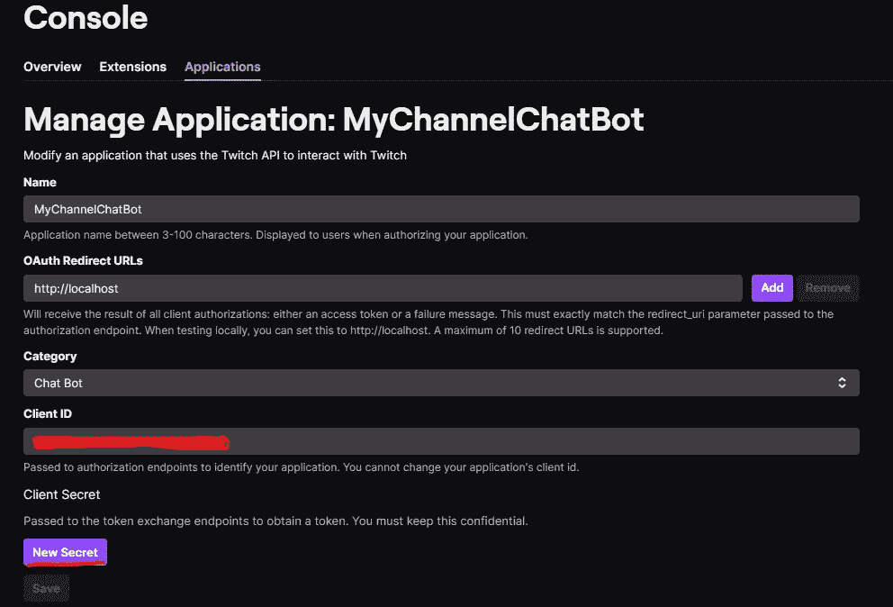

# 创建 Twitch 聊天机器人

> 原文：<https://medium.com/codex/creating-a-twitch-chat-bot-ca368321b7f7?source=collection_archive---------2----------------------->

卡斯帕·卡米尔·鲁宾在 [Unsplash](https://unsplash.com?utm_source=medium&utm_medium=referral) 上的照片

比方说，你喜欢上 Twitch，观看游戏流和查看新游戏，观看知名艺术家的音乐流或观看一些 ASMR 的内容，因为你喜欢这样。

然后**你决定开始流媒体**，只是为了好玩。你喜欢把事情做对，因此，你喜欢像专业人士那样与观众进行多层次的互动。

聊天听起来是个不错的地方，对吧？

**你听说过聊天机器人，但你不想用那些付费的！哦不不不，你才刚刚开始！开始把辛苦赚来的钱花在你甚至不知道自己是否真的喜欢做或想追求的事情上是不明智的！**要是有免费选项就好了……****

# 不要再看了

在这篇文章中，我将指导你如何实现一个 Twitch 聊天机器人**和**，之后，我还将指导你如何设置它，并在你的(当然)史诗流中使用它！

如果你只是想知道如何使用它，跳到“设置和使用机器人”部分。但是我建议至少读一下定义机器人行为的部分。

这个聊天机器人的代码也可以在 GitHub 上免费获得。

# 我们开始吧

实现 Twitch 聊天机器人的第一步是确定它需要运行什么！换句话说，我们需要为机器人提供什么样的配置值才能成功地连接到 twitch，连接到目标频道，并最终连接到聊天室。那么，**让我们定义一下我们需要的配置文件结构吧！**

这是我们将使用的配置文件结构:

让我们仔细分析一下:

*   **token _ endpoint**——由于我们的聊天机器人包含了为 Twitch 获取自己的访问令牌的逻辑，我们需要传递 Twitch 提供的端点，以便从中获取 OAuth 令牌。它总是相同的 url，并且已经预先填充在上面的代码片段中。
*   用户名——我们希望机器人在 twitch 上使用的用户名，即使我认为它被覆盖了，我们还是应该把它传递给机器人。
*   **client _ id**—Twitch 为聊天机器人应用程序指定的 Id，在我们将它注册到平台上之后(我们稍后将对此进行研究)。
*   **client _ Secret**—Twitch 为聊天机器人应用程序生成的秘密，在我们在平台上注册它之后(我们稍后将对此进行研究)。
*   **authorization_code** —告诉 Twitch 聊天机器人被授权使用平台上的某个账户的代码(我们稍后会对此进行研究)。

所以，基本上，一堆需要连接到 Twitch 的东西，其中大部分你只会在本文后面知道更多的细节。希望这是有帮助的🤣。

非常严肃地说，你现在需要的是对每个配置的简要描述，以便理解本指南接下来的内容，所以让我们继续。

# 配置摄取

好了，现在我们知道了配置中必须包含什么，我们应该讨论如何将这些值集成到应用程序中。

配置摄取是一篇独立的文章的主题，但是在这里我们将稍微涉及一下我为这个聊天机器人所做的实现，以便读取配置文件并验证其中提供的内容是否符合应用程序的期望。

**配置摄取可以分为两部分**:

*   模型的定义，一旦实例化，将包含配置值。
*   为配置提供的值的**验证**。

**从模型**开始，正如您在下面的代码片段中看到的，它基本上是一个值类，并使用了来自类验证器包的注释，这对于干净地为变量接受的值设置约束非常有帮助。

这里我们只使用了两个注释，因为这就是我们所需要的，但是它已经从至少两个离散的验证函数中剥离了我们的代码，这很棒！

**现在，进入配置验证**部分。配置的验证嵌入在 readConfig 函数中，该函数读取作为参数传递的路径中的文件，并返回有效 ChatBotConfig 的承诺。

**对于验证，由于我们已经用每个配置值的约束注释了模型，我们可以从类验证器中调用“验证”函数。**

它的工作方式非常简单:实例化带注释的类，然后用该实例作为参数调用 validate。如果它返回一个空列表，那么您的配置没有问题，否则，某些东西不符合需求，在这个非空列表中，您可以找到所有的问题。

非常简单和干净，对不对？当我发现这个包裹时，我非常高兴🤩。

另外，你会注意到**我为配置摄取**定义了一个特定的错误类型，而不是仅仅使用一般的错误类型。**我大多数时候都倾向于这样做，因为这样可以更容易地分析我在使用自己创建的应用程序时遇到的任何堆栈跟踪**。

**如果我在日志中看到一个“InvalidTwitchConfigError ”,我会立刻知道它来自哪里。**

# 变成真正的聊天机器人

所有这些文字和我们不进入聊天机器人本身，对不对？我很抱歉，但我想给你一个好主意，我是如何做的事情“浮动”的逻辑机器人本身！

现在进入实质性的部分:**这个机器人是如何工作的？**

让我们从主要部分开始，然后深入细节。下面，是聊天机器人的构造器和“大脑”功能。

基本上，它在初始化时需要一个配置对象，然后启动函数是这样的:

1.  *获取 OAuth 访问令牌，以便能够通过 Twitch 进行认证*
2.  *创建一个 Twitch 客户端实例，使用客户端支持的格式构建连接配置。*
3.  设置我们希望我们的机器人拥有的行为(它应该回答的命令，它应该忽略的消息，等等)。)
4.  *连接 Twitch，快乐起来！*

让我们深入这些步骤。

## 获取访问令牌

下面是获取访问令牌的代码，以便机器人能够连接到 Twitch。

深入研究一下代码中实际发生的事情，您会发现它基本上可以转化为两个步骤:

*   向 twitch 的令牌端点发出请求。
*   处理请求中发生的任何事情。

该请求显然必须符合 Twitch 的预期参数，但我们在这方面不会有“大问题”，因为所有“可配置”的值都来自我们的 config 对象，这已经过验证。最坏的情况是，我们可能在配置中有错误的值，但这是在响应处理部分管理的。

**在响应处理部分(第 17–32 行)，我们将端点的答案通过我们创建的验证器**，，它将:

*   返回经过验证的令牌响应(因此 fetchAccessToken 的返回类型是 TwitchTokenDetails 的承诺)
*   抛出我们创建的错误类型之一，以便在出现故障时更容易调试和分析根本原因。

底线是，**一个与配置验证非常相似的逻辑。**

你可以在下面查看 **TwitchTokenDetails** 值类和**TwitchTokenResponseValidator 的代码。**

你可能已经注意到了，我 **在任何地方都找不到 InvalidTwitchResponseError。**这是因为，不存在端点回答正确(状态码 200)但响应内容错误的情况。

**如果来自 Twitch 的 API 的契约发生了变化，但我们并不知道，因此也没有准备好**来解释响应体，那么最终可能会触发验证器抛出这个错误。但是**这实际上不能被认为是响应的错误，不是吗？**

这就是为什么我将这些错误归入 fetchAccessToken()中响应处理部分的 else 分支。为了公平起见，基本上将这些情况转换为 MalformedTwitchRequestError 实例。

现在**invalidwitchresponseerror**仅用于标记验证失败的信号，但我仍然决定保持这种类型，因为它现在不会造成任何伤害，将来会变得有用——例如，如果 Twitch 响应在任何时间点开始出错。

## *Twitch 客户端的实例化*

Twitch Client 是我们真正想要的:连接到 Twitch 频道的聊天。

Twitch 客户端来自于 [tmi.js](https://github.com/tmijs/tmi.js) ，这是一个用于 Twitch 消息传递接口的 javascript 库。它很容易使用和设置:只需要以它期望的格式传递一个配置。

正如你在上面看到的，没有太多的事情发生。**有一个函数在需要提供给客户端时构建配置(并让我们在这个过程中可视化它的结构)，我将来自 Bot 配置和刚刚获取的令牌的值传递给它，然后我使用它的返回来使用 tmi.js 创建我们的客户端。**

## *设置我们希望机器人拥有的行为*

在我启动机器人并连接到 Twitch 之前，我需要**定义它将如何运行。这是通过回调函数完成的。**

**回调函数定义了机器人对每条推送到聊天室的消息的行为。**

在代码的[示例回调中，我定义了机器人将忽略来自自身的消息，我还定义了以“！”开头的消息是命令，我为机器人提供了一个命令来支持。](https://github.com/PedroEFLourenco/Twitch-Chat-Bot/blob/master/src/app/chatBot/chatbot.ts)

这里定义的交互非常简单:一收到！你好”时，机器人应该回答“你好，<username>！欢迎来到频道。”。</username>

这显然是一个起点，你可以有更复杂的行为，但这已经是一个好的开始。有礼貌总是好的，即使你是一个聊天机器人。

关于聊天机器人的实现，这就是全部内容！现在我们进入“如何设置和使用”部分。我想对于你们中的非编码人员来说这是最有趣的。

# 设置和使用机器人

如果你不得不滚动这么远来找到你真正想要的，我很抱歉。但是开心点，你活下来了！

在这一节中，我们将详细介绍如何获得配置文件所需的值，以及如何使用 [Bot](https://github.com/PedroEFLourenco/Twitch-Chat-Bot) 。

**首先，**你需要安装 npm 和 node.js。如果没有，就去做(从[这里](https://docs.npmjs.com/downloading-and-installing-node-js-and-npm)试)，然后回来。

要获得代码，你可以去 [GitHub 库](https://github.com/PedroEFLourenco/Twitch-Chat-Bot)下载 zip 文件。拉开拉链后，机器人就在你身边了。

下载邮编按钮获取代码

## 如何获取 Bot 配置的值

为了运行 Bot，您需要为它提供本文前面提到的配置文件。该文件包含以下值:

*   **令牌 _ 端点**
*   **用户名**
*   **客户端 id**
*   **客户端 _ 秘密**
*   **授权 _ 代码**

从中可以看出， **token_endpoint** 是一个常量值(显示在本文和 GitHub 存储库中的配置文件片段中)，而**用户名**则完全由您决定。这给我们留下了 3 个要去获取的值！

**Client_id** 和 **client_secret** 均来自同一个地方，即[Twitch portal for application registration](https://dev.twitch.tv/console/apps/create)。这是一个门户，您可以在其中将您的应用程序注册为将连接到 Twitch 的实体。

在 Twitch 上注册应用程序

注册应用程序后，单击“管理”按钮访问 client_id，并单击按钮生成 client_secret(您应该将它存储在某个安全的地方，因为在此页面上不可能再看到它，但您可以随时生成一个新的)。

管理应用程序屏幕

client_secret✔️.client_id✔️两个下来，还有一个，那个是**授权 _ 码。**

授权码告诉 twitch，拥有它的人(在本例中是机器人)被授权使用授权者的帐户登录 Twitch。

你知道当你试图用脸书、苹果 ID 或其他什么登陆某个网站时会出现的屏幕吗？当您单击“允许”时，您授权网站代表您连接到这些方以获取一些信息。对于这种情况，整个过程几乎是相同的。

该授权以字母数字代码的形式出现，您需要向机器人提供该代码，以便它可以使用您用来授权它的帐户登录 Twitch，而无需知道该帐户的实际凭证！

这意味着**机器人在 Twitch 上没有自己的身份。它使用授权过程中使用的帐户的身份。**

通常，对于那些付费聊天机器人应用程序，要访问授权屏幕，会有一个带有漂亮的“在 twitch 上授权”按钮之类的网站。

但是在 DIY 领域，我们不需要这个，因为我们可以通过这个 url 结构到达那里:

> https://id.twitch.tv/oauth2/authorize?client _ id =**<client _ id>**redirect _ uri = http://localhost&response _ type = code&scope = chat:read chat:edit

您可以将上述 url 复制到您的浏览器中，并用您在上一步中获得的应用程序的 client_id 替换 **< client_id >** 。

您应该会看到如下所示的屏幕

Twitch 应用程序的授权页面

单击授权后，您将能够在浏览器的地址栏中看到您的授权码。

包含授权码的地址栏。

## 运行聊天机器人！

是时候了。👊

现在是时候把所有的东西都放在一起了:我们可以在我们的频道聊天时运行这个机器人了！🙌

所以，先决条件:当你运行机器人时，你显然应该是流式的，否则就没有聊天可以连接。😅

除此之外，只需遵循以下步骤:

1.  转到包含从 GitHub 下载的解压缩文件的文件夹
2.  用 Bot 配置的值和您的通道名称填充您的 config.ts 文件

config.ts 文件结构

3.在命令提示符下键入“npm install ”,然后按 enter 键——这将下载 Bot 运行所需的所有内容。

4.还是在命令提示符下，键入“npm start ”,然后按 enter 键运行 Bot！最初的输出应该是这样的:

如果是这样的话，**恭喜你，你正在运行一个免费的聊天机器人！！！**

要看到它的工作，只需写一个你支持的命令到聊天中，使用一个不同于机器人被授权的帐户，玩得开心！

工作聊天机器人🙌