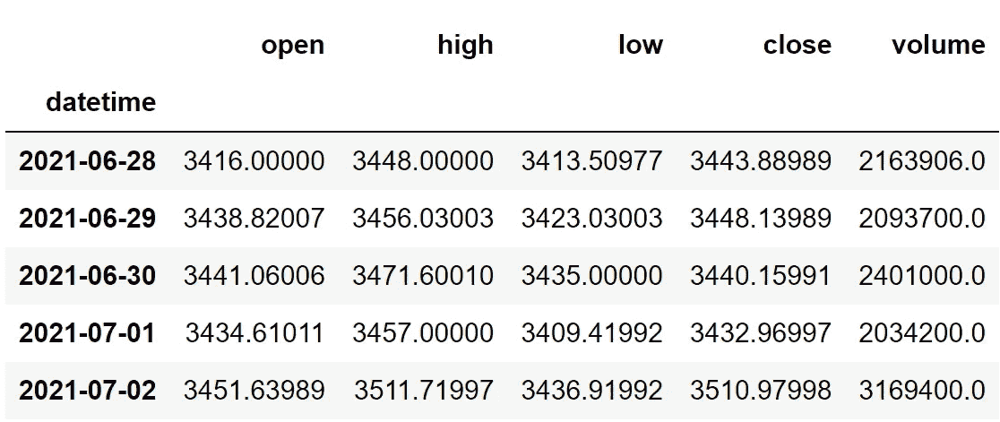
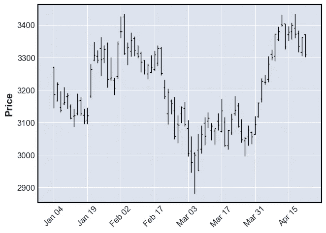
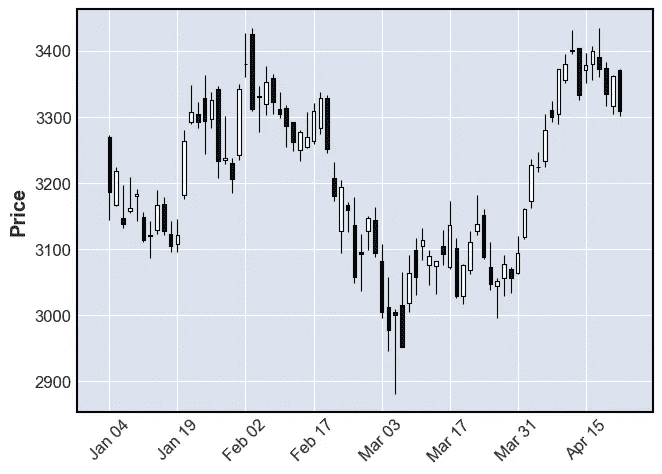
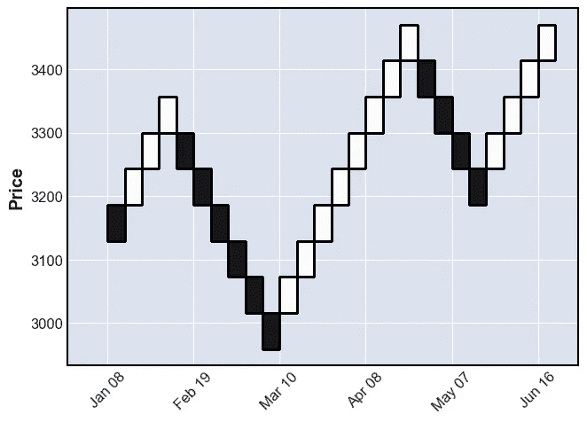
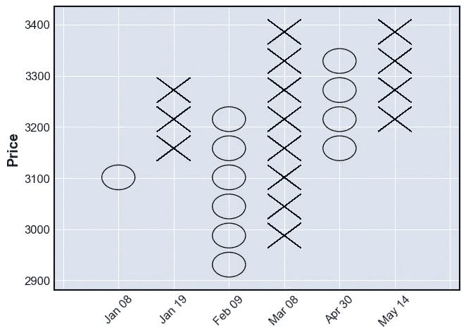
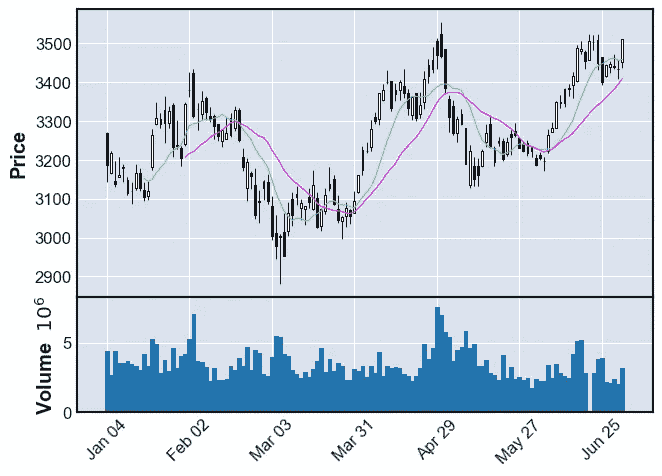

# 用 Python 在一行代码中创建高级财务图表

> 原文：<https://medium.com/codex/creating-advanced-financial-charts-with-python-in-one-line-of-code-79f87ed482e8?source=collection_archive---------0----------------------->

## 掌握最灵活的 python 库，创建好看的财务可视化


卢克·切瑟在 [Unsplash](https://unsplash.com?utm_source=medium&utm_medium=referral) 上的照片

# 介绍

应用于金融领域的编程和技术的激增是不可避免的，而且这种增长似乎永远不会下降。编程应用的最有趣的部分之一是历史或实时股票数据的解释和可视化。

现在，为了在 python 中可视化一般数据，matplotlib、seaborn 等模块开始发挥作用，但是，当涉及到可视化金融数据时，Plotly 将是首选，因为它提供了具有交互式视觉效果的内置函数。这是我所想的，但是有一个无名英雄，他是 matplotlib 的表亲，mplfinance 库。

我们都知道 matplotlib 包是多么的多才多艺，可以方便地绘制任何类型的数据。甚至像蜡烛图这样的财务图表也可以使用 matplotlib 包绘制，但这是徒劳的，因为我们必须从头开始。但是最近，我知道有一个名为 mplfinance 的独立模块，它是专门为创建高级财务可视化而设计的。在本文中，我们将深入研究这个 python 库，并探索它的函数来生成不同类型的图表。

# 导入包

将所需的包导入到我们的 python 环境中是一个不可避免的步骤。在本文中，我们总共需要三个包，它们是处理数据帧的 Pandas、进行 API 调用和提取股票数据的请求，以及创建财务图表的 mplfinance。对于那些尚未安装这些软件包的用户，请将以下代码复制到您的终端中:

```
pip install pandas
pip install requests
pip install mplfinance
```

安装完这些包之后，就该将它们导入到我们的 python 环境中了。

```
import pandas as pd
import requests
import mplfinance as mf
```

# 提取股票数据

现在，我们已经导入了所有必要的包。让我们使用由[twelvedata.com](https://twelvedata.com/)提供的 API 端点提取亚马逊的历史股票数据。在此之前，关于[twelvedata.com](https://twelvedata.com/)的一个说明:十二数据是领先的市场数据提供商之一，拥有针对所有类型市场数据的大量 API 端点。它非常容易与十二数据提供的 API 进行交互，并且拥有有史以来最好的文档。此外，确保您在[twelvedata.com](https://twelvedata.com/)上有一个帐户，只有这样，您才能访问您的 API 密钥(使用 API 提取数据的一个重要元素)。

**Python 实现:**

```
def get_historical_data(symbol, start_date):
    api_key = 'YOUR API KEY'
    api_url = f'https://api.twelvedata.com/time_series?symbol={symbol}&interval=1day&outputsize=5000&apikey={api_key}'
    raw_df = requests.get(api_url).json()
    df = pd.DataFrame(raw_df['values']).iloc[::-1].set_index('datetime').astype(float)
    df = df[df.index >= start_date]
    df.index = pd.to_datetime(df.index)
    return df

amzn = get_historical_data('AMZN', '2021-01-01')
amzn.tail()
```

**输出:**



作者图片

**代码解释:**我们做的第一件事是定义一个名为‘get _ historical _ data’的函数，该函数将股票的符号(‘symbol’)和历史数据的起始日期(‘start _ date’)作为参数。在函数内部，我们定义了 API 键和 URL，并将它们存储在各自的变量中。接下来，我们使用“get”函数提取 JSON 格式的历史数据，并将其存储在“raw_df”变量中。在对原始 JSON 数据进行清理和格式化之后，我们将以干净的 Pandas 数据帧的形式返回它。最后，我们调用创建的函数从 2021 年开始提取亚马逊的历史数据，并将其存储到' amzn '变量中。

# OHLC 海图

OHLC 图是一种条形图，显示每个时期的开盘价、最高价、最低价和收盘价。OHLC 图表很有用，因为它们显示了一段时间内的四个主要数据点，收盘价被许多交易者认为是最重要的。它也有助于显示增加或减少的势头。当开盘和收盘相距甚远时，它显示出强劲的势头，当开盘和收盘接近时，它显示出犹豫不决或微弱的势头。最高价和最低价显示了该时期的全部价格范围，有助于评估波动性。现在用 mplfinance 创建一个 OHLC 图表，只需要一行代码:

```
mf.plot(amzn.iloc[:-50,:])
```

在上面的代码中，我们首先调用`plot`函数，在函数内部，我们将之前提取的亚马逊的 OHLC 数据切片为最近的 50 个读数，这样做的目的是使图表更加清晰，以便元素可见。上面的一行程序将产生如下所示的输出:



作者图片

# 蜡烛图

交易者使用蜡烛图来根据过去的模式确定可能的价格变动。烛台在交易时很有用，因为它们在交易者指定的时间内显示四个价格点(开盘价、收盘价、最高价和最低价)。这种图表最有趣的地方在于，它还能帮助交易者解读情绪，而情绪是市场本身最重要的驱动力。为了用 mplfinance 生成一个蜡烛图，我们只需要添加另一个参数，即`plot`函数的`type`参数，并在其中提到`candle`。代码如下所示:

```
mf.plot(amzn.iloc[:-50,:], type = ‘candle’)
```

上面的代码将生成一个类似如下的蜡烛图:



作者图片

# 伦科图表

伦科图是一种利用价格变动而不是像大多数图表那样同时利用价格和标准时间间隔构建的图表。该图表看起来像一系列砖块，当价格移动指定的价格量时，会创建一个新的砖块，每个砖块都与前一个砖块成 45 度角(向上或向下)。Renko 图表的主要用途是过滤噪音，帮助交易者更清楚地看到趋势，因为所有小于箱体尺寸的波动都被过滤掉了。

据我所知，mplfinance 是唯一一个提供 Renko 图表的 python 库，也是我们接下来要看到的，这就是为什么这个包在金融可视化方面有很强的优势。现在要创建一个 Renko，我们只需在`plot`函数的`type`参数中指定`renko`。Renko 图表的代码如下所示:

```
mf.plot(amzn, type = ‘renko’)
```

我们还可以在`plot`函数中添加一个额外的参数，即`renko_params`参数，以根据我们的需要和其他类似的东西修改砖块大小，但我更喜欢默认的。上面的代码生成如下所示的 Renko 图表:



作者图片

# 点数图

点数图，简称为 P&F 图，类似于伦科图，绘制资产的价格运动，不考虑时间的推移。与一些其他类型的图表(如蜡烛图)相反，蜡烛图标记了资产在设定时间段内的移动程度，P&F 图使用由堆叠的 X 或 O 组成的柱，每个柱代表一个设定的价格移动量。X 代表价格上涨，而 O 代表价格下跌。当价格以反转量[ [4](https://www.investopedia.com/terms/p/pointandfigurechart.asp) ]反转时，在 O 之后形成新的 X 柱或在 X 之后形成新的 O 柱。

支持点数图的函数在别处找不到，只能在 mplfinance 库中找到，这也使得创建图表的过程更加容易，我们只需在`plot`函数的`type`参数中指定`pnf`即可。代码应该是这样的:

```
mf.plot(amzn, type = ‘pnf’)
```



作者图片

# 添加更多信息

mplfinance 软件包不仅仅局限于生成不同类型的图表，还使我们能够通过添加额外的指标，如简单移动平均线(SMA)和成交量，使这些图表更具洞察力。对于那些不知道这两者是什么的人来说，成交量是交易者在特定时间内买卖的股票数量，简单移动平均线(SMA)只不过是特定时间内的平均价格。它是一个技术指标，广泛用于创建交易策略。

用 matplotlib 绘制这些数据需要一千年的时间，而 mplfinance 只需要一行代码就可以完成这项任务。除了`type`参数之外，我们只需引入另外两个参数，即`mav`参数，其中我们必须指定每个 SMAs 的回望期，以及`volume`参数，其中如果我们想要将体积图添加到我们的图表中，我们必须提到`**True**` ，如果我们不想添加，则必须提到`**False**` 。这两个指示器的代码如下所示:

```
mf.plot(amzn, mav = (10, 20), type = ‘candle’, volume = True)
```

上面的代码可以通过两种方式进行修改和试验。第一种方法显然是尝试不同类型的图表。在上面的代码中，我们提到我们的图表类型是蜡烛图，但是您可以将其更改为 OHLC 图、伦科图，甚至是 P&F 图，并观察每个图表在有两个附加指标时的外观。下一种方法是使用`mav`参数，我们可以添加任意数量的具有不同回顾期的 SMA。上述代码的输出如下所示:



作者图片

# 保存情节

如果您想知道如何保存这些财务可视化，只需添加另一个参数，即`savefig`参数，您只需提到它的文件名，其余的就交给您了。假设您想要保存上面的情节，那么您必须遵循的代码如下所示:

```
mf.plot(amzn, mav = (10, 20), type = ‘candle’, volume = True, savefig = ‘amzn.png’)
```

为了保存你美妙的财务可视化，这就是你所要做的一切。很简单，对吧？

# 最后的想法！

在我看来，我感觉 mplfinance 是比 Plotly 或 Altair 等其他库更强大的绘制金融数据的库。这篇文章只是对 mplfinance 所能实现的一瞥，但是这个令人敬畏的库还有许多新的特性。它允许我们添加自定义技术指标数据，并在实际图表旁边绘图，我们可以自定义整个模板，甚至图表中的每个元素，添加趋势线，等等。这个库最好的部分是它的易用性，帮助我们只用一行代码就能产生高级的财务可视化。尽管像 Plotly 这样的包有内置的函数来创建这些图表，但是不可能在一行代码中完成。

mplfinance 现在唯一的缺点是它糟糕的文档，这使得人们甚至不知道这个包是关于什么的。文档是一个至关重要的方面，当涉及到开源项目时，应该被认为是最重要的。特别是，像 mplfinance 这样关键且有用的项目必须有公正的文档，清晰地解释它所提供的工具和功能。除此之外，我是这个图书馆的铁杆粉丝，希望你也是。就是这样！您已到达文章结尾。如果你忘记遵循任何图表的代码，不要担心。我在最后提供了完整的源代码。话虽如此，快乐观想！

## 完整代码:

```
import pandas as pd
import requests
import mplfinance as mf

# Extracting stock data

def get_historical_data(symbol, start_date):
    api_key = 'YOUR API KEY'
    api_url = f'https://api.twelvedata.com/time_series?symbol={symbol}&interval=1day&outputsize=5000&apikey={api_key}'
    raw_df = requests.get(api_url).json()
    df = pd.DataFrame(raw_df['values']).iloc[::-1].set_index('datetime').astype(float)
    df = df[df.index >= start_date]
    df.index = pd.to_datetime(df.index)
    return df

amzn = get_historical_data('AMZN', '2021-01-01')
amzn.tail()

# 1\. OHLC Chart

mf.plot(amzn.iloc[:-50,:])

# 2\. Candlestick Chart

mf.plot(amzn.iloc[:-50,:], type = 'candle')

# 3\. Renko Chart

mf.plot(amzn, type = 'renko')

# 4\. Point and Figure Chart

mf.plot(amzn, type = 'pnf')

# 5\. Technical chart

mf.plot(amzn, mav = (10, 20), type = 'candle', volume = True)

# 6\. Plot customization

mf.plot(amzn, mav = (5, 10, 20), type = 'candle', 
        volume = True, figratio = (10,5), 
        style = 'binance', title = 'AMZN STOCK PRICE', 
        tight_layout = True)

# 7\. Saving the plot

mf.plot(amzn, mav = (5, 10, 20), type = 'candle', 
        volume = True, figratio = (10,5), 
        style = 'binance', title = 'AMZN STOCK PRICE', 
        tight_layout = True, savefig = 'amzn.png')
```