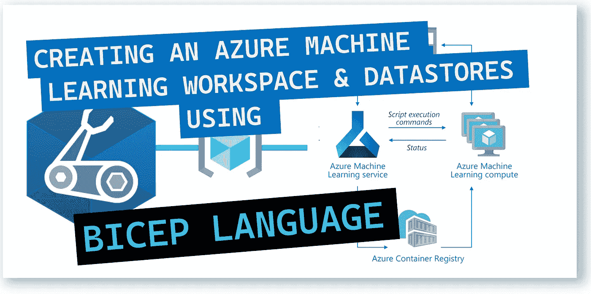
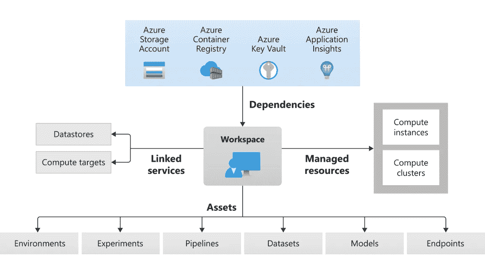
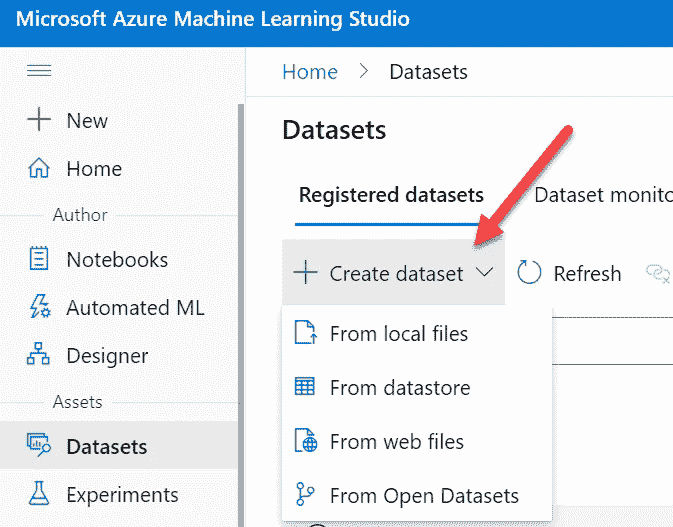
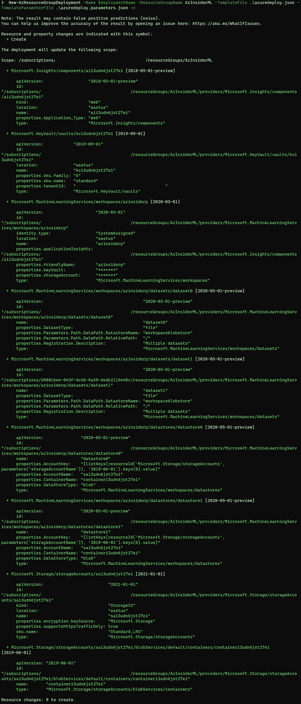
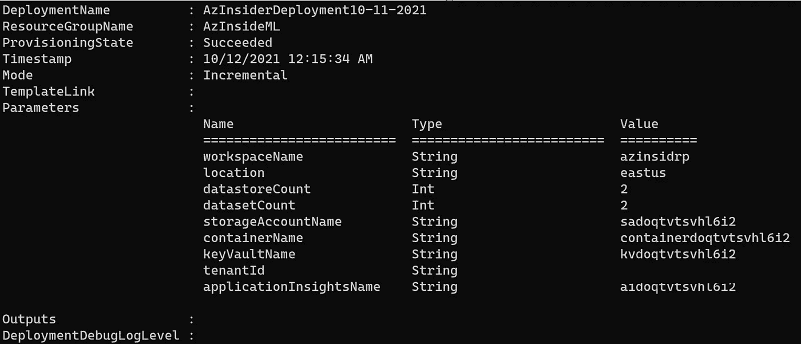
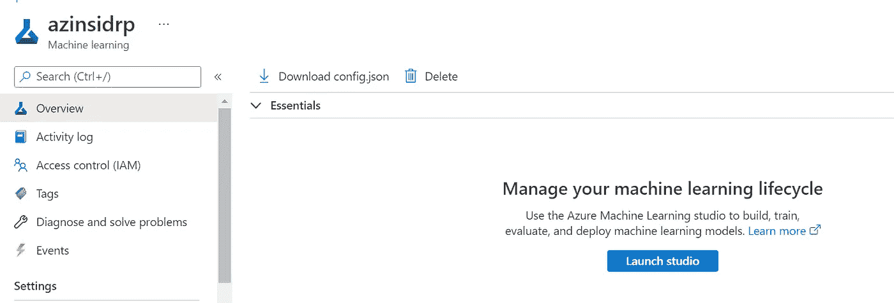
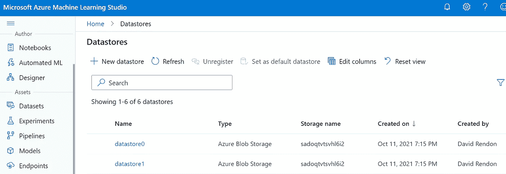

# 💪使用 Bicep 创建 Azure 机器学习工作区和数据存储

> 原文：<https://medium.com/codex/creating-an-azure-machine-learning-workspace-and-datastores-using-bicep-eda683a8579f?source=collection_archive---------0----------------------->

通过 Azure Bicep 使用基础设施即代码在 Azure 中快速部署机器学习解决方案。



使用 Bicep 创建 Azure 机器学习工作区和数据存储

你在 Azure 中利用机器学习作为云服务来加速和管理机器学习项目的生命周期。

在之前的文章中，我提到了 Azure 机器学习服务的核心组件:

*   **工作区**:这是核心组件。查看如何创建 Azure 机器学习[工作空间](/codex/using-bicep-to-create-workspace-resources-and-get-started-with-azure-machine-learning-bcc57fd4fd09?source=user_profile---------2----------------------------)。
*   **托管资源**:这些是 Azure 机器学习[计算节点](/codex/create-an-azure-machine-learning-compute-instance-using-azure-bicep-491783578656?source=user_profile---------1----------------------------)用于你的开发环境。[计算集群](/codex/create-an-azure-machine-learning-compute-cluster-using-azure-bicep-dd43f367f36a?source=user_profile---------0----------------------------)用于提交训练运行。
*   **链接服务**:包括**数据存储**和计算目标。
*   **资产**:这可以是环境、实验、管道、**数据集**、模型和/或端点。
*   **依赖关系**:这些是正确执行 AML 工作区所需的资源。

下图代表了 Azure 机器学习架构:



Azure 机器学习架构

本文将使用 Azure Bicep，一种用于以声明方式部署 Azure 资源的新 DSL 语言，来提供一个具有多个数据存储的 Azure 机器学习工作区。

首先，我们来看两个基本概念。AzureML 提供了两种处理数据的基本资产:

*   *数据存储库*
*   *数据集*

# Azure 机器学习中的数据存储是什么？

可以把数据存储想象成实际存储资源到 Azure 机器学习工作空间的映射。

数据存储为您的 Azure 机器学习存储帐户提供了一个接口。

# Azure 机器学习中的数据集是什么？

*数据集*是机器学习工作空间中的一项资产，它将帮助您连接到数据和存储服务，并使数据可用于您的机器学习实验。

当您在 Azure Machine Learning 中创建数据集时，您正在创建对您的存储服务中的数据的引用。Azure 没有复制你的数据。

这意味着在创建数据集时不会产生存储成本。将*数据集*视为存储在存储资源上的其他数据的指针。

您可以使用数据集来简化整个团队对数据的访问，而不是直接指向您的存储资源。您只需注册一次数据，然后就可以在不同的实验中重复使用它。

数据集的另一个好处是能够将它们用作脚本或管道的直接输入，并帮助您检查数据的使用位置。

可以使用 Azure Machine Learning Studio 门户的数据集选项创建数据集，并从本地文件、数据存储、数据库或打开的数据集创建数据集，如下图所示:



Azure 机器学习工作室-数据集

请注意，我们必须先创建一个工作区，然后才能与 Azure Machine Learning Studio 门户进行交互。

现在我们已经了解了基础知识，我们将使用 Bicep 模板，使用基础架构代码来简化创建带有数据存储和数据集的 Azure 机器学习工作区的过程。

Bicep 是用于声明式部署 Azure 资源的新 DSL 语言。在之前的[文章中，](https://blog.azinsider.net/why-is-azure-bicep-your-next-choice-for-infrastructure-as-code-f10a2b924ca7)我们讨论了 Bicep 对于 Azure 的基础设施即代码的重要性，以及它将如何影响你在 Azure 中的环境。

## 先决条件:

*   在你的本地机器上安装 Bicep
*   安装在本地计算机上的 Azure PowerShell 或 Azure CLI
*   有效的 Azure 订阅
*   资源组
*   在 Azure 订阅中启用了所有者/参与者角色的用户

我们将使用下面的 Bicep 文件创建一个新的 Azure 机器学习工作区，其中包含多个数据存储:

现在，我们将传递几个参数来使用一个单独的参数文件。

参数文件将如下所示:

```
{
 "$schema": "[https://schema.management.azure.com/schemas/2019-04-01/deploymentParameters.json#](https://schema.management.azure.com/schemas/2019-04-01/deploymentParameters.json#)",
 "contentVersion": "1.0.0.0",
 "parameters": {
  "workspaceName": {
   "value": "azinsiderj"
  },
  "location": {
   "value": "eastus"
  }
 }
}
```

注意，我们只传递新工作区的名称和位置。然后，我们将使用以下代码将 Bicep 文件部署到 Azure 订阅中的资源组:

```
$date = Get-Date -Format "MM-dd-yyyy"
$deploymentName = "AzInsiderDeployment"+"$date"New-AzResourceGroupDeployment -Name $deploymentName -ResourceGroupName AzInsiderML -TemplateFile .\azuredeploy.json -TemplateParameterFile .\azuredeploy.parameters.json -c
```

验证完成后，我们将执行部署。

下图显示了部署的预览:



部署预览

下图显示了部署输出。



部署输出

几分钟后，我们的 Azure 机器工作区和数据存储就准备好了。

我们可以访问机器学习工作室门户，然后从 web 文件创建我们的数据存储。你可以去 Azure 门户，从我们刚刚部署的机器学习服务，启动 Studio 门户:



Azure 门户—资源组

这将把你重定向到 Azure 机器学习工作室门户。

进入 Studio 门户后，您可以转到 Datastores 选项，您将看到最近使用 Bicep 文件创建的数据存储:



Azure 机器学习工作室-数据存储

之后，您可以使用 Bicep 或 Azure Machine Learning Studio 门户创建附加的数据存储或新的数据集。

希望这能让你更好地理解在使用 Azure 机器学习时，如何利用 Bicep 来自动创建所需的资源。

[*在此加入****azin sider****邮箱列表。*](http://eepurl.com/gKmLdf)

*-戴夫·r·*