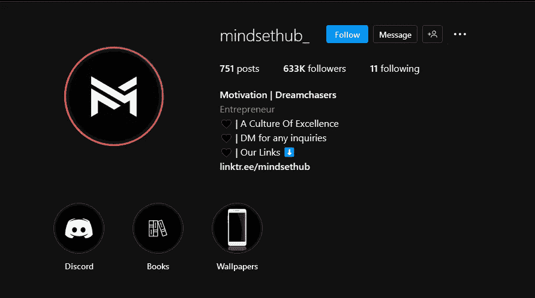
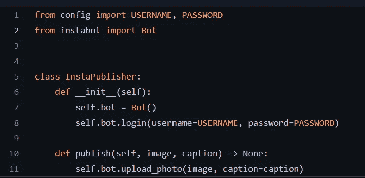

# 创建 Instagram 发布机器人。

> 原文：<https://medium.com/codex/creating-an-instagram-posting-bot-7b7a6c1ac34a?source=collection_archive---------13----------------------->

让我们来谈谈如何制作 Instagram 机器人

# 摘要

Instagram 是当今最受欢迎的社交媒体平台之一。作为一名用户，我经常使用它，但使用方式不同。我打开 Instagram 的主要原因不是看到我的熟人最近去墨西哥度假或嘲笑 memes(这是正确的，也是有趣的)——而是消费“灵感内容”。

“励志内容”账户的一个例子。

这些页面中有很多都有 10 万以上的追随者，并张贴…名人的名言…这让我想到，“嗯，与其向下滚动消费某人的偶像，我应该自己做一个！”

于是，任务开始了——我打算创建一个 Instagram 机器人，它可以每天自动发布我个人灵感来源的引用。

## 快速笔记

如果你在这里是因为你想自己做这件事，只需滚动到底部！在 [Github](https://github.com/Jacob-Mellichamp/Instagram-bot) 上有一个开放源代码的链接，我还将概述如何设置 repo 来为您个人工作！

本文还为视觉学习者提供了相应的视频

## 从哪里开始

作为软件工程师，把问题分解成小问题是我们的天性。最终目标是创建一个 Instagram 帐户，它可以自动发布随机报价，符合我们构建软件应用程序所需的标准，可以:

1.  从预先定义的人员列表中随机获取报价。
2.  生成一张图片，将作者的照片和引文结合在一起
3.  将生成的图片发布到 Instagram

如果我们遵循“关注点分离”的原则，我们也可以创建一个有组织的代码库来实现这些目标中的每一个。让我们开始吧！

## 一、随机报价选择

选择随机报价的过程可以有多种方式。我们从预定义的作者列表开始，所以想到的第一个算法是:

1.  随机选择一个作者(字面意思就是字符串列表中的随机字符串)
2.  从选定的作者中随机选择一段引文。(同样，只是在字符串列表中选择一个随机的字符串)

很简单，对吧？作者列表被硬编码到应用程序中，但引用列表是在运行时通过使用 Python 库 [beautifulsoup](https://beautiful-soup-4.readthedocs.io/en/latest/) 从 www.goodreads.com[网站](https://goodreads.com)提取引用而生成的。这允许终端用户容易地向硬编码列表添加额外的作者，而不必手动去搜索所述作者的酷报价。

**通过缓存进行优化:**代码还会将从 www.goodreads.com[网站获得的报价“缓存”在一个文本文件中，这样就不需要从该网站“重新获取”报价。](http://www.goodreads.com)

## 二。图象生成

如果这个机器人是为 twitter 制作的，那么拥有作者和引用将是我们唯一需要的。但是，因为这是 Instagram，所以我们要贴一张照片。这意味着在我们准备发布之前，我们需要将我们的随机报价变形到图像上。

**Instagram 要求发布时照片为一定尺寸:**

*   1:1 比例的图像(1080 x 1080 像素)
*   4:5 比例的图像(1080 x 1350 像素)

我不会撒谎，我一直在努力寻找这种尺寸的作者的图片。这种挣扎让我决定直接手动添加照片到应用程序中。使用我选择的照片编辑软件，Adobe Photoshop，我能够使用描述的尺寸创建照片，并将它们添加到软件应用程序中。一旦这些图像被保存到应用程序，python 库' [Pillow](https://pillow.readthedocs.io/en/stable/) ' (Python 图像库)被用来修改图像，并在重新保存之前将文本写入图像。

需要进行的主要照片编辑如下:

*   将图像的对比度降低 50%(这样照片文本会“弹出”)
*   将任意长度的字符串放在照片的中心。

# 三。发布到 Instagram

现在，我们都在等待的部分，实际上发布到 Instagram。确实有一个官方的 Instagram API 供开发者与各种终端交互。当涉及到个人编程项目时，当我没有太多东西时，我会犹豫是否要重新发明轮子。因此，我利用了 insta bot python 包装器与 Instagram 进行交互。我们不需要手动创建/配置请求，而是可以调用包装函数来完成这项工作！我们的应用程序中惊人的 12 行代码可以发布到 instagram！

用于发布到 instagram 的代码

向 Daniil Okhlopkov 致敬，他创建了一个非常直观的库！

# 结论

所以你有它的人！在想出一个最初的项目想法并将其分解为更小的子问题之后，我们成功地创建了一个 Instagram 发布机器人！这篇文章的主要收获是通过将一个问题分解成子问题或“个人挑战”,我能够创建一个易于配置和修改的简明代码库。我希望这个代码分解很容易理解。您可以随意克隆存储库并亲自尝试！

Github 链接:[https://github.com/Jacob-Mellichamp/Instagram-bot](https://github.com/Jacob-Mellichamp/Instagram-bot)

在推特上关注我:【https://twitter.com/JakeMellichamp 