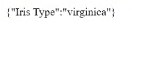

# 创建 ML 模型并将其作为 RESTful API:第 2 部分

> 原文：<https://medium.com/codex/creating-an-ml-model-and-serving-it-as-a-restful-api-part-2-450bd49dd17?source=collection_archive---------3----------------------->

这篇文章是[模型和 API 创建](https://notesandcodes.medium.com/creating-an-ml-model-and-serving-it-as-a-restful-api-part-1-4c8f7ed5e6ba)的延续，所以一定要先看看本系列的第 1 部分！


图片来源:【https://pixabay.com/images/id-4968987/ 

本系列的第 2 部分将着重于创建一个非常简单的 web 应用程序，它要求 Iris 的花瓣和萼片的宽度和长度。然后，它将调用虹膜分类模型 API，根据给定的用户数据对虹膜花的类型进行分类。web 应用程序将使用 PHP 和 HTML 创建，托管在本地服务器上。

# 编写 Web 应用程序🖥️

web 应用程序包含四个输入字段来接受用户数据。一旦用户点击提交，它将调用 API 并以 JSON 格式返回预测的分类。

为此，我们创建了一个名为 iris-app.php 的文件，并在其中输入以下 PHP 和 HTML 代码:

```
<?php
 $form = “
 <!DOCTYPE html>
 <html>
 <body>
 <h1>Iris Classification</h1>
 <form action=’iris-app.php’ method=’GET’>
 <p>Enter Sepal Length</p>
 <input type=’text’ name=’slength’/>
 <br/>
 <p>Enter Sepal Width</p>
 <input type=’text’ name=’swidth’/>
 <br/>
 <p>Enter Petal Length</p>
 <input type=’text’ name=’plength’/>
 <br/>
 <p>Enter Petal Width</p>
 <input type=’text’ name=’pwidth’/>
 <br/>
 <input type=’submit’ name=’Submit’/>
 <input type=’hidden’ name=’submitted’ value=’true’/>
 </form></body>
 </html>”;echo $form;
```

注意 Submit 下面的额外输入标记。它将用于通知程序表单已经提交。

它应该是这样的:


当用户单击 submit 时，它将重定向回同一个文件，因为这是我们执行 API 请求的地方。然后，我们必须将表单包含在 if-else 语句中，这样，只有当用户单击 submit 时，请求才会发生。如果没有，那么表单就会一直显示出来。

代码将会是:

```
<?php
 if(isset($_GET[‘submitted’])){
 //API Request Goes Here
 }
 else{
   $form = “
   <!DOCTYPE html>
   <html>
    <body> <h1>Iris Classification</h1>
      <form action=’home.php’ method=’GET’>
        <p>Enter Sepal Length</p>
        <input type=’text’ name=’slength’/>
        <br/>
        <p>Enter Sepal Width</p>
        <input type=’text’ name=’swidth’/>
        <br/>
        <p>Enter Petal Length</p>
        <input type=’text’ name=’plength’/>
        <br/>
        <p>Enter Petal Width</p>
        <input type=’text’ name=’pwidth’/>
        <br/>
        <input type=’submit’ name=’Submit’/>
        <input type=’hidden’ name=’submitted’ value=’true’/>
      </form> </body>
  </html>”; echo $form;
}
```

cURL 库可以用来在 PHP 中发出 HTTP 请求。我们首先使用 curl_init()初始化一个 curl 会话，然后只使用 curl_setopt()发出 API 请求，其中有三个参数:

* cURL_handler —使用` curl_init()`
*选项初始化 cURL 时返回—要更改的设置的常数值。对于这个程序，我们使用“CURLOPT_URL ”,因为我们想要传递一个 URL 作为第三个参数
* Value 中的值——用于设置的值。在这种情况下，我们调用 API 以及用户的输入作为查询。

一旦设置好，我们就用“curl_exec()”发出请求，最后用“curl_close”关闭 curl 会话。

完整代码写在下面:

```
$swidth = $_GET[‘swidth’];
$slength = $_GET[‘slength’];
$pwidth = $_GET[‘pwidth’];
$plength = $_GET[‘plength’];
$ch = curl_init();
curl_setopt($ch, CURLOPT_URL, “[https://iris-classification-model.herokuapp.com/classify?swidth=](https://iris-classification-model.herokuapp.com/classify?swidth=)".$swidth."&slength=".$slength."&pwidth=".$pwidth."&plength=".$plength);
$result = curl_exec($ch);
curl_close($ch);
```

我们完事了。如果我们用这些值运行程序:


我们得到虹膜分类为:



万岁！现在我们有了模型 API 和接口🎉！

嘿，你好！如果你喜欢读我的文章，并且想请我喝杯茶🍵，*我将非常感谢您在*[https://www.buymeacoffee.com/andreagon](https://www.buymeacoffee.com/andreagon)的支持

*祝您度过愉快的一天！*