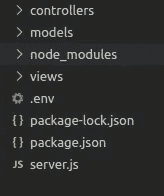

# 使用 NODEjs 和 MariaDB 创建 MVC 应用程序

> 原文：<https://medium.com/codex/creating-an-mvc-application-using-nodejs-and-mariadb-9510c7b91716?source=collection_archive---------2----------------------->


[Unsplash](https://unsplash.com?utm_source=medium&utm_medium=referral) 上 [AltumCode](https://unsplash.com/@altumcode?utm_source=medium&utm_medium=referral) 拍摄的照片

# 堆栈

MVC 或模型-视图-控制器是一种设计模式，它将应用程序分成三个主要组件:模型、视图和控制器。简单来说，模型管理数据，视图呈现数据，控制器是其他组件的接口。

这个 MVC 应用程序将用 Nodejs 运行环境构建。Nodejs 使用 google V8 引擎，该引擎允许在 web 浏览器之外执行 JavaScript 代码。具有非阻塞 I/O 操作的单线程事件循环模型体系结构提供了一种处理并发请求的方法，而无需创建多线程。这些特性使 Nodejs 成为构建高效应用程序的好选择。此外，我们还将使用 Express 框架，该框架提供了几个特性，使得用 Nodejs 开发 web 应用程序变得更加容易和快速。

在数据库引擎方面，我们将使用 MariaDB。MariaDB 是由 MySQL 的原始开发者构建的，并保证保持开源，目前正在被像 Google 或 Wikipedia 这样的著名用户使用。查询将通过 Nodejs MariaDB connector 手动编写，而不是像流行的 Sequelize 那样使用对象关系映射器(ORM)。

为了实现视图，将使用模板引擎 EJS(嵌入式 JavaScript)。EJS 的学习曲线很快，因为你需要编写的代码基本上是 HTML 标记结合基本的 JavaScript 代码。

在开始之前，我认为设定目标和限制是合适的。本教程的主要目的是提出一个使用 Nodejs 创建 MVC 应用程序时可以使用的策略。为此，我们将构建一个简单的登录页面，您可以在其中进行身份验证并查看用户资料页面。我们将实现基本的基于角色的访问控制，以区分管理员和普通角色。它不会涵盖您在开发要在生产环境中部署的应用程序时需要考虑的许多方面。例如，错误处理、日志记录或基本的安全措施(如加密密码)不包括在内。

# 开始

为了能够继续学习本教程，您应该已经安装了:

*   NPM 或者百胜这样的包装经理；
*   Nodejs
*   MariaDB 服务器。

好吧，让我们从创建以下文件夹结构开始:

```
mkdir controllers models views
```

打开您的终端并输入 *npm init -y* 来创建我们的 package.json 文件，不要问任何问题。在本教程中，我没有讨论在配置包文件时需要考虑的问题。让我们通过输入以下命令来安装节点模块:

```
 npm install mariadb express express-session body-parser passport dotenv ejs
```

dotenv 模块支持将环境变量从. env 文件加载到 process.env 中。在本例中，我们使用 dotenv 来存储数据库配置和服务器端口。在应用程序的根文件夹中创建一个. env 文件，并复制这些配置，稍后将通过调用 *dotenv.config()* 来加载这些配置。

```
DB_HOST=localhostDB_DATABASE=myappDB_USER=adminDB_PASSWORD=mypassSERVER_PORT=3000
```

更改内容以适应您的数据库服务器配置。现在在同一个文件夹中创建一个 server.js 文件，并通过 import express 和 dotenv 启动。添加 express listen 函数来创建 HTTP 服务器。

```
const express = require(“express”); const dotenv = require(“dotenv”);const app = express();dotenv.config();app.listen(process.env.SERVER_PORT, function () {console.log(“Server listening at: “ + process.env.SERVER_PORT)});
```

尝试用命令 *node server.js* 启动你的服务器，你应该得到一个终端消息“服务器监听 3000”。现在，应用程序的根目录应该如下所示:



在“views”文件夹中创建一个名为 *partials* 的文件夹，并在里面创建一个 *headers.ejs* 文件。在这个文件中，我们将放置一些可以被其他 ejs 文件导入的 HTML 代码。当不同的页面(如导航栏、页脚或页眉)中有相同的代码时，这个 ejs 特性特别有用。在这种情况下，我们更多地是用这个来展示概念，而不是出于实际原因。

在 views 文件夹中，我们需要创建一个 *login.ejs* 文件，其中包含我们的 HTML 标记和来自 ejs 的 javascript。该文件将从 partials 文件夹导入 header.ejs 文件。

看一下*<% if(errors . length){ %>*块。使用这个代码片段，我们可以发送一个错误变量，并向最终用户显示一条错误消息。如果错误变量不包含任何消息，生成的 HTML 将不包含任何内容。

在控制器中，folder 用我们的第一个路由创建了一个 login.route.js 文件。

```
const express = require("express");const router = express.Router();router.get("/", function (request, response) { response.render("login", { errors: [] });});module.exports = router;
```

返回 server.js 文件，将 EJS 设置为视图引擎，并将登录路由文件与登录端点绑定在一起。

```
app.set("view engine", "ejs");app.set("views", "views");app.use("/login", require("./controllers/login.route"));
```

再次启动我们的应用程序，在[http://localhost:3000/log in](http://localhost:3000/login)打开您的浏览器。您应该能够看到登录页面。

下一步是创建数据库连接池。在应用程序的根目录下创建 utils 文件夹，并在其中创建一个包含以下内容的 db.js 文件。

基本上，我们创建了一个新的 MariaDB 服务器连接池，并在 getConnection 函数中封装了获取新连接的能力。访问数据库的详细信息从 dot env 文件中获取。

现在打开您的 SQL IDE 并创建包含两个用户的 USERS 表:一个用户具有管理员角色，另一个是普通用户。

```
CREATE DATABASE myappCREATE TABLE USERS( ID int NOT NULL AUTO_INCREMENT PRIMARY KEY,USERNAME varchar(100),EMAIL varchar(100),ROLE varchar(100),PASS varchar(100));INSERT INTO USERS(USERNAME,EMAIL,ROLE,PASS)VALUES(‘John’,’a@myemail.com’,’USER’,’mypassword’);INSERT INTO USERS(USERNAME,EMAIL,ROLE,PASS)VALUES(‘Mary’,’b@myemail.com’,’ADMIN’,’mypassword’);
```

在模型中，文件夹创建一个 user.model.js 文件，并声明 *read* 、 *list、*和*是 ValidCredentials* 函数。 *Read* 用于获取用户信息， *list* 用于获取所有用户的列表， *areValidCredentials* 用于检查登录凭证是否正确。在每个函数中，我们从连接池中请求一个新的连接，在获取数据后，我们关闭连接。

在 utils 内部，该文件夹创建了一个名为 auth.js 的新文件。首先导入 express-session 模块，该模块允许服务器端会话存储，客户端接收带有会话 id 的 cookie。我们将使用默认配置在服务器端(内存)存储会话信息。在 passport *serializeuser* 函数中，我们选择希望在会话中存储什么用户信息，在本例中，我们只存储用户名。随后在*deseriizeduser*函数中从数据库中检索整个用户对象，并保存到 request.user。*check authentic ation*函数可用作简单的基于角色的授权中间件，其中角色可在路由级别传递，并与存储在 request . user 中的用户角色进行比较

在服务器中，该文件添加 bodyParser 中间件并初始化身份验证。在 app.use(route，routefile)之前添加这个中间件很重要。否则，passport 将不会被初始化，您将会得到一个错误。

```
const bodyParser = require(“body-parser”)app.use(bodyParser.json(), bodyParser.urlencoded({ extended: true }));const auth = require(“./utils/auth”);auth.initialization(app);
```

在控制器的文件夹中创建 profile.route.js 文件。基本上，我们将有一个 profile/user 和 profile/admin 路由，其中我们使用 *checkAuthentication* 中间件来限制对我们传递的角色的访问。用户可以使用他们的个人资料访问页面，而管理员可以访问他们的个人资料和用户列表。

在 server.js 中添加配置文件路由

```
app.use(“/profile”, require(“./controllers/profile.route”));
```

更改登录路由器文件以考虑登录过程。get 方法呈现登录页面，或者如果用户已经过身份验证，则重定向到配置文件页面。post 方法检查凭证是否有效，以及它们是否是通过 request.login(user)登录的用户。除了这种定制方法，我们可以使用 passport local 策略来完成基本相同的任务。我们在这里还包括允许注销的路由。为此，我们只需调用 request.logOut()。

在 views 文件夹中创建一个 profile.ejs。该文件呈现用户数据，如果用户是管理员，它还呈现数据库中的用户列表。

再次启动我们的服务器，检查您是否能够同时登录两个用户。感谢阅读本教程，你可以在这里查看项目代码。请随时提出改进文章质量的建议。