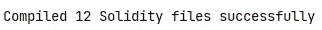

# 从头开始创建 NFT 智能合同

> 原文：<https://medium.com/codex/creating-an-nft-smart-contract-from-scratch-eaf4f83ef558?source=collection_archive---------3----------------------->

*为区块链以太坊(或多边形)创建 NFT 智能合约。*


图片由[内纳德·诺瓦科维奇](https://unsplash.com/@dvlden?utm_source=unsplash&utm_medium=referral&utm_content=creditCopyText)在 [Unsplash](https://unsplash.com/s/photos/ethereum?utm_source=unsplash&utm_medium=referral&utm_content=creditCopyText) 拍摄

对于一些人来说，NFT 是一个非常辛辣的话题。但关于人们对它的看法，这是一个非常有趣的话题，可以用于伟大的事情(如分散的证券交易所)。区块链技术仍然是相当新的，各公司刚刚进入这一领域。

那么，一个开发者如何才能试着分一杯羹呢？我们可以创建自己的项目，学习 Solidity(Polygon 和 Ethereum 上智能合约的语言)，并构建可能会让世界变得更好的惊人 dApps。

*本文是为具备一些编程知识的开发人员编写的。一些关于 NodeJS / NPM 的知识也会有所帮助。坚固性也会用到。为了让你理解，我会尽我所能去了解每一件事。享受吧。*

# 什么是智能合约？

简单地说，一个“[智能契约](https://ethereum.org/en/developers/docs/smart-contracts/)”，或者仅仅是“契约”就是一个运行在区块链上的程序。索拉纳称之为“程序”，Polygon 和以太坊称之为“智能合约”。实际上，它们是一种账户，就像你自己的以太坊地址一样。他们有自己的余额，可以通过网络发送交易。然而，它们不受用户控制。他们是“不可信的”。

用户可以与这些智能合同进行交互。他们也可以阅读代码，看看它做了什么。它们对每个人都一样，默认情况下，不能从区块链中删除。

正如简介中提到的，以太坊的智能合约是用 Solidity 编写的，Solidity 是一种静态类型的语言，具有智能合约的一些附加功能，如`address`和`payable`类型。

# 什么是 NFT？

NFT 是不可替换的令牌。常被描述为类似于 AAPL 这样的股票。然而，这是半假的。股票具有相同的倍数，例如，公司 A 可能有 6000 万股，这些股票完全相同，它们是半可替代的。

但是 NFT 是不可替代的。只能存在一个副本。所以它更类似于艺术。只有一个蒙娜丽莎，也只有一个*隐朋克#1234* 。它们是集合的一部分，但是每一个令牌仍然是唯一的。

NFT 也可以在其中存储所有权，并且可以包含比标准所说的更多的功能。一个简单的合同可以让用户铸造新的代币，转让它们，并烧掉它们。您的智能合约可能还具有更改令牌的功能(例如更改数字宠物的名称)。

本质上，NFT 只是你需要实现的一组标准的[，它们可以选择性地包含你为它编程的任何东西。](https://ethereum.org/en/developers/docs/standards/tokens/erc-721/)

它们也被称为 ERC-721 合同。这是因为它首先被提交到以太坊改进提案(EIP)网站。因此，当这个提议被接受时，EIP-721 就变成了 ERC-721。它们定义了智能合约将实现的特定接口和功能。

# ERC-721 标准

ERC-721 标准和其他一些小功能是我们将要实现的。让我们看看*标准到底定义了什么*。

我链接到的网站 OpenZeppelin 是一个非常有用的网站，可以提供文档和一些标准的信息。它们还提供了契约，您可以通过导入它们并根据自己的需要覆盖它们来使用它们。如果你想深入阅读完整的建议，你需要去 EIPS 的网站。

在 OZ 上，我们可以看到很多 ERC721 和 IERC721 的提及。IERC721 是我们实现的*接口*。它定义了函数名、参数、返回类型以及它应该包含的变量和映射。它还实现了 ERC165，你可以在这里阅读。

我们将首先关注 IERC721。它有几个看起来非常相似的函数和重载函数，我们就不详细介绍了，因为它们和非重载函数做的是一样的。我们来看看函数。

*   `**Constructor()**`。该构造函数在部署时只调用一次。它可以用来初始化私有变量或其他数据。就像 Java 或 C#中普通的类构造函数一样。它可以有一个空的身体。
*   `**BalanceOf()**`。该函数将返回特定地址拥有的令牌数。
*   `**OwnerOf()**`。它返回特定`tokenId`的所有者的地址。比如:“谁拥有 CryptoPunk #1234？”。
*   `**SafeTransferFrom()**`。这个和它的非安全对应物用于将令牌从一个地址传送到下一个地址。您还需要添加您想要转移的令牌的`tokenId`。
*   所有的`**approve()**`功能。这些都*批准*一个你输入的地址来替你管理代币。他们可以转让代币。这通常用于标记代币或在 OpenSea 等市场上出售代币。
*   `**SupportsInterface()**`。这是给 ERC165 的。你可以在这里阅读[。但是你现在不用担心了。](/quick-programming/what-is-erc165-and-why-you-should-use-it-d0641a2f29e5)

虽然这是有效的 NFT 契约唯一需要实现的东西，但是 OpenZeppelin 的 ERC721 契约还包含一些我们也将使用的函数。最值得注意的是:

*   `**_safeMint()**`，这是用户将从你的合同中调用的主要功能。它允许你(或用户)铸造新的令牌。您几乎总是会添加更多的功能，比如检查用户是否被允许铸造令牌。
*   `**tokenURI**`。`tokenURI`存储关于令牌的信息。它通常是一个到 JSON 文件的 IPFS 链接，该文件存储了令牌的名称和图像。像 OpenSea 这样的市场调用这个函数来获取关于您的令牌的所有信息。
*   `**_baseURI**`T18。默认情况下不会实现`_baseURI`，但是它通过提供 URI 的基础来增加`tokenURI`的功能。例如，每个令牌可能存储在 IPFS 的一个文件夹中。将整个链接存储在每个令牌中是没有意义的，相反，您可以简单地将`tokenId`附加到`baseURI`来创建`tokenURI`。

这基本上是我们需要实现的一切，然而，如果你想用这个契约开发一个 dApp，我们可能想从其他 OpenZeppelin 契约中添加一些更有用的函数，如 [ERC721Enumerable](https://docs.openzeppelin.com/contracts/4.x/api/token/erc721#ERC721Enumerable) 。

## ERC 721 可数

ERC721Enumerable 增加了一些有用的函数，可以更容易地获得关于令牌的特定数据，而无需对区块链进行 1000 次`view`调用。它增加了以下功能。

*   `**TokenOfOwnerByIndex()**`。这在所有者持有多个代币的情况下非常有用。例如，它返回第 7 个令牌地址`0xabc...`持有。
*   `**TotalSupply()**`。它返回合同当前拥有的令牌总数。如果铸造了 10000 个代币，那就是 10000 个。
*   `**TokenByIndex()**`返回通过索引检索到的令牌的`tokenId`。虽然大多数时候指数和`tokenId`是相同的。
*   `**_beforeTokenTransfer**`在任何令牌传输(包括铸造和刻录)之前调用。目前我们不需要担心这个。

在 [OpenZeppelin](https://docs.openzeppelin.com/contracts/4.x/api/token/erc721) 上的 ERC721 还有很多其他变体。如果你想的话，你可以自己去查看，但是我们现在不需要详细讨论。我只想告诉你，它们是存在的，而且非常有用。

# 我之前提到过多边形，它是什么？

多边形和以太坊一样，是一个区块链，你可以在上面创建智能合约。它比以太坊上的智能合约便宜得多，而且目前更环保，因为 Polygon 是风险证明，而以太坊是更老派的工作证明。

**这两个**的代码完全相同，唯一的区别是 ChainId 和部署它们所需的参数。它们都使用 Solidity，并且都可以使用相同的地址**访问像 MetaMask 这样的钱包。这使得它非常适合业余爱好项目，而学习更严重的项目。**

# 创建智能合同

您可以通过几种不同的方式创建智能合同。对于较大的项目，您可能希望建立一个良好的工作空间，正如我们下面将要做的。但如果你只想运行智能合约，玩一玩，可以用 Remix。

## 再搅拌

虽然我们不打算使用 Remix ，但它是一个很棒的智能合约开发在线集成开发环境。它允许您轻松地测试新事物，而无需在测试网上重新部署契约。它允许您在 JavaScript VM 中进行测试。你可以在我写的另一篇文章中读到更多。

[](/codex/how-to-test-a-smart-contract-with-remix-b2e9669997dd) [## 如何用 Remix 测试智能合约

### 无需部署到测试网即可轻松测试。

medium.com](/codex/how-to-test-a-smart-contract-with-remix-b2e9669997dd) 

如果你决定使用 Remix，直接跳到本文的 Solidity 编码部分。你不会错过这个项目太多，但它可能是好的学习安全帽或松露在未来更大的项目。

## 设置安全帽

要创建智能合同，我们需要设置一些工具。有几种方法可以做到这一点，比如使用 Remix，但我将使用 [HardHat](https://hardhat.org/) 。HardHat 是一个工具，它将帮助我们在未来以编程方式部署和测试我们的智能合约。可以使用 NodeJS 的包管理器 [NPM](https://npmjs.com/) 将其作为一个包下载。

安装 NPM 后，为项目创建一个文件夹。名字不重要。接下来，打开命令行，分别输入以下命令。

```
npm init -y
npm install --save-dev hardhat
```

第一个命令初始化一个新的节点项目，第二个命令只为这个项目安装 hard hat**。请注意，安装 HardHat 可能需要几分钟时间，它有很多依赖项。**

**运行`npx hardhat`，选择`Create an empty hardhat config file`。这将创建一个`hardhat.config.js`文件，您可以在其中设置 Solidity 编译器设置、部署设置等等。**

**在我们编写了智能契约之后，您可以使用`npx hardhat compile`来编译它。现在我们已经拥有了一切，让我们从简单的部分开始，即可靠性代码。**

## **坚固性代码**

**现在，我们终于可以创建实际的智能合约了。谢天谢地，对我们来说，这是相当简单的，即使没有深刻理解 ERC-721 标准，或知识的可靠性语言。**因为我们可以使用**[**open zeppelin**](https://docs.openzeppelin.com/contracts/4.x/api/token/erc721)**的智能合约来导入大部分功能**而不用写任何东西。**

**许多大项目都使用 OpenZeppelin 的合同。它允许我们将注意力集中在整个项目上，而不是实现我们可以从互联网上抓取的功能。这和使用其他语言的库或包是一样的。**

**我们可以通过运行以下命令，使用 NPM 安装 OpenZeppelin 的合同。**

```
npm i @openzeppelin/contracts
```

**你可以在 `*node_modules*` *文件夹里找到它们，有兴趣的话可以去看看。不过，我们只打算导入它们。***

**创建一个名为`contracts`的文件夹，并在其中创建一个扩展名为`.sol`的文件。这将是我们的智能合同。**

**这几行代码是 NFT 智能合约的基础。我们从 OpenZeppelin 导入 ERC721Enumerable，并用我们的令牌名和缩写调用它的构造函数。我们还将`pragma solidity 0.7.3`匹配到可以在`hardhat.config.js`文件中找到的 Solidity 版本。**

***注意，我们导入了 ERC721Enumerable，但是只调用了 ERC721Enumerable 导入的 ERC721 的构造函数。***

**我们现在可以添加一些覆盖铸造功能所需的变量。**

**我们设置了合同可以创建的最大令牌数，当然，还有每个令牌的价格。我们从来自 ERC721Enumerable 的`totaSupply`中获得我们将要铸造的令牌的`tokenId`。**

**您现在已经创建了一个非常简单的 NFT 契约。你现在可以添加更多的功能，覆盖你特定用例的功能，或者只是运行`npx hardhat compile`来尝试编译它。**

**如果你得到错误的实体版本，你可能需要更新你的配置文件，如下所示。**

**您可以添加/修改编译器，以确保包含所有合同使用的每个版本。然后它应该没有任何问题地编译。**

****

**恭喜你！你在这篇文章的底部。我希望到目前为止你已经学到了很多，我也希望你能用这些知识来构建令人惊叹的项目。如果你想了解接下来的步骤，我建议你看看下面的进一步阅读部分。**

# **进一步阅读**

*   **[使用 Remix 测试智能合约](/codex/how-to-test-a-smart-contract-with-remix-b2e9669997dd)**
*   **[使用 HardHat 测试智能合约](/codex/testing-a-smart-contract-with-hardhat-️-b7edd925891)**
*   **[部署带有 Remix 的智能合约](/quick-programming/how-to-deploy-a-smart-contract-using-remix-9e270b253249)**
*   **[使用 HardHat 部署智能合同](/quick-programming/how-to-deploy-a-smart-contract-with-hardhat-45e0a6ffdb4c)**
*   **[用 Web3 和 NextJS 创建一个基本的 dApp](/codex/creating-a-basic-dapp-with-web3-and-nextjs-2ee94af06517)**

# **结论**

**我们现在已经创建了一个简单的智能合同，它完全实现了 ERC-721 标准。查看延伸阅读部分，了解后续步骤，如使用 Remix 或 HardHat 测试和部署您的合同。**

**非常感谢您的阅读，祝您度过美好的一天。**

**[考虑通过成为中级会员来支持我。它帮了我大忙，不会花你任何额外的费用，而且你可以阅读尽可能多的中等文章！](https://mbvissers.medium.com/membership)**

**在 [Twitter](https://twitter.com/0xmbvissers) 和 [gm.xyz](https://gm.xyz/u/mbvissers.eth) 上关注我，以跟上我的项目。**

**查看[袋鼠黑帮](https://kangaroomob.io/) NFT 项目。**

**检查多边形上的[像素披萨](https://www.pixel-pizzas.com/)。**