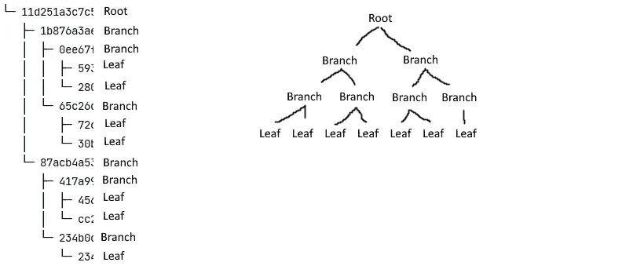

# 使用 Merkle 树证明创建 NFT 白名单

> 原文：<https://medium.com/codex/creating-an-nft-whitelist-using-merkle-tree-proofs-9668fbe72cb4?source=collection_archive---------0----------------------->

将白名单加入以太坊或多边形 NFT 智能合约的最简单、最安全的方法。


由[托德·夸肯布什](https://unsplash.com/@toddquackenbush?utm_source=unsplash&utm_medium=referral&utm_content=creditCopyText)在 [Unsplash](https://unsplash.com/s/photos/tree?utm_source=unsplash&utm_medium=referral&utm_content=creditCopyText) 拍摄的照片

许多 NFT 项目目前都实现了某种白名单。这也是一个好主意。它减少了机器人的数量。它让鲸鱼有更小的机会铸造数量惊人的代币，如果你实现它们，它可以给白名单上的用户更多的额外津贴。

但是如何实现安全的白名单呢？您可能希望使用后端服务器，以某种方式验证签名，并以某种方式保护智能合约，使其不会被欺骗。Merkle Tree Proofs 是最好的方法之一，所以让我们看看如何将它们用于白名单。

# 什么是 Merkle 树？

Merkle 树是一种用于加密的树状结构。一棵 Merkle 树有任意数量的被称为叶子的节点。这些是将被散列的数据值，在我们的例子中是白名单用户的地址。每对散列将被再次散列，然后这些散列对将被散列，直到只剩下一个节点。根节点。

这确保了节点中的任何变化都会反映到最终的根节点中。这使得检查值是否正确变得相当容易。



左图:漂亮打印的 Markle 树和节点名称；右图:同一棵树的真实图像。

OpenZeppelin 有一个智能合约，我们可以使用它来轻松地添加我们需要的功能，以便在我们自己的合约中轻松检查证明。我们只需要创建一个根节点，并为智能契约的函数提供一个散列。因此，让我们创建 Merkle 树，并设置我们需要的后端。

# 后端

如前所述，我们需要一个后端。这将是我们创建 Merkle 树的部分，这样用户就不能更改它来添加他们自己的地址。这将在一个服务器上完成，然后该服务器使用正确的参数调用智能契约来执行链上检查。

我们需要安装一些软件包。我们将使用 NPM，但你也可以使用纱线。我们将初始化 Node(用于测试)，安装 MerkleProofJS，并安装 Keccak256，因为它是 Solidity 的默认散列函数。

```
npm init -y
npm i merkleproofjs
npm i keccak256
```

一旦安装了软件包，我们可以创建一个名为`index.js`的文件，并在需要时通过在控制台中运行`node index.js`来运行它。我将使用`console.log`来展示每个步骤并提供更多信息。

我们应该做的第一件事是创建一个白名单以太坊地址列表，我已经添加了一个 7 个随机地址的列表(包括“0x”)并将它们作为字符串放入一个数组中。

然后，我们需要使用 keccak256 将它们全部散列，以创建我们的树叶。完成所有的叶子后，我们可以创建 Merkle 树并通过使用 MerkleTreeJS 得到我们的根 hash。

有了这些，我们可以创建证明，将它们发送到区块链进行验证，或者在发送交易之前自己验证它们，这可能会浪费用户的资金。

我们以某种方式从前端检索用户的地址，像我们的叶子一样散列它，并使用我们已经用正确地址制作的 Merkle 树检索证明。

在以十六进制格式创建证明后，我们也可以从`merkleTree`变量中验证它。这可能是有用的，但不是必需的，因为我们只需要将证明发送到区块链。

使其在生产中安全且易于使用的最佳方式是创建一个 API，您可以使用需要散列到 Merkle 证明中的正确数据调用该 API(但其他人不能),在前端获取证明，并使用 web3js 通过用户钱包中的事务将其发送到区块链。

现在，我们可以看看智能合约将如何实现适当的功能来验证我们发送给它的 Merkle 证明。

# 智能合同

在智能契约中验证 Merkle 证明非常容易，因为它只需要我们从 OpenZeppelin 的 Merkle Proof 契约中调用一个函数。

在执行我们想要执行的功能之前，我们只需在一个`require`语句中调用 OpenZeppelin 的`verify`函数，比如铸造令牌。

如果希望更安全，可以为根创建一个私有变量，并使用 setter 函数来设置它。不过这取决于你，这样看起来会更好，并且在原始根哈希出现问题时会更安全。

# 结论

就是这样。您可能需要稍微修改一些代码来使用 Truffle 进行测试，或者实际上在 API 内部实现它，但是这应该非常相似，如果不是相同的话。

非常感谢您的阅读，祝您度过美好的一天。

考虑通过成为中级会员来支持我。它帮了我大忙，不会花你任何额外的费用，而且你可以阅读尽可能多的中等文章！

在 [Twitter](https://twitter.com/0xmbvissers) 和 [gm.xyz](https://gm.xyz/u/mbvissers.eth) 上关注我，以跟上我的项目。

查看[袋鼠黑帮](https://kangaroomob.io/) NFT 项目。

检查多边形上的[像素披萨](https://www.pixel-pizzas.com/)。