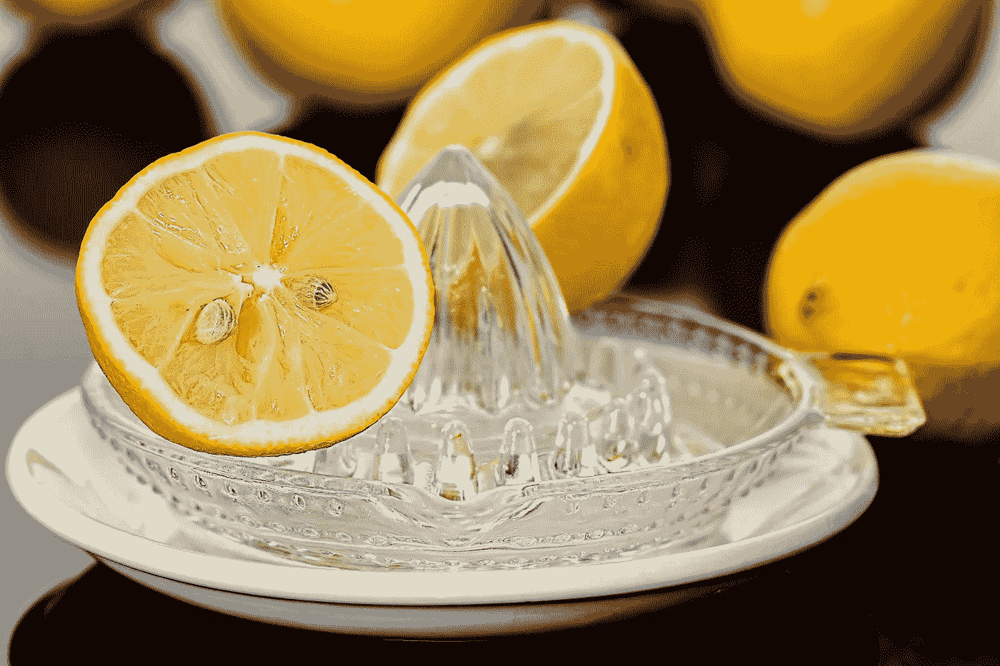

# 用 Raceplotly 创建酒吧比赛动画很容易

> 原文：<https://medium.com/codex/creating-bar-race-animations-is-easy-peasy-lemon-squeezy-with-raceplotly-83b2edd46cbe?source=collection_archive---------5----------------------->

## 如何使用 Raceplotly 在几秒钟内创建一个酒吧比赛动画

图片由 [Pixabay](https://pixabay.com/photos/lemon-squeezer-lemon-juice-citrus-609273/) 提供

条形图竞赛是一个有趣的数据可视化，显示随着时间的推移，随着条形图的演变而变化的数据。它作为一种可视化类型被广泛有效地用于显示和评估一组项目之间的排名