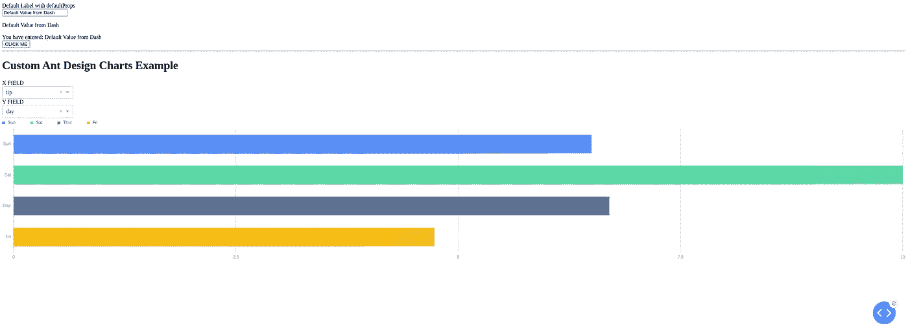
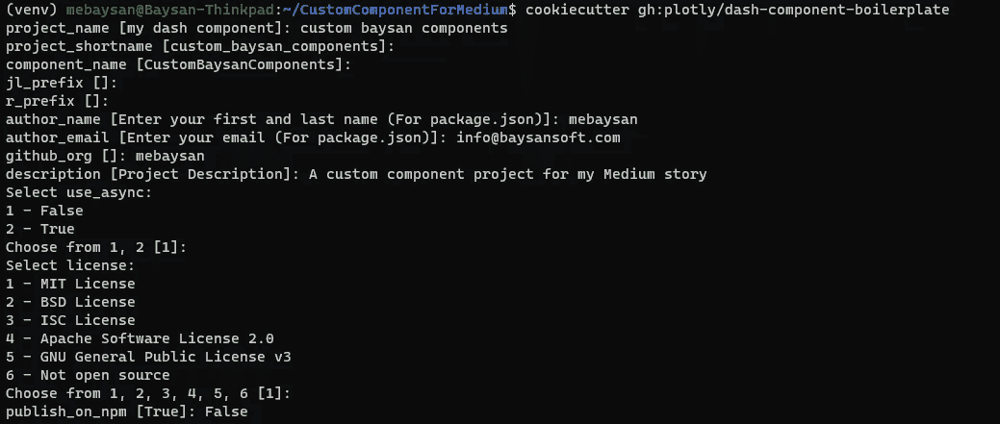
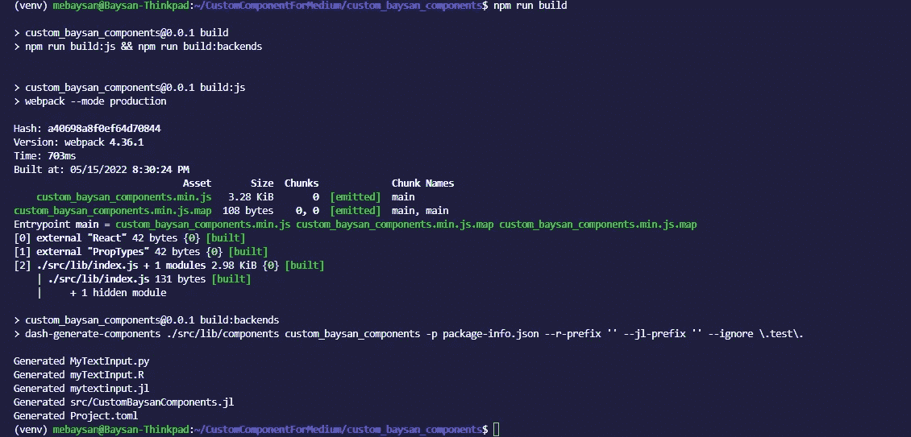
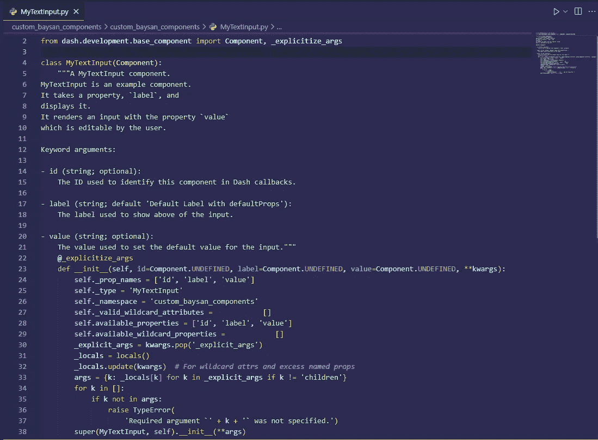
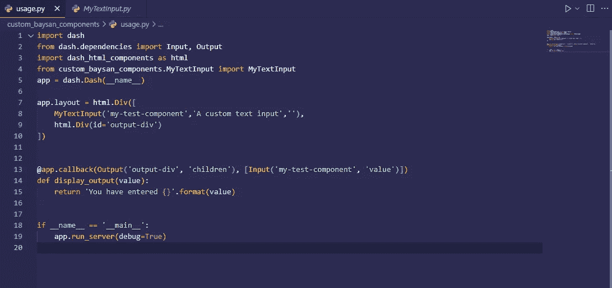
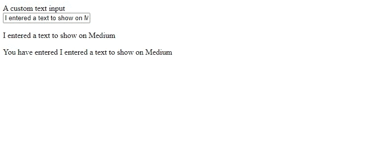

# 创建自定义 Plotly Dash 组件

> 原文：<https://medium.com/codex/creating-custom-plotly-dash-components-933b405abd21?source=collection_archive---------1----------------------->


[克里斯·利维拉尼](https://unsplash.com/@chrisliverani?utm_source=medium&utm_medium=referral)在 [Unsplash](https://unsplash.com?utm_source=medium&utm_medium=referral) 上拍摄的照片

## 通过在 Python 中使用 React

你好。在本文中，我将告诉你我们如何在 Plotly Dash 中创建自己的组件。您可以使用下面的链接访问我创建的 repo 来测试这个过程。

[](https://github.com/mebaysan/CustomDashReactComponent) [## GitHub—mebaysan/CustomDashReactComponent

### 嗨，现在我需要在 React 中创建自定义组件，因为我的工作。为了做到这一点，我已经学会了…

github.com](https://github.com/mebaysan/CustomDashReactComponent) 

作者图片

# 介绍

这里有一篇由 Plotly 编写的[有据可查的文章](https://dash.plotly.com/react-for-python-developers)来创建你的组件。然而，我将直接从使用[样板文件](https://github.com/plotly/dash-component-boilerplate)创建一个定制项目开始。我将解释核心概念并创建一个定制组件来展示我们如何做到这一点。

# 创造工作环境

我将创建一个虚拟环境并安装需求，然后使用`cookiecutter`创建一个项目。

```
python3 -m virtualenv venvsource venv/bin/activatepip install cookiecuttercookiecutter gh:plotly/dash-component-boilerplate
```



作者图片

# 文件夹结构

*   我们在`/src/lib/components/*.react.js`文件中开发我们的组件
*   我们可以使用`/src/demo/App.js`文件(一个 React 应用程序)来测试我们的组件
*   *我们必须使用`Component.propTypes={}`指出道具
*   *我们必须使用`setProps`道具将我们的定制组件与 Dash 回调绑定。如果我们想从 Dash 组件中更新我们的组件，我们必须使用`setProps`属性。
*   *我们必须导入和导出我们在。/src/lib/index.js `./src/lib/index.js`文件

# 开始创建组件

我将在项目文件夹中找到我的终端，然后安装需求。

```
cd custom_baysan_componentspip install -r requirements.txt
```

我将在`src/lib/components`文件夹中创建`MyTextInput.react.js`文件。该组件创建一个简单的文本输入和一个`p`元素。当我们在文本输入中写入内容时，`p`元素会自动更新。

```
import React, {useState} *from* 'react';import PropTypes *from* 'prop-types';*/***** MyTextInput is an example component.*** It takes a property, `label`, and*** displays it.*** It renders an input with the property `value`*** which is editable by the user.***/*const MyTextInput = (props) => {const [value, setValue] = useState(props.value);const updateValue = (e) => {setValue(e.target.value);props.setProps({value: e.target.value});};return (<>{*/* <label>{props.label != null ? props.label : 'DEFAULT LABEL'}</label> */*}<label>{props.label}</label><br /><input*value*={props.setProps ? props.value : value}*onChange*={updateValue}/><p>{value}</p></>);};MyTextInput.defaultProps = {label: 'Default Label with defaultProps',};MyTextInput.propTypes = {*/***** The ID used to identify this component in Dash callbacks.***/*id: PropTypes.string,*/***** The label used to show above of the input***/*label: PropTypes.string,*/***** The value used to set the default value for the input***/*value: PropTypes.string,};export default MyTextInput;
```

## 属性:Pythonic 中最重要的领域

如果我们不指出组件的每个属性，Dash 会给我们一个错误，并且不会将我们的 React 组件转换成 Python 类。为了处理这个问题，我们必须像下面这样定义每个属性。此外，我们可以通过使用注释行为他们编写文档。

```
MyTextInput.propTypes = {*/***** The ID used to identify this component in Dash callbacks.***/*id: PropTypes.string,*/***** The label used to show above of the input***/*label: PropTypes.string,*/***** The value used to set the default value for the input***/*value: PropTypes.string,};
```

此外，我们可以为属性创建默认值。如果我们这样定义，就不必给出 Python 中定义的属性。

```
MyTextInput.defaultProps = {label: 'Default Label with defaultProps',};
```

## 注册组件

我们需要导入和导出我们在`src/index.js`文件中创建的组件。否则，我们不能将组件转换成 Python 类。

```
*/* eslint-disable import/prefer-default-export */*import MyTextInput *from* "./components/MyTextInput.react";export {MyTextInput};
```

# 生成组件

我们准备将组件转换为 Python 类(Dash 组件)。我们使用`npm run build`命令将 React 组件转换成 Python 类。

```
npm run build
```



作者图片

然后，组件将自动转换成 Python 类，放在`custom_baysan_component`文件下。



作者图片

# 使用组件

为了测试组件，在`usage.py`文件中有一个基本的 Dash 应用程序。我将从由`npm run build`命令创建的 Python 模块中导入组件。

```
from custom_baysan_components.MyTextInput import MyTextInput
```

将会有一个与我们使用`cookiecutter`创建的项目同名的 Python 包。



作者图片

这是代码的输出。



作者图片

# 最后

希望这是有帮助的，你喜欢它。我没有深究什么是 React 或者 React 中有什么钩子之类的基本话题。因为它们不是这个故事的目标。此外，你可以在下面的报告中找到另一个关于使用蚂蚁设计图表的例子。

[](https://github.com/mebaysan/CustomDashReactComponent) [## GitHub-mebaysan/CustomDashReactComponent

### 嗨，现在我需要在 React 中创建自定义组件，因为我的工作。为了做到这一点，我已经学会了…

github.com](https://github.com/mebaysan/CustomDashReactComponent) 

问候。