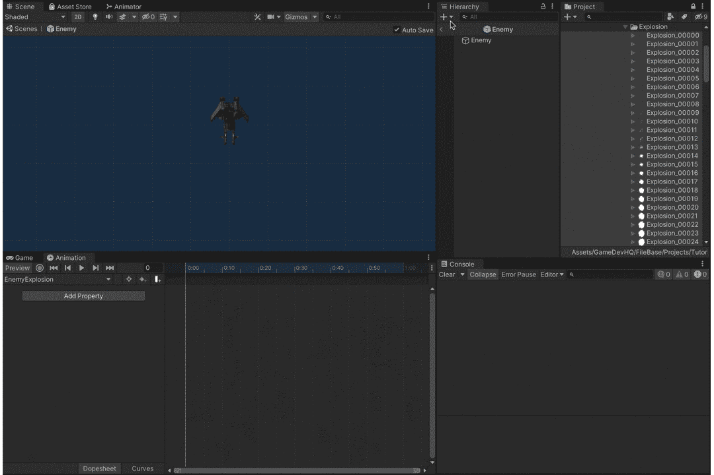
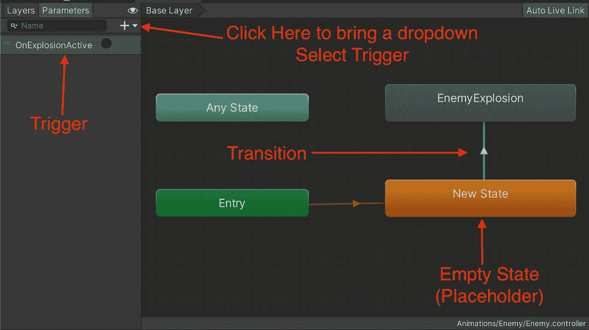
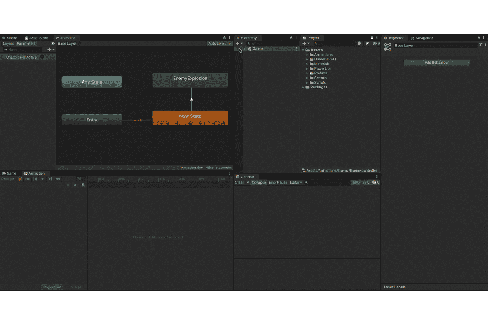
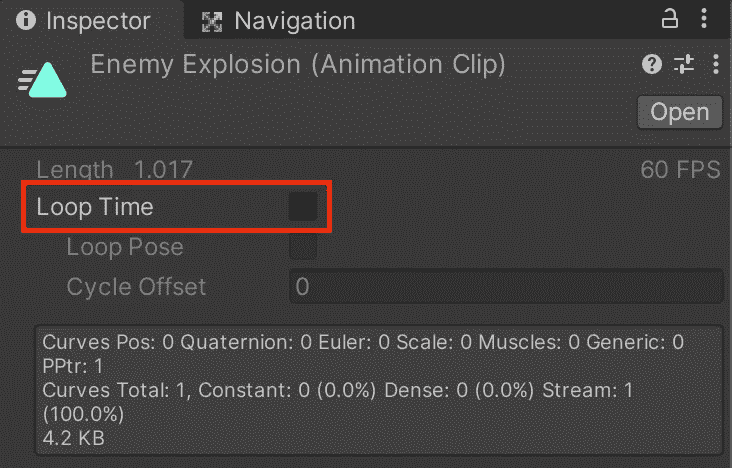
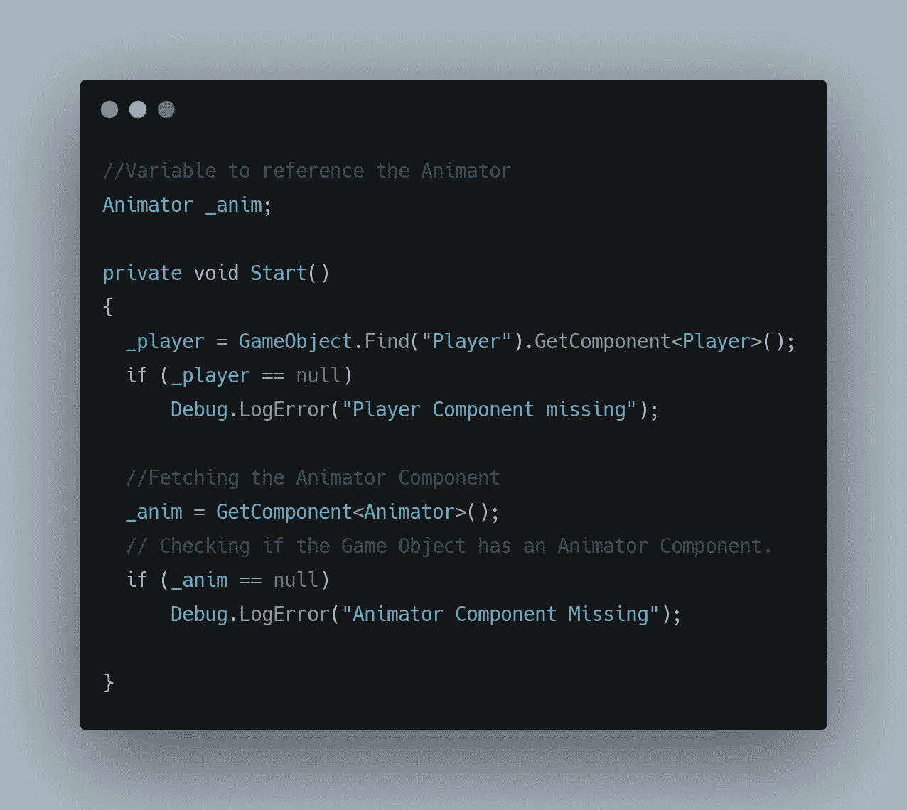
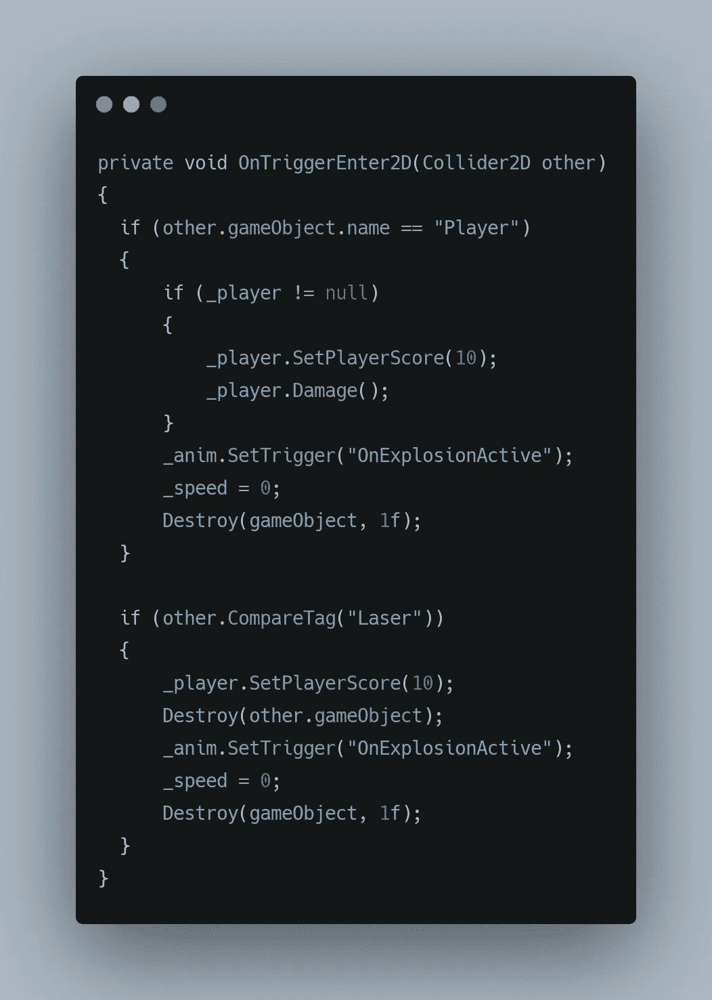

# 制造敌人的爆炸

> 原文：<https://medium.com/codex/creating-enemy-explosions-a31607120771?source=collection_archive---------15----------------------->

Joshua Woroniecki 在 [Unsplash](https://unsplash.com?utm_source=medium&utm_medium=referral) 上的照片

在一个关于战斗宇宙飞船的游戏中，可以说爆炸在游戏中扮演了重要的角色。所以让我们把这个游戏带入生活…

我们已经看到了如何使用精灵在 unity 中制作[动画，利用这些知识让我们创造一个**爆炸。**](/nerd-for-tech/animating-sprites-in-unity-b1c5d995133e)

如上所述，创建爆炸的过程非常简单，只需选择要制作动画的对象，创建一个新的动画，然后上传带有精灵的动画。动画面板包含一个时间轴，通过它可以增加/减少动画的持续时间，也可以编辑动画(删除节点，在节点之间创建大/短间隔，添加节点等)。

准备好动画后，让我们转到**动画师**来创建一个触发器，它将在被调用时播放我们新创建的动画。

其中**转换**包含一个条件。当条件为**真**时，我们进入**敌人爆炸**状态，然后播放我们的动画。

此外，在动画剪辑中关闭循环时间。

Unity 默认打开它

现在剩下的就是访问我们上面创建的 OnExplosionActive 触发器。这可以通过执行以下操作来完成，

因为我们正在处理敌人的爆炸，这个逻辑被写在敌人的行为脚本中。

有关更多详细信息，请查看[之前的文章](https://sidthakur3519.medium.com)。

**SetTrigger** 是一个 Animator 方法，当被调用时激活给定的参数，然后触发一个事件，在我们的例子中就是爆炸。这里，我们将速度设置为 0，以防止爆炸动画在对象继续下落时继续。然后我们在 1 秒钟后摧毁游戏物体。1 秒也是我爆炸动画的时长。

*注:按照这里的爆炸脚本，总共持续 1 秒的爆炸动画会伤害到* ***玩家。***

这给了我们以下结果，

同样的概念可以应用于**玩家**或任何其他游戏对象。

感谢您的阅读。更多即将推出！！！