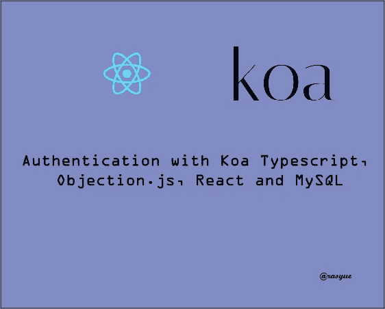

# 用 Koa.js 和 React 创建登录系统

> 原文：<https://medium.com/codex/creating-login-system-with-koa-typescript-objection-js-jwt-react-and-mysql-7fe42f8c4415?source=collection_archive---------2----------------------->

koa 打字稿

在本教程中，我们将使用 React 为前端应用程序和 Koa(Typescript)为后端应用程序构建一个简单的登录

除了 React 和 Koa，我们将使用 Objection.js (ORM)和 MySQL (database)。

# 装置

首先，我们需要确保已经安装了 [Node.js](https://nodejs.org/en/) 。