# 创建模块化通电系统

> 原文：<https://medium.com/codex/creating-modular-powerup-systems-dad9d8b41721?source=collection_archive---------8----------------------->

照片由[穆拉特·翁德尔](https://unsplash.com/@muratodr?utm_source=medium&utm_medium=referral)在 [Unsplash](https://unsplash.com?utm_source=medium&utm_medium=referral) 上拍摄

对于玩家来说，能量是一个吸引人的因素。它们被认为是决定一款游戏成败的因素之一(例如无敌能量启动，在它持续的时候很有趣，但是在整个游戏过程中启用它，你会失去乐趣/挑战因素)。到目前为止，我们一直致力于为游戏增加三倍的能量，但是如果我们需要为游戏增加更多的能量呢？在这种情况下，我们将需要建立一个模块化的系统，可以处理和执行任何我们希望添加到游戏中的能量。

让我们来看看构建模块化上电系统的一种方法。

首先，让我们创建一个名为**速度**的新技能，顾名思义，它可以让我们的玩家移动得更快。

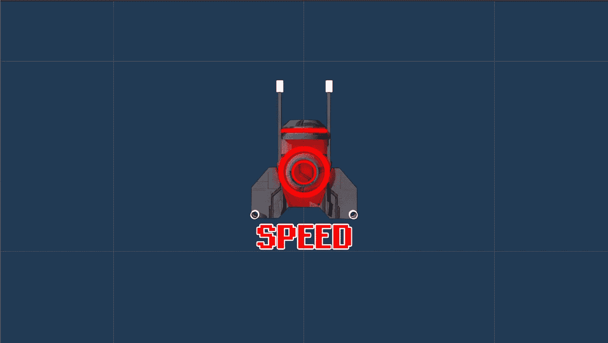

资产可以在这里找到

现在让我们来实现这个方法，让玩家移动得更快。

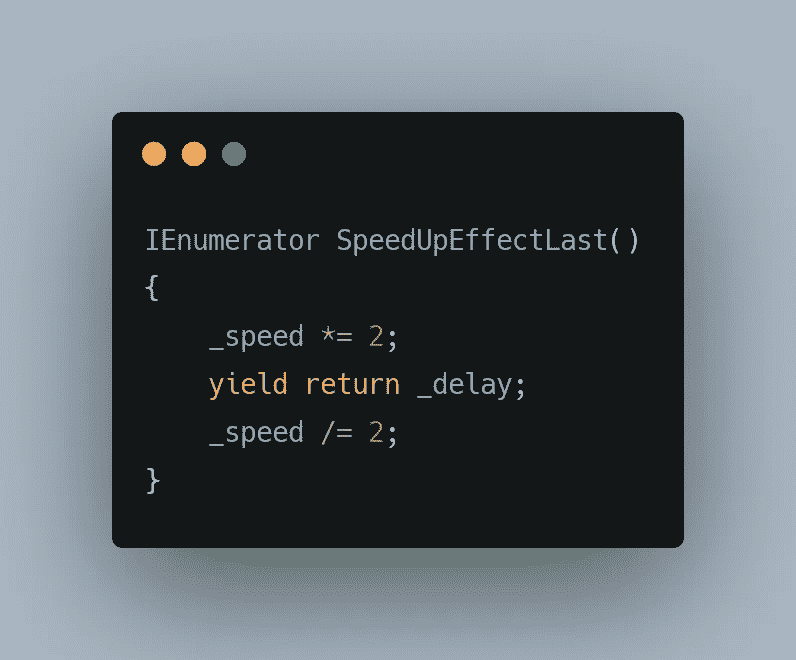

这里，**speedupeffectslast()**是一个[协程](/codex/unity-development-coroutines-adae74fcd857)，用于加倍玩家的移动速度，并在给定的时间间隔内保持有效(_delay 存储协程暂停执行的时间)。

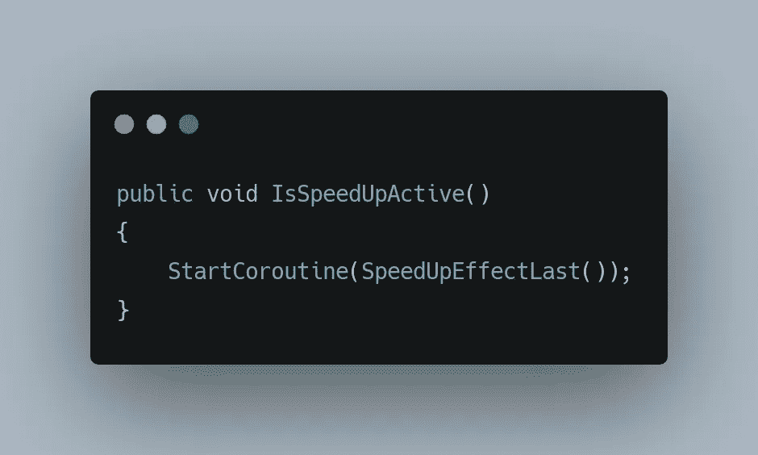

调用 IsSpeedUpActive()时，玩家的移动速度会在短时间内加倍。

现在我们已经有了加速方法，让我们继续创建一个模块化的加电系统。

这种模块化系统背后的概念是，每个加电都包含一个唯一的 ID，当被调用时，该 ID 实例化附加的加电。从我们到目前为止所看到的，每一个行为都有它自己相关的行为脚本。这意味着我们所有的加电都将包含相同的[加电](/codex/starting-to-feel-like-a-real-video-game-98d19567ca44)脚本，而与该加电的功能无关。所以，

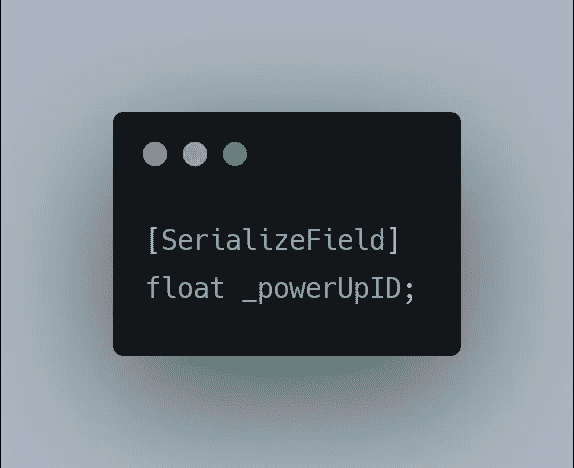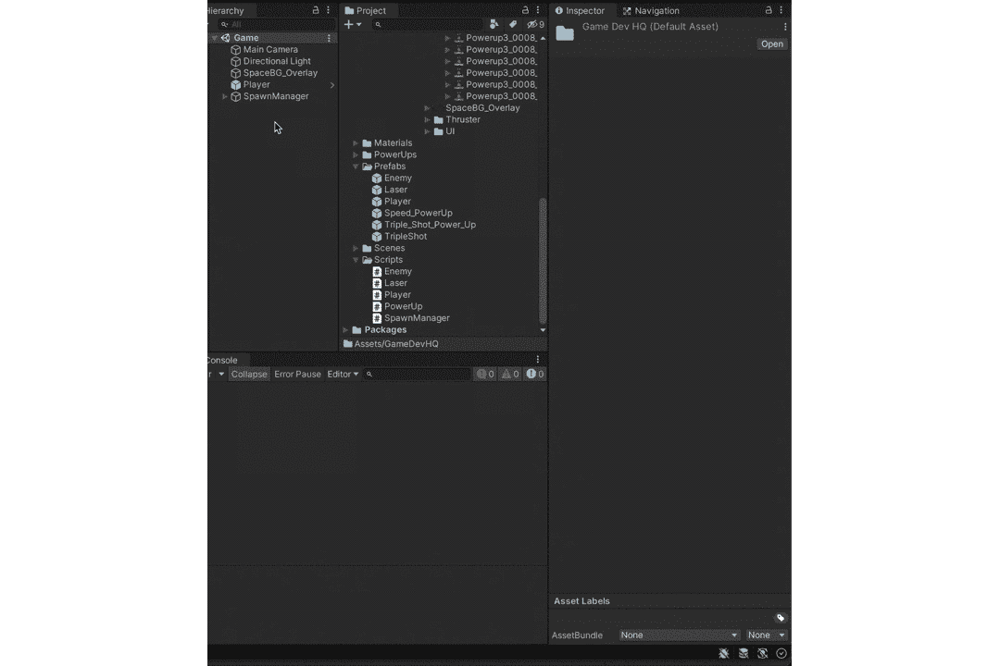

**_powerUpID** 是唯一的 ID，我们根据该 ID 激活所需的加电。

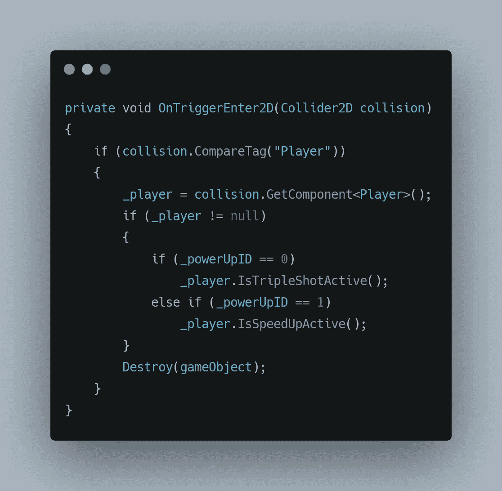

在[和](/codex/starting-to-feel-like-a-real-video-game-98d19567ca44)的基础上。

在这里，我们可以观察到我们正在实例化三倍镜头，并且只有在调用相关联的加电 ID 时才加速加电。

现在让我们继续使用使用唯一 id 的模块化方法来生成随机加电。

在我们继续之前，我们需要对什么是**数组**有一个基本的概念。

**阵列:**

数组是一种存储相似项(相同数据类型)集合的数据结构。它们基本上用于存储数据集合，唯一的约束是它们属于相同的数据类型，并且不超过数组的大小。

我们使用方括号([])来初始化/表示给定的变量是一个数组。

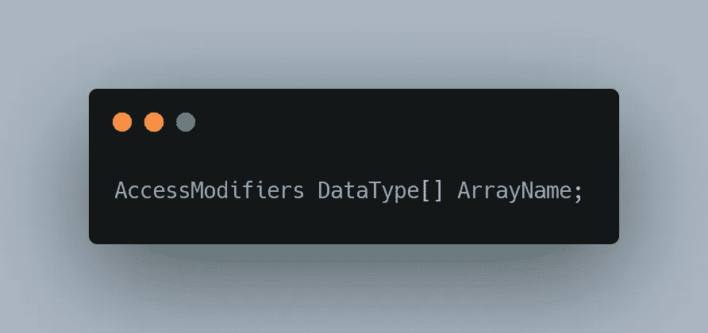

句法

让我们用我们的用例来解释数组的用法。我们希望根据开机 ID 产生一个随机开机。要做到这一点，我们首先需要收集我们所有的电源，这可以通过执行以下操作来实现:

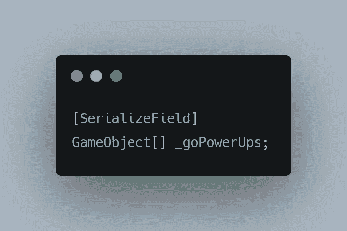

默认情况下，访问修饰符设置为 private。

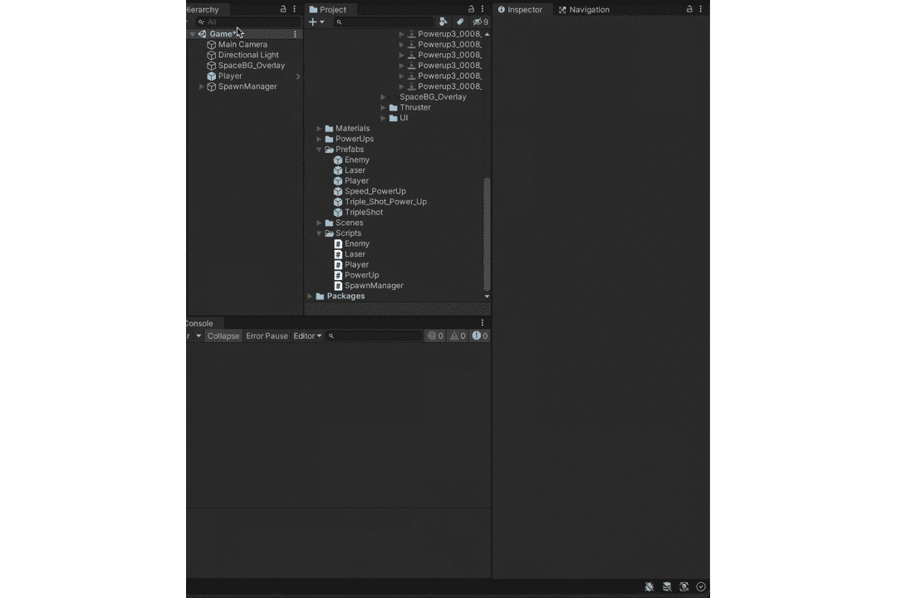

现在我们有了一个大小为 2 的 powerUp 数组，我们可以使用数组的索引(powerUp[0]，powerUp[1])来访问它的元素。数组索引从 0 开始，一直到 size(Array)-1，在本例中是 1。我们还观察到索引 0 被 tripleShotPowerUp 占用，索引 1 被 SpeedPowerUp 占用。

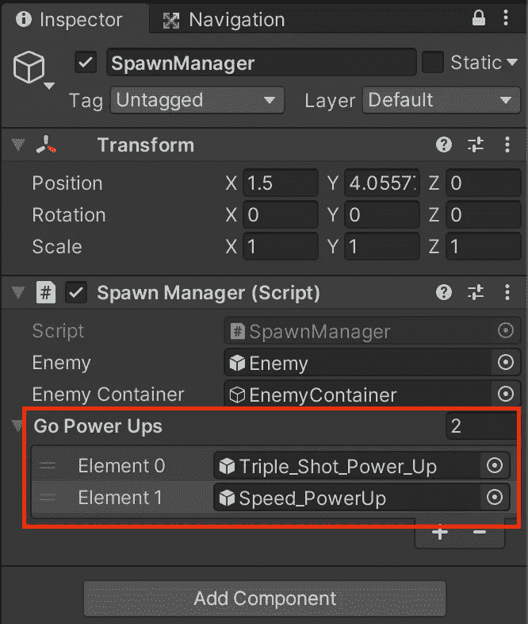

可以使用索引值来访问数组的元素。所以，

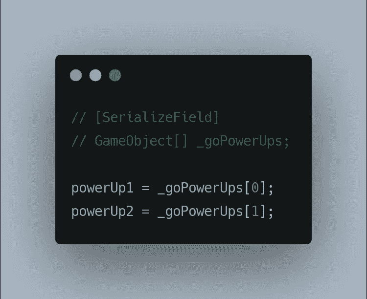

这只是一个例子，与我们的代码无关。

利用这种阵列知识，可以在随机的时间间隔内随机启动电源。

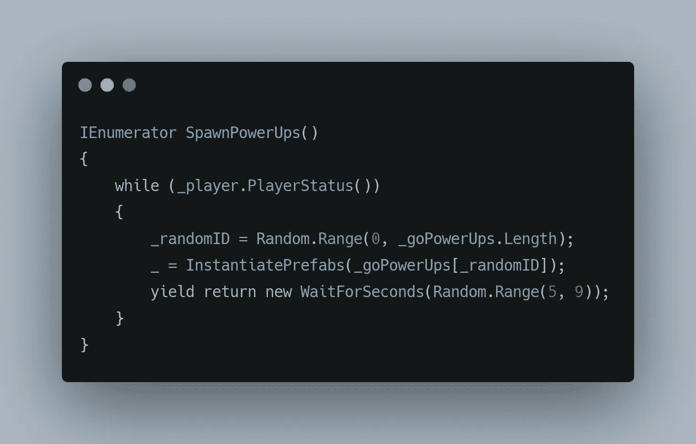

这里， **_randomID** 是一个变量，存储 0–1 之间的随机值， **_goPowerUps。Length** 在这种情况下返回 2，因为我们的数组包含 2 个元素(Random。Range 在 minVal 和 maxVal(不包括)之间选择一个随机值。
**SpawnPowerUps()**以 5 到 9 秒的随机间隔从给定的数组中随机产生一个能量。

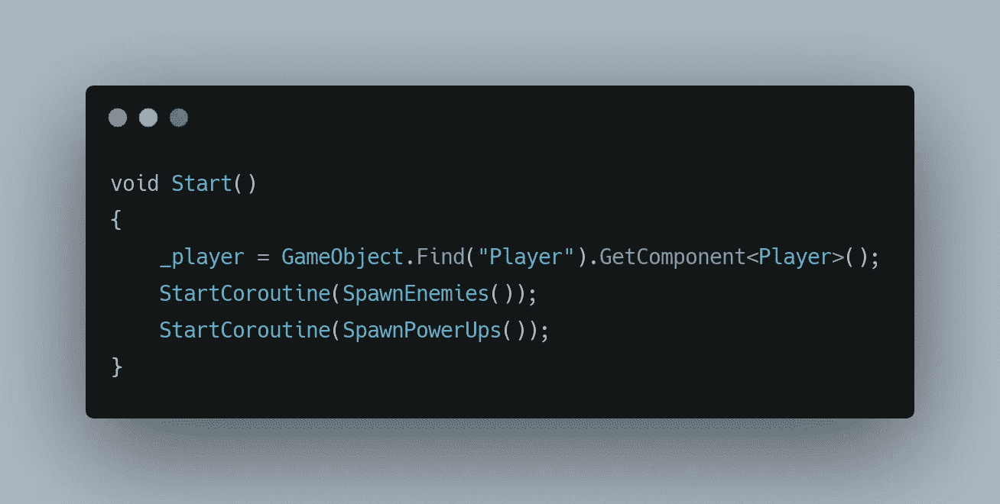

这给了我们以下结果，

