# 用 Altair 创建可展示的数据可视化

> 原文：<https://medium.com/codex/creating-presentable-data-visualization-with-altair-5a3286e697ab?source=collection_archive---------4----------------------->

## [抄本](/)

## 使用地热热流数据的案例研究


由[奥斯汀·法灵顿](https://unsplash.com/@austinfarrington?utm_source=medium&utm_medium=referral)在 [Unsplash](https://unsplash.com?utm_source=medium&utm_medium=referral) 上拍摄

ltair 是一个 python 库，主要关注声明性可视化。这个库有一个足够简洁的语法来执行各种可视化。

Altair 与其他可视化库的一个显著区别是，Altair 具有一行代码属性，不需要很多代码行来显示各种可视化。


**图一。**Altair:Python 中的声明性可视化

在本文中，我们不会详细说明 Altair 的所有用途。相反，我们将探索一些适用于数据集的有趣功能。

# 安装和数据调节

为了获得最佳的可视化体验，请使用 Jupyter 实验室或 Jupyter 笔记本 IDE。牛郎星安装可以用`pip install altair`完成。

本文中使用的数据是皇家霍洛威东南亚研究集团[的东南地热流量汇编数据的一部分](http://searg.rhul.ac.uk/current-research/)。

首先，我们需要导入所需的库，然后检查我们的数据，如下面的代码所示。

```
import altair as alt
import pandas as pddf = pd.read_csv(‘pabum_compile.csv’)print('our data shape is ' + str(df.shape))
df.head()
```

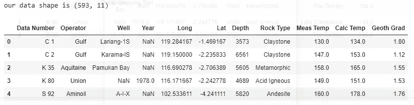

**表 1。**地热热流数据集

我们可以看到我们的数据有 593 行和 11 列。请注意，深度以英尺为单位，测量温度(测量温度)和计算温度(计算温度)以华氏度为单位，地热梯度(地热梯度)以华氏度/ 100 英尺为单位。

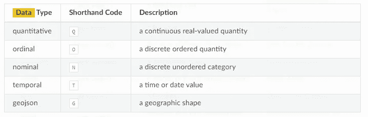

**表 2。** [牛郎星](https://altair-viz.github.io/user_guide/encoding.html?highlight=data%20types)中的数据类型编码

Altair 将数据分为几种数据类型(表 2)。这些数据类型对于以后的可视化很有用，因为每种数据类型都有不同的可视化特征。

# 简单情节

现在让我们用 Altair 可视化一个简单的情节。从表 3 中可以看出，这个库中有许多类型的绘图可供我们选择。然而，在本文中，我们将只使用一个点状图(`mark_tick ()`)、散点图(`mark_point ()`)和条形图(`mark_bar ()`)来可视化我们的数据。

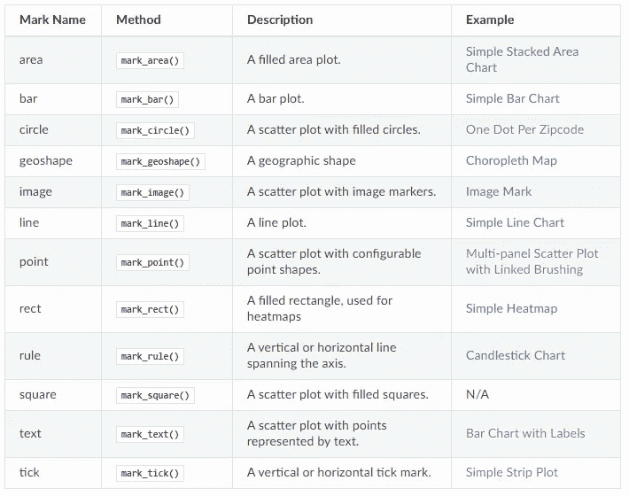

**表 3。** [牛郎星](https://altair-viz.github.io/user_guide/marks.html)中的可视化方法

我们将使用“Meas Temp”参数执行第一个简单的绘图技术( **Tick Plot** )，如以下代码所示。柱状图(**图 2** )是显示数据分布的最简单的可视化技术之一。

```
alt.Chart(df).mark_tick().encode(x = ‘Meas Temp’)
```

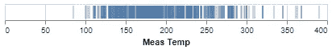

**图二。**刻度图可视化

我们的第二种可视化技术(**散点图**)是用 X 轴上的参数**、**、**、Y 轴上的【计算温度】、**、【地理坡度】作为颜色键**来执行的。**

```
alt.Chart(df).mark_point().encode(x = ’Meas Temp’,y = ’Calc Temp’,color = ‘Geoth Grad:Q’)
```

`Geoth Grad: Q`需要指定将数据定义为定量数据类型，以便可视化将显示颜色条，而不是代表名义/序数数据的圆点/圆圈符号。

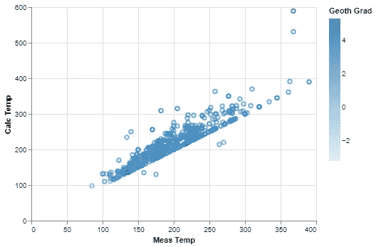

**图三。**散点图可视化

我们最后一个简单绘图的技术(柱状图)是通过可视化"**岩石类型"**参数的`count ()`来完成的，如下面的代码所示。

```
alt.Chart(df).mark_bar().encode(y = ’count()’, x = ’Rock Type’)
```

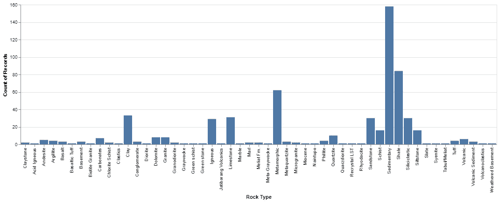

**图 4** 。条形图可视化

可以通过显示颜色键来修改条形图，以使其提供更多信息，如下面的代码所示。

```
alt.Chart(df).mark_bar().encode(y = ’count()’, x = ’Rock Type’, color = ‘Operator’)
```

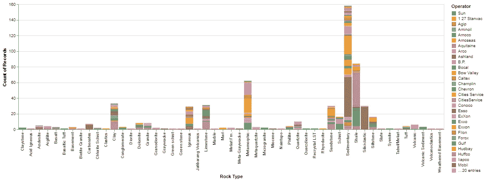

**图 5。**彩色可视化条形图

从这三个简单的绘图示例可以看出，Altair 使用户的可视化变得更加简单，因为它使用了一行代码，并且不需要额外的标记工作。这被称为**声明式可视化。**

# 数据转换

Altair 允许用户执行多种数据转换，如估算数据(`transform_impute ()`)、聚合数据(`transform_aggregate ()`)、过滤数据(`transform_filter ()`)、bin 数据(`transform_bin ()`)等。在本文中，我们将使用`transform_bin ()`转换数据，然后使用`column encoding`技术可视化数据，以显示一个包含 2 个不同支线剧情的剧情。

```
alt.Chart(df).mark_bar().encode(
 alt.X(alt.repeat(“column”), type=’ordinal’),
 alt.Y(‘count()’)
).properties(
 width=400,
 height=200
).repeat(
 column=[‘Meas Temp binned’,’Calc Temp binned’]
).transform_bin(
 ‘Meas Temp binned’, field = ‘Meas Temp’,bin=alt.Bin(maxbins=10)
).transform_bin(
 ‘Calc Temp binned’, field = ‘Calc Temp’,bin=alt.Bin(maxbins=10))
```

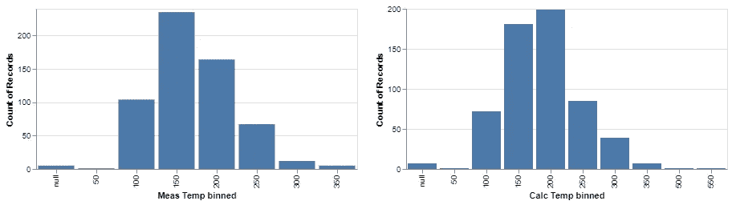

**图六。**带分箱数据可视化的条形图

`transform_bin ()`用于将数据(**“测量温度”和“计算温度”**)划分到指定的区间。该流程旨在呈现更易理解的数据可视化，如图**图 6** 所示。

# 互动情节

交互式剧情是 Altair 的一个显著特点。这个库可以用最少的约束显示各种交互式支线剧情。凭借这一优势，Altair 还可以用于迷你仪表板，以显示/监控日常业务活动。

首先，我们将尝试用两个图例(`alt.Color ()` & `alt.Size ()`)制作一个简单的交互交会图(`.interactive ()`)，如下面的代码所示。

```
alt.Chart(df).mark_point().encode(
 alt.X(‘Long:Q’, title=’Longitude’,scale = alt.Scale(zero=False)),
 alt.Y(‘Lat:Q’, title=’Latitude’,scale = alt.Scale(zero=False)),
 alt.Color(‘Meas Temp’,scale = alt.Scale(scheme=’turbo’)),
 alt.Size(‘Calc Temp’)
).properties(
 width=600,
 height=400
).interactive()
```

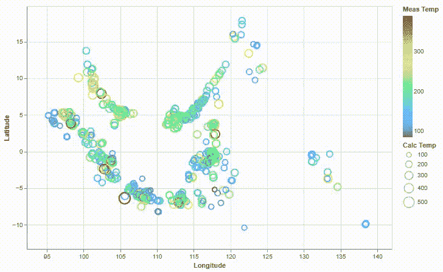

**图 7。**交互式交会图可视化

图 7 显示了一个带有两个图例(颜色键和点大小)的交互式可视化，我们可以在其中自由缩放和拖动。

接下来，我们将通过结合`.repeat ()` 和`.interactive ()`编码来进行交互连接，如下面的代码所示。

```
alt.Chart(df).mark_point().encode(
 alt.X(alt.repeat(“column”), type=’quantitative’),
 alt.Y(alt.repeat(“row”), type=’quantitative’),
 color=alt.Color(‘Year:Q’,scale = alt.Scale(scheme = ‘darkblue’))
).properties(
 width=200,
 height=200
).repeat(
 row=[‘Meas Temp’, ‘Calc Temp’],
 column=[‘Depth’, ‘Geoth Grad’]
).interactive()
```

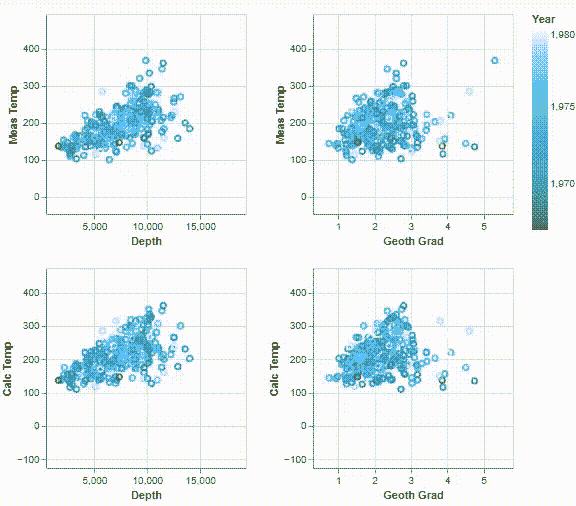

**图 8。**交互式串联图可视化

**图 8** 显示我们可以在所有支线剧情上同时进行交互式可视化(拖动和缩放)。

对于第三个例子，我们将实现一个`brush`技术。这项技术允许我们在子情节中选择某些数据。当这种情况发生时，它将同时选择其他支线剧情中的相同数据。下面的代码还引入了一种编码技术来单独定义 x 轴。

```
#interval for selection
#global for applying in every plot
brush = alt.selection(type=’interval’,resolve = ‘global’)# Need to Specify Depth:Q for making the legend into the color bar
yaxis = alt.Chart(df).mark_point().encode(
 y=’Geoth Grad’,
 color=alt.condition(brush, ‘Depth:Q’, alt.ColorValue(‘lightgray’)),
).add_selection(
 brush
).properties(
 width=300,
 height=300
)#horizontal concatinating (encode separately)
yaxis.encode(x=’Calc Temp’) | yaxis.encode(x=’Meas Temp’)
```

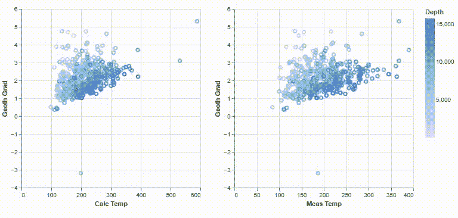

**图 9。**交互式笔刷选择可视化

现在，我们将尝试将图 9 中**所示的`brush`技术与条形图(`mark_bar ()`)相结合，以产生如图 10** 中**所示的信息可视化。**

```
brush = alt.selection(type=’interval’)scat = alt.Chart().mark_point().encode(
 alt.X(‘Long:Q’, title=’Longitude’,scale = alt.Scale(zero=False)),
 alt.Y(‘Lat:Q’, title=’Latitude’,scale = alt.Scale(zero=False)),
 alt.Color(‘Meas Temp’,scale = alt.Scale(scheme=’turbo’)),
 alt.Size(‘Calc Temp’)
).properties(
 width=420,
 height=400
).add_selection(brush)#transform bin: specify the dummy parameter (Depth_binned) in y axis
#transform with alt.Bin using the parameter in the dataframe (Depth)
bars = alt.Chart().mark_bar().encode(
 x=’Depth_binned:O’,
 y=’count()’,
 color=alt.Color(‘Rock Type’,scale = alt.Scale(scheme=’set1'))
).properties(
 height=400
).transform_filter(
 brush
).transform_bin(
 ‘Depth_binned’, field = ‘Depth’,bin=alt.Bin(maxbins=15))alt.hconcat(bars, scat, data=df)
```

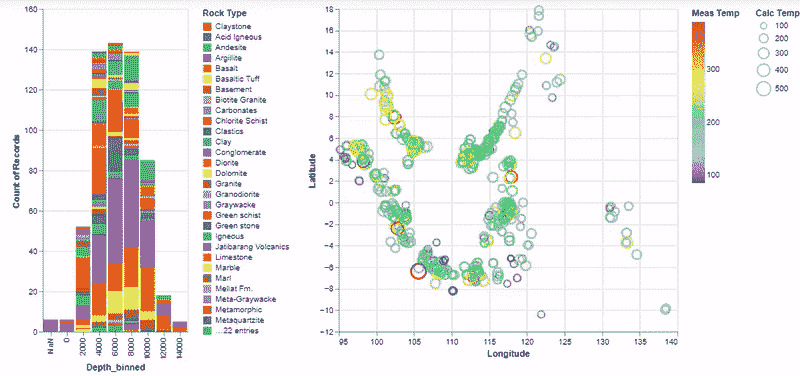

**图十。**带刷子可视化的条形图和交会图

**图 10** 由两个子图组成:**以**“岩石类型”为色键的“深度”条形图**(左)**和经纬度交会图**(右)**。通过利用交会图中的`brush`技术，我们可以轻松检查所需位置的深度或岩石类型特征。

我们还可以将水平连接技术应用于条形图，以产生一个有趣的迷你仪表盘，如图**图 11** 所示。

```
brush = alt.selection(type=’interval’)scat = alt.Chart(df).mark_point().encode(
 alt.X(‘Long:Q’, title=’Longitude’,scale = alt.Scale(zero=False)),
 alt.Y(‘Lat:Q’, title=’Latitude’,scale = alt.Scale(zero=False)),
 alt.Color(‘Meas Temp:Q’,scale = alt.Scale(scheme=’turbo’)),
 alt.Size(‘Calc Temp’)
).properties(
 width=600,
 height=400
).add_selection(brush)bars = alt.Chart(df).mark_bar().encode(
 alt.X(alt.repeat(“column”), type=’ordinal’),
 alt.Y(‘count()’)
).properties(
 width=400,
 height=200
).repeat(
 column=[‘Meas Temp binned’,’Calc Temp binned’]
).transform_bin(
 ‘Meas Temp binned’, field = ‘Meas Temp’,bin=alt.Bin(maxbins=10)
).transform_bin(
 ‘Calc Temp binned’, field = ‘Calc Temp’,bin=alt.Bin(maxbins=10)
).transform_filter(brush)alt.vconcat(scat, bars, data=df)
```

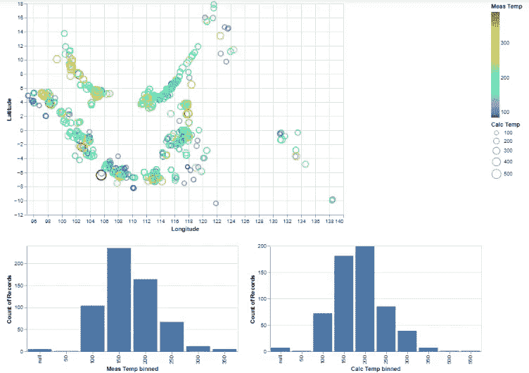

**图 11。**双条形图和交会图，带刷子可视化

我们可以在**图 11** 中看到，3 个不同的子图(**经纬度交会图、实测温度柱状图和计算温度柱状图**)可以同时可视化并相互作用。

可以得出结论，产生如图 10 和图 11 所示的可视化，**只需要 4 个主线代码** : `brush`、`scat`、`bars`和`concat`。这种技术非常简单明了，可以创建一个信息丰富且优雅的可视化效果。这个好处还可以简化我们对数据的分析，尤其是当我们想要构建一个数据可视化仪表板的时候。

# 关闭

尽管如此，这个库还可以探索许多其他的可视化技术。更详细的解释，你可以在这里查看 Altair [的官方文档。编码快乐！](https://altair-viz.github.io/)