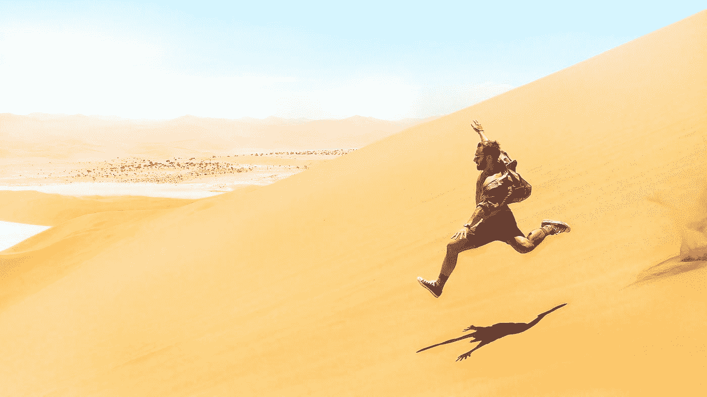

# 🛼在 Unity/C#中创建程序动画

> 原文：<https://medium.com/codex/creating-procedural-animations-in-unity-c-8c5c2394739d?source=collection_archive---------0----------------------->

## 你知道我们实际上可以编码运动吗？:)

由[雷米·雅克因](https://unsplash.com/@jack_1?utm_source=medium&utm_medium=referral)在 [Unsplash](https://unsplash.com?utm_source=medium&utm_medium=referral) 上拍摄的照片

当你在玩视频游戏时，你需要创建很多资源——从 3D 模型到纹理、音乐、故事或动画。有时候，作为一名独立游戏开发者，制作某种类型的内容可能真的不在你的能力范围内。例如，我真的不擅长…