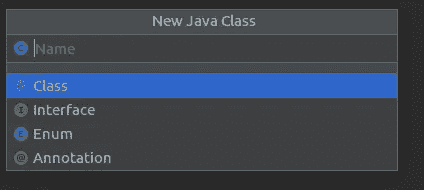

# 使用 Hilt 创建视图模型依赖项

> 原文：<https://medium.com/codex/creating-viewmodel-dependencies-using-hilt-ff8005488910?source=collection_archive---------11----------------------->

在前一篇博客中，我们了解了如何创建网络模块，以及如何使用 Hilt 注入与网络连接相关的依赖项。


[吉米·张](https://unsplash.com/@photohunter?utm_source=medium&utm_medium=referral)在 [Unsplash](https://unsplash.com?utm_source=medium&utm_medium=referral) 上的照片

你可以从这里跳转到以前的博客

 [## 中等

### 在网络模块中使用 Hilt](/@priyansh-kedia/using-hilt-in-the-network-module-6ff8c50027d6)  [## 中等

### 创建网络模块](/@priyansh-kedia/creating-the-network-module-with-hilt-3eefc54b72) 

## ApiClient 接口

```
@JvmSuppressWildcards
interface ApiClient {

    @POST("<Your endpoint here>")
    suspend fun loginUsingCredentials(@Body requestBody: RequestBody): Token

}
```

在上面的代码块中，我们创建了一个简单的接口类和一个从服务器获取身份验证令牌的挂起函数。你可以在这里阅读暂停功能。

接下来，我们将添加一些代码来为我们的视图模型注入依赖项。

## VMFactory

首先，创建一个新类，并将其命名为 VMFactory。

```
@Singleton
class VMFactory @Inject constructor(private val viewModels: MutableMap<Class<out ViewModel>, Provider<ViewModel>>) :
    ViewModelProvider.Factory {

    override fun <T : ViewModel> create(modelClass: Class<T>): T = viewModels[modelClass]?.get() as T
}
```

这只是一个工厂方法，将用于创建我们的 ViewModel 类的实例。您可以看到这个方法有一个可变的 map 和 Provider 作为依赖项。

## VMKey

我们现在创建一个 VMKey 注释。这将是我们唯一一次创建要使用的 java 文件。

```
@MapKey
@Documented
@Target({ElementType.*METHOD*})
@Retention(RetentionPolicy.*RUNTIME*)
public @interface VMKey {
    Class<? extends ViewModel> value();
}
```

在创建新的 java 文件时，一定要记得选择注释。



该注释将用于指定可变映射中的键，即 **VMFactory** 的依赖项。

最后，我们创建了我们的**虚拟机模块**。

## 虚拟机模块

这个模块将包含我们所有的视图模型，并将它们和它们所需的依赖项一起注入。

```
@Module
@InstallIn(ApplicationComponent::class)
abstract class VMModule {

    @Binds
    internal abstract fun bindVMFactory(factory: VMFactory): ViewModelProvider.Factory

    @Binds
    @IntoMap
    @VMKey(AuthViewModel::class)
    abstract fun authViewModel(authViewModel: AuthViewModel): ViewModel

}
```

正如您所看到的，我们在这个模块中添加了我们的 VMFactory，因此它可以用于注入视图模型。

在此之下，我们添加了 AuthViewModel，这只是身份验证包的一个 ViewModel 类。您可以用您的 ViewModel 类替换它。

维奥拉，我们结束了。这就是使用**句柄**注入网络依赖项所需要做的全部工作。

您可以使用一些代码示例来创建 repo 和 ViewModel 类。

**回购类的代码。**

```
class AuthRepo @Inject constructor(private val apiClient: ApiClient) {
// Add code for the repo methods}
```

**虚拟机类的代码**

```
class AuthViewModel @Inject constructor(private val authRepo: AuthRepo): ViewModel() {// Add code for Viewmodel methods
} 
```

最后，这是我们如何在片段或活动中实例化一个 ViewModel 类。

```
private val authViewModel by viewModels<AuthViewModel> **{** vMFactory **}**
```

在上面的代码块中，vMFactory 被注入到 BaseFragment 中，我们是这样做的

```
@Inject
lateinit var viewModelFactory: ViewModelFactory
```

希尔特负责剩下的。

在前三篇博客中，我们了解了如何使用 Hilt 注入我们的网络和视图模型依赖项，这让我们可以使用像 MVVM 这样的定义好的架构获得干净的代码。

**参考文献**

[](https://blog.mindorks.com/android-viewmodels-under-the-hood) [## Android 视图模型:引擎盖下

### 在本文中，我们将讨论作为 Android 架构组件一部分的 ViewModel 的内部结构…

blog.mindorks.com](https://blog.mindorks.com/android-viewmodels-under-the-hood)