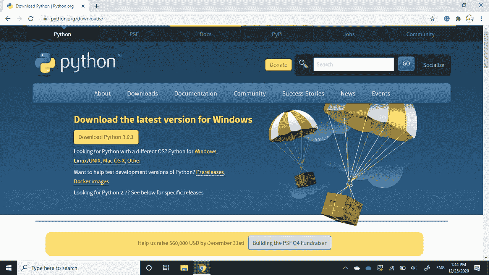

# 用 Python 创建自己的编程语言。

> 原文：<https://medium.com/codex/creating-your-own-programming-language-with-python-895c4b26c704?source=collection_archive---------3----------------------->


Radowan Nakif Rehan 在 [Unsplash](https://unsplash.com?utm_source=medium&utm_medium=referral) 上拍摄的照片

所以你想创建自己的编程语言，却不知道从何下手？下面是我如何为父亲节创造自己的编程语言，名为 [TEN](https://github.com/Aadit-Ambadkar/TEN-Programming-Language) 。

附:你也可以！

要开始，你需要确保你已经安装了 Python。您可能还想将其更新到 Python 3.X。我会推荐 3.9，因为这是本文发布时的最新版本。

要安装 Python，只需进入[www.python.org，](http://www.python.org,)打开导航栏中的下载部分，点击 Python 3.9.5 按钮:



去 Python 的网站(截图过时)

运行安装程序，并遵循弹出的步骤。

现在我们需要安装一些 python 包，这将允许我们把 python 文件转换成 exe 文件。这些步骤取自[这个](https://stackoverflow.com/a/44433442)堆栈溢出答案。

打开一个新的命令提示符窗口，并键入以下命令:

```
pip install cx_Freez
```

然后，键入以下命令:

```
pip install idna
```

这两个库是转换所需要的。将文件复制到。exe 文件。

既然已经解决了这个问题，我们需要开始规划我们的定制语言。为了简单起见，我们将构建一种基于堆栈的编程语言。

基于堆栈的编程语言是一种在堆栈上运行的语言。首先，输入一些值，然后对这些值进行运算。例如，要将两个数字相加，您需要键入以下代码:

```
number1 number2 +
```

`number1`将第一个数字添加到堆栈，然后`number2`将第二个数字添加到堆栈。所以，我们的堆栈现在包含了`number1`和`number2`。然后，通过键入`+`，我们将这两个数字添加到堆栈中。所以，这样做的最终结果是堆栈中`number1+number2`的值。

顾名思义，整个语言运行在一个堆栈上，所以我们需要首先定义一个包含我们的堆栈的变量。为此，从`collections`库导入`deque`(发音为 deck)包:

```
from collections import deque
q = deque()
```

下一步是——好吧，现在你做不了什么，因为你还没有真正考虑过你的语言的语法。真正的下一步是远离 Python，打开一个黑色文本文件。您需要开始创建您的编程语言的语法。

想想你希望它是什么样子。你将如何对数字进行基本运算？你将如何向堆栈中添加项目？你如何定义字符串？

如果你想得够久，你应该至少有 10 个不同的命令，不包括基本的数字运算。否则，你基本上只是在建造一个计算器。

现在你已经想好了语法(相信我，你还没有完全想好，因为你可以打赌语法会随着你开发这种语言的时间而改变)，我们可以开始真正的 python 工作了。

为了清楚起见，让我们称我们将要创建的语言为 CUSTOM。

我们需要打开包含自定义脚本的文件。但是，在我们打开文件之前，我们需要文件名。如果你曾经编译过 python 脚本，你知道你输入的命令是`python <filename>.py`。我们实际做的是将字符串`<filename.py>`传递给 python.exe，然后 python.exe 编译这个文件。Python 实际上允许我们编译带有附加参数的 python 文件:`python <filename>.py arg1 arg2 …`。arg1、arg2、…然后被传递到我们的 python 脚本中，该脚本可以使用这些参数。为了访问这些参数，我们使用`sys.argv`。`sys.argv`是包含每个附加参数的列表。目前，我们将只传入一个参数，即自定义脚本的文件名:

```
from collections import dequefilename = sys.argv[1]
q = deque()
```

然后，我们将文件的所有内容读取到一个名为`contents`的变量中。

```
import sys
from collections import dequefilename = sys.argv[1]
file = open(filename, 'r')
contents = file.read() # Reads the entire file as a single stringq = deque()
```

我假设你的编程语言不会有变量，因为变量访问可能是一个真正的痛苦。您可以查看我的 TEN Github 页面(上面有链接),看看我是如何管理变量赋值和访问的。

现在，几乎所有的变量都完成了。现在我们需要逐个字符地迭代代码。我让我的每个命令都是一个字符，这样我就可以一个字符一个字符地迭代。您可以使用一个字符串标记器，但实际上并不需要。(另外，制作一种模糊的编程语言非常流行)

首先，迭代每个字符的代码:

```
i = 0
while (i < len(contents):
    # Some code here
```

让我们从简单的开始，检查用户是否正在定义一个字符串。假设用户用`“`打开字符串，用`‘`关闭。然后，我们将编写以下内容:

```
if (contents[i] == "\""):
    j = i
    while (contents[j] != "\'"):
        j += 1
    q.appendleft(contents[i+1:j])
    i = j
```

所以像这样的一些基本的东西会让代码变得更好！

下面是一个示例，它只允许用户添加字符串并打印它们。使用与上面相同的字符串定义，并让`;`成为打印堆栈顶部的命令:

```
import sys
from collections import dequefilename = sys.argv[1]
file = open(filename, "r")
contents = file.read()i = 0
while i < len(contents):
    if (contents[i] == "\""):
        j = i
        while (contents[j] != "\'"):
            j += 1
        q.appendleft(contents[i+1:j])
        i = j
    elif (contents[i] == ";"):
        print(q[0])
    i+=1
```

就是这样！剧本写好了！现在，我们只需要把它变成一个 EXE 文件。为此，创建另一个 python 文件，并将其命名为`setup.py`。在该文件中，粘贴以下代码:

```
from cx_Freeze import setup, Executablebase = Noneexecutables = [Executable("CUSTOM.py", base=base)]packages = ["idna"]
options = {
    'build_exe': {
        'packages':packages,
    },
}
setup(
    name = "CUSTOM",
    options = options,
    version = "0.2",
    description = '',
    executables = executables
)
```

不要忘记用 python 文件的名称替换 CUSTOM。就这样跑`setup.py`:

```
python setup.py build
```

就是这样！该文件将保存在构建文件夹中。确保另一个文件夹(lib)和 python3.dll，python3X.dll(X 是你的版本)和实际的 exe 文件在同一个目录下。

现在，用以下内容创建一个文本文件:

```
"Hello World!';
```

使用以下命令运行它:

```
CUSTOM sample.txt
```

还有，“你好，世界！”应该输出！如果你愿意，可以随意在脚本中添加更多内容。如前所述，你可以在我的 GitHub 中看到我的作品样本。