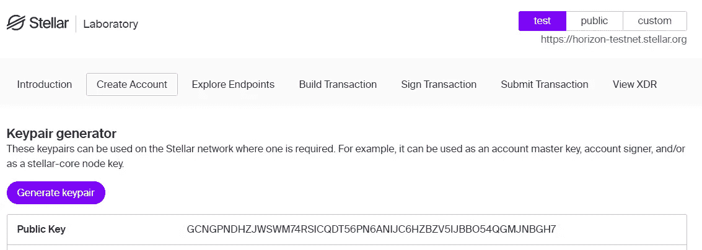
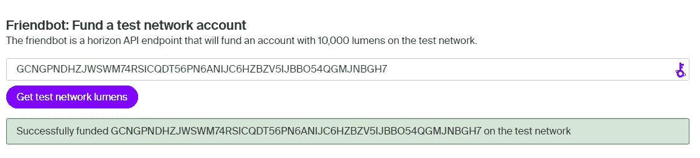
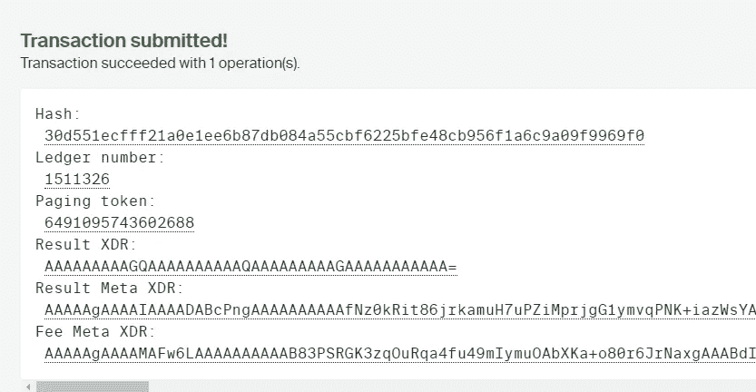
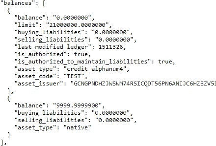

# 在恒星区块链上创建您自己的令牌

> 原文：<https://medium.com/codex/creating-your-own-token-on-the-stellar-blockchain-8ec5cb0d0bb5?source=collection_archive---------12----------------------->

*在领先的金融区块链上创建您自己的代币，无需编写代码。*


杰里米·贝赞格在 [Unsplash](https://unsplash.com/s/photos/tokens?utm_source=unsplash&utm_medium=referral&utm_content=creditCopyText) 上拍摄的照片

恒星(XLM)是一个区块链，开始是一个涟漪(XRP)的分叉。此后，它重新设计了代码，使用恒星共识协议。它的主要目的是促进快速和安全的支付。确认时间在 2-5 秒之间，这是尝试和创建一些项目的完美链条。

这篇文章将是一个关于如何在 XLM 测试网上创建你自己的令牌的教程。

# 创建令牌

要在 Stellar 上发行新代币，您需要使用发行者帐户和经销商帐户。这些帐户相互连接以创建令牌。我们将在下面的段落中检查它。

## 1.创建发卡行账户

第一步是创建一个发卡行账户。你可以去[恒星实验室](https://laboratory.stellar.org/#account-creator?network=test)创建一个密钥对，然后用 testnet 流明快速资助它。一定要选择 testnet，并将您的密钥对保存在安全的地方。

如果您打算将发卡行帐户用于 mainnet 令牌，也请记住，您不应该与任何人共享您的私钥。



生成密钥对



获取 testnet 流明

## 2.创建分销账户

接下来，我们需要创建一个额外的帐户作为分销商。按照与前面相同的步骤创建另一个帐户并为其注资。记得将私有和公共密钥保存在安全的地方。

您可以通过以下 URL 验证您的 testnet 帐户是否有资金

```
[**https://horizon-testnet.stellar.org/accounts/**](https://horizon-testnet.stellar.org/accounts/GB6NZ5ERDCW7HKHLSGU24H53R5TCGKNOHADNOKNPVDZUV6RGWNNMNNJV)**<YOUR_PUBLIC_KEY>**
```

## 3.在发行者和经销商之间建立信任线

为了创建一个信用额度以表明经销商信任发行方，我们可以使用 [Stellar Laboratory](https://laboratory.stellar.org/#txbuilder) 上的交易生成器。这让我们无需编写任何代码就可以创建一个新的令牌。

*   用您的经销商公钥填写`Source Account`字段。
*   点击按钮获取您帐户的下一个序列号。
*   对于我们的简单令牌，我们可以忽略`base fee`、`memo`和`time bounds`字段。
*   将`Operation Type`改为“变信任”。
*   将资产设置为字母数字值之一，并为您的令牌创建一个名称。我将使用“TEST ”,所以我将使用`alphanumeric 4`。
*   输入您的发卡行帐户公钥。
*   信任限制将设置可创建的令牌数量。我会创造 21.000.000 代币。
*   我们可以将`source account`字段留空。
*   点击按钮签署 tx。
*   添加签名者私钥(分发服务器的私钥)
*   点击下面的提交按钮
*   最后，点击下一页的`Submit Transaction`按钮，等待您的交易通过。



交易完成

## 4.锁定发卡行账户

因为我们希望令牌的数量限制在 2100 万，所以我们需要锁定发行者帐户。因此，再次转到**事务构建器**页面。

*   输入发行者帐户公钥。
*   获取下一个序列号。
*   向下滚动并将操作类型设置为“设置选项”。
*   将“主重量”设置为 0。
*   签署交易

你现在完成了！

# 检查代币

我们可以通过以下网址检查我们的代币

```
[https://horizon-testnet.stellar.org/accounts/](https://horizon-testnet.stellar.org/accounts/)**<DISTRIBUTOR_PUBLIC_KEY>**
```

您应该能够在返回的 JSON 对象中的`balances`属性下找到您的余额。



我的分销商帐户余额

如您所见，我们有一个 balance 对象(用花括号表示)的数组(一个列表，用方括号表示)。大的那个是我们的测试令牌，因为它有`TEST`的`asset_code`。小的是我们添加的 testnet 流明。这比我们签署交易后得到的 10.000 流明略低，这笔交易花费了少量流明。

# 结论

虽然我喜欢为创建令牌这样的简单任务提供无代码解决方案，但我也喜欢为开发人员创建一篇文章，以便有更多的控制和更自动化的过程来创建和发布令牌。但那是以后的事了。

非常感谢您的阅读，祝您度过美好的一天。

考虑通过获得中等会员来支持我。它帮了我大忙，不会花你任何额外的费用，而且你可以阅读尽可能多的中等文章！

在 Twitter 和 gm.xyz 上关注我，了解我和我的项目。

检查多边形上的像素比萨饼。