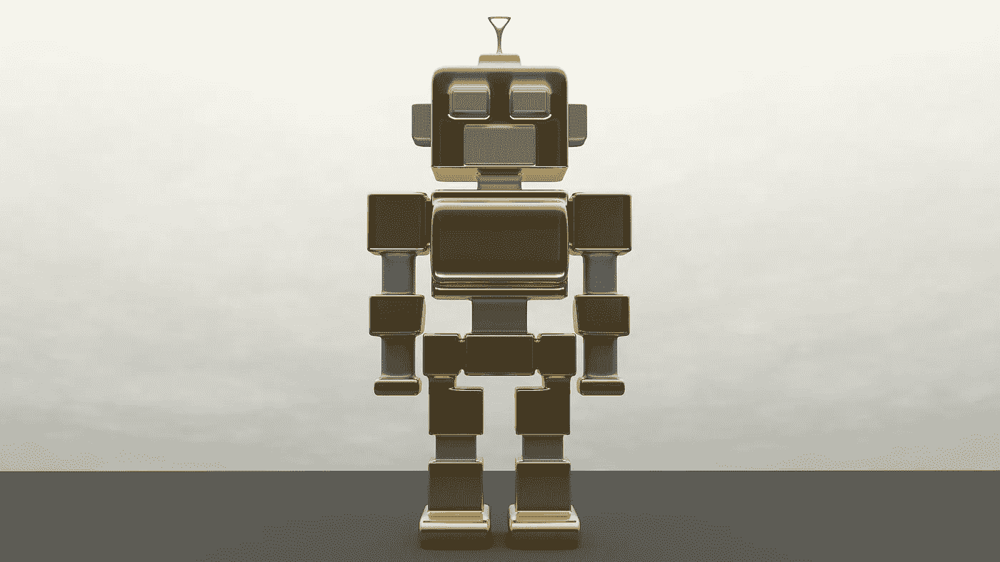

# 创造力是当今经济的一项资产

> 原文：<https://medium.com/codex/creativity-is-an-asset-in-todays-economy-e290cbecb73c?source=collection_archive---------11----------------------->

图片由 Erik_Stein 在 Pixabay 上提供

## 机器人可以做很多事情，但是它们不能画一幅毕加索的画。

每天，似乎都有另一种新奇的科技产品出现。

这些物品本应使我们的生活更加便利，然而它们往往适得其反，导致我们上瘾或消费。