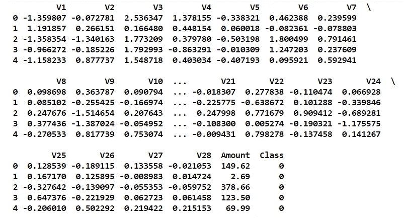
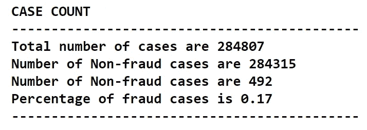
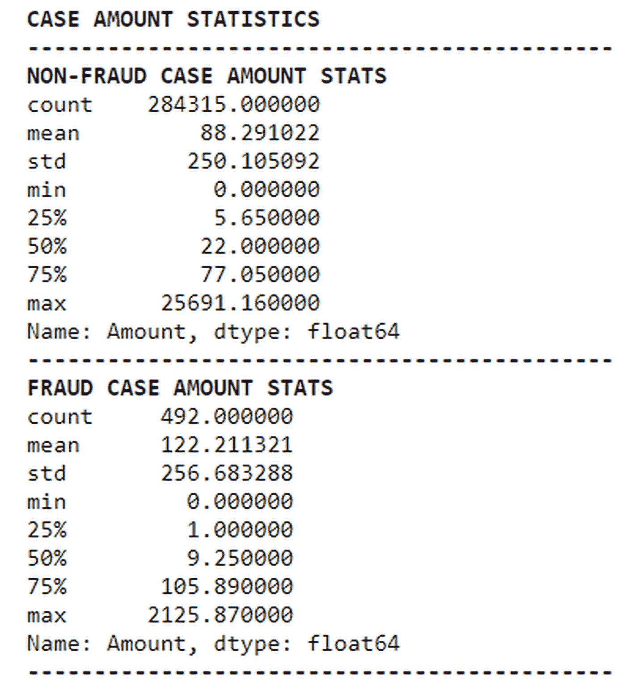
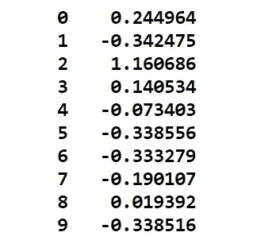
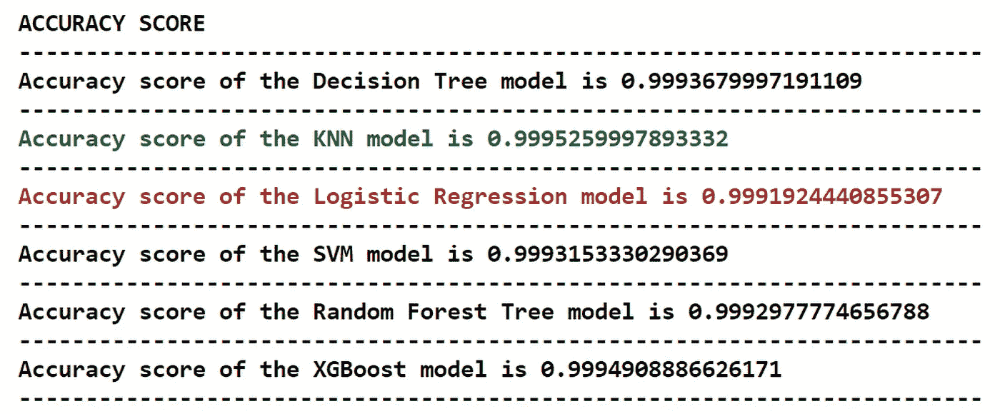
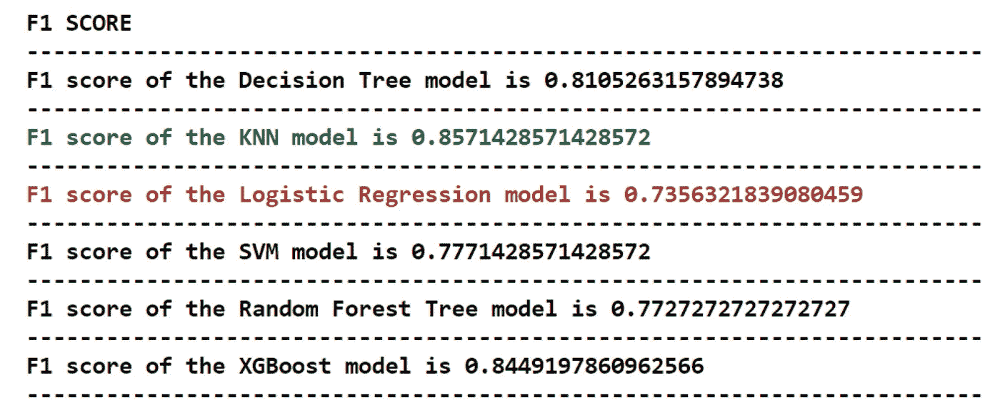
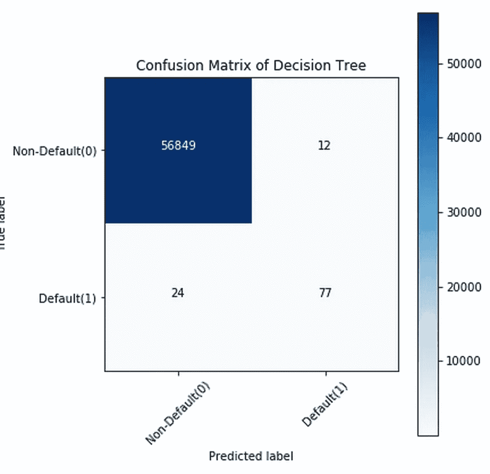
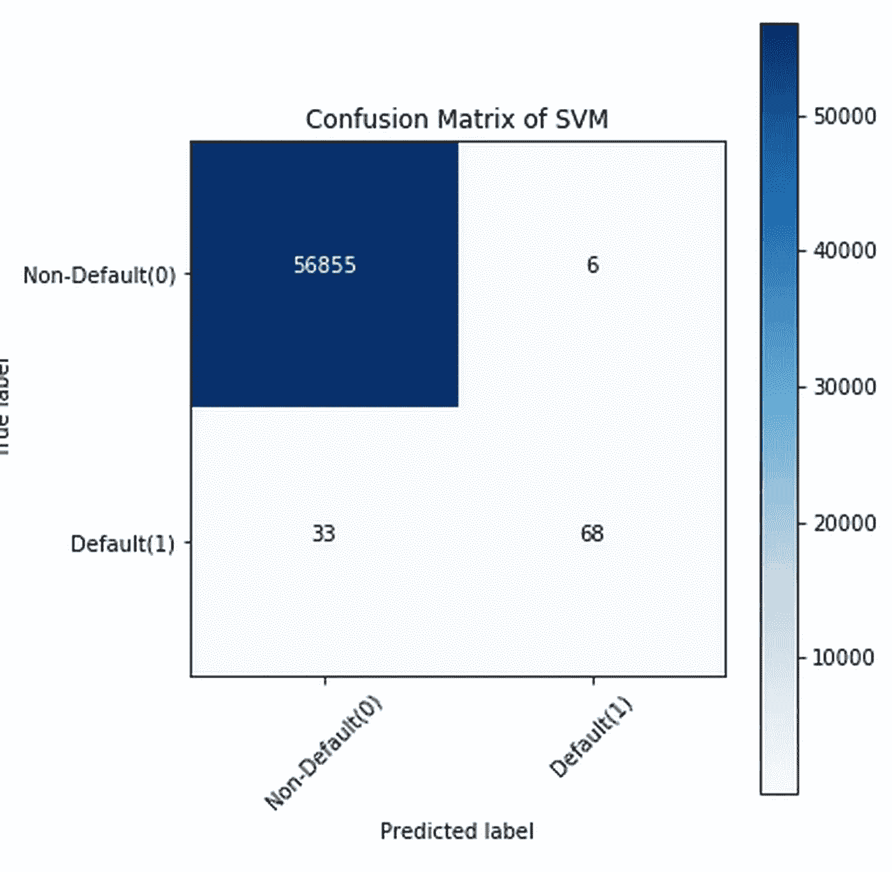
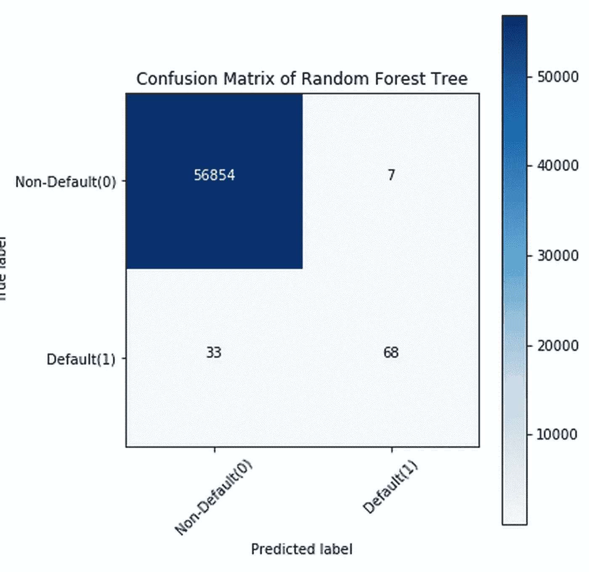

# Python 中基于机器学习的信用卡欺诈检测

> 原文：<https://medium.com/codex/credit-card-fraud-detection-with-machine-learning-in-python-ac7281991d87?source=collection_archive---------0----------------------->

## 药典

## 使用 XGBoost、随机森林、KNN、逻辑回归、SVM 和决策树来解决分类问题

# 情况

假设您受雇于一家信用卡公司，帮助其发现潜在的欺诈案件，从而确保客户不会为他们没有购买的商品付费。给你一个数据集，其中包含人们之间的交易，以及他们是否是欺诈的信息，并要求你区分他们。这就是我们要处理的情况。我们的最终目的是通过建立分类模型来分类和区分欺诈交易，从而解决这种情况。

**为什么分类？分类是预测离散变量(二元、是/否等)的过程。).在这种情况下，部署分类模型比部署任何其他模型都更乐观。**

# 涉及的步骤

1.  将所需的包导入我们的 python 环境。
2.  导入数据
3.  根据我们的需求处理数据并进行探索性数据分析
4.  特征选择和数据分割
5.  建立六种分类模型
6.  使用评估度量来评估所创建的分类模型

我们在这个项目中使用 python，因为使用一堆方法真的很容易，有大量用于机器学习的包，并且很容易学会。最近几天，python 的就业市场比任何其他编程语言都高，像网飞这样的公司正在将 python 用于数据科学和许多其他应用。至此，让我们深入到编码部分。

# 导入包

对于这个项目，我们的主要包是处理数据的 Pandas，处理数组的 NumPy，处理数据分割的 scikit-learn，构建和评估分类模型，最后是 xgboost 分类器模型算法的 xgboost 包。让我们将所有的主包导入到 python 环境中。

**Python 实现:**

# 导入数据

**关于数据:**我们要用的数据是 Kaggle 信用卡欺诈检测数据集([点击这里获取数据集](https://www.kaggle.com/mlg-ulb/creditcardfraud))。它包含 V1 到 V28 的特征，这些特征是通过 PCA 获得的主要成分。我们将忽略时间特征，它对建立模型没有任何用处。剩下的特征是“金额”特征和“类别”特征，前者包含交易的总金额，后者包含交易是否是欺诈案件。

现在，让我们使用“read_csv”方法导入数据，并打印数据，以便在 python 中查看。

**Python 实现:**

输出:

作者图片

在接下来的过程中，我们将进行一些数据处理和探索性数据分析(EDA)。

# 数据处理和 EDA

让我们看看在我们的数据集中有多少欺诈案例和非欺诈案例。除此之外，我们还要计算欺诈案例在所有记录的交易中所占的百分比。用 python 来做吧！

**Python 实现:**

输出:

作者图片

我们可以看到，在 284，807 个样本中，只有 492 个欺诈案例，仅占总样本的 0.17%。因此，我们可以说，我们正在处理的数据是高度不平衡的数据，在建模和评估时需要小心处理。

接下来，我们将使用 python 中的“describe”方法获得欺诈和非欺诈交易金额数据的统计视图。

**Python 实现:**

输出:

作者图片

在查看统计数据时，可以看到与其他变量相比,“数量”变量中的值变化很大。为了减少其大范围的值，我们可以使用 python 中的“StandardScaler”方法对其进行规范化。

**Python 实现:**

输出:

作者图片

# 特征选择和数据分割

在这个过程中，我们要定义自变量(X)和因变量(Y)。使用定义的变量，我们将把数据分成训练集和测试集，进一步用于建模和评估。我们可以使用 python 中的‘train _ test _ split’算法轻松拆分数据。

**Python 实现:**

输出:

作者图片

现在我们已经拥有了构建分类模型所需的所有组件。所以让我们开始吧。

# 建模

在这一步中，我们将构建六种不同类型的分类模型，即决策树、K-最近邻(KNN)、逻辑回归、支持向量机(SVM)、随机森林和 XGBoost。尽管我们可以使用更多的模型，但这些模型是用于解决分类问题的最流行的模型。所有这些模型都可以使用 scikit-learn 软件包提供的算法来构建。仅对于 xgboost 模型，我们将使用 XGBoost 包。让我们用 python 实现这些模型，并记住所使用的算法可能需要时间来实现。

**Python 实现:**

在上面的代码中，我们构建了六种不同类型的分类模型，从决策树模型到 XGBoost 模型。现在让我们分解代码。

从决策树开始，我们使用了“决策树分类器”算法来构建模型。在算法中，我们提到“最大深度”为“4 ”,这意味着我们允许树分裂四次,“标准”为“熵”,它与“最大深度”最相似，但决定何时停止分裂树。最后，我们将预测值拟合并存储到“tree_yhat”变量中。

接下来是 K 近邻(KNN)。我们使用“KNeighborsClassifier”算法构建了模型，并提到“n_neighbors”为“5”。“n_neighbors”的值是随机选择的，但可以通过迭代一系列值来乐观地选择，然后将预测值拟合并存储到“knn_yhat”变量中。

关于逻辑回归的代码没有什么可解释的，因为我们通过使用“Logistic regression”算法以一种更简单的方式保留了模型，并像往常一样，将预测变量拟合并存储在“lr_yhat”变量中。

我们使用“SVC”算法建立了支持向量机模型，我们没有提到算法中的任何内容，因为我们设法使用了默认的内核，即“rbf”内核。之后，我们在拟合模型后将预测值存储到‘SVM _ yhat’中。

下一个模型是我们使用“RandomForestClassifier”算法构建的随机森林模型，我们提到“max_depth”为 4，就像我们构建决策树模型一样。最后，将这些值拟合并存储到“rf_yhat”中。请记住，决策树和随机森林的主要区别在于，决策树使用整个数据集来构建单个模型，而随机森林使用随机选择的要素来构建多个模型。这就是为什么使用随机森林模型而不是决策树的原因。

我们最后的模型是 XGBoost 模型。我们使用 xgboost 包提供的“XGBClassifier”算法来构建模型。我们提到“最大深度”为 4，最后，将预测值拟合并存储到“xgb_yhat”中。

至此，我们已经成功地构建了六种分类模型，并对代码进行了简单的解释。我们的下一步是评估每个模型，并找到最适合我们情况的模型。

# 估价

如前所述，在此过程中，我们将使用 scikit-learn 软件包提供的评估指标来评估我们构建的模型。我们在这个过程中的主要目标是为我们给定的案例找到最佳模型。我们将使用的评估指标是准确性得分指标、f1 得分指标，最后是混淆矩阵。

## 1.准确度分数

准确率是最基本的评价指标之一，被广泛用于评价分类模型。准确性分数的计算方法很简单，就是将模型做出的正确预测数除以模型做出的预测总数(可以乘以 100，将结果转换为百分比)。它通常可以表示为:

**准确度得分=正确预测数/预测总数**

让我们检查我们建立的六个不同分类模型的准确度分数。用 python 来做这件事，我们可以使用 scikit-learn 包提供的‘accuracy _ score’方法。

**Python 实现:**

输出:

作者图片

根据准确性评分评估标准，KNN 模型显示为最准确的模型，而逻辑回归模型显示为最不准确的模型。然而，当我们对每个模型的结果取整时，它显示 0.99 (99%准确)，这是一个非常好的分数。

## 2.F1 分数

F1 分数或 F 分数是用于评估分类模型的最流行的评估度量之一。它可以简单地定义为模型精度和召回率的调和平均值。计算方法是将模型的精度和召回率的乘积除以模型的精度和召回率相加所得的值，最后将结果乘以 2。它可以表示为:

**F1 得分= 2((精度*召回)/(精度+召回))**

使用 scikit-learn 包提供的“f1_score”方法，可以在 python 中轻松计算 F1 分数。

**Python 实现:**

输出:

作者图片

模型的排名几乎与之前的评估指标相似。根据 F1 评分评估标准，KNN 模型再次夺回第一名，逻辑回归模型仍然是最不准确的模型。

## 3.混淆矩阵

通常，混淆矩阵是分类模型的可视化，它显示了与原始模型相比，模型对结果的预测有多好。通常，预测结果存储在一个变量中，然后转换成一个相关表。使用相关表，混淆矩阵以热图的形式绘制。尽管有几个内置的方法来可视化一个混淆矩阵，但为了更好地理解，我们将从头开始定义和可视化它。用 python 来做吧！

**Python 实现:**

输出:

作者提供的图片

**理解混淆矩阵:**我们以 XGBoost 模型的混淆矩阵为例。看第一排。第一行是测试集中实际欺诈值为 0 的交易。可以算出来，其中 56861 的诈骗值为 0。在这 56861 笔非欺诈交易中，分类器正确预测了其中的 56854 笔为 0，7 笔为 1。这意味着，对于 56854 个非欺诈交易，测试集中的实际流失值为 0，而分类器也正确地预测了这些为 0。我们可以说，我们的模型已经很好地对非欺诈交易进行了分类。

让我们看看第二排。看起来有 101 笔交易的欺诈值是 1。分类器正确地预测其中 79 个为 1，22 个错误地为 0。错误预测的值可以被认为是模型的误差。

这样，在比较所有模型的混淆矩阵时，可以看到 K-最近邻模型在将欺诈交易与 XGBoost 模型之后的非欺诈交易进行分类方面表现得非常好。因此，我们可以得出结论，可以用于我们的情况的最合适的模型是 K-最近邻模型，可以忽略的模型是逻辑回归模型。

# 最后的想法！

经过一系列的过程，我们已经成功地建立了六种不同类型的分类模型，从决策树模型到 XGBoost 模型。之后，我们使用评估指标评估了每个模型，并选择了最适合给定情况的模型。你可以为自己感到高兴，因为你已经遇到并成功完成了一个最著名的金融数据科学项目。

在本文中，我们将模型数量限制为 6 个，但是还有更多的模型可以探索。此外，我们已经用 python 构建了可行的模型，但是在每个模型背后有越来越多的数学和统计数据。感谢您阅读本文，如果您忘记了遵循任何编码部分，不要担心，我已经在本文末尾提供了完整的代码。

如果你有兴趣在金融领域应用机器学习，强烈推荐参加在线课程 [**机器学习&金融市场深度学习**](https://quantra.quantinsti.com/learning-track/machine-learning-deep-learning-in-financial-markets/?ref=nikhiladithyan) ，这是由 [**Quantra**](https://www.quantra.quantinsti.com/?ref=nikhiladithyan) (一个用于量化金融的 python 平台)进行的专业化。

## 完整代码: