# 基于支持向量机(SVM)的信用风险评估

> 原文：<https://medium.com/codex/credit-risk-assessment-using-support-vector-machine-svm-88d9ffab94c8?source=collection_archive---------7----------------------->

SVM 是一种广泛用于分类和回归问题的监督机器学习算法。其受欢迎的主要原因是其稳健性(低方差)、处理高维数据的能力(与线性回归相比，SVM 适用于样本数少于预测数的情况)，以及处理非线性数据模式的能力。

简单地说，SVM 包括四个理论基础:

1.  分离超平面。在二维空间中，它是一条直线，将数据点分成两个独立的区域。
2.  最大边缘分离超平面。这相当于找到一条线，使决策边界与其最近的数据点(支持向量)之间的距离最大化，也称为余量。
3.  软利润。实际上，我们遇到的大多数数据集都不能被分离超平面所分离。在这种情况下，SVM 允许一些数据实例位于边缘的错误一侧，甚至通过在公式中引入松弛变量和成本 C 等参数来分离超平面。参数 C 是超参数，我们可以使用它通过 k 重交叉验证(CV)来微调 SVM 模型。
4.  内核函数。SVM 通过特征映射将数据点投射到更高维的空间。这种计算很容易通过核函数来解决。我强烈推荐这篇 Quora 帖子来了解更多关于内核功能的细节。有几个可用的核，但我将侧重于线性核和径向基函数(RBF)核。

在这篇文章中，SVM 被用来区分信用不良和信用良好。根据 [investopedia](https://www.investopedia.com/terms/b/bank-credit.asp) 的说法，银行信贷是个人或企业可以从银行借到的资金总额。数据是从 [UCI 机器学习库](https://archive.ics.uci.edu/ml/datasets/South+German+Credit+%28UPDATE%29)下载的。根据与数据相关联的[论文](http://www1.beuth-hochschule.de/FB_II/reports/Report-2019-004.pdf)，总共有 20 个预测因子和一个响应变量(良好与不良信用风险)。除此之外，作者还建议将错误分类坏风险的成本分配为错误分类好风险成本的五倍。因此，误分类成本将被用作网格搜索中的目标函数，以找到最佳的超参数设置。

在温和地介绍了 SVM 和数据本身之后，让我们开始编码。

# 数据采集和分割

有一个名为‘read _ SouthGermanCredit’的 R 脚本文件。与下载的数据一起出现的“r”。运行 R 中的脚本文件，生成的“dat”数据帧是将用于分析和建模的处理数据。我将“dat”变量保存为。RData '文件，所以我只需要在需要的时候加载 RData 文件。

加载所有需要的包。

```
library(rsample) # stratified sampling
library(cdata) # data wrangling
library(ggplot2) # beautiful plot
library(GGally) # grouped scatter plot matrix
library(magrittr) # pipe
library(dplyr) # data wrangling
library(caret) # data preprocessing and transform
library(e1071) # svm
library(WVPlots) # double density plot and ROC curve
library(knitr) # tidy table
library(sigr) # calculate AUC
```

显示数据的内部结构和统计摘要。然后，通过分层抽样对数据进行拆分。

```
load(“credit.RData”)
str(dat)
summary(dat)
response=’credit_risk’set.seed(10)
split=initial_split(dat,prop=0.8,strata = response)
train=training(split)
test=testing(split)
```

从 str()输出中，我们知道有 14 个名义预测值(没有自然排序)，3 个序数变量(有自然排序)和 3 个连续预测值。

# 数据可视化

由于我们的数据包括分类预测值和连续预测值，我们需要使用不同的图形输出来可视化它们相对于响应变量的分布。

## 连续预测器

```
idx_con=c(“duration”,”amount”,”age”)
# Grouped boxplot. Turn train data from wide to long format
train_con=cbind(train[,idx_con],credit_risk=train[,response])
train_con_long=unpivot_to_blocks(train_con,nameForNewKeyColumn = “variables”,
 nameForNewValueColumn = “values”,
 columnsToTakeFrom = idx_con)ggplot(data=train_con_long, aes(x=credit_risk,y=values)) +
 geom_boxplot(color=”blue”,fill=”blue”,alpha=0.2,notch=TRUE,
 outlier.color=”red”,outlier.fill = “red”,outlier.size = 2) +
 facet_wrap(~variables,ncol=3,scales = “free”)
```

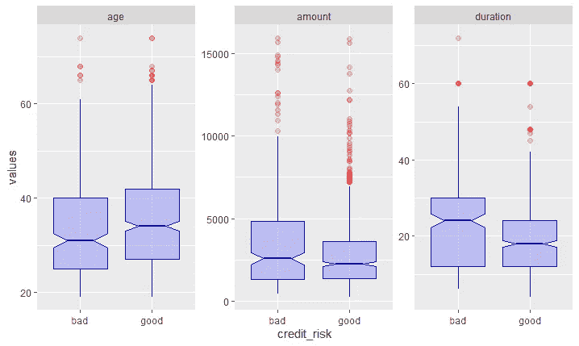

上面的方框图给我们带来了一些深刻的见解:不良信贷一般来自年轻的贷方。持续时间长往往是不良信贷。我们可以得出这些推论，因为“年龄”和“持续时间”面板中的箱线图的凹口不重叠，因此两组(坏信用和好信用)的中位数显著不同。但是，需要注意的是，存在异常值(标记为红圈)。因此，上述关系并不确定。

由于我们有多个连续的预测值，相关矩阵图构建如下。

```
ggpairs(train_con,columns = 1:3, ggplot2::aes(colour=credit_risk))
```

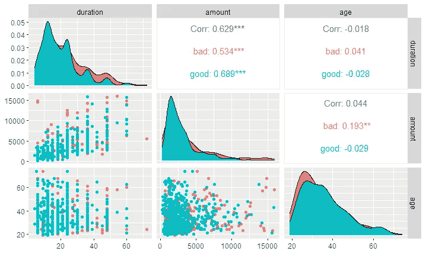

金额和期限变量正相关，这是有意义的，因为需要更多的时间来偿还更高金额的贷款。如密度图和散点图所示，类别没有很好地分开。

## 分类预测

列联表是更好地了解分类变量在类别标签中分布情况的好方法。下面的代码片段显示了如何在 r 中构造列联表。

```
# contigency table (count)
table(train$housing,train$credit_risk)
```

我们可以将列联表形象化，如下所示。

```
# Visualization of two categorical variables: method 1
ggplot(data=train) +
 geom_count(aes(x=housing,y=credit_risk))# method 2
train %>%
 count(credit_history,credit_risk) %>%
 ggplot(aes(x=credit_history,y=credit_risk)) +
 geom_tile(aes(fill=n)) +
 theme(axis.text.x = element_text(angle = 45,hjust=1))
```

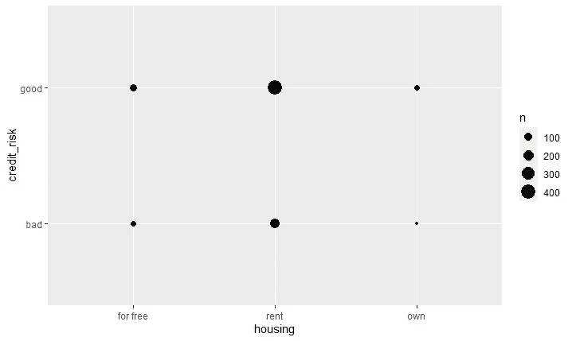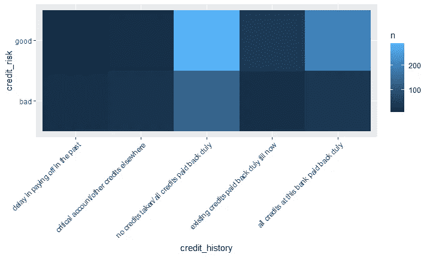

如何确定分类预测因子和反应变量之间的关系？独立性的卡方检验是这种假设检验的稳健统计量。

```
train_cat=train[,!(colnames(train) %in% idx_con)]t=c()
idx=c()
for (i in (1:(ncol(train_cat)-1))) {
 t[i]=chisq.test(train_cat[,i],train$credit_risk)$p.value
 # u[i]=fisher.test(train[,i],train$credit_risk)$p.value
 if (!is.list(tryCatch( { result <- chisq.test(train[,i],train$credit_risk) }
 , warning = function(w) { print(“TRUE”) }))) {
 idx=c(idx,i)
 }
}idx_sig=which(t<=0.05)idx_int=!(idx_sig %in% idx)
colnames(train_cat)[idx_sig[idx_int]]
```

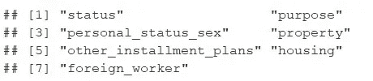

不独立于反应变量的预测因子:信用风险。

如果列联表中某个单元的预期频率小于 5，卡方检验可能会产生不准确的结果。

# 特征工程

SVM 的一个缺点是它不能处理分类特征。因此，必须对分类预测值进行预处理或转换成数值。一键编码应用于名义预测值，而标签编码应用于顺序预测值。连续变量通过最小-最大归一化被标准化为[0，1]。至此，我们应该意识到数据泄漏。为了防止这个问题，数据准备应该只适合于训练数据。下面显示了上述训练数据和拒绝数据转换的代码片段。

```
# Perform one hot encoding for categorical (nominal) predictors.
library(caret)
var_cat=c("status","credit_history","purpose","savings","employment_duration",
          "personal_status_sex","other_debtors","property","other_installment_plans",
          "housing","job","people_liable","telephone","foreign_worker")train_cat=train[,colnames(train) %in% var_cat]
dummy=dummyVars("~.",data=train_cat)
newdata=data.frame(predict(dummy,newdata=train_cat))# label encoding for ordinal variables
# chooses the related variables
var_ord=c("installment_rate","present_residence","number_credits")
train_cont=train[,colnames(train) %in% var_ord]
train_cont=transform(train_cont,installment_rate=as.numeric(installment_rate)-1,
                     present_residence=as.numeric(present_residence)-1,
                     number_credits=as.numeric(number_credits)-1)# Min-max normalization of continuos predictors
var_cont=c("amount","age","duration")
dat_cont=train[,colnames(train) %in% var_cont]
process=preProcess(dat_cont,method = c("range"))
scaled_dat_cont=predict(process,dat_cont)# concatenate all the predictors with response variable by columns
train_new=cbind(newdata,train_cont,
                scaled_dat_cont,credit_risk=train$credit_risk)# test data
# One-hot encoding
test_cat=test[,colnames(test) %in% var_cat]
newdata=data.frame(predict(dummy,newdata=test_cat))# Label encoding
test_cont=test[,colnames(test) %in% var_ord]
test_cont=transform(test_cont,installment_rate=as.numeric(installment_rate)-1,
                    present_residence=as.numeric(present_residence)-1,
                    number_credits=as.numeric(number_credits)-1)
# Min-max normalization
dat_cont=test[,colnames(test) %in% var_cont]
scaled_dat_cont=predict(process,dat_cont)# concatenate by columns
test_new=cbind(newdata,test_cont,
               scaled_dat_cont,credit_risk=test$credit_risk)
```

# SVM 模型的训练与评估

## 线性 SVM

正则化参数 C 是决定 SVM 模型性能的关键。C 的高值意味着分离超平面两侧的小余量，因此不利于可能导致更复杂的决策边界的错误分类。这可能会导致过度拟合问题。

通过网格搜索法可以找到最佳 C 参数。如上所述，两个类别的错误分类成本是不同的。因此，网格搜索的目标函数被设置为误分类成本，而不是分类误差的默认设置。对于成本敏感的分类问题，准确性度量可能会产生误导。线性 SVM 的权重(系数)(它们的符号和绝对幅度)有助于探索特征的重要性和对最终预测输出的贡献。更多详情请见本[换股帖](https://stats.stackexchange.com/questions/39243/how-does-one-interpret-svm-feature-weights)。

```
# Hyper-parameters tuning cost function
cost_matrix=matrix(c(0,1,5,0),ncol=2)
err=function(truth,pred){
  t=table(truth=truth,pred=pred)
  tot_cost=sum(t*cost_matrix)
  tot_cost
}range_exp=seq(-10,10,by=2)
set.seed(200)  # for reproducibility
# linear kernel SVM. No scaling is needed as it had been performed beforehand.
# class weight is set to be inversely proportional to the number of samples in 
# each class
svm_tune=tune(svm,credit_risk~.,data = train_new,kernel='linear', scale=FALSE,
              probability=TRUE, class.weights='inverse',
              ranges = list(cost=c(2^range_exp)),
              tunecontrol = tune.control(cross=5,error.fun = err))
summary(svm_tune)
min_cost=svm_tune$performances$cost[which.min(svm_tune$performances$error)]# Visualization 
svm_tune$performances %>%
  ggplot(aes(x=cost,y=error)) +
  geom_line() +
  scale_x_continuous(name = "cost, C",trans = "log2") + 
  ylab("misclassification cost") +
  geom_vline(xintercept = min_cost,
             color="red",linetype=2)# Extract the best model in term of misclassification cost
svm_lin=svm_tune$best.model
```

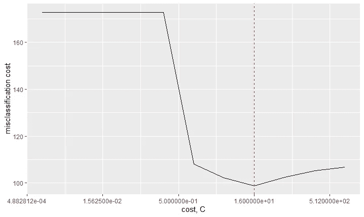

最佳 C 值是 16。

```
coef_lin=data.frame(names=names(coef(svm_lin))[-1],coef=coef(svm_lin)[-1])
coef_lin_10=coef_lin[order(-abs(coef_lin$coef))[1:10],]
rownames(coef_lin_10)=NULL
kable(coef_lin_10)# Visualization of coefficients estimates
ggplot(data=coef_lin_10,aes(x=names,y=coef)) +
  geom_pointrange(aes(ymin=0,ymax=coef)) +
  coord_flip() +theme_classic() + ylab("coefficient estimates")# first column shows the output labels of svm, second column is the # corresponding decision values
data.frame(fitted=svm_lin$fitted[1:10],dv=svm_lin$decision.values[1:10])
```

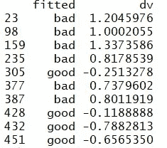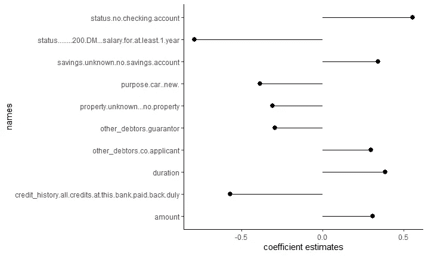

上表告诉我们，正决策值指的是不良信用，反之亦然。因此，从上面的图表中我们可以看出，超过 200 德国马克(德国货币，应该指出，这一数据是在 1973 年至 1975 年收集的)的稳定工资和良好的信用记录有助于良好的信用，因为它们是负面的。另一方面，没有支票账户和持续时间长有助于不良信贷。

## SVM 皇家银行

径向基核函数可以数学表示如下:

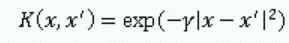

径向基核函数

上式所示的γ，γ定义了单个训练样本的影响范围。因此，C 和γ是需要优化的超参数。我首先从粗网格搜索开始，在找到“更好”的区域后，按照这篇[论文](https://www.csie.ntu.edu.tw/~cjlin/papers/guide/guide.pdf)中的建议进行细网格搜索。代码及其相应的输出可以在 [RPubs](https://rpubs.com/JQ_programmer_92/790849) 中找到。

## SVM 模特表演评估

由于这是一个二分法分类问题，可以绘制双密度图和受试者工作特征(ROC)曲线。计算性能指标，如准确度、误分类成本、精确度、召回率和 f1-measure，以比较线性 SVM 和 RBF SVM。相关代码和性能指标如下所示。

```
pred_svm_lin=predict(svm_lin,newdata=test_new,decision.values = TRUE)
pred_svm_rbf=predict(svm_rbf,newdata = test_new,decision.values = TRUE)
dat_plot=data.frame(outcome=test_new$credit_risk,dv_svm_linear=attr(pred_svm_lin,”decision.values”)[1:nrow(test_new)],
 dv_svm_rbf=attr(pred_svm_rbf,”decision.values”)[1:nrow(test_new)])# double densitiy plot and paired ROC curves
DoubleDensityPlot(dat_plot,xvar=”dv_svm_linear”,truthVar = “outcome”,
 title=”Distribution of linear svm scores (test data)”) +
 geom_vline(xintercept = 0, color=”red”, linetype=2)DoubleDensityPlot(dat_plot,xvar=”dv_svm_rbf”,truthVar = “outcome”,
 title=”Distribution of RBF svm scores (test data)”) +
 geom_vline(xintercept = 0, color=”red”, linetype=2)ROCPlotPair(dat_plot,xvar1=”dv_svm_linear”,xvar2 = “dv_svm_rbf”,truthVar = “outcome”,
 truthTarget = “good”, title=”ROC plots for svm models (test data)”)
```

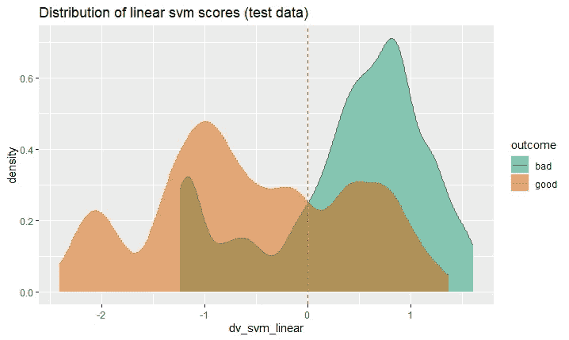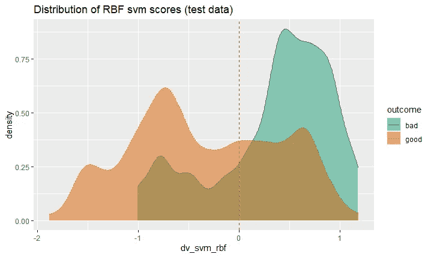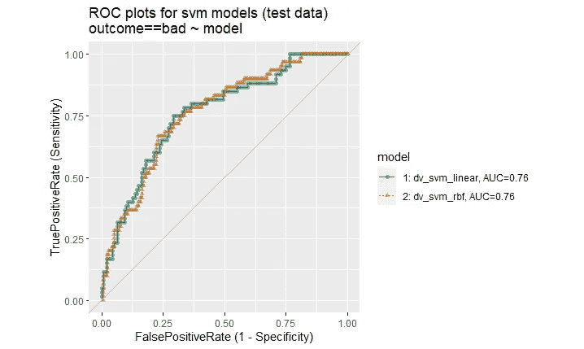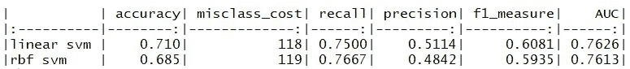

用测试数据评估支持向量机模型的性能。

对于这个问题，回忆(敏感度)将是一个非常重要的性能指标，因为它告诉我们分类器在识别未来未知数据的潜在不良信用方面的能力。线性和径向基函数 SVM 模型表现出大致相似的性能。完整的代码可以在 Github 的 [RPubs](https://rpubs.com/JQ_programmer_92/790849) 和[信用数据目录中找到。](https://github.com/Jacky-lim-data-analyst/programmer.git)

# 参考

格勒普明大学(2019)。南德国信贷数据:修正一个广泛使用的数据集。报告 4/2019，柏林应用科学大学第二系数学、物理和化学报告。