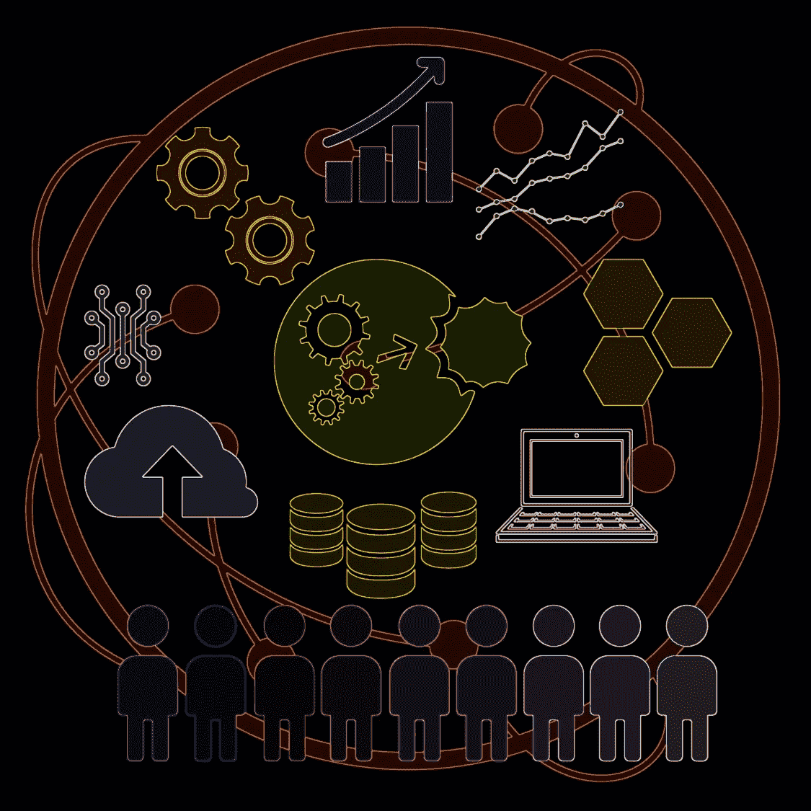

# 关键数据元素和数据质量

> 原文：<https://medium.com/codex/critical-data-elements-and-data-quality-5707bf3ace72?source=collection_archive---------17----------------------->

数字时代(使用 Adobe Spark/Adobe Express 创建的图像)

# 不是所有能数的都算数。

我们目前生活在数字时代，淹没在数据的海洋中。组织拥有大量的数据实体和数据元素，以及与之对应的大量数据，并且他们每天都在积累越来越多的数据。随着大量数据的到来，了解什么是“高质量”的数据，什么不是非常重要。

# 数据实体、元素、维度…

在我们继续之前，让我解释一些与数据库或数据存储相关的数据术语。“数据实体”是我们收集数据的真实世界的对象、概念、事件和现象。“数据元素”是描述数据实体的不同属性。因此，数据实体充当包含描述它的所有数据元素的容器。

考虑一个有许多类型机器的机械车间:CNC、车床、压力机等等。“机器”将是表示位于车间的物理对象的数据实体，并且数据元素可以是机器类型(例如，CNC)、机器 ID、机器名称、机器品牌、机器位置、机器正常运行时间等，其存储不同机器的属性值。

另一个术语是“数据质量维度”这是指定义数据元素质量的特征。参考我们示例中的机器，这将涉及机器数据实体的每个记录中的每个数据元素的有用值的存在，例如数据的及时可用性、数据的准确性、重复值等等。数据质量维度使您能够洞察数据的质量。

# 什么是质量数据？

如果数据适合其预期用途，则被认为是高质量的。换句话说，数据质量可以被定义为对这些数据在给定环境中是否有用的评估。虽然数据质量是一个抽象概念，不能这样衡量，但它有几个维度或方面可以衡量，并被视为数据质量的维度。数据质量维度的一些示例是完整性(即，值是否存在)、唯一性(与实体相关的数据不重复的程度)和准确性(数据值与现实的接近程度)。

在前面提到的 CNC 机床示例中，如果我们的目的是跟踪我们工厂的总设备利用率，那么机床类型、正常运行时间和位置等机床要素将是该用途的必要数据，并且需要准确、完整和无重复。机器的颜色将不是必要的数据。

正常运行时间数据元素的数据质量维度可能是收集数据的频率。如果我们记录一年中一天的机器正常运行时间，那就没什么用了。但是如果我们每天都记录机器的正常运行时间，那将会非常有用，从而获得高质量的数据。

# 数据重要吗？看情况。

确保组织所有数据的质量是一项昂贵且资源密集型的工作。然而，并非所有数据都具有同等的重要性。一些数据元素是关键的，组织必须确保它们是高质量的，并且适合它们的预期用途。另一方面，一些数据元素可能没有任何价值，评估它们的质量是浪费时间、金钱和精力。

例如，许多数据值是出于可疑的原因而被捕获和存储的，例如作为购买的数据模型的一部分，或者从数据迁移项目中保留，但是它们可能不是实现任何业务目标所必需的。评估这些数据的质量是浪费时间和精力。[1]

考虑一个数据分析练习，包括测量公司直接营销活动所需的数据质量。这里需要回答的问题是，执行直接营销活动需要哪些数据？它基本上需要客户联系数据，比如姓名、地址、电子邮件地址等等。应该选择包含客户联系数据的正确数据源和正确的数据元素—包含客户姓名、地址、电子邮件地址的字段。然而，诸如记录评论和职位的字段是客户联系数据的一部分，但是对于执行市场活动的目的没有商业价值，因此不需要考虑。[2]

# 数据对底线的影响

关键数据元素可以定义为支持企业义务或关键业务功能或流程的数据元素，如果数据质量在一个或多个数据质量维度上不达标，将会引起客户不满、带来合规风险或产生直接的财务影响。[2]

客户不满和监管影响会对财务产生不利影响。例如，未能遵守法规可能会导致企业支付罚款。不满的客户可能会将业务转移到别处，造成收入损失。一般来说，财务影响可能包括惩罚成本、机会损失成本、费用增加或收入和利润减少。因此，关于不同数据质量维度的与数据元素、数据元素组或数据实体相关联的成本可以用于确定关键度。[3]

例如，在大多数以客户为中心的组织(如金融服务、电信、公用事业或零售公司)中，不准确的姓名和地址数据元素会导致巨大的邮寄成本。因此，对他们来说，地址数据至关重要。

理解关键数据实体和相关数据元素的一种方法是考虑依赖于数据质量的重要企业义务，并映射数据依赖性，即获取每个义务的信息所需的关键数据实体和相关数据元素。对一项企业义务至关重要的数据元素可能对另一项企业义务并不重要。

例如，零售公司的企业义务可能包括销售报告和消费者行为趋势报告。虽然客户年龄、年收入和职业可能是消费者行为趋势报告的关键数据元素，但它们不是销售报告的关键数据元素。

另一方面，有些数据元素对于大多数企业义务可能是至关重要的。企业义务可能因行业部门或企业类型而异。以下因素可用于确定数据元素的关键程度:
使用数据元素的企业义务数量
与数据元素相关的成本
与数据元素相关的风险
使用数据的部门、团队或用户数量

除此之外，某些数据和信息极其敏感，从数据安全的角度来看，可以归类为关键数据和信息。这种数据和信息的例子是社会安全号、借记卡号、信用卡号、安全 PIN 号、通行码和护照号。有时，单独的数据元素可能不被认为是敏感的，但是当在一组数据元素中时就变得敏感了。个人身份信息就是这种情况的一个例子。[4]

确定关键数据元素并对其进行优先排序，是一个组织开始根据相关数据质量维度(数据质量的可衡量方面)评估其数据质量之前必须执行的首要步骤之一。试图衡量和管理所有数据的质量可能是一项势不可挡的、经济上不可行的工作，注定会失败。因此，当你考虑评估和提高数据质量时，请记住著名物理学家阿尔伯特·爱因斯坦的评论:“不是所有可以计数的都有价值，也不是所有有价值的都可以计数。”

要了解有关数据质量的更多信息，包括如何衡量数据质量维度、实施数据质量管理方法以及在实施数据密集型项目时要考虑的数据质量方面，请阅读 [*《数据质量:维度、衡量、战略、管理和治理*](https://www.amazon.com/Data-Quality-Dimensions-Measurement-Management/dp/0873899776) (ASQ 质量出版社，2019)。这篇文章很大程度上借鉴了那本书的研究成果。

**传记:** *鲁帕·马汉提(Rupa Mahanti)是一名顾问、研究员、演讲家、数据爱好者，* [*多本关于数据*](http://amazon.com/Rupa-Mahanti/e/B07TQG3MHH/ref=dp_byline_cont_book_1) *(数据质量、数据治理、数据分析)书籍的作者。她也是* [*子栈*](http://rupamahanti.substack.com/) *的“数据发布”时事通讯的发行人。*

**参考文献**
1。马汉提，鲁帕。 [*数据质量:维度、度量、战略、管理和治理*。](https://asq.org/quality-press/display-item?item=H1552) ASQ 质量出版社，2019 年，第 526 页。
2。同上
3。马汉提，鲁帕。[“数据概要分析项目选择和实现:关键考虑事项”](https://web.b.ebscohost.com/abstract?direct=true&profile=ehost&scope=site&authtype=crawler&jrnl=15220540&AN=111019569&h=mKmOlClhdifXwlEBwflSvEp4Pa3cvDGrVytk88sY92MwZ0Fp4LVTFGdshFC3N%2bZyUrs0nxhvzpMUWAJTW9g85g%3d%3d&crl=c&resultNs=AdminWebAuth&resultLocal=ErrCrlNotAuth&crlhashurl=login.aspx%3fdirect%3dtrue%26profile%3dehost%26scope%3dsite%26authtype%3dcrawler%26jrnl%3d15220540%26AN%3d111019569) *《软件质量专业》，*第 17 卷第 4 期，第 44–52 页。
4。同上。

注:本文于 2020 年 3 月首次发表于 QualityDigest.com[杂志](https://www.qualitydigest.com/inside/customer-care-article/critical-data-elements-and-data-quality-031020.html)上，另一版本发表于 LightsonData.com[杂志](https://www.lightsondata.com/data-deluge-critical-data-elements-and-their-quality/)上。