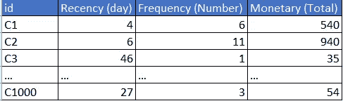
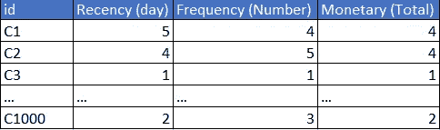
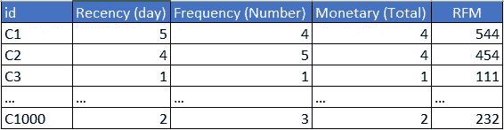
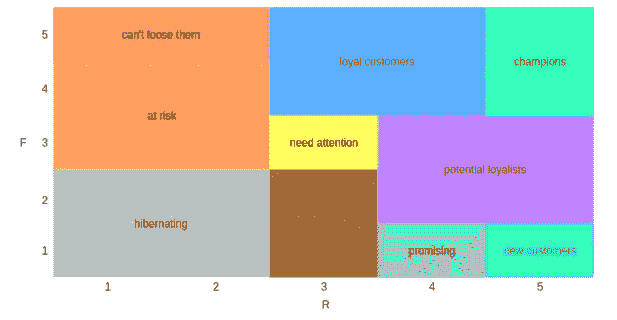

# CRM 分析，RFM 分析

> 原文：<https://medium.com/codex/crm-analytics-rfm-analysis-90aa2ae55fbc?source=collection_archive---------9----------------------->

在学习并完成了一个关于基于规则的分类的[项目后，本周的主题是 CRM 分析。](/@bariscengiz/calculating-potential-customer-return-using-rule-based-classification-152610c4d945)

CRM 意味着客户关系管理。CRM 有三种类型:**协作型、分析型和运营型**。作为一名数据科学家，最重要的方法是——你可以猜到——分析方法。

大多数公司都有庞大而有价值的客户数据库，如果不使用其中的数据，那将是一种耻辱。为了做出更好的商业决策，公司可以使用 RFM 分析和细分他们的客户。为每个客户提供不同的方法太难/不可能了。通过细分，公司可以更有策略地接近客户群。

# RFM 分析

RFM 代表近期，频率，货币。

**最近**:最近一次交易与分析日期之间的时间。

**频率:**交易笔数。

**货币:**交易总价。

RFM 是一种数据驱动的、基于规则的分段技术。

表 1 示例 RFM 表

在表 1 中，我们可以观察客户的 RFM 信息，并尝试对它们进行比较，但是需要对值进行标准化，以对每个客户进行评估和细分。如果不转换这些值，就不可能确定客户的 R、F 和 M 值是否高。例如，C3 的最近时间是 46 天，与 C1 或 C2 相比，这看起来很糟糕，但可能有一些客户的最近时间超过 300 天。这种标准化可以通过在 1-5 的评级系统中对每个指标进行评分来完成。

表 2 RFM 分数

现在我们可以清楚地看到，C3 的最近得分是坏的，因为 1 是最低分。创建评分表后，可以通过多种方式确定每个客户的 RFM 评分，如计算 RFM 值的平均值或使用 RFM 值进行标注。让我们使用标签。

表 3 RFM 标签

仍然可以看出，有太多的 RFM 分数。准确地说，(111，112，…，555) 5 = 125 个值。为此，我们可以使用 2 轴 RF 网格进行分段。

图-1 射频网格

请注意，没有使用 M 分数。这是因为我们的目标是以合理的方式减少组的数量，而货币不是最重要的指标。因为，一个大的购买或许多小的购买可以获得高的货币分数。

很多时候，留住现有客户远比赢得新客户更有效。因此，公司可能会关注高频率和低新近得分的群体，如“不能失去他们”、“处于风险中”。这些客户在某些时候是“冠军”或“忠诚客户”，赢回他们是有益的。注意不同的领域和行业要采取不同的做法。

这个过程应该定期进行，以更新客户的分数，并评估自上次细分过程以来应用于客户的策略的性能。

感谢您的阅读。

bar Cengiz