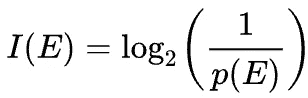
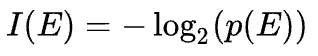
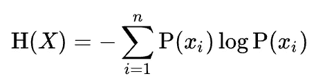
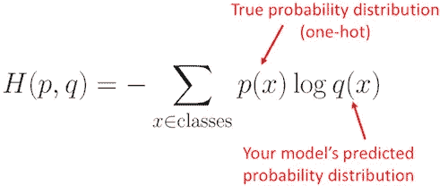
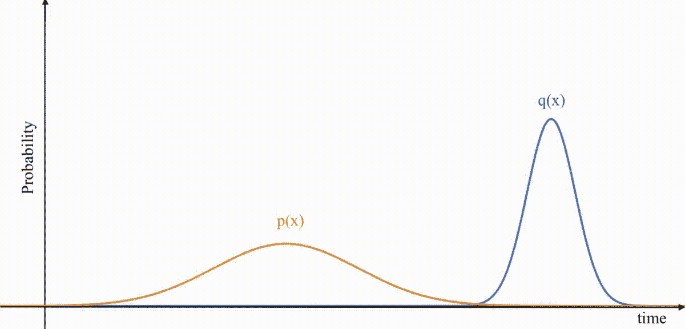

# 交叉熵但不是没有熵和 KL 散度

> 原文：<https://medium.com/codex/cross-entropy-but-not-without-entropy-and-kl-divergence-a8782b41eebe?source=collection_archive---------7----------------------->

在 [Unsplash](https://unsplash.com?utm_source=medium&utm_medium=referral) 上拍摄的 [ThisisEngineering RAEng](https://unsplash.com/@thisisengineering?utm_source=medium&utm_medium=referral)

在处理机器/深度学习问题时，损失/成本函数用于确保模型在训练时变得更好。目标是使损失函数尽可能小。如果损失越小，模型越好。当试图对图像/文本/音频等进行分类时。交叉熵损失是最流行的代价函数。它用于使分类模型更好。在这里，我们将讨论熵、交叉熵、KL 散度，以及它在本文中是如何工作的。

TLDR:交叉熵是特定随机变量或事件集合的两个概率分布之间的差异。

**所需术语:**

1.  概率分布

> 概率分布是概率论和统计学中的一个数学函数，它表示实验中几种可能结果的发生概率。

2.随机变量

> 非正式地说，随机变量的值依赖于随机现象的结果。

3.熵

> 熵是万物变得越来越随机的过程。是无敌的。

在转向交叉熵之前，我们必须知道**熵**的意思:

熵，最简单的形式，是从特定概率分布中选择的单个样本中获得的平均信息量的度量。

让我们考虑一下天气预报系统；如果我们测量沙漠中的天气熵，它将总是接近于 0，因为那里总是阳光明媚。如果没有变化，那么熵将接近于 0，反之亦然。

要计算熵，我们需要一些度量来计算信息量。信息论由 [**克劳德·沙农**](https://en.wikipedia.org/wiki/Claude_Shannon) 解决了这个问题。

***信息内容*** 是一个随机变量发生特定事件的可能性有多大，基于熵的定义，我们需要一个当概率高时(因为没有变化)接近 0，同时当概率低时(因为变化大)接近 1 的函数。我们可以将用于计算从任何事件 E 获得的信息的对数函数视为:

[信息内容](https://en.wikipedia.org/wiki/Information_content)

这相当于:

[信息内容](https://en.wikipedia.org/wiki/Information_content)

回到熵的定义，它是从分布中选择的单个样本获得的平均信息量。上述信息内容公式变为:

[熵](https://en.wikipedia.org/wiki/Entropy_(information_theory))

在熵的情况下，我们总是考虑相同的概率分布(即大部分是真实分布)。但是交叉熵处理的是我们既有预测分布又有真实分布的情况。

*(可以从任何函数或模型等得到预测分布。)*

让我们把真实的概率分布看作 ***p*** ，把预测的概率分布看作 ***q*** *。我们的公式变成交叉熵公式为:*

[交叉熵](https://stackoverflow.com/questions/41990250/what-is-cross-entropy)

使用这里的基本熵定义，交叉熵公式给出了从关于真实分布 **p.** 的预测分布 **q** 获得的平均信息

当预测的和真实的分布接近时，这意味着交叉熵接近于 0。(这就是我们想预测某个东西时想要的，所以它必须接近真值或分布)，否则交叉熵会很高。因此，我们总是试图减少交叉熵，因为它会使真实分布和预测分布接近。

> 如果我们考虑理想情况，其中我们的真实预测分布 p 与真实分布 q 相同，那么交叉熵等于熵。

通常，在现实世界的场景中，分布是不同的，因为真实分布不可能等于预测分布；在这种情况下，交叉熵总是比熵大一些值。交叉熵大于熵的量称为相对熵，或者用数学术语来说，称为 kull back-lei bler 散度(KL 散度)。

所以简单来说:

> ***交叉熵=熵+ KL 散度***

或者说 **KL 散度**由下式给出:

[KL 发散](https://towardsdatascience.com/part-i-a-new-tool-to-your-toolkit-kl-divergence-5b887b5b420e)

> 基本上，KL 散度是从真实分布到预测分布的自然距离。

KL 散度衡量一个概率分布与另一个概率分布的不同程度。它显示了它们之间的距离。更具体地说，它是我们需要从一个分布更新的信息量，以便我们可以从一个分布转移到另一个分布(贝叶斯法则)。

如果我们已经预测概率为 **p** 和真实概率为 **q** ，那么随着时间的推移，我们试图减少 KL 散度，这样它们可能是相似的，

随着时间的推移最小化 KLD

因此，在分类问题中，使用交叉熵总训练样本的和进行优化等价于使用 KL 散度总训练样本的和进行优化；这就是为什么交叉熵是最佳和最常用的成本/损失函数，因为它有助于使预测分布和真实分布更接近。

用于总结:

1.  如果我们有一个概率为 1(近似值)的事件，那么它不会给出任何信息，所以熵将接近于 0。
2.  相反，如果我们有一个概率接近 0(近似值)的事件，任何事情都可能发生，给出大量信息，因此熵相对于 1。
3.  扩展熵概念如果我们想到监督学习(或类似学习)当我们知道真实分布并且我们的模型/函数给出预测分布时，我们可以使用交叉熵来确定我们的预测分布给出了多少关于真实分布的信息。
4.  当预测分布与真实分布具有高相似性时，交叉熵应该接近 0；这就是我们想要的；否则，交叉熵会很高。
5.  我们总是试图减少交叉熵，因为它会使真实的和预测的分布接近，但这之间总是有一个微小的差距。
6.  理想情况下，当预测分布和实际分布相等时，交叉熵和熵将是相同的。
7.  在现实世界中，不可能有相同的分布，交叉熵会高一些；这个量叫做 KL 散度。