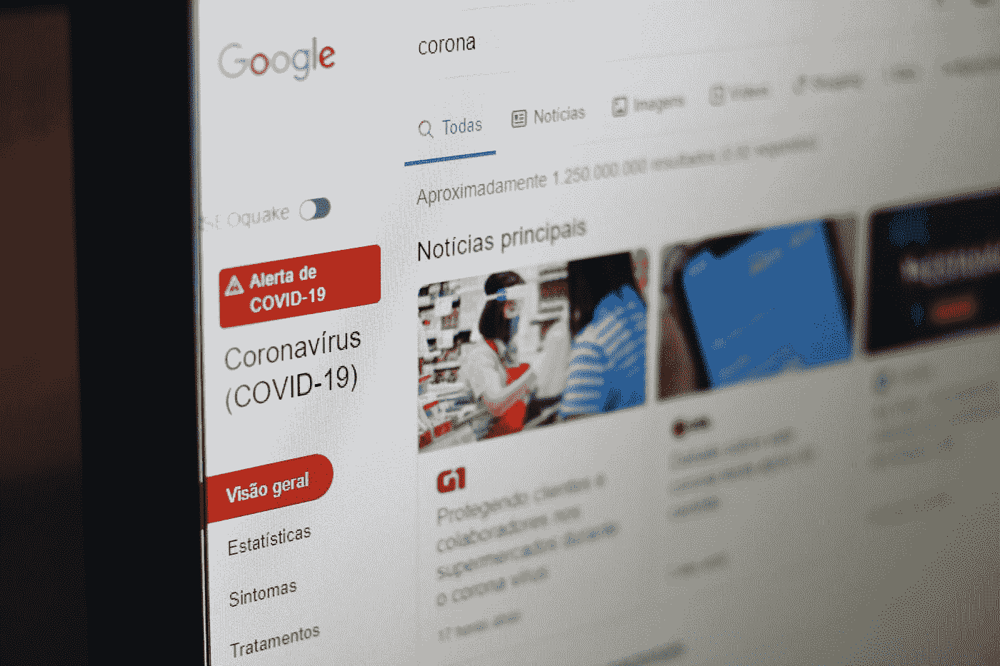

# 用您自己的本地数据湖处理新冠肺炎新闻文章(一步一步)

> 原文：<https://medium.com/codex/crunching-covid-19-news-articles-with-your-own-local-data-lake-step-by-step-d99be6aea25f?source=collection_archive---------0----------------------->

Nathana rebou as 在 [Unsplash](https://unsplash.com?utm_source=medium&utm_medium=referral) 上的照片

## [抄本](http://medium.com/codex)

在本文中，我将展示如何在您的个人计算机上运行数据湖的基本组件，由于采用了 Docker 容器技术([https://www.docker.com/](https://www.docker.com/))，只需付出最少的努力。顺便说一下，如果你还没有安装它，这是一个很好的时机，在这个博客以前的出版物中…