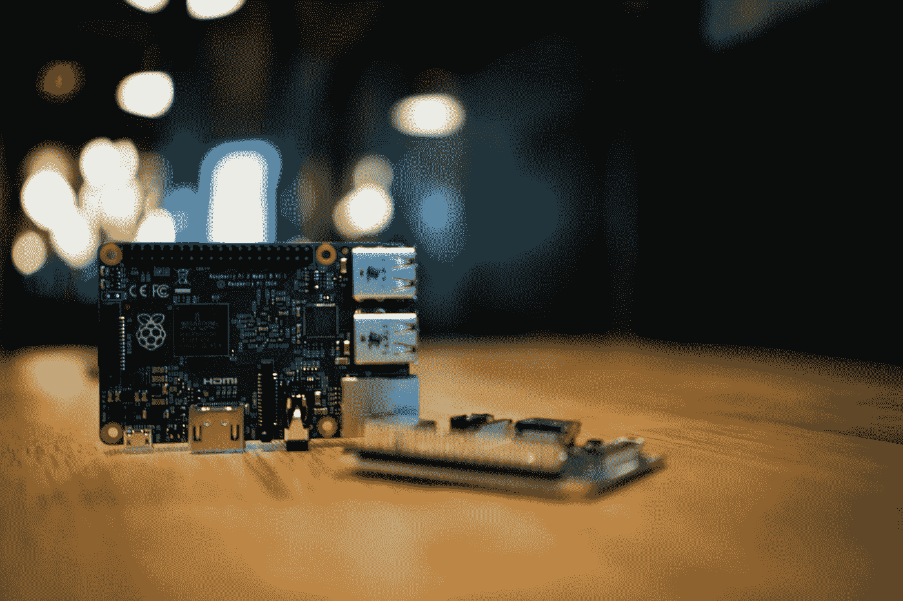

# 树莓派十年

> 原文：<https://medium.com/codex/crunchx-edition-7-b48ac021e2b6?source=collection_archive---------6----------------------->

## 阅读 Raspberry Pi 从 25 美元的电脑到今天的发展历程，以及本周时事通讯中的更多内容

杰夫·劳克斯在 [Unsplash](https://unsplash.com?utm_source=medium&utm_medium=referral) 上的照片

这是 CrunchX 的第七版，这里是我们认为值得花时间的故事和资源。

# 1.技术如何帮助改善全球金融包容性

金融业正经历着业内前所未有的人口统计数据引发的兴趣热潮。这归功于技术创新和区块链的扩散。这篇文章很好地展示了是什么推动了这种兴趣的增长，以及它是否能长期持续下去。由 Carmen Reinicke 撰写关于美国消费者新闻与商业频道的文章，由 [Omar Zahran](https://medium.com/u/74d56154f1f9?source=post_page-----b48ac021e2b6--------------------------------) 编辑选择。点击此处阅读文章:

[https://www . CNBC . com/2022/03/11/how-technology-is-helping-improve-financial-inclusion-around-the-world . html](https://www.cnbc.com/2022/03/11/how-technology-is-helping-improve-financial-inclusion-around-the-world.html)

# 2.Roblox 如何让编程初学者对 Luau 更友好

每个人都知道 Roblox 是一款面向儿童的有趣游戏，但它可能是学习编程的基础？在这篇文章中，证明了这是游戏走向的一个方向。一个边玩边学的伟大机制，有助于装备未来的程序员。由斯塔尔·坎贝尔在《新书库》上撰写，由奥马尔·扎赫兰编辑。点击此处阅读文章:

[https://thenewstack . io/how-roblox-makes-programming-beginner-friendly-with-luau/](https://thenewstack.io/how-roblox-makes-programming-beginner-friendly-with-luau/)

# 3.计算机科学教授用他的中风创造了一个应用程序，帮助幸存者重新学习技能

这是一个温暖人心的故事，讲述了一位教授如何能够将潜在的悲剧转化为积极的事情，他利用他中风的痛苦作为一种手段，建立一个应用程序，帮助中风幸存者重新学习技能。由 Diane Daniel 在 Manisteenews 上撰写，由 Omar Zahran 编辑选择。点击此处阅读文章:

[https://www . manisteenews . com/news/article/Computer-science-professor-used-his-stroke-to-16994435 . PHP](https://www.manisteenews.com/news/article/Computer-science-professor-used-his-stroke-to-16994435.php)

# 4.树莓派的 10 年:25 美元的电脑走过了漫长的道路

树莓派已经 10 岁了。这是一个很好的观察小设备，它彻底改变了计算，以及它将如何继续开拓前进的道路。由西蒙·比森撰写的关于科技共和国的文章，由[奥马尔·扎赫兰](https://medium.com/u/74d56154f1f9?source=post_page-----b48ac021e2b6--------------------------------)编辑选择。点击此处阅读文章:

[https://www . techrepublic . com/article/10-years-of-raspberry-pi-the-25-computer-come-a-long-way/](https://www.techrepublic.com/article/10-years-of-raspberry-pi-the-25-computer-has-come-a-long-way/)

# 5.数据科学和人工智能推动创新以保护环境的 6 种方式

如何利用数据科学和人工智能变得更加环保的 6 个例子。由 Mukesh Kwatra 博士撰写，关于由 [Christianlauer](https://medium.com/u/2696f801a31a?source=post_page-----b48ac021e2b6--------------------------------) 撰写的分析见解和编辑选择。点击此处阅读文章:

[https://www . analyticsinsight . net/6-ways-data-science-and-artificial-intelligence-is-driving-innovation-to-help-the-environment/](https://www.analyticsinsight.net/6-ways-data-science-and-artificial-intelligence-is-driving-innovation-to-help-the-environment/)

# 6.将数据科学扩展到可视化之外

关于如何让视障人士更容易接触和理解数据科学的有趣方法。由 Maria Herd 在《今日马里兰》上撰写，由 Christianlauer 编辑选择。点击此处阅读文章:

[https://today . UMD . edu/expanding-data-science-beyond-visualization](https://today.umd.edu/expanding-data-science-beyond-visualization)

# 7.要尝试的 12 个数据科学项目(从初级到高级)

12 个具体的项目想法，用于处理不同技能水平的数据，从基本的数据探索到真实世界的项目，如假新闻检测、信用卡欺诈检测等等。Sakshi Gupta 在《跳板》上撰写，Christianlauer 编辑选择。点击此处阅读文章:

[https://www .跳板. com/blog/data-science/data-science-projects/](https://www.springboard.com/blog/data-science/data-science-projects/)

# 8.范畴论

本人数学出身，对函数式编程有着浓厚的兴趣，可以强烈推荐 Bartosz Milewski 关于范畴论的这一系列视频。编程的基础知识、一点集合论和概念上的好奇心是必需的——但是你会学到很多关于你听说过但从未完全理解的单词的含义和来源！编辑选择由[斯图尔特伍利博士](https://medium.com/u/a435b5883828?source=post_page-----b48ac021e2b6--------------------------------)。点击此处查看 Bartosz Milewski 关于范畴理论的完整播放列表:

[https://youtu.be/I8LbkfSSR58](https://youtu.be/I8LbkfSSR58)

# 9.用这 15 个资源在 2022 年学习 Haskell

从 Bartosz 的视频中，我还发现了一篇优秀的文章，其中有许多关于学习 Haskell 语言的详细链接和参考资料。如果你没有体验过 Haskell，或者想尝试一种真正的函数式语言，并且暗恋类型，这本书非常值得一读。我预计 Haskell 将继续在业界发展，它的使用将变得更加广泛——至少对于任何真正对计算机科学感兴趣的人来说，熟悉它是值得的。由关于开发天才的 [Serokell](https://medium.com/u/80128fbfb065?source=post_page-----b48ac021e2b6--------------------------------) 撰写，由 Stuart Woolley 博士编辑选择。点击此处阅读文章:

[https://blog . dev genius . io/learn-haskell-in-2022-with-these-15-resources-c 3550 CB 471 a 5](https://blog.devgenius.io/learn-haskell-in-2022-with-these-15-resources-c3550cb471a5)

# 10.IOCC

和所有优秀的软件工程师一样，我喜欢挑战——看到其他人也喜欢挑战也很有趣。您可能会喜欢浏览国际模糊 C 代码竞赛(IOCCC)的档案，并试图破译一些模糊代码是如何工作的。要想了解一些获奖作品，当然需要对这门语言有很深的掌握。它还通过网站的外观和感觉提醒你，有时简单是最好的……斯图尔特·伍利博士的编辑精选。要了解更多关于比赛的信息，请访问以下网站:

https://www.ioccc.org/index.html

# 结束语

这是我们本周的精选。希望你发现了一些新的、鼓舞人心的、惊人的、疯狂的科技新闻。非常感谢您花时间阅读本版 CrunchX。下周请留意下一期。

## 问候，

法典小组