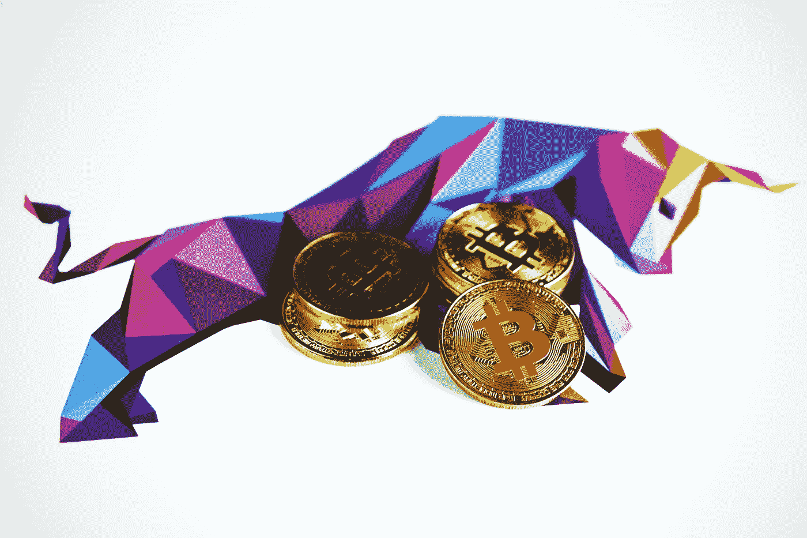

# 加密可以让你变得富有，但也可以让你变得贫穷

> 原文：<https://medium.com/codex/crypto-could-make-you-rich-but-it-could-also-make-you-poor-2b4bb0e5286f?source=collection_archive---------14----------------------->

## 不要跳上炒作的列车。花一点时间教育自己。

[行政长官](https://unsplash.com/@executium?utm_source=unsplash&utm_medium=referral&utm_content=creditCopyText)在[广场](https://unsplash.com/s/photos/crypto?utm_source=unsplash&utm_medium=referral&utm_content=creditCopyText)拍照

投资加密是现在最热门的事情。如果你投资得当，每年 500%的回报是可能的。但是那些回报都是*纯运气*没有技巧。你不应该为了回报而投资加密。*你应该投资它使用的技术*和它可能有的用例。

如今区块链技术并没有*那么*难学。每个骗子都可以毫不费力地在以太网上制造一枚新硬币。这使得加密市场非常不稳定，很容易被骗子利用。

不仅仅是骗子可以利用泵和转储计划。**对冲基金或大公司可以利用他们的客户** **和巨大的头寸**来建立他们自己的加油站和垃圾场。目前，密码市场还相当不规范。 ***牢记在心*** 。

# 拉地毯和退出骗局

如果你是 Reddit 上“加密货币”的常客，你可能听说过这些骗局。它本质上意味着一个创造者将创造一个硬币，炒作它以获得更好的价格，然后出售他们自己的硬币。根据硬币和协议的不同，他们也许可以通过卖出自己的头寸使价格下跌 90%以上。

每天都会在许多新令牌上执行此操作。这些骗局的最大特点就是发现一枚试图从最近围绕其他事物的炒作中获利的硬币。这个时候我们有很多'伊隆'、'食犬'和'月亮'硬币。你认为那是巧合吗？

一些硬币可能会假装它们不是真的。警惕这些硬币，谨慎接近。期待基本的市场原则在密码上发挥作用。需求将推动价格上涨。一个算法最多只能加百分之几。你的收获将来自哪里？代码？**代码不能提供任何真实的货币值**。记住这一点。

Dogecoin 本身是加密货币市场中一种成熟的硬币，但它仍然容易被较大的组织抽取和转储。当你**阅读当前的白皮书**时，你会知道它并没有太多的积极因素。**警惕这些陷阱，尽量降低你的风险**。

# 荒谬的 APYs

我个人还没见过这些，但是听说过。一枚年收益率高得离谱的硬币无疑是一个骗局。**如果好得难以置信，那大概就是**。

用赌注做广告的硬币和代币不是个问题，但是如果它们承诺的东西超过了它们实际能给的，你可能要再考虑一下了。

# 结论

目前，加密市场相当不受监管。这使得它成为骗子赚几个钱的好地方。警惕最常见的骗局。不要试图购买币安和比特币基地等知名经纪商之外的股票，并尽可能阅读任何相关文件。

如果你投资 10 美元，这可能不是一个问题，但如果一条鲸鱼可能步入“ElonMoonRocketMarsBase”(不是真实的)，这可能是对加密市场整体看法的一个真正问题。

非常感谢您的阅读，祝您度过美好的一天。