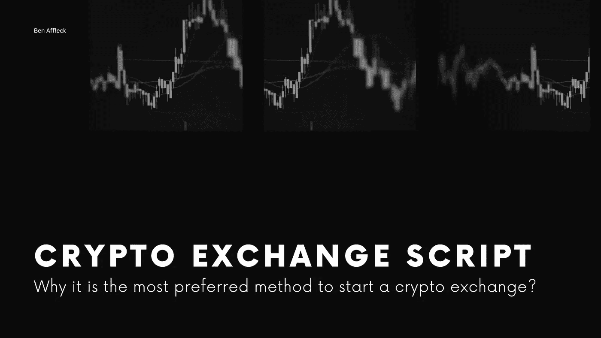

# 加密货币交换脚本—为什么它是首选的加密交换开发方法？

> 原文：<https://medium.com/codex/cryptocurrency-exchange-script-why-it-is-the-preferred-crypto-exchange-development-method-3988054b65b8?source=collection_archive---------22----------------------->

## 想知道为什么加密交换脚本比其他方法更受欢迎吗？

随着加密货币领域新业务的出现，加密货币兑换业务无需介绍。在 2021 年和 2022 年，启动加密货币交易所是最受欢迎的商业模式。作为最受欢迎的商业模式，密码创业者中一直存在这个问题。

**“开展加密货币兑换业务的方法是什么？”**

虽然有许多方法可以推出加密货币兑换业务，但加密创业者一直在遵循这三种也被认为是突出的方法。

1.  从头开始开发加密交换
2.  使用开源代码构建加密交换
3.  从加密货币兑换脚本开始

有了上面提到的三种加密交换开发方法，从加密交换脚本启动你的交换平台是最聪明和最有效的方法。我来详细阐述一下这三种方式。

在博客的最后，你会知道为什么 [**加密货币交易脚本**](https://coinsqueens.com/?utm_source=CESprefererd&utm_medium=medium&utm_campaign=kartz) 是启动你的加密交易平台的最佳方法。

## **1。从头开始开发一个加密交换系统**

*   **复杂程度**
    从头开始开发您的加密交换平台是一个复杂的过程。你需要几个具有技术专长的开发人员来完成加密交换平台。
*   **费用**
    如果你打算从头开始开发你的软件，开发费用会很高。可能在 5 万到 10 万美元左右。
*   **时间管理**
    你需要在你的加密交换平台开发上花费至少 6-12 个月的时间。
*   定制化很难修改或定制你的软件。你需要精通区块链技术的团队才能处理源代码
*   测试版测试
    你只能在开发阶段测试你的软件。
*   如果您打算从头开始开发您的 exchange 平台，那么只有少数功能可用。
*   在你的软件中集成插件是有风险的，而且太贵了。

## 2.从开源代码构建加密交换

*   复杂程度
    如果你对区块链技术非常精通，这没什么大不了的。但是数据很有可能丢失或被窃取。
*   **成本**
    如果你从开源构建你的加密货币兑换脚本，价格是非常高的，而且还集成了很多交易和安全 API。
*   **时间管理**在这种情况下，你无法预测搭建你的交流平台的时间。
*   如果你给你的软件添加一个独特的功能，你需要一个熟练的技术人员来编写你的加密交换脚本。
*   测试版测试需要一个非常熟练的测试团队来测试你的软件。
*   **特性**
    您可以根据业务需求为您的软件添加多种特性，但不能确定是否有效。
*   **附加组件**
    你需要一个高水平的开发人员来将附加组件功能与你的软件集成在一起。

## 3.使用加密货币交换脚本启动加密交换

*   **复杂程度**
    这样，你就可以简单快捷地启动你的加密货币兑换脚本了。因为它是预先开发、设计和测试的软件。
*   **成本**
    这是揭示软件成本的时候了。这是负担得起的 kickstart 你的生意。一个加密交换脚本的成本从 4.9k 美元开始。这可能会根据您的业务需求略有不同，但不会超过传统的加密交换开发成本。
*   **时间管理**
    由于前两种方法比较耗时，加密交换脚本是现成的软件。您可以在短时间内启动您的软件。
*   **定制**
    加密货币兑换脚本是完全可定制的。您可以根据您的业务需求向您的软件添加额外的或独特的功能。
*   **Beta 测试**
    该软件是预先开发的，并在真实环境中经过多次测试。这意味着软件是安全的，没有错误。
*   **功能**
    加密货币兑换脚本以合理的价格提供了所有高级、基本、先进和最新的安全功能。
*   **附加模块**
    一个加密货币兑换脚本是一个现成的软件，所以你可以很容易地集成附加模块，价格适中。

希望大家对加密货币兑换脚本有一个清晰的认识。如果你是一个企业家或商人，你会兴奋地知道更多关于最好的加密交换克隆脚本。

## 谁提供安全和可定制的加密货币交换克隆脚本？

目前的市场只有几家可信的加密交换克隆脚本提供商。找到它们是你需要面对的第一个复杂性。您需要考虑一些突出的因素，如克隆脚本的质量、代码的效率以及加密交换脚本提供者提供的定制选项。以 [**最佳加密交易脚本提供商**](https://coinsqueens.com/?utm_source=preferredmethod&utm_medium=medium&utm_campaign=kartz) 结束将会减轻你的加密交易业务，因为它们涵盖了开始加密交易业务的大部分挑战部分。你所需要做的就是清楚地解释你的密码交易业务的需求。认为任务完成了！