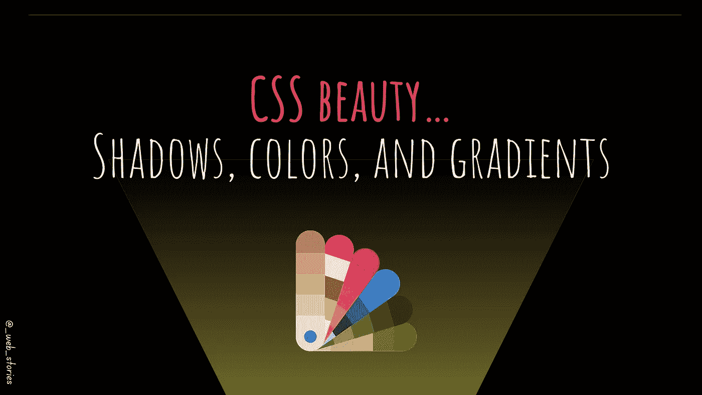

# ✨CSS 美女…

> 原文：<https://medium.com/codex/css-beauty-de40e965c452?source=collection_archive---------10----------------------->

## 阴影、颜色和渐变…是什么让网页变得性感！

作者:FAM

使房子漂亮的是室内设计、颜色、家具、对比、装饰等等。

对于一个网页，它是 CSS 颜色，阴影和渐变。它创造了一个良好和愉快的用户体验，结合了良好的性能和通过它冲浪的实用性。