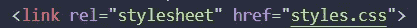

# CSS 盒子模型

> 原文：<https://medium.com/codex/css-box-model-4785e0ef5b64?source=collection_archive---------25----------------------->

边距、填充、边框、内容……如果你对 CSS 有一点点了解，你一定听说过这些术语。今天，我将深入探讨 CSS 盒子模型，并讨论边距、填充、边框和内容。如果你正在学习 CSS 布局，那么盒子模型是你需要学习的第一件事。这不是选择，这是必须。那么，盒子模型到底是什么？简而言之，它几乎是一个包裹了每个 HTML 元素的盒子，但这并不能真正解释太多，不是吗？好吧，让我们看一张我制作的图片来说明我的意思:

这是一个快速的绘图，并不意味着完美。让我们来分解一下:

*   **内容:**这是你的元素的内容。这可以是一张图片，一段文字，一个标题，任何东西。
*   **填充:**这相当于你的内容周围的空间。它介于边界和内容之间。假设您有一个 button 元素，并且边框和内容之间的间距太小，您可以调整填充值。
*   **边框:**顾名思义，它是一个包裹你的填充和内容的边框。我们将举例说明每个属性，这样会清楚得多。
*   **边距:**新人经常把填充和边距混在一起，因为两者都是用来间隔的。这一切都归结于实践，但简而言之，空白是用于你的元素周围的空间。假设你有两张并排的图片，你想让它们相距 x 个像素，你必须调整边距值来把它们分开。一旦我们转向例子，这将会清楚得多。

不过，先说不同类型的箱子。我们有直列式盒子和块状盒子。这些框的行为方式不同，然而，它们之间最大的区别是块框换行，而行内框不换行。块框和内联框之间有更多的区别，但是我不会在这篇文章中涵盖每一个区别。然而，如果您对它们之间的区别感兴趣，MDN Web Docs 的这篇文章[肯定会有所帮助。](https://developer.mozilla.org/en-US/docs/Learn/CSS/Building_blocks/The_box_model)

# 填料

内容非常简单明了，所以我不会浪费你的时间。让我们看看我们可以做什么填充。让我们研究一个非常基本的按钮元素。

在我的浏览器上看起来是这样的:

好吧，我不喜欢我的边框和我的内容之间的间距，这几乎就是“点击我！”让我们创建一个新的 CSS 文件，并将其添加到我们的 HTML 文件。我们也可以使用*内联 css* 或*内部 css* ，但是常见的最佳实践是使用外部 css。我像这样添加我的 CSS 文件:

在这个 CSS 文件中，我所做的只是向按钮元素添加填充，如下所示:

常见的最佳实践是以顺时针方向书写填充值。所以你应该从上到下，从右到下，最后到左。你很快就会明白为什么这很重要。让我们再次检查我们的按钮:

好吧，这不是现存的最漂亮的按钮，但这清楚地说明了填充的作用。它增加了边框和内容之间的间距。你真的需要输入 4 行不同的代码来添加填充吗？不尽然！有一个*填充*速记值。记得我之前说的吗？数值以顺时针方向书写。所以我们假设我想添加 8px 的顶部填充，15px 的右侧填充，5px 的底部填充，最后 10px 的左侧填充。我不得不这样写:

很简单，对吧？但这并没有结束！我们的按钮现在看起来更糟了:

因为我们的优势根本就不存在。看起来很奇怪。如果上下间距相同，左右间距相同，会好看很多，对吧？谢天谢地，我们还有一个更简单的值来表示它！让我们将上下填充设为 10px，左右填充设为 15px。

我们的按钮现在看起来也好多了:

# 边境

对于边框和边距，我们将在两个不同的框上工作。让我们将盒子添加到 HTML 文件中。为了增加我们的盒子，我将使用 [Emmet](https://docs.emmet.io/cheat-sheet/) 。如果你想提高你的 HTML 速度，你绝对应该查一下 Emmet:

其结果是:

好了，是时候做些 CSS 了。

让我们检查一下我们的浏览器。

完美。我们的框之间没有间距，因为现在没有定义的*边距*。我只添加了 2 个框来展示我们的元素，没有任何空白。让我们暂时去掉绿框，我们会把它带回来作为利润。我就简单注释掉。

好吧。让我们也给我们的元素添加一些内容。我将简单地添加一个白色的文本。我还会将文本居中，这样我们至少有一些内容。

我们终于为边境做好了准备。让我们在盒子周围添加一个 10px 的纯黑边框。它会又丑又大，但它会清楚地展示边界是做什么的。

如您所见，它添加了一个边框来包围我们的填充和内容。它没有干扰我们的填充或我们的内容。有不同的边界属性，但边界可以是一篇独立的文章，所以我不会在这方面做太多的描述。相反，我会留给你一些资源。

# 利润

首先，我们需要把绿盒子拿回来，去掉黑框。我还将去掉内容，这样两个框就相似了。让我们开始吧。

完美。现在，这些盒子叠放在一起。因此，我们可以在红色框中添加一个`margin-bottom`，或者在绿色框中添加一个`margin-top`。让我们给红框增加 50px 的下边距。

正如你所看到的，它增加了元素本身的间距，把我们的绿盒子推开了。不过有一点要注意，如果你把`margin-bottom: 50px;`加到红框里，把`margin-top: 50px;`加到绿框里，你会期望总的间距是 100 像素，对吗？好吧，让我们看看会发生什么。

等等，那和以前一样。即使您使用 inspect element，您也会看到红色框的底部边距为 50px，绿色框的顶部边距为 50px，那么这是怎么回事呢？好吧，一旦你给红框 50px 的底部边距，这些元素之间还是有 50px 的边距。这就是所谓的*边缘塌陷*。然而，如果你给绿色方框增加 100 像素的页边距，它又会被推开 50 像素。边距也具有与填充相同的速记属性。你可以简单地做:

这增加了 10px 的上下边距和 50px 的左右边距，如下所示:

# 高度和宽度

如果你手动设置你的元素的高度和宽度，就像我们对盒子所做的那样，你设置的是你的元素的*内容*区域的高度和宽度，而不是整个元素的高度和宽度。不过，您可以很容易地计算出元素的整个高度和宽度。为此，您需要添加内容、边框、边距和填充。让我们来计算下面这个盒子的总高度和总宽度:

好吧，我们从身高开始。200 像素是我们内容的高度，我们有 10 像素的顶部和底部填充，所以总共是 20 像素，我们有 5 像素的顶部和底部边距，所以总共是 10 像素，最后我们有 2 像素的顶部和底部边框，所以总共是 4 像素，总共是 234 像素。这是我们的总高度。对于宽度，你重复同样的过程。200 像素的宽度，40 像素的填充，20 像素的边距和 4px 的边框，所以总共是 264 像素。所以我们的元素总共是 264x234 像素。好的，但是那太多工作了。这正是 CSS 引入另一种 CSS 盒子模型的原因，要使用它，你只需:

现在实际宽度和高度都是 200px。这似乎很有用，不是吗？但是，如果我需要不断地为每个规则集编写`box-sizing: border-box;`，这不是浪费时间和精力吗？不是一遍又一遍地重复同样的代码吗？嗯，你可以继承框大小！

这使您能够对 CSS 文件中的每个元素使用 box-sizing: border-box，除非另有说明。很酷，对吧？这总结了我对 CSS 盒子模型的想法！感谢阅读。

如果你想补充我错过的东西，请在下面留言。下次见。