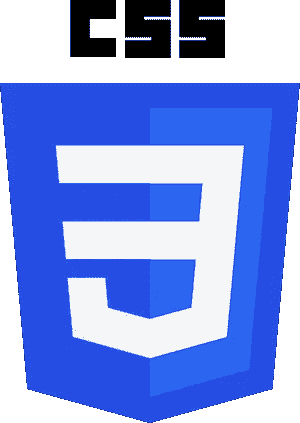

# CSS 状态和伪类

> 原文：<https://medium.com/codex/css-states-pseudo-classes-522fe7b6c454?source=collection_archive---------3----------------------->

## 你知道 CSS 本身已经可以给你的 HTML 页面增加很多活力了吗？

当你作为一名网络开发人员创建一个新的网页时，你最终总是会依赖相同的 T2 编程语言:

*   **HTML** 为结构，骨架
*   **JavaScript** (JS)用于逻辑、动态