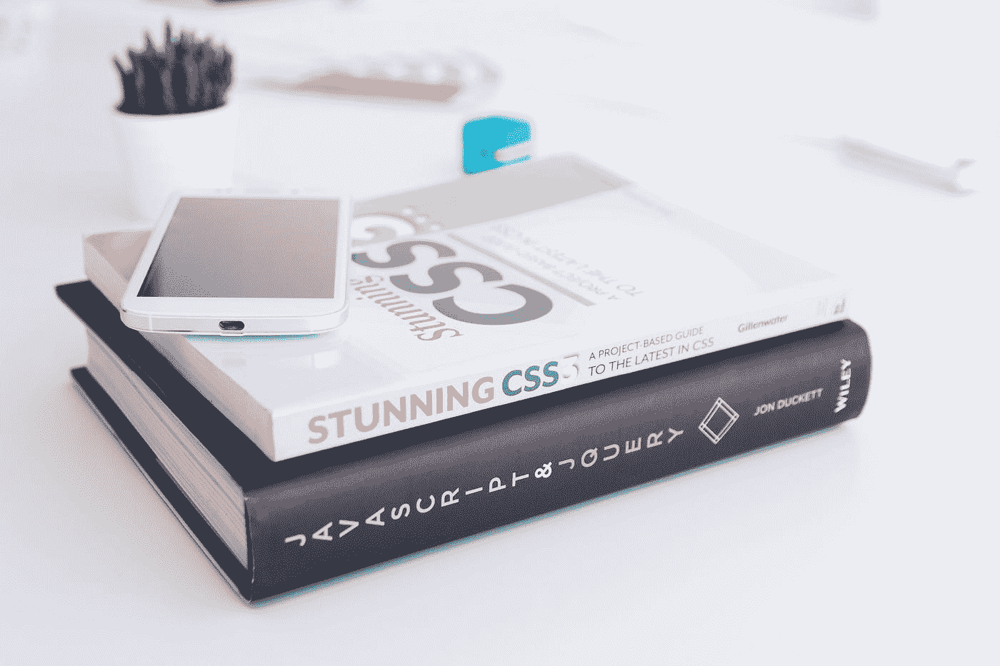

# CSS 变量:旨在让你的生活更简单

> 原文：<https://medium.com/codex/css-variables-designed-to-make-your-life-easier-1a5e676ce0f9?source=collection_archive---------5----------------------->

[KOBU 机构](https://unsplash.com/@kobuagency?utm_source=medium&utm_medium=referral)在 [Unsplash](https://unsplash.com?utm_source=medium&utm_medium=referral) 上拍摄的照片

想象一下这样一个场景，您刚刚为客户开发完一个 web 应用程序，您将它发送出去进行评审。当他们回复时，你会发现他们喜欢这个设计，但更喜欢稍微暗一点的蓝色。听起来很简单，对吧？实际上，这个请求可能会导致您在整个脚本中搜索蓝色的每个实例，并用新的替换它…