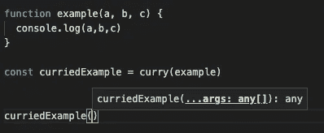

# 打字稿中的油彩

> 原文：<https://medium.com/codex/currying-in-typescript-ca5226c85b85?source=collection_archive---------1----------------------->


安迪嘿的库里照片 [@eastcoastkitchen](https://unsplash.com/@eastcoastkitchen?utm_source=unsplash&utm_medium=referral&utm_content=creditCopyText)

# 什么是 Currying？

Currying 是一种编码技术，它将一个带有一定数量参数的函数转换成一个可链接的函数，允许它的参数分阶段提供。

例如，奉承`fn(1,2,3)`将允许它像`fn(1)(2)(3)`或`fn(1)(2,3)`等一样被调用。

下面是一个 currying 函数的例子:

```
function curry(targetFn, …existingArgs) {
  return function(…args) {
    const totalArgs = […existingArgs, …args]
    if(totalArgs.length >= targetFn.length) {
      return targetFn(…totalArgs)
    }
    return curry(targetFn, …totalArgs)
  }
}
```

注意目标函数的 length 属性的使用。因此，currying 只能处理带有必需参数的函数。当然，这并不是说最后一次调用 curried 函数不能提供可选参数。

这有许多用途，例如日志记录函数或构建器。但是它们的一个问题是，至少对于 JavaScript 来说，生成的 curried 函数可能会丢失参数信息。如下图所示:



普通 JS 自动完成

幸运的是，这是 TypeScript 可以帮助我们的。但是需要一些相当复杂的类型才能实现。

# 场景

对于我们的 curried 函数，在确定其规格时，我们需要考虑两个独立的运动部件:

*   原始函数——它可以有任何参数和任何返回类型，但是我们需要知道它们
*   先前提供的参数——这些参数可以是任意数量的原始函数参数,但只能按照它们被指定的顺序。

我们可以使用上面的方法来确定简化函数的参数类型，即任意数量的原始函数**剩余参数**

然后，我们可以使用上面的所有内容来确定定制函数的**参数和返回类型。**

*   这些参数将是原始函数剩余的必需参数
*   如果先前提供的参数+最新的参数大于或等于原始函数参数的长度，则返回类型将是原始函数的返回类型。
*   否则，返回类型是另一个使用原始函数和所有当前提供的参数的派生函数

**因此，我们需要定义 3 种主要类型。**

# **部分参数类型**

我们需要的第一种类型是给定一个函数，如果所有参数都被认为是可选的，则返回一个表示函数参数的元组。

这对于我们来说应该是一个容易创建的类型，因为我们几乎可以从 TypeScript 提供的现有实用程序类型中构建它。

*   `Partial` —该类型接受所提供类型中的所有键，并使它们可选。
*   `Parameters` —此类型提取表示给定函数参数的元组。

最终结果应该是这样的。

```
type PartialParameters<
  FN extends (…args: any[]) => any
> = Partial<Parameters<FN>>;
```

然而，在某些用例中，TypeScript 有时不会将`Partial<any[]>`的结果视为数组类型，因此我们不能将它与 rest 参数一起使用。问题就谈到这里[https://github.com/microsoft/TypeScript/issues/29919.](https://github.com/microsoft/TypeScript/issues/29919.)

```
function foo<
  F extends (…args: any[]) => any
>(fn: F, …args: Partial<Parameters<F>>) { }
// ERROR: A rest parameter must be of an array type.ts(2370)
```

因此，我们需要以一种将类型的输出保留为元组的方式来重复这个功能。

为此，我们将使用一个实用程序类型，它的工作是遍历给定的元组以找到所有的组合，以及一个包装器类型，它将函数参数提供给这个实用程序类型。

这是我们的实用程序类型，它使用递归和推理来一个接一个地检索元组中所有必需的项，并将它们作为可选值添加到输出类型中，最后将任何现有的可选值添加到输出类型中。

```
type PartialTuple<
  TUPLE extends any[],
  EXTRACTED extends any[] = []
> =
  // If the tuple provided has at least one required value
  TUPLE extends [infer NEXT_PARAM, ...infer REMAINING] ?
    // recurse back in to this type with one less item 
    // in the original tuple, and the latest extracted value
    // added to the extracted list as optional
    PartialTuple<REMAINING, [...EXTRACTED, NEXT_PARAM?]> :
    // else if there are no more values, 
    // return an empty tuple so that too is a valid option
    [...EXTRACTED, ...TUPLE]
```

在这个练习中，推理和递归将是我们最好的朋友。它们允许我们逐个查看所提供的元组的每个部分，直到我们检查完每个必需的参数。

现在我们的`PartialParameters`类型可以使用这个实用程序类型来代替部分类型，结果是一样的，但是不会混淆 TypeScript 是否是数组类型。

```
type PartialParameters<FN extends (…args: any[]) => any> =
  PartialTuple<Parameters<FN>>;// EXAMPLEtype PartialParametersExample = PartialParameters<
  (a: boolean, b: string, c?: number) => any
>
// type PartialParametersExample = [boolean?, string?, number?]
```

# **剩余参数类型**

如前所述，我们需要考虑的另一种类型是用户仍然需要提供的必需参数的子集。因此，如果我们的 curried 函数的用户提供了 3 个参数，总共有 5 个必需的参数，那么该类型应该返回一个包含其余 2 个参数类型的元组。

不幸的是，我们不能只做`Array.slice`，也不能使用所提供参数的长度来提取给定数量的预期参数，但是我们可以用递归来分析元组类型的长度。方法如下:

```
type RemainingParameters<
  PROVIDED extends any[],
  EXPECTED extends any[]
> =
  // if the expected array has any required items…
  EXPECTED extends [infer E1, …infer EX] ?
    // if the provided array has at least one required item,
    // recurse with one item less in each array type
    PROVIDED extends [infer P1, …infer PX] ?
      RemainingParameters<PX, EX> :
    // else the remaining args is unchanged
    EXPECTED :
  // else there are no more arguments
  []
```

本质上，这样做是从两个元组类型的前面删除必需的项，直到其中一个不再有任何必需的项。如果是空的`EXPECTED`元组，则返回一个空元组(不是预期的元组，因为它仍然包含可选值，并且我们永远不会达到拥有空元组的地步)。如果是`PROVIDED`元组，那么返回`EXPECTED`元组中剩余的内容。

同样，这里有一些例子:

```
type RemainingSimple = RemainingParameters<
  [1, 2],
  [number, number, number]
>
// type RemainingSimple = [number]type RemainingOverflow = RemainingParameters<
  [1, 2, 3, 4],
  [number]
>
//type RemainingOverflow = []
```

你们当中有眼力的可能已经注意到，这实际上并没有断言项的类型是相等的，所以一个字符串元组可以与一个数字元组进行比较，这种类型不会在意。幸运的是，我们不需要这样做，因为当我们使用这种类型时，我们的 curried 函数类型的其他部分已经断言了这种类型。

但是，如果我们确实想确定类型是正确的，我们可以这样做。

```
type RemainingParameters<
  PROVIDED extends any[],
  EXPECTED extends any[]
> =
  // if the expected array has any required items…
  EXPECTED extends [infer E1, …infer EX] ?
    // if the provided array has at least one required item
    PROVIDED extends [infer P1, …infer PX] ?
      // if the type is correct, recurse with one item less
      //in each array type
      P1 extends E1 ? RemainingParameters<PX, EX> :
      // else return this as invalid
      never :
    // else the remaining args is unchanged
    EXPECTED :
  // else there are no more arguments
  []
```

如果我们这样做，那么对于递归的每一级，如果提供的参数不是预期类型的有效扩展，类型`never`将被返回。

```
// without the type validation
type RemainingDifferentTypes = RemainingParameters<
  [1],
  [string, string]
>
// type RemainingDifferentTypes = [string]// with the type validation
type RemainingDifferentTypes = RemainingParameters<
  [1],
  [string, string]
>
// type RemainingDifferentTypes = never
```

# **定制函数类型**

好的，这是我们必须做的最后一种类型…或者我应该说是最后两种类型，因为我们需要把逻辑分离出来。我们需要一个类型来定义实际的函数，另一个类型来定义它的返回值。

让我们从主要的函数类型开始:

```
type CurriedFunction<
  PROVIDED extends any[],
  FN extends (…args: any[]) => any
> =
  <NEW_ARGS extends PartialTuple<
    RemainingParameters<PROVIDED, Parameters<FN>>
  >>(…args: NEW_ARGS) =>
    CurriedFunctionOrReturnValue<[…PROVIDED, …NEW_ARGS], FN>
```

这个类型有两个泛型参数，一个表示之前提供的所有参数，另一个表示 curried 函数的类型。

我们在这里也给返回的函数类型一个泛型参数，它是从我们之前提供的泛型类型和我们之前构建的类型构建的。将`PartialTuple`和`RemainingParameters`与前面的参数和函数参数结合起来，允许我们将返回类型参数指定为“任意数量的剩余函数参数”。

使用`NEW_ARGS extends`捕获参数的类型允许 TypeScript 在调用函数时准确地看到提供了哪些参数，而不仅仅是知道它是任何有效的选项。因为我们确切地知道它们是什么，所以我们可以将它们与前面的参数组合起来，并将组合后的元组类型传递给我们接下来将构建的`CurriedFunctionOrReturnValue`类型。

```
type CurriedFunctionOrReturnValue<
  PROVIDED extends any[],
  FN extends (…args: any[]) => any
> =
  RemainingParameters<PROVIDED, Parameters<FN>>
    extends [any, …any[]] ?
    CurriedFunction<PROVIDED, FN> :
    ReturnType<FN>
```

这一个并不太复杂，它使用提供的参数泛型类型来与定制函数的预期参数进行比较。如果发现还剩下任何参数，返回类型就变成另一个`CurriedFunction`，这次是最新提供的参数。但是，如果已经指定了所有的参数，那么它的返回类型就变成了原来的 curried 函数的类型。

# **将所有这些放在一起…**

现在让我们将这些类型应用到我们的 curry 函数中:

```
function curry<
  FN extends (…args: any[]) => any,
  STARTING_ARGS extends PartialParameters<FN>
>(targetFn: FN, …existingArgs: STARTING_ARGS):
  CurriedFunction<STARTING_ARGS, FN>
{
  return function(…args) {
    const totalArgs = [...existingArgs, ...args]
    if(totalArgs.length >= targetFn.length) {
      return targetFn(...totalArgs)
    }
    return curry(targetFn, ...totalArgs as PartialParameters<FN>)
  }
}
```

我们给了它两个泛型类型，第一个是第一个参数中提供的函数的类型，第二个是已经提供的参数的类型。

与上面的泛型类型`NEW_ARGS`一样，我们将这两种类型都指定为泛型类型，这样我们就可以捕获关于它们的更详细的信息。

如果我们简单地放入`(targetFn: (...args: any[]) => any, ...existingArgs: PartialParameters<FN>)`，那么我们将不得不以最通用的格式使用这些类型。我们无法判断参数的类型或函数的返回类型，也无法准确判断前面提供了哪些参数。

通过将函数的返回类型指定为`CurriedFunction`，我们还向编译器提供了关于内部函数的返回类型和参数的信息，这使我们不必重复自己的工作。

打字的唯一问题是我们必须将`totalArgs`转换成`PartialParameters<FN>`。我们知道这是对的，但编译器不知道。我们可以构建另一种类型来帮助编译器。但这不值得努力。

现在剩下的就是尝试一下了:

```
function buildString(a: number, b: string, c: boolean): string {
  return `The ${a.toString(36)} ${b} ${c ? "truth" : "lie"}!`
}const curried = curry(buildString)
// const curried: CurriedFunction<
//   [],
//   (a: number, b: string, c: boolean) => string
// >const invalid = curried("not a number")
// Argument of type 'string' is not assignable
// to parameter of type 'number'.ts(2345)const invalid2 = curried(123)({not: "a string"})
// Argument of type '{ not: string; }' is not assignable
// to parameter of type 'string'.ts(2345)const partway = curried(573566, "is a")
const result = partway(false)
// const result: stringconsole.log(result) 
// Yes, I really did make that outdated a reference
```

就这样了。感谢阅读！希望这对你有所帮助。有时，为了让 TypeScript 能够很好地工作，您必须跨越许多障碍，但是在以前没有验证的地方添加验证的能力非常有用。

你会做什么不同的事吗？留言评论！这是我第一次写这样的指南，所以总是欢迎反馈。