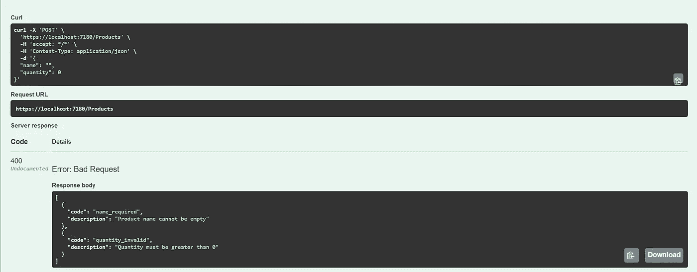
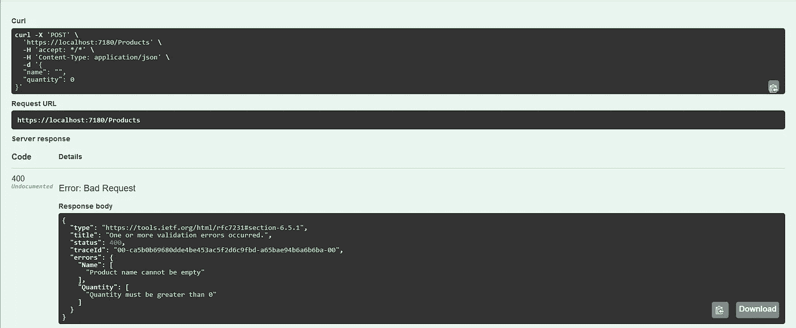
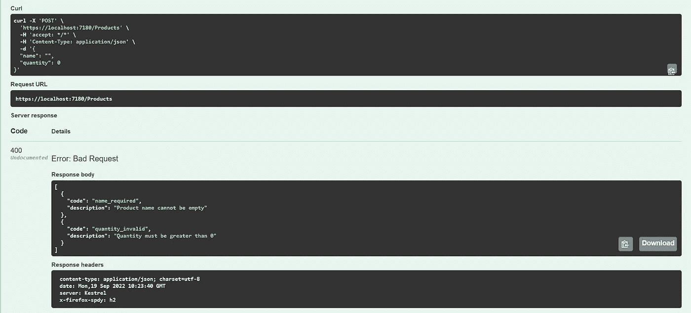

# 使用 ASP.NET 核心 6 Web API 和 FluentValidation 定制错误响应

> 原文：<https://medium.com/codex/custom-error-responses-with-asp-net-core-6-web-api-and-fluentvalidation-888a3b16c80f?source=collection_archive---------1----------------------->

## 如何在 ASP.NET 核心中自动化错误处理


埃里克·麦克林在 [Unsplash](https://unsplash.com?utm_source=medium&utm_medium=referral) 上的照片

假设我们正在创建一个多个客户端应该使用的公共 API，并且我们已经达到了验证传入模型和处理坏请求的程度。我们希望尽可能自动化这一过程。此外，要求为每个错误实现一个唯一的代码，并将其包含在响应中。让我们考虑如何使用 ASP.NET 核心 6 和 FluentValidation 来实现这一点。

# **创建一个 Web API 项目**

首先，让我们在命令行中使用以下三个命令创建一个新的 web 项目解决方案:

```
dotnet new sln --name WebAPICustomErrorResponses
dotnet new web --name WebAPI --framework net6.0
dotnet sln add .\WebAPI\WebAPI.csproj
```

现在让我们转到 WebAPI 项目，并向其中添加 Swagger 和 FluentValidation 包:

```
cd WebAPI
dotnet add package Swashbuckle.AspNetCore --version 6.2.3
dotnet add package FluentValidation.AspNetCore --version 11.1.2
```

转到 *launchSettings.json* 并将下面一行添加到 WebAPI 和 IIS Express 配置文件中:

```
"launchUrl": "swagger"
```

并使 *Program.cs* 看起来这样:

程序. cs

# 实现端点

在我们的演示应用程序中，我们将实现一个简单的 API 来创建和获取产品。产品模型看起来是这样的:

产品. cs

具有 GET 和 POST 方法的控制器如下所示:

ProductsController.cs

我们不会花太多时间为我们的产品建立一个数据库或另一个存储，因为这不是本文要讨论的，所以让我们只使用 *Products* 静态字段并将我们的项目存储在那里(第 9 行)。

要将控制器添加到 ASP.NET 核心，让我们修改 *Program.cs* 这种方式(第 6 行和第 15 行):

程序. cs

# **验证请求**

现在，我们已经到了需要在将产品添加到存储之前对其进行验证的时候了。如前所述，要求每个错误都有一个唯一的代码。因此，让我们定义以下误差模型:

Error.cs

接下来，让我们创建 *ProductValidator* 类，并向*产品*模型添加一些验证规则:

ProductValidator.cs

为了让它工作，我们还需要向服务提供者注册 *ProductValidator* ，所以在您的 *Program.cs 中添加下面一行代码:*

程序. cs

让我们将验证器注入控制器:

ProductsController.cs

为了测试这一点，让我们尝试创建一个名称和数量为空的产品:



API 错误响应

所以现在我们不能创建一个带有无效字段的新产品，错误模型也符合要求，但是我们如何改进我们的代码来进一步扩展呢？

# **自动验证**

手动验证效果很好，但是如果我们不想在每个需要验证的端点中编写相同的代码呢？幸运的是，FluentValidation 给了我们这个机会。首先，我们这样修改 *Program.cs* :

程序. cs

我们移除了 *ProductValidator* 注册，并代之以来自我们程序集的所有验证器的自动注册(第 10–13 行)。因为这几行代码，我们不再需要在 *Program.cs.* 中注册验证器

此外，我们不需要在我们的端点编写错误处理代码，ASP.NET 会为我们做这些。因此，让我们将 *ProductsController* 回滚到以下状态:

ProductsController.cs

让我们来看看:



API 错误响应

验证仍然有效，但是请等待！错误模型改变了，这背后的原因是 ASP.NET 使用它的 [*ModelState*](https://learn.microsoft.com/en-us/aspnet/core/mvc/models/validation?view=aspnetcore-6.0) 来处理所有无效请求。

为了克服这种行为，我们需要求助于没有被很好地记录的方法。

首先，我们需要实现一个拦截器，并将错误代码和消息一起传递给 ModelState。拦截器可能是这样的:

usecustomerrormodelinterceptor . cs

事实是，我们不能在这样的拦截器中覆盖 ModelState 结构。但是我们可以将错误序列化到适当的模型中，并将其作为字符串向前传递。

您可能认为如果我们在拦截器中序列化我们的错误，我们也需要在其他地方反序列化它们…您是对的！

让我们转到 *Program.cs* 并对其进行如下修改:

程序. cs

第 13–23 行是这里的关键，我们正在反序列化来自拦截器的错误，并更改错误响应的默认结构以适应我们的*错误*模型。

另外，不要忘记向服务提供者注册拦截器(第 29 行)。

让我们再次调用我们的端点:



API 错误响应

我们得到了预期的结果！可能是这样…但是让我们稍微改进和重构我们的程序。

# **重构**

为了使编写新验证器的过程更加方便，让我们创建一个小的扩展方法:

ValidatorExtensions.cs

这个方法的用法是这样的:

ProductValidator.cs

# **结论**

好吧，就这样。感谢阅读！你可以在我的 [GitHub](https://github.com/BohdanTron/WebAPICustomErrorResponses) 上找到源代码。