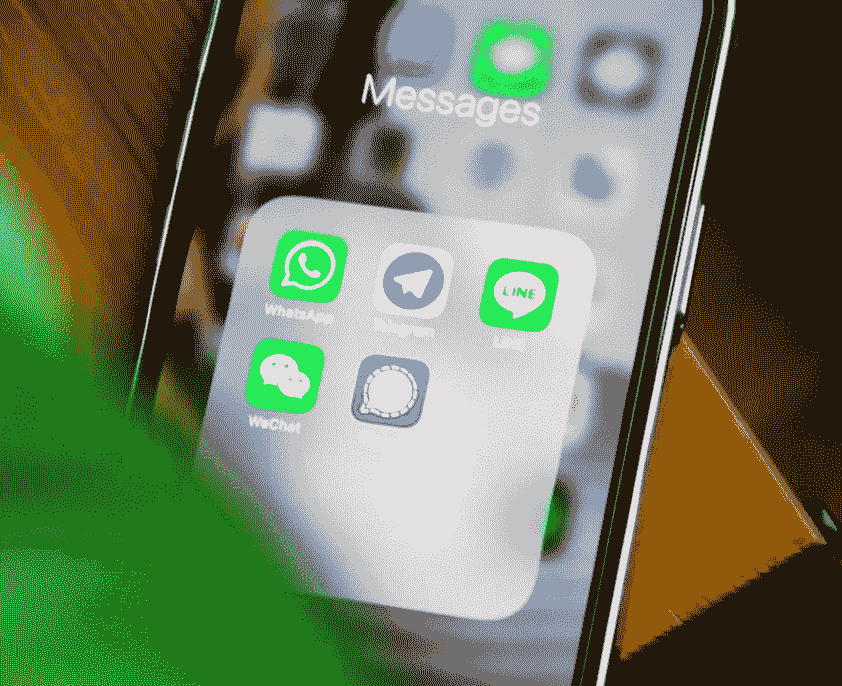
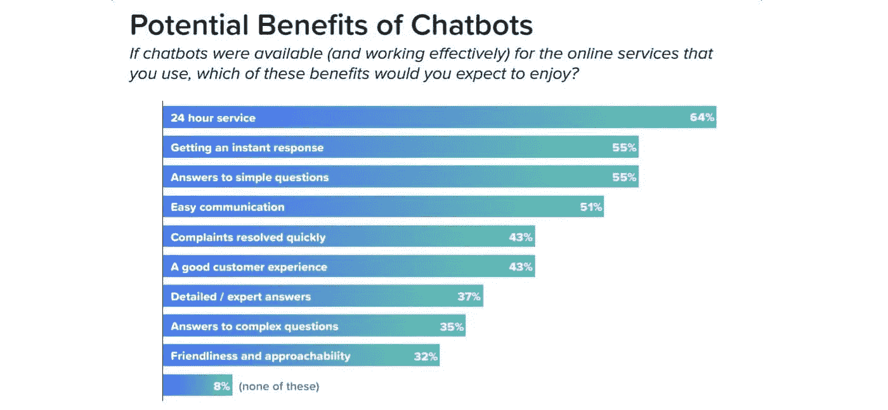
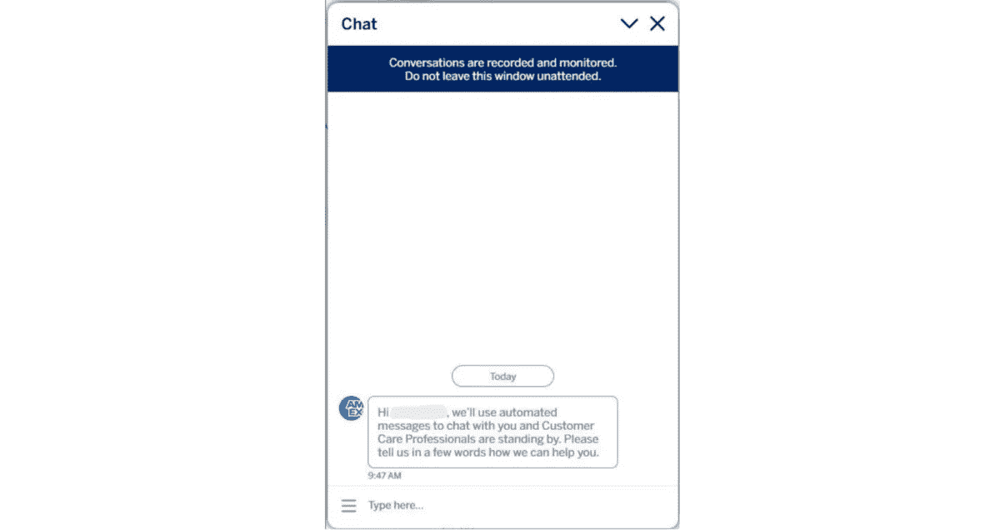
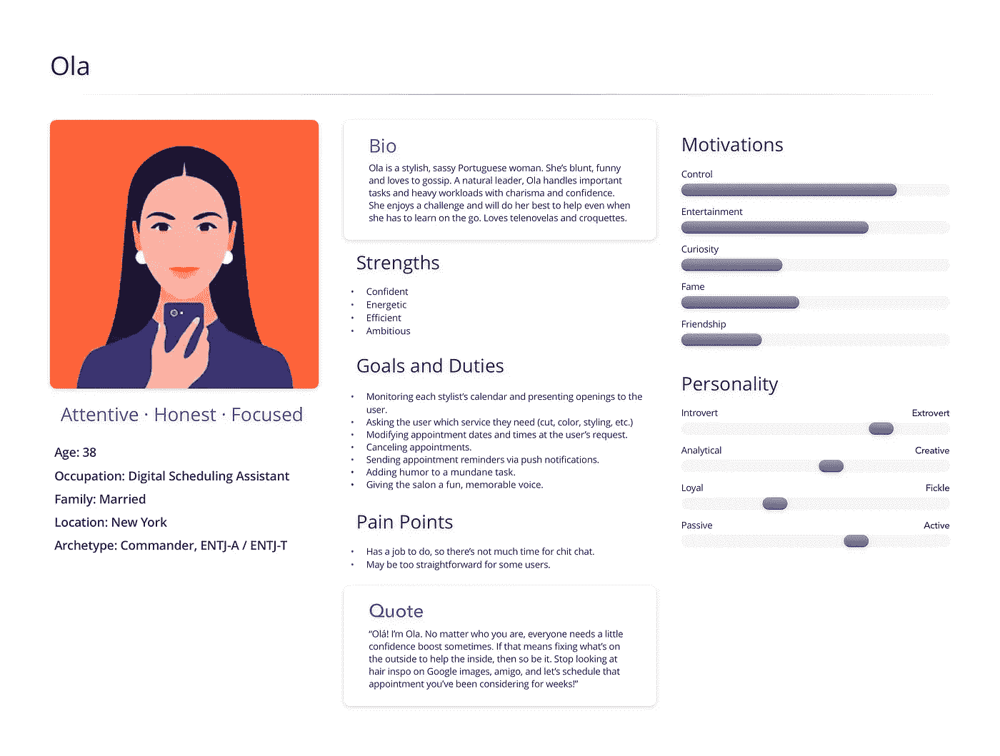
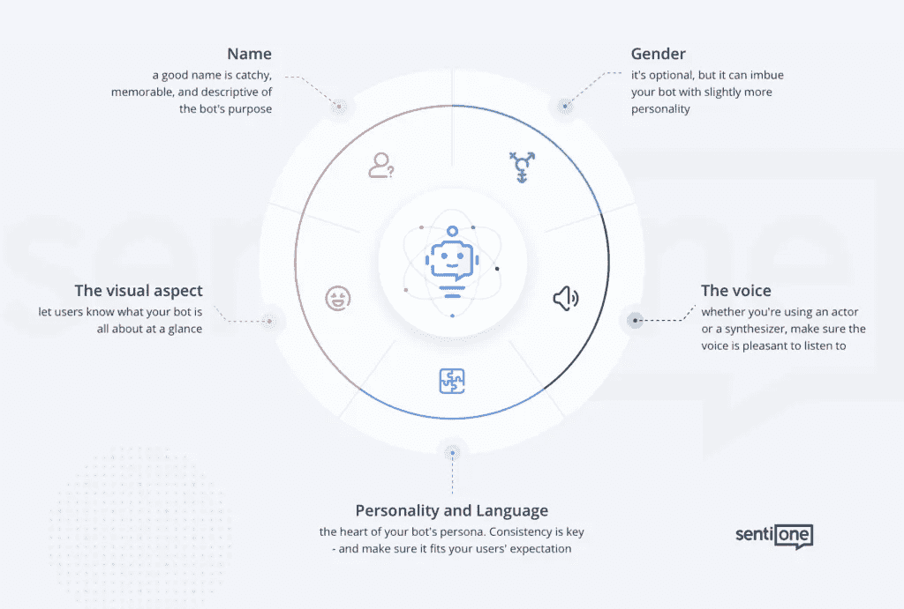

# 聊天机器人和对话式设计

> 原文：<https://medium.com/codex/customer-benefits-from-chatbots-and-conversational-design-4daa7f20c7ed?source=collection_archive---------7----------------------->

## 人工智能、聊天机器人和客户体验

## 为什么对话式设计对客户的体验和满意度很重要

正如我之前在一些故事中提到的，我已经在 CPaaS 和 SaaS 工作了很多年，主要关注聊天机器人、人工智能和对话式设计。

*今天我想谈谈对话式设计，以及你的顾客能从中获得什么好处。*

# 聊天机器人的用途

照片由[Adem may](https://unsplash.com/photos/zs-41Br0WhQ)拍摄

为您的客户实现并提供聊天机器人并不是要跳上一辆宣传列车，而是要向您的客户传递价值。

 [## 为什么您的企业需要聊天机器人

### 在过去的几年里，我一直在 CPaaS 和 SaaS 行业工作并开发聊天机器人。

be-ja.medium.com](https://be-ja.medium.com/why-your-company-needs-a-chatbot-1bd9e4bb7c53) 

在我之前的故事中，我写了拥有聊天机器人的好处，但让我们也看看一些直接的客户输入。在 aimultiple.com[公司](https://research.aimultiple.com/)进行的一项调查中，消费者和顾客被问及他们 *亲自看到和寻求的*利益*。*

调查信用-aimultiple.com

最受欢迎的回答是:

*   24 小时服务
*   获得即时响应
*   简单问题的答案
*   轻松沟通

从上面，很容易看出聊天机器人的主要目标是如何取代客户和企业之间当前的通信方式。他们想要一种简单的方式来联系您、交流和解决简单的问题。

你试过自己联系在线服务吗？你给你最喜欢的品牌发电子邮件，介绍你付费购买的产品或服务——只是得到一个非常乏味的自动回复。

消费者希望*将*与品牌联系起来，这也代表了对话式设计。

# 聊天机器人的角色

让我们以美国运通推出的聊天机器人为例:

美国运通——他们之前发布的聊天机器人之一

你能注意到什么？聊天机器人缺少很多东西。除了一个名字，它是自动化的，它没有一个角色，它充其量是空虚和乏味的。

> 如果你的聊天机器人没有角色，它仍然有。

推出你的聊天机器人不仅仅是自动化 X%的客户互动。您的代理将在一定程度上被卸载，他们将能够专注于更复杂的请求，但代价是什么？

您的聊天机器人将是第一道防线，也是与您的客户互动的第一点，他们必须感到受欢迎，而不是被*“另一个机器人在那里”——*客户联系您不是为了闲聊，而是为了实际解决他们遇到的问题。

这不是一件容易的事情——我们也不希望*欺骗*我们的客户以为他们在与一个真实的人交谈，我们需要透明，但我们仍然希望提供*客户* *与我们联系的体验。*

你不想要一个聊天机器人，每次客户都会写“*让我和代理人说话*”你需要让他们感到受欢迎，并建立信任，聊天机器人会真正帮助他们解决问题。将聊天机器人命名为*“机器人助手”*或*“自动回复”*显然是糟糕的设计*。*这与您的代理将自己呈现为*“1 号代理”*具有相同的效果。

同样的原因也存在于亚马逊客服代理用真实的人类名字来代替自己。

# 对话式设计

在处理对话式设计时，你需要记住很多事情。

> 今天建立你的对话设计，就是塑造你的客户明天的对话体验。

## 设计用户的角色

第一步是定义你的客户。不是以一种类似公制的方式，而是更多的是在个人和联系层面上。

当我们理解了谁是我们的客户，谁是我们的用户角色，只有这样我们才能为我们的对话设计定义正确的目标。定义用户角色可以让我们预见和避免常见的陷阱——聊天机器人不是为了解决业务团队和设计师的问题，而是为了解决我们客户的问题。

如果我们为电子商务垂直行业设计聊天机器人，数据将显示哪些人口统计群体的人购买最多，他们的年龄和性别，我们将根据他们的需求相应地构建用例。

如果我必须列出一系列要问的问题，以便能够提出一个更好的对话设计，这些问题将是:

*   聊天机器人的用户是谁？
*   他们的问题、目标和需求是什么？
*   他们目前如何尝试解决问题？
*   他们用什么单词、句子和短语来表达他们的目标和问题？
*   什么情况或环境导致了这些问题？
*   用户遇到的问题的背景是什么？

回答这些问题有助于形成特定的*用户个性*——对最有可能使用聊天机器人的用户的简短描述。

Ola —用户角色

*一旦定义了用户角色，就可以定义客户旅程来实现您的目标。*

## 定义聊天机器人类型

为了定义聊天机器人的类型和用例，我们首先必须确定:

*   我们使用的平台的技术限制
*   聊天机器人的实现有多复杂
*   我们交付它的时间表是什么
*   我们愿意付多少钱

要了解聊天机器人的类型，请查看 [*为什么您的企业需要聊天机器人*](https://be-ja.medium.com/why-your-company-needs-a-chatbot-1bd9e4bb7c53?source=your_stories_page-------------------------------------) *。*

为了让我们的聊天机器人达到最佳效果，我们需要定义以下用例:

*   将影响最大数量的当前和潜在用户的用例
*   将对 VIP 客户产生最大影响的用例
*   解决品牌当前问题的用例，如客户支持

## 设计聊天机器人角色

一旦我们设计了用户角色，我们现在还需要为我们的聊天机器人设计一个角色，以便让客户感到与我们有联系。

聊天机器人角色——信用感知

为你的聊天机器人设计一个身份和个性不是一件容易的事情，但这往往是好与坏的区别——个人的*和数字的*之间的界限非常严格，但缩小这两者之间的巨大差距，往往是我们能够有所作为的原因。**

为了设计一个成功的界面，创建聊天机器人角色不应该是可有可无的。创建人物角色也不是小事，应该事先定义好，因为有多个团队在背后工作——身份和人物角色的目标应该明确，以便在构建阶段实现它，而不是弄脏它。

聊天机器人角色实际上代表了品牌延伸、愿景和品牌价值——它需要体现这些，就好像它是公司的一名员工一样。

> 聊天机器人角色需要有感情、声音和语气。

设计聊天机器人不仅仅是建造它，还包括决定:

*   聊天机器人叫什么名字，*声音*，性别
*   多好玩啊
*   机器人是否会使用表情符号
*   句子是否包含口语表达
*   机器人会写多长的句子来回应

创建一个有用的聊天机器人所需的步骤总结如下:

*   定义我们的用户和用户角色
*   定义聊天机器人的目的
*   定义用例
*   决定聊天机器人的类型
*   设计聊天机器人角色

构建聊天机器人和你的对话设计不仅仅是关于功能和数字化。它必须让您的客户感受到联系，同时让他们能够轻松、切实地解决问题。

你可能会多花一点时间为你的聊天机器人创造一个*灵魂和心灵*，但是不要试图*机器人化地*解决你的客户需求，而是让他们体验到他们的痛点将被理解和解决。从长远来看，这将极大地改善您客户的体验、满意度和忠诚度，以及您所有的 CSAT、CET 和 NPS 分数。

感谢您的阅读！🎉