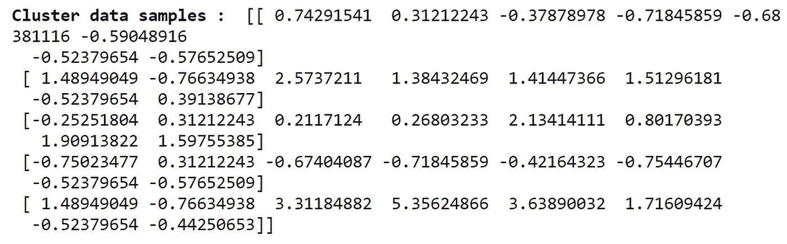

# Python 中基于 K-Means 的客户细分

> 原文：<https://medium.com/codex/customer-segmentation-with-k-means-in-python-18336fb915be?source=collection_archive---------0----------------------->

## [法典](http://medium.com/codex)

## 学习构建和可视化 K-means 模型来解决聚类问题

# k 均值聚类

K-均值聚类波束，将‘n’个观测值划分为所提到的‘K’个簇(产生类球形簇)。K-Means 是一种无监督学习算法，也是用于聚类任务的最简单算法之一。K-Means 将数据分成没有任何聚类内部结构的非重叠子集。一个分类中的值彼此非常相似，但是不同分类之间的值差异很大。K-Means 聚类非常适合处理中型和大型数据。

尽管算法简单，K-Means 仍然是数据科学中聚类案例的强大工具。在本文中，我们将使用 K-means 算法解决一个聚类问题，即客户细分(根据相似的特征将客户分组)。现在让我们来看一下我们要解决的案例。

# 情况

假设您有一个客户数据集，您需要对这个历史数据应用客户细分。客户细分是将客户群划分为具有相似特征的个体群体的实践。这是一个重要的战略，因为企业可以瞄准这些特定的客户群，并有效地分配营销资源。例如，一个组可能包含高利润和低风险的客户，即更有可能购买产品或订购服务的客户。商业任务就是留住这些客户。另一个群体可能包括来自非营利组织的客户。现在，让我们使用 K-Means 算法根据 python 数据中提供的特征对客户进行细分。

# 涉及的步骤

1.  导入所需的包
2.  将客户数据导入 python 环境
3.  分析数据，找到一些有用的信息
4.  根据我们的需要处理数据
5.  使用 K-Means 算法构建模型
6.  分析和可视化所建立的 K-Means 模型

事不宜迟，让我们深入编码部分吧！

# 导入包

每个任务都必须从将所需的包导入各自的环境开始(在我们的例子中是 python)。我们的主要软件包包括用于处理数据的 pandas、用于处理数组的 NumPy、用于可视化的 matplotlib & seaborn、用于三维可视化的 mplot3d，以及用于构建 K-Means 模型的 scikit-learn。让我们将所有主要的包导入到 python 环境中。

**Python 实现:**

既然我们已经将所有必需的主包导入到 python 环境中。让我们继续导入客户特征数据。

# 导入数据

**关于数据:**我们要用的数据包含了客户的各种特征和信息([在这里找到数据](https://github.com/Nikhil-Adithyan/Customer-Segmentation-with-K-Means))。这些属性包括“客户 ID”、“年龄”、“教育程度”、“工作年限”、“收入”、“卡债务”、“其他债务”、“拖欠”、“债务收入比率”。在这种情况下，属性“Education”和“Defaulted”是分类变量，其他属性是离散变量。

我们将使用 Pandas 包提供的“read_csv”方法来读取数据并将数据导入到我们的 python 环境中。我们使用“read_csv”方法，因为我们要使用的数据在。csv '格式。如果是 excel 表，建议使用' read_excel '方法读入 python 环境。现在让我们用 python 导入我们的数据！

**Python 实现:**

输出:

图片作者[作者](https://nikhiladithyan.medium.com/)

既然我们已经成功地将客户细分数据导入到 python 环境中。让我们探索并获得一些关于数据的信息。

# 数据分析

使用客户细分数据，我们将进行一些分析并制作一些图像，以提取有关数据的有用信息。

我们将从分析顾客的年龄分布开始。作为一个分布案例，我们可以生成一个分布图来更有效地分析它。用 python 来做吧！

**Python 实现:**

输出:

图片由[作者](https://nikhiladithyan.medium.com/)

通过查看图表，我们可以了解到，客户数量最多的年龄在 35-40 岁之间，客户数量最少的年龄在 50-60 岁之间。

接下来，使用数据集中的“Defaulted”属性，我们可以看到有多少客户违约(1)，有多少客户不违约(0)，以及违约案例的百分比。为了分析默认情况下的计数值，我们可以使用 seaborn 中的“count plot”方法生成一个计数图。

**Python 实现:**

输出:

图片作者[作者](https://nikhiladithyan.medium.com/)

据了解，大部分客户都没有拖欠信用卡。更准确地说，违约客户的数量是 183 个，非违约客户的数量是 517 个，这意味着 35%的客户拖欠了他们的信用卡。

现在使用散点图，让我们检查“年龄”和“收入”属性之间的关系。使用 seaborn 软件包提供的“散点图”方法可以生成一个散点图。用 python 来做吧！

**Python 实现:**

输出:

图片作者[作者](https://nikhiladithyan.medium.com/)

我们可以看到，随着年龄的增长，收入也在增加。因此，我们可以说，属性“年龄”和“收入”是线性关系。

接下来，我们将制作一个气泡图，表示“收入”、“工作年限”和“债务比率”属性的数据点。散点图和气泡图之间的唯一区别在于，气泡图表示三个属性的数据点，而散点图中仅显示两个属性。要生成气泡图，我们可以使用“散点图”方法，但是将散点图大小更改为“debtincomerability”属性。用 python 来做吧！

**Python 实现:**

输出:

图片由[作者](https://nikhiladithyan.medium.com/)

上图显示了三个属性的数据点，散点图基于“默认”属性进行着色。此外，我们可以观察到“工作年限”和“收入”属性之间的线性关系。

这样，我们已经成功地从各个方面探索了这些数据。所以我们进行下一步。

# 数据处理

在这一步中，我们将标准化数据集，这对于构建我们的模型非常重要。但是什么是正常化呢？

> 归一化是一种统计方法，有助于基于数学的算法同等地解释具有不同量值和分布的特征

使用 scikit-learn 包提供的“StandardScaler”函数，我们可以在 python 中对数据集执行规范化。

**Python 实现:**

输出:

图片作者[作者](https://nikhiladithyan.medium.com/)

现在我们有了构建 K-Means 模型所需的所有组件。因此，我们可以继续构建模型。

# 建模

我们可以使用 scikit-learn 包提供的“KMeans”算法在 python 中构建 K-Means。

KMeans 类有许多可以使用的参数，但是我们将使用这三个参数:

*   **init** -质心的初始化方法。该值将为:“k-表示++”。 **k-means++** - 智能地为 k-means 聚类选择初始聚类中心，加速收敛。
*   **n_clusters** -要形成的簇的数量以及要生成的质心的数量。该值将为 3
*   **n_init** -使用不同质心种子运行 k-means 算法的次数。就惯性而言，最终结果将是 n_init 次连续运行的最佳输出。该值将是 12

在建立模型之后，我们将拟合并定义一个变量‘labels’来存储所建立模型的聚类标签。用 python 来做吧！

**Python 实现:**

输出:

图片由[作者](https://nikhiladithyan.medium.com/)

现在，我们已经成功地构建并拟合了 K 均值模型，并将聚类标签存储到“标签”变量中。使用由模型产生的标签，我们可以找到关于模型的一些有用的见解，并得出结论。

# 模型洞察力

为了找到一些有用的见解，我们必须向客户数据添加一个属性，显示每一行的分类值。用 python 来做吧！

**Python 实现:**

输出:

图片由[作者](https://nikhiladithyan.medium.com/)

如您所见，我们在客户数据中创建了一个名为“cluster_num”的新属性，它表示每一行属于哪个分类值。

现在，让我们使用“groupby”方法对分类值进行分组，并使用“mean”方法查看数据集中每个属性的平均值。

**Python 实现:**

输出:

图片作者[作者](https://nikhiladithyan.medium.com/)

让我们使用气泡图来查看基于客户年龄和收入的客户分布，颜色代表聚类值。用 python 来做吧！

**Python 实现:**

输出:

图片由[作者](https://nikhiladithyan.medium.com/)

与其分析二维气泡图，不如分析三维散点图更有效，也更容易得出结论。我们可以使用 python 中的“mplot3d”包来生成三维散点图。使用“mplot3d”包，按照代码在 python 中生成三维散点图。

**Python 实现:**

输出:

图片作者[作者](https://nikhiladithyan.medium.com/)

我们的 K-Means 模型将客户划分为互斥的组，在我们的例子中是三个集群。每个集群中的客户在人口统计学上彼此相似。现在，考虑到每个集群的共同特征，我们可以为每个组创建一个配置文件。例如，3 个群集可以是:

*   富裕、受过教育和老年
*   中年和中等收入
*   年轻和低收入

就是这样！我们已经成功地建立了我们的 K-Means 模型，并从中进行了客户细分。希望这篇文章对你有用，非常感谢，我也在文章末尾提供了完整的代码。

**快乐的机器学习！**

完整代码: