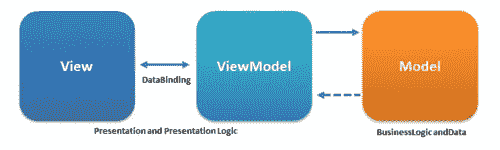
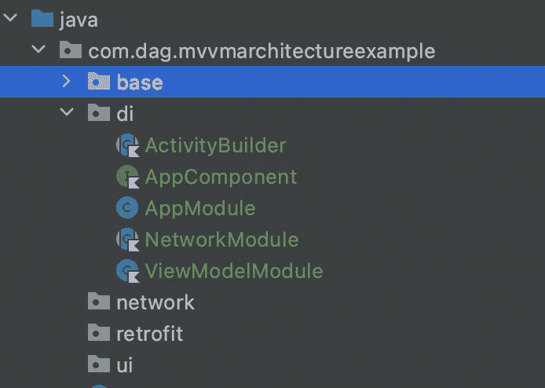
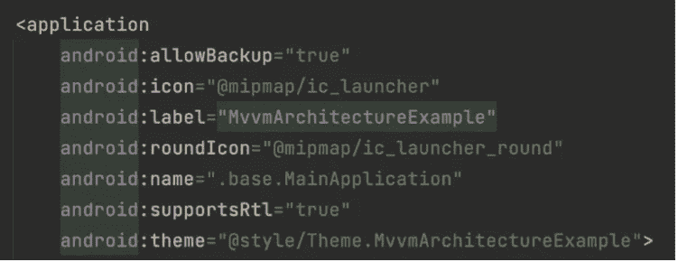
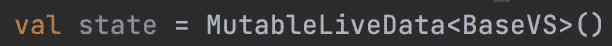

# MVVM 架构的定制实施

> 原文：<https://medium.com/codex/customized-implementation-of-mvvm-architecture-565dfd78671a?source=collection_archive---------10----------------------->

大家好，今天我想谈谈 MVVM 建筑，这是最著名的建筑模式。这个架构是每个在移动平台上工作的人都知道的，因此我将深入研究这个架构，并添加一些不同于谷歌推荐的架构的定制。先来个小提醒。

图 1

如图 1 所示，这个架构有三个主要组件。视图是与用户相联系的组件，视图的另一面称为 UI。视图模型提供了视图和模型之间的联系。根据视图向视图模型发送的事件，视图模型向本地数据库或 web 服务发送请求。模型表示应用程序的数据和业务逻辑。

按照大家的理解，我们来谈谈这个架构会增加什么。新增内容列表如下所示:

通过依赖注入通过匕首查看模型注入

通用数据绑定初始化

查看状态

在开始申请过程之前，我强烈建议你和我一起编码，但如果你不想编码，我附上下面的应用程序。每次提交代表上面给出的一个主题。

# 依赖注入

Dagger 是“一个用于 Java、Kotlin 和 Android 的完全静态的编译时[依赖注入](http://en.wikipedia.org/wiki/Dependency_injection)框架。它是由 [Square](http://square.github.io/) 开发的[早期版本](https://github.com/square/dagger)的改编版，现在由谷歌维护。

****

**图 2**

**首先，您的目录层次结构应该如图 2 所示。Di 文件夹代表了关于 dagger 的类。AppComponent 类将所有模块引入项目。组件注释是写模块名的地方。**

**应用程序组件**

**在此步骤中，将创建 BaseApplication 和 Main Application，然后创建模块。**

**基本应用和主要应用**

**基础应用程序是 dagger 首先创建的类。创建两个类后，您应该将主应用程序引入到应用程序中，并在清单文件中添加一行代码。此外，主应用程序的引入如图 3 所示。“android:name”是应用程序标签的属性，它引入了类。DaggerApplication 是一个抽象类，它扩展了 Application 类，并注入其成员，可用于注入附加到它的活动、片段、服务、广播接收者和内容提供者。**

****

**图 3**

**现在是讨论模块的时候了。模块也有依赖关系。DaggerAppComponent 将内部的属性注入到类中。让我们说得更清楚些。正如您在下面的代码中看到的，“AndroidInjection.inject(this)”开始注入。Dagger 搜索有" ContributesInjector "注释的类。ActivityBuilder 具有包含此批注的提供程序。当 Dagger 找到与注入类返回相同类型的提供者时，它会进入提供者的模块列表。该类的所有依赖项都是从模块列表中收集的。在 ActivityBuilder 类之后，您会看到一个模块的示例。**

**活动构建器**

**视图模型模块**

**显然，安卓推荐的一种方式也可以，这是你的选择。在我看来，当视图模型在其构造函数中带参数时，用 dagger 进行依赖注入更容易注入视图模型。**

# **数据绑定初始化**

**初始化是创建一个新的对象，这个对象有一个特定的类型。所有页面都有自己的绑定类型，因此绑定类型必须是通用的。泛型参数在活动或片段的定义中给出。即使绑定的类型是已知的，绑定初始化也需要布局 id。因此，抽象函数是在活动或片段中声明的。在图 3 中，您可以看到通用数据绑定初始化的例子。**

**基础活动**

# **视图状态**

**我们将在基本文件夹中创建一个名为 BaseState 的接口。这个接口提供了在 BaseActivity 和 BaseFragment 中创建通用函数的机会，因此，这个通用函数可以在所有活动和片段中使用。然后，一个状态变量将被放置在基本视图模型中，如下所示。**

****

**图 4**

**你准备好最后阶段了吗？让我们完成这项工作。**

**基础活动版本 2**

**当状态变量的值在 viewmodel 中改变时,“stateChange”函数将起作用。按照你的流程，你可以在函数里面做。下面的代码是 viewmodel 和 activity 之间的连接。众所周知，数据绑定提供了另一种改变用户界面的方法。两种方式都可以使用。**

**你可以在下面的链接中找到完整的代码。**

** [## GitHub-DogukanGun/mvvmarchitecture 示例

### 此时您不能执行该操作。您已使用另一个标签页或窗口登录。您已在另一个选项卡中注销，或者…

github.com](https://github.com/DogukanGun/MvvmArchitectureExample) 

在这篇文章中，我只是想给 MVVM 建筑增加更多的特色。希望这对你有帮助。**