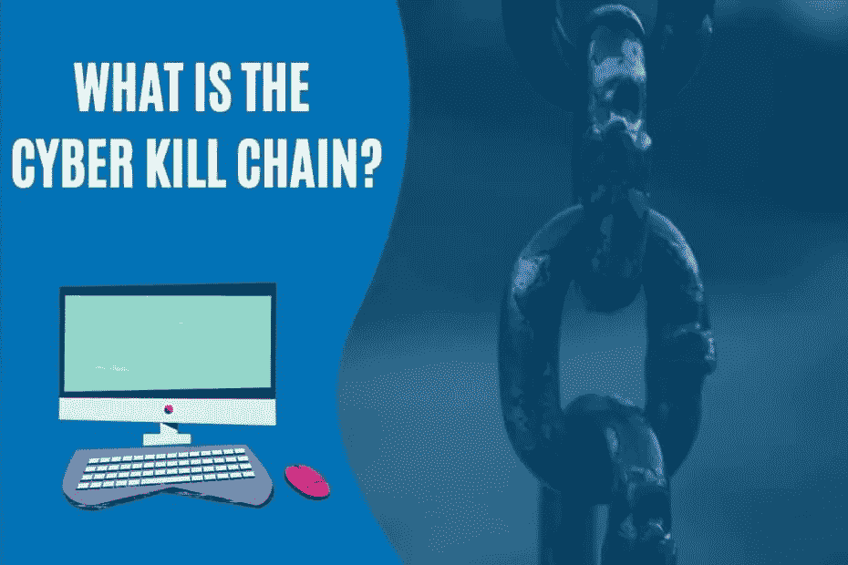

# 网络杀戮链:黑客如何瞄准并搞垮组织

> 原文：<https://medium.com/codex/cyber-kill-chain-how-hackers-target-and-take-down-organizations-stackzero-6b6bcd8a0eb2?source=collection_archive---------7----------------------->

# 介绍

这篇文章介绍了什么是网络杀伤链以及它是如何工作的。或许你可以关注一些网络安全播客、时事通讯等。你听说过，但你知道它到底是什么吗？