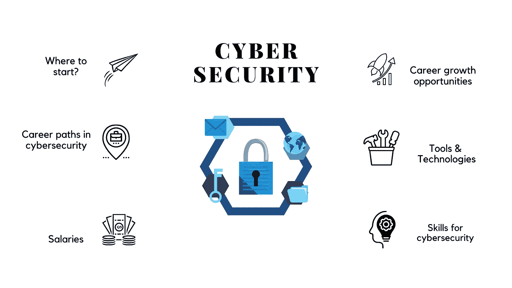
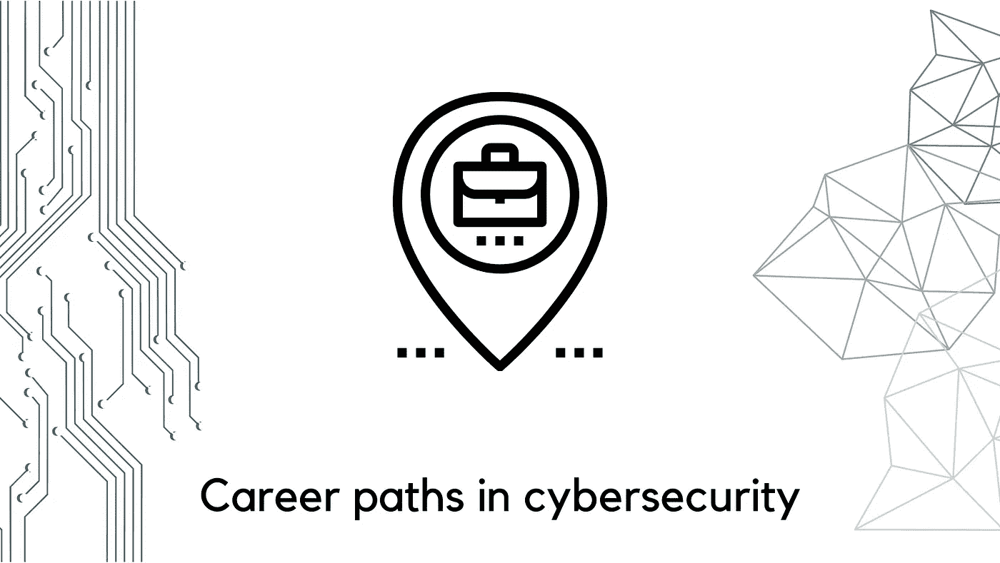
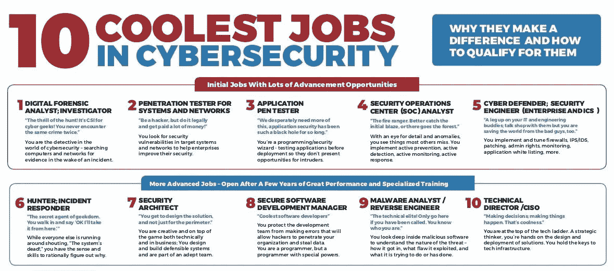
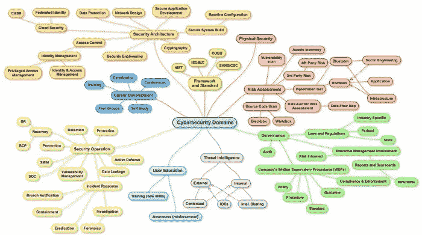
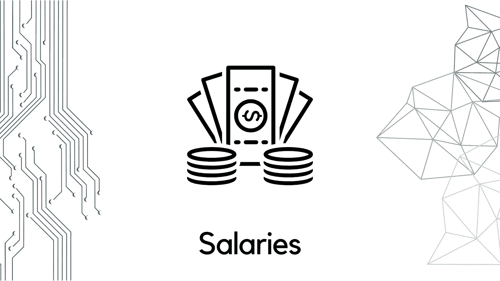
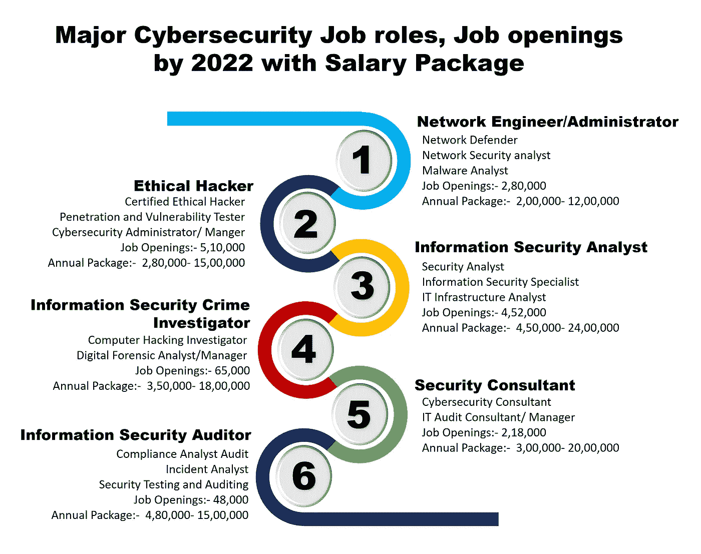
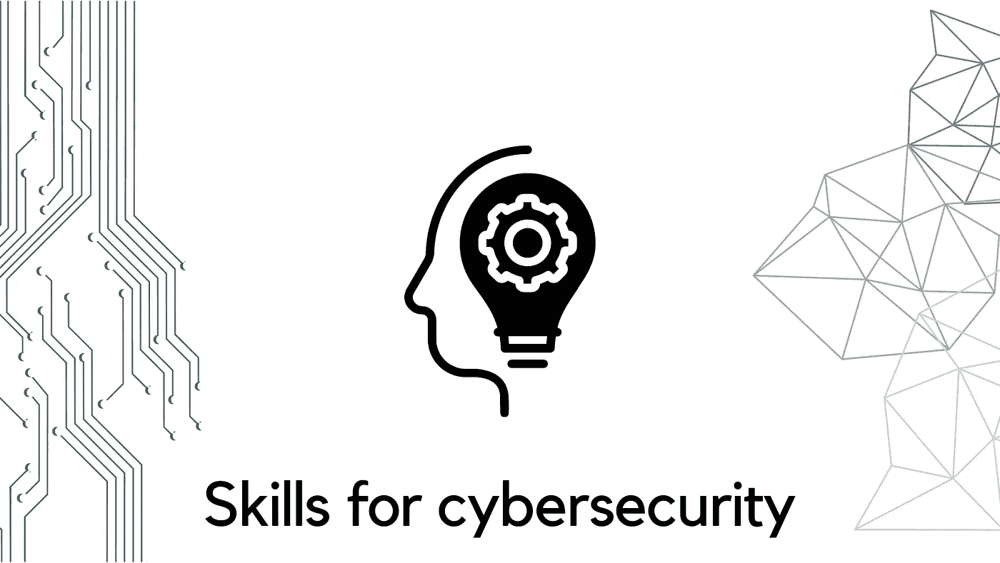
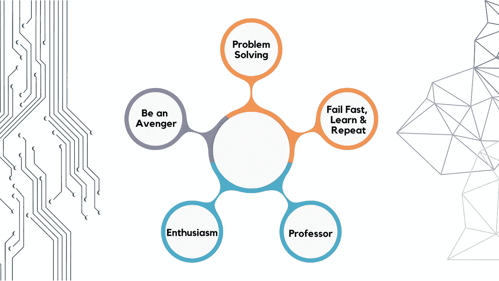
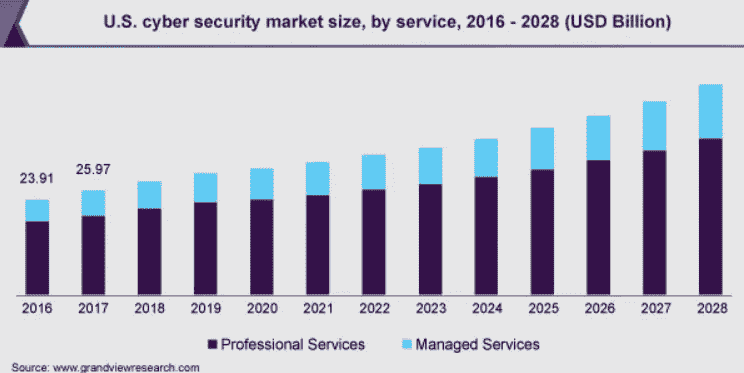

# 网络安全职业路线图

> 原文：<https://medium.com/codex/cyber-security-career-roadmap-54f45e6a94b4?source=collection_archive---------0----------------------->

数字空间的繁荣增加了网络攻击，关键部门需要特别关注网络安全威胁。网络安全专业人才需求量很大。网络安全职业回报丰厚，要求也很高。由于现有网络安全专业人员的数量与日常面临的网络安全挑战之间的巨大差距，世界各地都需要大量的网络安全专业人员。

ISC 最近的一项研究发现，尽管面临新冠肺炎和经济压力，组织计划在未来 12 个月增加网络安全人员。那么“**如何在网络安全**开始职业生涯呢”？

由于网络安全专业人员在数据安全中的重要性，每个组织都需要他们。对网络安全专业人才的需求非常高，相比其他亚太国家，印度提供了更广阔的机会。在印度，能够解决网络安全问题的熟练专业人员明显较少，因此为印度年轻人的网络安全职业生涯打开了许多新的大门。

1.  获得学士学位

大多数工作需要网络安全或相关领域(如信息或计算机科学)的三年或四年学士学位。计算机网络、编程、密码学是核心课程，为学生在网络安全领域的成功职业生涯准备技术和分析技能。

2.培训和认证

拥有大学学位是开始网络安全职业生涯的正确途径，但不是唯一途径。43%的网络安全专业人员持有证书，他们除了大学学位之外还接受了培训。拥有适当的网络安全培训证书是开始网络安全职业生涯的绝佳方式。

一些雇主可能要求应聘者持有认证课程，作为初学者，你可以选择 [IBM 网络安全分析师专业证书](https://www.coursera.org/professional-certificates/ibm-cybersecurity-analyst)。这个 8 门课程的专业证书将为您提供技术技能，为网络安全分析师的角色做好工作准备。教学内容和实验将向您介绍网络安全、终端保护、事件响应、威胁情报、渗透测试和漏洞评估等概念。

本课程旨在提供计算机网络的全面概述。它涵盖了一切，从现代网络技术和协议的基础到云的概述，再到实际应用和网络故障排除。

从总体上发展对它的广泛理解。你对每个领域了解得越多，你就越能了解每个团队的工作情况和你遇到的困难。

*   具备 C++、Java、Node、Python、Ruby、Go 或 Power Shell 等语言/工具的知识是一个额外的优势。
*   能够经常在压力下和快节奏的环境中工作。
*   拥有对细节的敏锐洞察力和出色的解决问题的能力。
*   了解最新的网络安全趋势和黑客策略。

确保你热爱学习！可以在这些平台上查看一些课程:
- Coursera
- Udemy
- EdX

一旦你准备好进入这个成长中的行业，现在就开始探索网络职业，在网络安全领域有大量的机会和工作机会。一些最佳职位包括:

**安全分析师:**设计并实施无懈可击的安全措施。

**安全工程师:**为组织的信息技术安全系统建模。

**安全专家:**综合运用硬件和软件技能保护应用程序免受威胁。

**事件响应者:**响应任何类型的安全漏洞并限制损害。

**渗透测试员:**合法侵入软件系统，识别漏洞并报告解决方案。

**安全架构师:**为公司设计、构建和管理网络和计算机安全的实现。

**身份和访问管理工程师:**专注于组织内的数字身份，以确保系统的正确级别并防止未经授权的使用。

**密码专家:**在这里人们参与加密敏感信息，以确保企业隐私。

**恶意软件/取证分析师:**发现、分析&调查恶意软件的各种属性，找出攻击的元凶和原因。

**安全审计员:**开发 IT 系统测试，以识别风险和合规性问题。评估防火墙、加密协议和相关的安全措施。

除了对网络安全专业人员的需求不断增加之外，该行业还面临着训练有素的人员严重短缺的问题，这些人员能够胜任并熟练地担任越来越多的网络安全角色。根据 NASSCOM 年的一份报告，到 2020 年，印度将需要约 100 万名网络专业专家。教育机构认识到了这一差距，并开始在印度提供网络安全课程，但在采取行动之前，分析和比较这些课程是至关重要的。

尽管拥有世界上最广泛的 IT 人才库，但今天，印度严重缺乏熟练的网络安全专业人员。这种严重短缺导致企业愿意向网络安全专业人士支付高薪。根据一些报道，印度网络安全专家的平均工资已经增长到了 100 卢比。88 万卢比。

*在印度，这些工资会受到多种因素的影响，如位置、经验、技能&公司。*

除了大学学位和培训证书，一些软技能将有助于一个人在网络安全职业生涯中成长。为了在网络安全职业生涯中大放异彩，我建议你在实习期间接受一些实践培训，并遵循这些关键步骤(并根据你的需要增加内容)

1.  **解题**

如果你选择生活在一个充满问题的世界，那么最好成为一个问题解决者。网络安全问题造成世界混乱。数据安全的危害是巨大的，因为它涉及个人和组织的隐私。解决网络问题和保护数据是网络安全专业人员的责任。你的批判性思维能力将帮助你成为一名出色的事件响应者。

**2。快速失败，学习&重复**

对用于解决网络安全问题的新技术感到好奇。了解为帮助安全专业人员而开发的工具。迅速认识到问题并实施正确的技术来解决它。作为一名安全架构师，你可以有一个光明的职业生涯，因为你有解决问题的好奇心。

**3。教授**

不断了解该领域的问题，并继续给出切实可行的解决方案。把它做得更像是在教别人，而不是把它当成一项日常工作。如果你是一个很好的倾听者和感同身受者，那么一个适合你的职位将是网络安全顾问。

**4。热情**

在解决网络安全问题上承担更多责任。从那些从在线诈骗者手中拯救了许多人的故事中获得灵感。如果你是一个爱好者，那么如果你热衷于创造性地解决问题，渗透测试员的工作将适合你。

**5。成为复仇者**

网络犯罪每年造成大约 6 万亿美元的损失，到 2025 年将达到 10.5 万亿美元。此外，这还会危及许多人的生命。网络安全专业人员必须是拯救地球免遭任何此类网络犯罪的复仇者。如果你对受害者感同身受，一个合适的职位是安全工程师。

*   **加密工具:**使用加密技术防止未经授权访问数字信息的软件。加密技术用于保护计算机上的数字信息以及通过互联网发送到其他计算机的数字信息。
*   **网络漏洞扫描工具:**用于识别计算机系统安全弱点的安全技术。漏洞扫描可以被个人或网络管理员用于安全目的，也可以被试图获得对计算机系统的未授权访问的黑客使用。
*   **下一代防病毒软件:**将传统防病毒软件提升到新的高级端点安全保护水平。它超越了已知的基于文件的恶意软件签名和启发式方法，因为它是一种以系统为中心、基于云的方法。
*   **下一代防火墙:**深度数据包检测防火墙，超越了端口/协议检测和阻止，增加了应用程序级检测、入侵防御和从防火墙外部获取情报。
*   **PKI 服务:** PKI 保护在双方之间来回传递的敏感电子信息，并为每一方提供密钥来加密和解密数字数据。
*   **安全信息和事件管理** **(SIEM):** 通过收集和分析(近实时和历史)安全事件以及各种其他事件和上下文数据源，支持威胁检测、合规性和安全事件管理。核心功能包括广泛的日志事件收集和管理、跨不同来源分析日志事件和其他数据的能力，以及操作功能(如事件管理、仪表板和报告)。
*   **数据丢失防护** ( **DLP** ):数据丢失防护(DLP)是一套工具和流程，用于确保敏感数据不会丢失、误用或被未授权用户访问。DLP 软件对受监管、机密和业务关键型数据进行分类，并识别违反组织定义的策略或预定义策略包中的策略的情况，通常由 HIPAA、PCI-DSS 或 GDPR 等法规遵从性驱动。

2020 年，全球网络安全市场规模为 1671.3 亿美元，预计 2021 年至 2028 年的 CAGR 将达到 10.9%。市场的增长可以归因于网络攻击的日益复杂化。在过去的十年里，网络诈骗和犯罪的频率和强度都在增加，给企业带来了巨大的损失。随着网络犯罪事件的大幅增加，世界各地的企业纷纷将资金投入到先进的信息安全技术上，以加强其内部安全基础设施。此外，保护关键基础设施免受高级持续威胁(APTs)的需求促使全球政府改革其网络安全战略，为行业参与者创造了大量机会。

各种技术在零售、银行、电信和制造业中的使用越来越多，这推动了对吸收、处理和存储大量机密信息的需求。泄露此类机密信息会给组织带来巨大的经济损失。此外，向远程工作模式的转变也增加了组织间网络威胁的风险。对网络威胁的日益关注鼓励组织采用解决方案并配置恶意软件保护、检测和缓解策略，从而推动市场增长和职业机会。

***“安全总是被认为太多，直到有一天它不够了。”~威廉·H·韦伯斯特，前联邦调查局局长。***