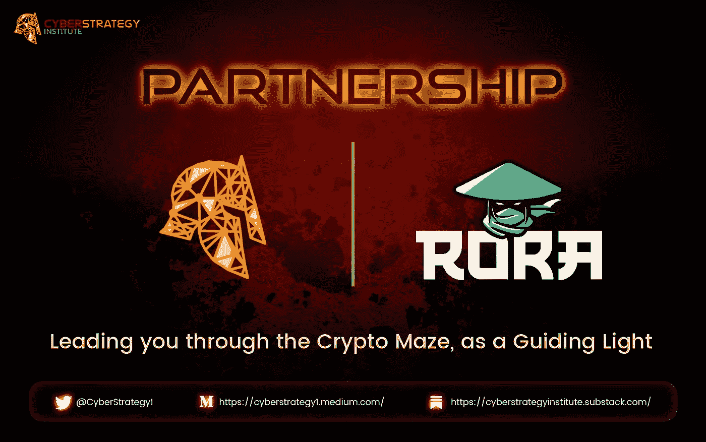
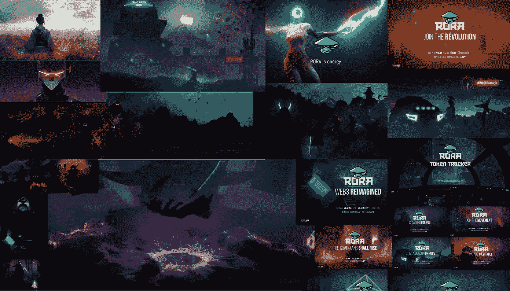

# 网络战略研究所与 RORA 领域合作

> 原文：<https://medium.com/codex/cyber-strategy-institute-partners-with-rora-realm-94bffaa09ec5?source=collection_archive---------14----------------------->

当文化与策略相遇->你开启了一个与人类经验一致的迷人新世界，激发了各种形式的创造。

在 Crypto 中，许多概念相互叠加，形成一个新世界的棱镜。许多人使用流行语，玩关键词宾果游戏，或者做相反的事情，说很少的话，让你梦见他们是什么。许多人用“社区”这个词来描述迷因令牌和 NFT 持有者文化，它们各有不同的子集。其中最成功的是围绕自己建立品牌。我们都有自己喜欢的品牌，从软饮料像可口可乐对百事可乐，或者汽车雪佛兰对福特，或者宝马对奔驰。时尚将这带到了另一个层面，因为它们塑造了我们所有人的穿着方式。像迪斯尼、漫威、辛普森一家等品牌通过讲述吸引我们情感的故事来做到这一点。

文化是终极品牌，因为它带领我们走向通常只有少数人知道的未来。正是这种束缚，使得 web3 脱颖而出，打破障碍，赋予新一代以力量。当你看电影时，许多人认为元宇宙未来可能成为的最好例子是“预备玩家一号”，这是一个多元宇宙的环境，所有这些环境都相互联系，争夺我们的注意力。我们的注意力、时间和努力是创造促进增长的网络效应的新黄金标准。那些最终掌握所需技能的人将获得巨大的增长。RORA 通过艺术讲故事是其强大的特点之一，这使得它在人群中脱颖而出。

更多 RORA 王国艺术作品的样本可以在他们的网站上找到，查看宣言 https://rora.app

我们认为，RORA 领域就是这样一个项目，它已经在迷因令牌空间中崭露头角，并且已经暗示在不久的将来会有跨链活动和合并非功能性网络技术。这就是吸引网络战略研究所来帮忙的项目类型。它具有 DeFi 的所有本质，具有模因社区的精神，但我们认为 RORA 实际上是一个新的类别，一种文化符号。文化符号注定要通过它的有机发展来塑造和吸引我们的注意力。文化是我们思考的方式，是通过我们的朋友和家人形成的。这包括其他联系，如我们在哪里上学，书籍，食物，衣服，电影或我们最喜欢的品牌以及他们的关系和合作伙伴关系。RORA 领域有一个非常光明的未来，我们期待着在未来的岁月里帮助他们培养伟大的合作伙伴关系和创新。

**这次合作对网络战略研究所意味着什么？**

它建立了我们与 RORA 领域团队作为一个值得信赖的顾问的关系。提高他们在以下领域的知识、技能和能力，如有需要，还可获得更多。

*   安全、战略发展和规划。
*   风险分析，决策，市场分析。
*   社区和伙伴关系发展、关系建设和业务增长。
*   我们的重点是协助 RORA 领域 NFT 生态系统和跨链方面的基础设施，需要完成 RORA 领域的愿景。
*   以及世界建筑，和其他将在以后揭示的方面。

我们期待在未来听到更多类似的公告，并渴望支持这个团队实现其目标。

网络战略研究所期待着为您带来更强大的合作伙伴关系，见解和分析，让您在导航加密迷宫的优势！

# 关于网络战略研究所

通过使项目和人员能够完成比他们最初认为可能完成的更多的事情来激励他们。这是通过在#L1/L2s #DeFi、#NFTs、#GameFi、事件响应、大数据、创造收益/流动性、文化和#知识产权方面用“战略真理”解决加密项目最棘手的挑战来实现的！

网址:[https://cyberstrategyinstitute.com/](https://cyberstrategyinstitute.com/)

[**碎碎念**](https://twitter.com/CyberStrategy1) | [**中等**](https://cyberstrategy1.medium.com/)

# 关于 RORA 领域

Rora Realm 是一种文化令牌，是一种液体令牌形式的分散式知识产权(D-IP)。IP 围绕着被称为罗拉的角色、她的守护者以及宇宙中所有被称为罗拉厌恶者的元素。

这是一个游戏化的协作社区体验，社区成员被称为 Rora 的守护者。

我们创造了有史以来第一个 shill2earn 和 create2earn 生态系统，以便以每日奖金和任务的形式创建计划，为完成任务提供报酬。

随着 Rora 品牌的发展，团队建立了以 Rora 为主题的 dapps，以持续推动效用。我们还将 Rora 品牌在游戏、娱乐、商品、服装等多个行业进行货币化，以便为生态系统创造多种收入来源。

RORA 令牌是获得罗拉王国产权的必要条件。给你制造和销售你自己的 Rora 主题的 NFT，应用程序和商品的权力。它也是所有 Rora 相关产品和设施的主要支付凭证。

该令牌还将赋予守护者创建、升级和获取特殊 NFT 资产的权力，并获得对独家 Rora 应用程序和活动的访问权。以及对链上治理提案进行投票，以确定未来的特性、策略、内容和工具。代币还可用于奖励社区成员通过参与我们的 shill2earn & create2earn 游戏化社区体验来赢得奖金、任务和完成特殊任务。

了解更多关于 Rora 领域的信息:

**网址:**【https://rora.app/ 

【https://twitter.com/RoraRealm】推特: [推特](https://twitter.com/RoraRealm)

**宣言:**[https://manifesto.rora.app/](https://manifesto.rora.app/)

**Docs:**[https://rora-realm . git book . io/welcome-to-git book/rora-realm/our-vision](https://rora-realm.gitbook.io/welcome-to-gitbook/rora-realm/our-vision)