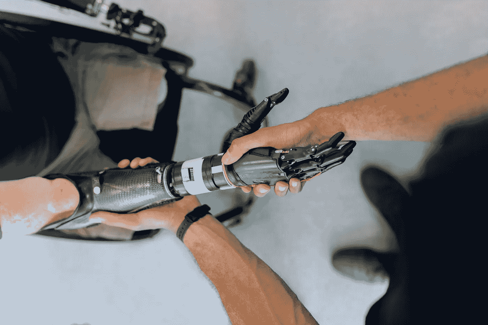

# 电子人？—外科手术和机器人技术如何创造出栩栩如生的假肢

> 原文：<https://medium.com/codex/cybernetics-how-surgery-and-robotics-create-lifelike-artificial-limbs-60d2823e2e8e?source=collection_archive---------10----------------------->

## 感觉和功能像自然肢体的假肢不再是科幻小说。

在 [Unsplash](https://unsplash.com/s/photos/prosthetic-arm?utm_source=unsplash&utm_medium=referral&utm_content=creditCopyText) 上拍摄的 [ThisisEngineering RAEng](https://unsplash.com/@thisisengineering?utm_source=unsplash&utm_medium=referral&utm_content=creditCopyText)

对人类神经系统的更好理解和机器人技术的进步有助于创造功能和感觉自然的假肢。